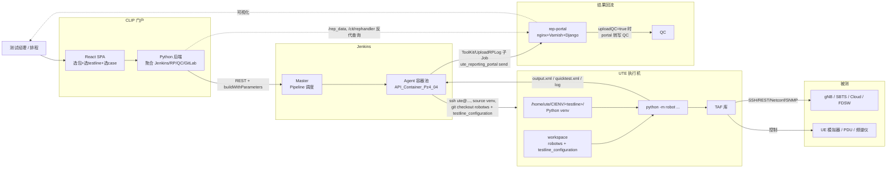
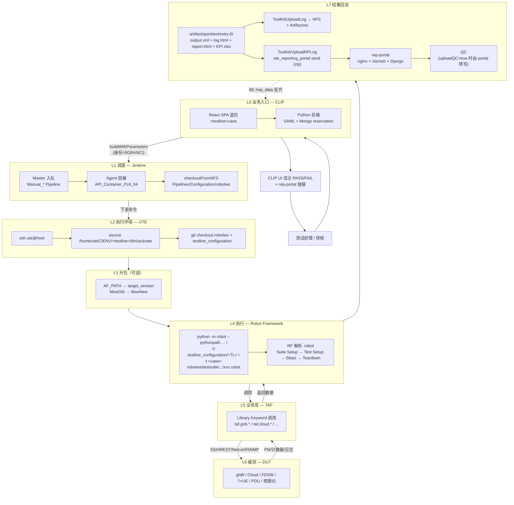
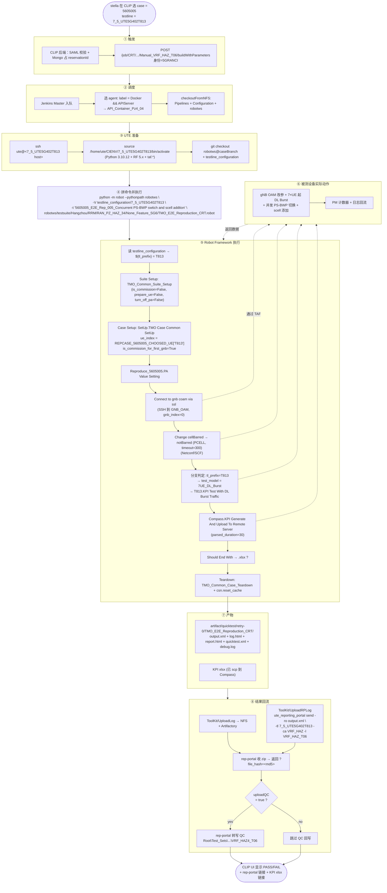
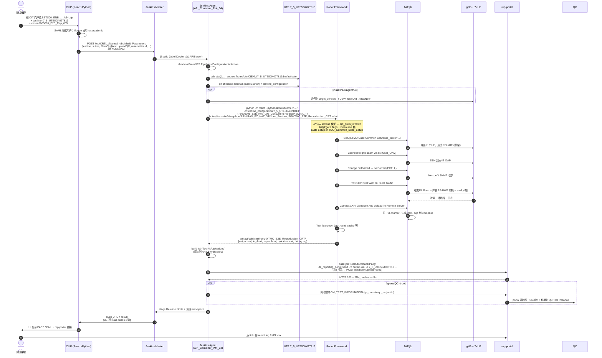

# 5G 自动化测试平台 — 架构与流程

> 范围：`CLIP → Jenkins → UTE → robotws + testline_configuration → TAF + Robot Framework → 被测 gNB/UE → rep-portal/QC` 的端到端自动化平台。
> 本文是 [original_jenkins_robotframework.md](original_jenkins_robotframework.md)（实测取证版，含原始 Jenkins/GitLab/curl 抓取证据）的**精简架构版**：只保留结构与逻辑，去掉调查痕迹，最后用一个真实 case 走完全程。

---

## 1. 一句话定义

> **CLIP 决定测什么，Jenkins 决定怎么调度，UTE 决定在哪跑，TAF + Robot Framework 决定怎么测，robotws 提供用例本身，testline_configuration 提供环境模型，rep-portal 决定结果给谁看，QC 决定结果归档到哪。**

七层叠加：**Python 运行时 + RF 执行引擎 + TAF 业务库 + Git 双仓库（用例 / 测试线）+ Jenkins 调度 + CLIP 业务入口 + rep-portal/QC 结果回流**。

---

## 2. 平台分层

| 层 | 组件 | 角色 | 关键技术 |
|---|---|---|---|
| L0 业务入口 | **CLIP** `https://clip.int.net.nokia.com/cit/welcome` | 测试经理选包/选 testline/选 case 的门户 | nginx 1.26.1 + React SPA (CRA, webpack4) + SAML SSO + Python 后端 (Flask/FastAPI) + MongoDB |
| L1 调度 | **Jenkins** `https://10.101.54.5/` | 接受 CLIP 触发 → 派 agent → 拼 robot 命令 → 收集结果 → 派下游 Job | Jenkins Pipeline (Groovy) + Shared Library (`5getcrt/SharedLibrary`) |
| L2 执行环境 | **UTE 执行机** | Linux VM，每条测试线一个 Python venv，提供与被测设备的网络可达性 | Debian + pyenv + 内部 PyPI `pypi.ute.nsn-rdnet.net` |
| L3 用例 + 配置 | **robotws** + **testline_configuration**（两个 GitLab 仓库） | `.robot` 用例 + 每条 testline 的 `__init__.py` 环境模型 | Git MR + Code Guard 评审 |
| L4 执行引擎 | **Robot Framework 5.x** | 解析 `.robot` → 调 Library Keyword | `python -m robot ...` |
| L5 业务库 | **TAF**（`taf.gnb.* / taf.cloud.* / taf.transport.* / taf.lteemu / ...`） | 把"操作 gNB / UE / Cloud / 仪器"封装成 Python API + RF Keyword | Python 包，托管在内部 PyPI |
| L6 被测对象 | gNB / SBTS / Cloud / FDSW / UE 模拟器 / PDU / 频谱仪 | DUT | SSH / REST / Netconf / SNMP |
| L7 结果回流 | **rep-portal** + **QC** | 结果聚合可视化 + 正式归档 | rep-portal: nginx 1.18 + Varnish 6.0 + Django; QC: HP/MF Quality Center |

---

## 3. 三个最易混淆的关系：Python ↔ Robot Framework ↔ TAF

```
+-------------------+     uses      +--------------------+
| Robot Framework   | ─────────────►|  TAF 业务库         |
| (.robot DSL +     |               |  taf.gnb.* /       |
|  RF 引擎)          |               |  taf.cloud.* / ...  |
+--------+----------+               +---------+----------+
         │ both written in / run by             │
         ▼                                       ▼
+--------------------------------------------------+
|                   Python (CPython 3.10)         |
|       /home/ute/CIENV/<testline>/  (pyenv venv) |
+--------------------------------------------------+
```

- **TAF** = 业务 SDK（Python 包），封装"操作真实设备"。RF 用例通过 `Library  taf.xxx` 拿到 Keyword。
- **RF** = DSL 解释器 + 执行引擎。`.robot` 文件不是 Python，但跑起来是 Python 进程。
- **Python** = 地基。每条 testline 的 venv 由 `pip-compile` 锁版生成，决定本次跑的 RF/TAF/三方库版本。

---

## 4. 各组件使用的框架/技术

| 组件 | 前端 | 后端 / 运行时 | 数据存储 | 与外界的通信 |
|---|---|---|---|---|
| **CLIP** | React SPA（Create React App, webpack 4, react-router v5）；4 个并列子门户 CIT/CDRT/CRT_HALF_FB/MRT | nginx 1.26.1 反代 → Python（Flask/FastAPI，URL 风格 kebab-case + `?queryparam=`） | MongoDB（reservation = 24-hex ObjectId） | SAML SSO 登录用户；REST 调 Jenkins、rep-portal、QC、GitLab |
| **Jenkins** | Jenkins Web UI + Robot Framework Plugin（PASS/FAIL 渲染） | Jenkins Master + 容器化 agent 池（label `Docker && APIServer`，落地 IP 10.101.54.6） | 本机 build 历史 + 内部 Mongo API `http://10.182.68.169:5000/api/db`（`cit-execute-result-rt` 表） | Pipeline (Groovy) + Shared Library；通过 `httpRequest` 与 reservation/状态 API 交互 |
| **UTE 执行机** | — | Debian 6.1 + pyenv + Python 3.10.12 + 多个 venv `/home/ute/CIENV/<testline>/` | 本机 site-packages（按 `.lock` 装） | SSH 接受 Jenkins agent 触发；RF 进程出站 SSH/REST/Netconf 到被测 |
| **robotws** | — | 一堆 `.robot` + `requirements.cfg` + `dependencies.py3xx-rf50.lock` | GitLab `RAN/robotws`（旧名 `5G/robotws5g`，CRT Pipeline 仍用旧名） | MR + Code Guard |
| **testline_configuration** | — | 每条 testline 一个目录 + `__init__.py`（含 `UTE_CONFIG` + TAF testline 模型） | GitLab 仓库 | RF `-V` 注入 |
| **TAF** | — | Python 包 `taf.*`（Nokia 内部 PyPI / Artifactory） | — | 同时作为 Python lib 和 RF Library 暴露 |
| **rep-portal** | 静态 SPA at `/dashboard/` | nginx 1.18.0 → Varnish 6.0 → Django（非 DRF），按业务域拆 path：`/testbook/ /ute_apis/ /ute_api/ /cloud_manager/ /reports/` | Django 后端自带 + 历史趋势库 | 接收 zip 上传 (`POST /testbook/upload/robot/`)；JSON-RPC 给 CRT/事件；返回 `?file_hash=<md5>` 回链 |
| **QC** | 内部 Web | HP/MF Quality Center | QC 自有库 | Pipeline 把 `CM_TEST_INFORMATION`（含 `qc_domain/qc_project/id`）注入 `ute_reporting_portal send`，由 rep-portal 转写到 QC |

---

## 5. 端到端流程图



### 5.1 同一流程的纵向视图（Top-Down，按时间轴展开）



---

## 6. 一次执行的 7 个阶段

1. **触发**：用户在 CLIP 选好"包 + testline + case 列表" → CLIP 后端用机器号 **5GRANCI** 调 `POST /job/.../buildWithParameters` 启动对应 Manual_* Pipeline。
2. **派 agent**：Jenkins Master 按 label 选中容器化 agent（`API_Container_Pz4_04` 等），从内网 NFS `/disk3/nfs/5g_source_cit/<src>.tgz` 解压 Pipelines / Configuration / robotws，再 ssh 到 UTE。
3. **准备 workspace**（在 UTE 上）：`source /home/ute/CIENV/<testline>/bin/activate`；`git checkout` robotws (`caseBranch`) + testline_configuration。
4. **可选升包**：若 `installPackage=true`，先按 `AF_PATH` 拉 BTS 包升级到 `target_version`；按 `fdswOld→fdswNew` 刷 FDSW。
5. **执行用例**：拼装 `python -m robot ... -V testline_configuration/<TL> -t <case> robotws/testsuite/.../xxx.robot` 跑到底。
6. **结果产出**：`-d artifact/...` 下生成 `output.xml` / `log.html` / `report.html` / `quicktest.xml` / `debug.log` + 业务 artifact。
7. **回流**：Pipeline 派下游 Job `ToolKit/UploadLog`（同步到 NFS / Artifactory）+ `ToolKit/UploadRPLog`（`ute_reporting_portal send` zip 到 rep-portal）；若 `uploadQC=true`，注入 `CM_TEST_INFORMATION` 让 rep-portal 转写 QC。失败的 RP 上传次日由 `PostResult2RP` 扫 Mongo 重发。

---

## 7. Jenkins → RF 关键变量速查

| 变量 | 来源 | 作用 |
|---|---|---|
| `AF_PATH` | CLIP / Job 参数 | 被测 BTS 包下载 URL |
| `target_version` | CLIP / Job 参数 | 升包目标版本 |
| `testline` / `testline_name` | CLIP / Job 参数 | 选中的 UTE testline |
| `fdswOld` / `fdswNew` | CLIP / Job 参数 | FDSW 升级前后版本 |
| `caseBranch` / `testcaseBranch` | CLIP / Job 参数 | 用 robotws 的哪个分支 |
| `uploadQC` | CLIP / Job 参数 | 是否回写 QC |
| `reservationId` | CLIP 注入 | 24-hex Mongo ObjectId，用于在 reservation 服务里释放 testline |
| `triggerByJobFromClip` | CLIP 注入 | 标记本次是否 CLIP 触发 |
| `-V testline_configuration/<TL>` | Pipeline 拼装 | RF Variable file，注入测试线模型 |
| `-t <case_id>` | CLIP 选定 | 限定要跑的 test case |

---

## 8. 走一遍真实 case：`5605005_E2E_Rep_005_Concurrent PS-BWP swtich and scell addtion`

> 用 testline **`7_5_UTE5G402T813`** 跑这条 case 的全过程。Case 文件：[testsuite/Hangzhou/RRM/RAN_PZ_HAZ_34/None_Feature_SG6/TMO_E2E_Reproduction_CRT.robot](../../robotws/testsuite/Hangzhou/RRM/RAN_PZ_HAZ_34/None_Feature_SG6/TMO_E2E_Reproduction_CRT.robot#L282)（第 282 行起）。

### 8.1 这条 case 长什么样（节选）

```robotframework
*** Settings ***
Suite Setup     TMO_Common_Suite_Setup    is_commission=${False}    whether_do_prepare_ue=${False}    turn_off_pa=${False}
Test Teardown   TMO_Suite_Teardown
Force Tags      5G_SISO    SG_06    CA_VRF_HAZ4    PY36
Resource        testsuite/Hangzhou/resources/RAN_PZ_HAZ_34/lines/SG6/TMO/TMO_common_keywords.robot
Resource        taf/rfrl/procedures/SISO/test_models/etsi/resources/Test_Model.robot

*** Test Cases ***
5605005_E2E_Rep_005_Concurrent PS-BWP swtich and scell addtion
    [Documentation]    Author:stella.lin@nokia-sbell.com
    ...                EXECUTION TESTLINE: TL073,TL284,TL282
    [Tags]     T080    T073    T813
    [Setup]    SetUp.TMO Case Common SetUp    ue_index=${REPCASE_5605005_CHOOSED_UE['${tl_prefix}']}
    ...        is_commission_for_first_gnb=${True}
    Reproduce_5605005.PA Value Setting
    Connect to gnb coam via ssl    connection=GNB_OAM    gnb_index=0
    Change status for parameter cellBarred on GNB    exp_status=notBarred    list_cell_ids=${PCELL_INDEX}
    ...    connection=GNB_OAM    timeout=300
    ${test_model_description}    Set Variable If    '${tl_prefix}'=='T073'    8UE_DL_SFTP
    ...                                             '${tl_prefix}'=='T080'    7UE_DL_SFTP
    ...                                             '${tl_prefix}'=='T813'    7UE_DL_Burst
    ${report_timestamps}    Run Keyword If   '${tl_prefix}'=='T073' or '${tl_prefix}'=='T080'
    ...                    T080.KPI Test With DL SFTP
    ...                    ELSE IF    '${tl_prefix}'=='T813'    T813.KPI Test With DL Burst Traffic
    Should Be True    ${report_timestamps}!=${None}    msg=Get Report Timestamps Failed.
    ${kpi_report_file}    Compass.KPI Generate And Upload To Remote Server
    ...    report_timestamps_list=${report_timestamps}    report_parsed_duration=30
    ...    test_comments=${test_model_description}
    Should End With    ${kpi_report_file}    xlsx    msg=Get KPI Merged Results Failed.
    [Teardown]    Run Keywords    Run Keyword And Continue On Failure
    ...    TMO_Common_Case_Teardown    ue_index=${REPCASE_5605005_CHOOSED_UE['${tl_prefix}']}
    ...    AND    csn.reset_cache
```

它做的事：在 **T813 这条线** 上模拟 7 个 UE 跑 DL Burst 流量，并发 PS-BWP 切换 + scell 添加，采集 KPI 上传到 Compass 服务器，输出一份 xlsx 报告 + 一组 KPI 指标。

### 8.2 这条 case 的纵向流程图



### 8.3 端到端时序



### 8.4 这条 case 触碰了平台的哪些层

| 阶段 | 平台动作 | 涉及层 |
|---|---|---|
| 用户点 trigger | SAML 鉴权、占 reservation、调 Jenkins | L0 CLIP（前端 React + 后端 Python + Mongo） |
| Jenkins 排队执行 | 选 agent、checkoutFromNFS、ssh UTE | L1 Jenkins（Pipeline + SharedLibrary）|
| UTE 上准备环境 | activate venv、git checkout | L2 UTE（pyenv venv） |
| RF 启动 | `python -m robot -V testline_configuration/7_5_UTE5G402T813 -t ...` | L4 RF |
| RF 解析 `${tl_prefix}` | 由 testline `__init__.py` 注入 → 选中 `T813.KPI Test With DL Burst Traffic` 分支 | L3 testline_configuration |
| RF 调 Keyword | `Connect to gnb coam via ssl`、`Change cellBarred`、`KPI Test With DL Burst Traffic`、`Compass.KPI Generate And Upload...` | L4 → L5 |
| Keyword 实际操作 | TAF 通过 SSH/Netconf 操作 gNB；通过 UE 模拟器/PDU 控制 7 个 UE；scp 上传 xlsx | L5 TAF → L6 DUT |
| 跑完 | 输出 `output.xml / log.html / quicktest.xml`，xlsx 在 Compass | L4 RF artifact |
| 上报 | `ute_reporting_portal send` zip 上传；`uploadQC=true` 时让 rep-portal 转写 QC | L7 rep-portal + QC |
| 用户看结果 | 在 CLIP UI 看绿/红 + rep-portal 链接（由 CLIP 后端 `/rep_data` 中转） | L0 CLIP + L7 |

### 8.5 这条 case 在 testline T813 时的语义具象化

- `${tl_prefix}` = `T813`（由 testline_configuration `7_5_UTE5G402T813/__init__.py` 设定）
- `REPCASE_5605005_CHOOSED_UE['T813']` → 选定的 UE 编号集合
- `test_model_description` = `7UE_DL_Burst`
- 走 `T813.KPI Test With DL Burst Traffic` 这一支（不是 T073/T080 的 DL SFTP）
- KPI xlsx 用 `Compass.KPI Generate And Upload To Remote Server` 上传到 Compass，再被 rep-portal 通过 metadata 关联展示
- 在 rep-portal 上这次 run 的标识：`-tl 7_5_UTE5G402T813 --sw_version <SBTS00_ENB_...> -p UTE -ca VRF_HAZ -l <SG>` + 一个 `?file_hash=<md5>` 的回链

---

## 9. 参考

- 实测取证版（含 Jenkins console、GitLab Pipeline 源码、curl HEAD、UTE r2/r3 抓取）：[original_jenkins_robotframework.md](original_jenkins_robotframework.md)
- 用例文件：[robotws/testsuite/Hangzhou/RRM/RAN_PZ_HAZ_34/None_Feature_SG6/TMO_E2E_Reproduction_CRT.robot](../../robotws/testsuite/Hangzhou/RRM/RAN_PZ_HAZ_34/None_Feature_SG6/TMO_E2E_Reproduction_CRT.robot)
- 测试线模型：`testline_configuration/7_5_UTE5G402T813/__init__.py`
