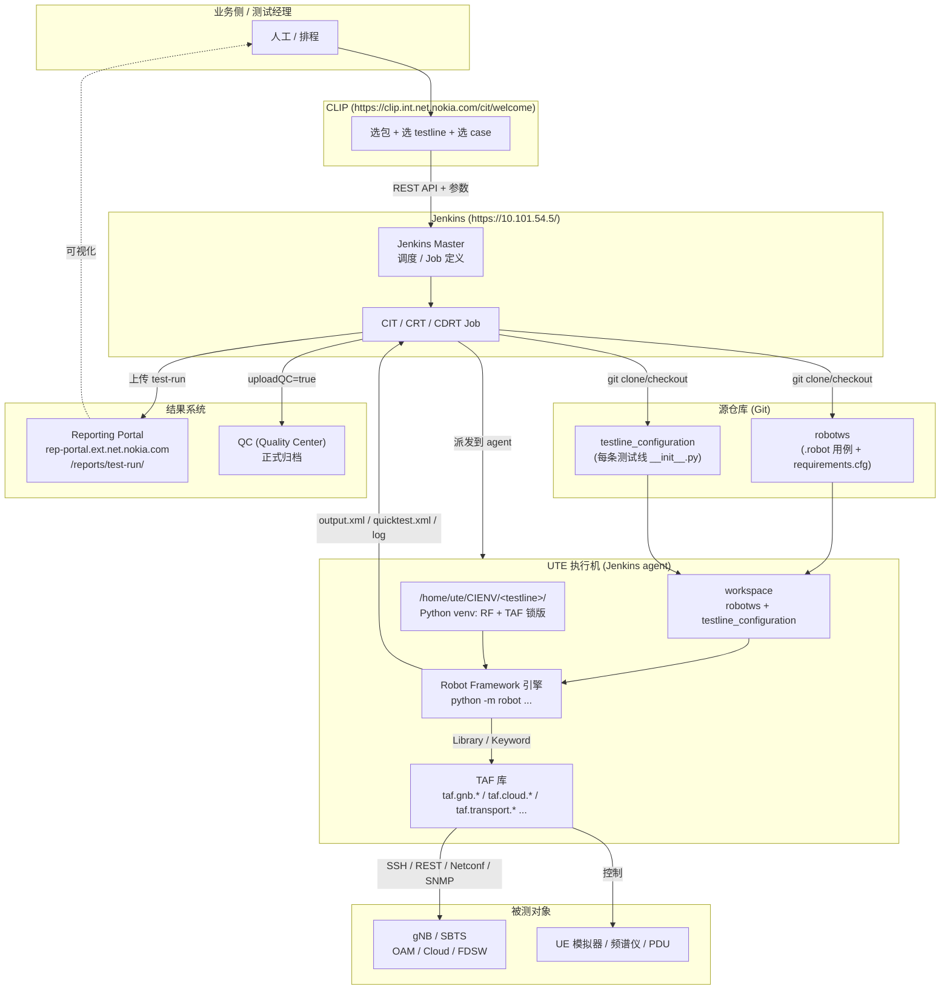

# 现有自动化测试框架平台 全景梳理

> 范围：你当前在使用的、围绕 **TAF + Robot Framework + Jenkins + CLIP + Reporting Portal + QC** 构建的整套基站（gNB / SBTS）自动化测试链路。
> 参考输入：`C:\TA\robotws`（用例仓库）、`C:\TA\testline_configuration`（测试线配置仓库）、Jenkins (`https://10.101.54.5/`)、Reporting Portal、CLIP 触发器、UTE 执行环境。
>
> 本文档目标：
> 1. 厘清 **TAF / Robot Framework / Python** 三者的关系
> 2. 厘清 **CLIP → Jenkins → UTE → robotws → Reporting Portal → QC** 的端到端流转
> 3. 给出每一层使用的技术栈
> 4. 给出可视化流程图

---

## 1. 一句话定义平台

> **CLIP 决定"测什么"，Jenkins 决定"怎么调度"，UTE 提供"在哪跑"，TAF + Robot Framework 决定"怎么测"，robotws 提供"测试用例本身"，testline_configuration 提供"被测对象长什么样"，Reporting Portal 决定"结果给谁看"，QC 决定"结果归档到哪"。**

整个平台本质是：**Robot Framework 用例仓库 + 测试线配置仓库 + Jenkins 调度 + UTE 执行环境 + 结果回流系统**。

---

## 2. 各组成部分及其角色

### 2.1 Python
- **角色**：底层运行时。所有一切（Robot Framework、TAF 库、用例参数化、各种工具脚本）都是 Python 进程跑起来的。
- **平台中的体现**：UTE 上每个测试线都有一个独立的 Python venv，例如：
  ```
  /home/ute/CIENV/7_5_UTE5G402T813/bin/activate
  ```
  这就是给该测试线锁版的 Python 环境，里面装好了 `robotframework`、`taf.*`、`robotframework-sshlibrary` 等。

### 2.2 Robot Framework (RF)
- **角色**：测试用例编写和执行引擎。
- **本质**：一个 Python 库 + 一个 CLI（`python -m robot ...`）。
- **平台中的体现**：
  - 所有 `.robot` 文件都在 `C:\TA\robotws\testsuite\<site>\<feature>\...` 下。
  - 用例通过关键字（Keyword）调用 TAF 库，再由 TAF 库去操作真实基站、UE 模拟器、PDU、OAM 等。
  - 执行时由 Jenkins 拼出一长串 `robot` 命令，例如：
    ```
    python -m robot \
      --pythonpath .../robotws \
      -V testline_configuration/7_5_UTE5G402T813 \
      -t <case_id> robotws/testsuite/.../xxx.robot
    ```
- 输出：`output.xml` / `log.html` / `report.html` + 自定义 `quicktest.xml`、`debug.log`。

### 2.3 TAF（Test Automation Framework，Nokia 内部）
- **角色**：业务领域库集合。把"操作 gNB / OAM / Cloud / UE 模拟器 / 频谱仪 / PDU"等动作封装成 Python API 和 Robot Keyword。
- **本质**：一组以 `taf.*` 命名的 Python 包（在 `robotws/requirements.cfg` 中能看到大量声明）。例如：
  - `taf.config.testline` — 测试线模型抽象
  - `taf.gnb.oam.commissioning` — 基站 commissioning
  - `taf.gnb.oam.megazone_client` / `nodeoam_client` / `rap_manager` — OAM 各子系统客户端
  - `taf.cloud.openstack` / `taf.cloud.cbam` / `taf.cloud.ncir` — 云相关
  - `taf.hw.pdu` / `taf.hw.signal_analyzer` — 硬件控制
  - `taf.transport.ssh` / `taf.transport.bmc` — 传输层
  - `taf.lteemu` — LTE UE 模拟器
  - `taf.fdsw.rc` — FDSW 远程控制
- **与 Python / RF 的关系**：
  - TAF 是 **Python 写的**。
  - TAF 既可以被纯 Python 脚本调用，也提供 **Robot Keyword 形式**给 RF 用。
  - RF 在 `*.robot` 文件里 `Library  taf.xxx.yyy`，然后调用 `Keyword`，TAF 内部再调用 SSH / REST / Netconf / SNMP 等去操作被测设备。

### 2.4 robotws（用例仓库）
- 路径：`C:\TA\robotws`
- 角色：**所有 RF 用例的源仓库**。
- 关键目录：
  - `testsuite/<site>/<area>/...` — 真正的 `.robot` 用例（按团队 / 站点 / 功能划分）
  - `commissionings/` — 各 commissioning 套件（如 `5GC000159` 等）
  - `custom-config/` — 自定义配置
  - `sanity-checks/` — 仓库自身的代码质量与结构校验脚本（CI/CD 用）
  - `requirements.cfg` + `dependencies.py3xx-rf50.lock` — TAF / RF / Python 三者的依赖锁定
- WoW：必须新建分支 → 提 MR → Code Guard 评审 → 合入 master。
- Jenkins 在执行时通过 `git clone/checkout` 把这个仓库拉到 UTE 上某个 workspace。

### 2.5 testline_configuration（测试线配置仓库）
- 路径：`C:\TA\testline_configuration`
- 角色：**描述每条物理/虚拟测试线**（被测设备 + 周边环境）的配置仓库。
- 每条测试线一个目录，例如 `1_16_CLOUD051/`，里面是一个 `__init__.py`，定义 `UTE_CONFIG` 与 TAF 测试线模型。
- 命名规则：`([0-9]+)_([0-9]+)_([a-zA-Z0-9_]+)`，例如 `7_5_UTE5G402T813`、`1_16_CLOUD051`。
- Jenkins 命令中通过：
  ```
  -V testline_configuration/7_5_UTE5G402T813
  ```
  把该目录作为 RF 的 **Variable file**，让用例知道"这次跑的是哪条线、有哪些 BTS / UE / PDU / Cloud / IP"。
- CI 校验：UTE 配置语法、TAF 测试线模型、Black 风格、文件大小/扩展名、目录命名等。

### 2.6 UTE（Unified Test Environment）
- 角色：**测试执行机/测试 VM**。
- 本质：一台或一组运行 Linux 的 VM，按"测试线"切分出独立的 Python venv（`/home/ute/CIENV/<testline>/`）。
- 提供：
  - 已锁版的 Python + RF + TAF
  - 与被测基站 / 云 / UE 模拟器 / PDU 的网络可达性
  - Jenkins agent（让 Jenkins 把 job 派发到这台 VM 上跑）
- Jenkins 命令开头那行 `/home/ute/CIENV/.../bin/activate` 就是激活该测试线对应的 venv。

### 2.7 Jenkins
- 地址：`https://10.101.54.5/`
- 角色：**调度中心**。负责：
  1. 接收来自 CLIP（或人手动）触发的 Job
  2. 把 Job 派给对应的 UTE agent
  3. 在 UTE 上 `git clone` `robotws` + `testline_configuration` 到某个 workspace
  4. 拼出 `python -m robot ...` 命令并执行
  5. 收集 `output.xml` / `quicktest.xml` / `debug.log` / artifacts
  6. 调用 Reporting Portal 的上传接口（或由 RF Listener 上报）
  7. （可选）回写 QC

- 命令拼装样例（你提供的）：
  ```
  /home/ute/CIENV/7_5_UTE5G402T813/bin/activate
  http_proxy= https_proxy= python -m robot \
    --pythonpath /opt/.../robotws \
    -v AF_PATH:http://.../SBTS00_..._A54.zip \
    -v target_version:SBTS00_ENB_9999_260412_000003 \
    -v testline_name:7_5_UTE5G402T813 \
    -v fdswOld:LN_WN_FDSW18A_0000_100164_000000 \
    -v fdswNew:LN_WN_FDSW19_0000_000154_000000 \
    -v uploadQC:false \
    -v caseBranch:stella_tmo_0323 \
    -x quicktest.xml \
    -b debug.log \
    -d artifact/quicktest/retry-0/TMO_E2E_Reproduction_CRT/ \
    -V testline_configuration/7_5_UTE5G402T813 \
    -L TRACE \
    -t 05437018_EDA_UL_bler_verify_after_scell_released \
       robotws/testsuite/Hangzhou/RRM/RAN_PZ_HAZ_34/None_Feature_SG6/TMO_E2E_Reproduction_CRT.robot
  ```
  关键参数解读：

  | 参数 | 含义 |
  |---|---|
  | `--pythonpath .../robotws` | 让 RF 能 import 仓库内的资源 |
  | `-v KEY:VAL` | 注入运行时变量（被测包路径、版本号、testline 名、FDSW 版本、是否上传 QC、用例分支等） |
  | `-V testline_configuration/<TL>` | 把测试线 `__init__.py` 作为变量文件导入 |
  | `-x quicktest.xml` | 生成 xUnit 风格结果 |
  | `-b debug.log` | 输出更详细的 debug 日志 |
  | `-d artifact/...` | 输出目录（log/report/output 都进这里） |
  | `-L TRACE` | 日志级别 |
  | `-t <case>` | 只跑指定 test case |
  | 末尾 `.robot` | 用例文件 |

- 任务类型：**CIT**（Continuous Integration Test）/ **CRT**（Continuous Regression Test）/ **CDRT**（Continuous Daily Regression Test）等，由 Jenkins Job 名 + 触发源决定。

### 2.8 CLIP（CIT 触发与控制门户）
- 地址：`https://clip.int.net.nokia.com/cit/welcome`
- 角色：**业务侧的"按钮"层**，给测试经理 / 团队的 UI。可以：
  - 选择被测软件包 / 版本
  - 选择测试线
  - 选择要跑的测试集 / 用例
  - 触发 Jenkins 上对应的 Job（升包 + 执行 case）
- 与 Jenkins 的关系：CLIP 通过 Jenkins 的 REST API 调起对应 Job，并把参数（包路径、testline、case 列表等）作为 Job 参数传过去。Jenkins 再把它们拼到 `python -m robot -v ...` 里。

#### 2.8.1 CLIP 全栈结构（实测，2026-04-20 via curl HEAD + main bundle 抽串）

CLIP 不是单一系统，而是**聚合门户（aggregator portal）**：把 Jenkins、rep-portal、QC、reservation 服务、robotws GitLab 拼在一个 React UI 下。

**栈图：**

```
Browser
  ↓
nginx 1.26.1                ← HSTS preload, X-Frame-Options: DENY, nosniff, SPA fallback
  ↓ /
React SPA (Create React App, webpack 4, react-router v5)
  ├─ /cit/*        (CIT 子门户：dashboard / scheduletable / testreservation / tlexecution / tlmanage / rephandler / operationhistory / testrun-analyse-details ...)
  ├─ /cdrt         (CDRT 子门户)
  ├─ /full_fb      (CRT_HALF_FB)
  ├─ /mrt          (MRT 子门户)
  └─ /admin
  ↓ AJAX (相对路径)
nginx → 反代到后端 API（极大概率 Python，Flask 或 FastAPI；URL 为 kebab-case + ?queryparam= 风格）
  ├─ /api/automatic-test/runs/report/?limit=...
  ├─ /reservation*       — reservation domain（reservationId 是 24-hex Mongo ObjectId）
  ├─ /schedule/stream/   — 排程
  ├─ /all-builds, /failed_jobs, /relaunch_node, /gnb_upgrade_info?jenkins_url=
  │     ↓
  │  Jenkins REST (https://10.101.54.5/) → 触发 Manual_* Pipeline，机器号 5GRANCI
  ├─ /rep_data, /cit/rephandler   → 中转 rep-portal 数据给前端
  ├─ /check_qc                    → QC
  ├─ /create_pr                   → 代用户在 robotws 上创建 GitLab MR
  └─ /saml/login, /saml/logout, /auth/refresh, /refresh   → SAML SSO + token refresh
  ↓
MongoDB（reservation/记录，ObjectId 印证）+ 可能的 RDBMS（历史/执行记录）
```

**关键证据：**

| 维度 | 结论 | 证据 |
|---|---|---|
| 反向代理 | nginx 1.26.1（比 rep-portal 的 1.18 新一档）| `Server: nginx/1.26.1` + `Strict-Transport-Security: max-age=31536000; preload` + `X-Frame-Options: DENY` + `X-Content-Type-Options: nosniff` |
| 缓存层 | **没有**（与 rep-portal 不同） | 无 `Via:` `X-Varnish:` `X-Cache:` |
| 前端 | React SPA，Create React App 脚手架 | `<title>CLIP</title>` + `<div id="root"></div>` + `webpackJsonpmy-app`（CRA 默认 `name: "my-app"`）+ `/static/{js,css}/{2,main}.<hash>.chunk.{js,css}` 两段式 chunk + `/manifest.json` |
| 前端路由 | react-router v5 风格 | `path:"/cit/testreservation/:view"`、`path:["/ticket/:type"]`、`path:"/cit/testrun-analyse-details/:testrunId"` |
| 平行子模块 | **CIT、CDRT、CRT_HALF_FB、MRT** 4 个并列子门户 | bundle 中：`CIT:"/cit"`、`CDRT:"/cdrt"`、`CRT_HALF_FB:"/full_fb"`、`MRT:"/mrt"` —— 这就是为什么前缀是 `/cit/` |
| SPA fallback | 整个 `/cit/*` 都返回同一 `index.html` | `/` 与 `/cit/welcome` HEAD 完全相同：`content-length: 3019`、同一 `etag: "69787456-bcb"` |
| 鉴权 | **SAML SSO**（Nokia AD）+ token refresh | `"/saml/login"`, `"/saml/logout?"`, `"/auth/refresh"`, `"/refresh"` |
| 后端框架 | 无法 100% 锁死（SAML 拦匿名 curl），**极大概率 Python（Flask/FastAPI）** | URL 风格：`/cd/history?n_days_ago=90`、`/execution_history?n_days_ago=`、`/reservation?page=`、`/groupuser?work=`、`/api/automatic-test/runs/report/?limit=` —— kebab-case + 自由 query 参数 = Python 后端典型；TAF 团队全栈 Python |
| 与 Jenkins 的桥 | 后端代理（不是前端直连）| `/all-builds`、`/failed_jobs`、`/relaunch_node`、`/gnb_upgrade_info?jenkins_url=`、`/schedule/stream/` |
| 与 rep-portal 的桥 | CLIP 后端中转 | `/rep_data`、`/cit/rephandler` |
| 与 QC 的桥 | 配置校验 | `/check_qc` |
| 与 robotws/GitLab 的桥 | **能代用户开 MR** | `/create_pr` —— CLIP 后端持有 GitLab token |
| Reservation 系统 | 自建 domain，Mongo 后端 | `/reservation/plans?reservation_id=…`、`/reservation/ute_build_validate`；`reservationId=69e4ce2e01bac81d94e0dc05` 是标准 24-hex Mongo ObjectId |

**重要含义：**

1. **用户登录走 SAML，Jenkins 触发用 5GRANCI**：用户身份 = SAML 主体，CLIP 后端拿到后用 5GRANCI 机器号去调 Jenkins —— 与之前 §9.5 看到的 `Started by user 5GRANCI` 现象完全吻合。
2. **CLIP 与 rep-portal 解耦**：rep-portal 是数据/报告系统（Django + Varnish + nginx，见 §9.2），CLIP 是触发/编排门户（React + Python + nginx）。两者无强耦合，可独立替换。
3. **CLIP 后端拥有跨系统写权限**：不仅 trigger Jenkins，还能 `/create_pr` 操作 robotws GitLab、`/check_qc` 操作 QC。是真正的 ops-aggregation 角色。
4. **前端栈较旧（CRA + webpack 4 + react-router v5）**，约 2019-2021 年间打的 bundle，之后只 rebuild 未重构；后端可能演进更快。

### 2.9 Reporting Portal（rep-portal）
- 地址：`https://rep-portal.ext.net.nokia.com/reports/test-run/`
- 角色：**测试结果聚合与可视化平台**。
- 接收：Jenkins 跑完后把 `output.xml` / `quicktest.xml` / 日志 / artifact 推上来，按 test-run 聚合，提供：
  - 单次 run 的成功率 / 失败原因
  - 历史趋势
  - 关联到具体 testline / build / case
- 与 QC 的关系：当 Jenkins 命令里 `-v uploadQC:true` 时，结果会进一步被回传到 QC（HP/MF Quality Center）形成正式归档。

### 2.10 QC (Quality Center)
- 角色：测试结果的**正式归档系统**（Nokia 内部质量管理系统）。
- 触发：受 `uploadQC` 变量控制；CIT/CRT 结果按需回写。

---

## 3. 三个最易混淆的关系：TAF ↔ Python ↔ Robot Framework

```
+--------------------+        +--------------------+
|     Robot Framework|        |     TAF 库集合      |
|   (.robot 文件 / RF |  use   |  taf.gnb.* /       |
|    Keyword 引擎)    +-------->  taf.config.* /    |
|                    |        |  taf.transport.*  |
+---------+----------+        +---------+----------+
          |                              |
          | both written in / run by     |
          v                              v
+----------------------------------------------------+
|                      Python                        |
|  (CIENV/<testline>/bin/python  +  pip 锁定依赖)    |
+----------------------------------------------------+
```

要点：
- **TAF 是 Python 库**。它不是另一个语言，也不是替代 RF；它是 RF 用例脚下踩的"业务 SDK"。
- **RF 是 Python 写的执行框架**。`.robot` 文件本身不是 Python，但运行起来是 Python 进程。
- **Python 是地基**：venv 决定了这次跑的 RF / TAF / 第三方库都是哪个版本。
- 一句话：**RF 调 TAF，TAF 操作设备，全部跑在 UTE 的 Python venv 里。**

---

## 4. 端到端流程（文字版）

1. **触发**
   - 用户在 **CLIP** 选好"包 + 测试线 + case 列表" → 点触发
   - CLIP 调 Jenkins REST API → 启动对应 Job
2. **调度**
   - Jenkins Master 接 Job → 选中 UTE agent（按 testline 标签匹配）
3. **准备 workspace（在 UTE 上）**
   - `git clone/checkout robotws`（指定 `caseBranch`，例如 `stella_tmo_0323`）
   - `git clone/checkout testline_configuration`（master 或指定分支）
   - `source /home/ute/CIENV/<testline>/bin/activate` 激活该测试线的 Python venv
4. **可选：升包**
   - 部分 Job 先做 SW upgrade（拉 `AF_PATH` 指定的 BTS 包升级到 `target_version`、刷 FDSW 等）
5. **执行用例**
   - Jenkins 拼装并执行 `python -m robot ... -V testline_configuration/<TL> -t <case> robotws/testsuite/.../xxx.robot`
   - RF 加载 `.robot` → 调 TAF Keyword → TAF 通过 SSH/REST/SNMP/Netconf 操作 BTS / Cloud / UE 模拟器 / PDU
6. **生成结果**
   - 在 `-d artifact/...` 目录得到 `output.xml`、`log.html`、`report.html`、`quicktest.xml`、`debug.log` 及业务 artifact
7. **结果上传**
   - Jenkins post-build 步骤把结果推到 **Reporting Portal**（按 test-run 聚合）
   - 若 `uploadQC=true`，再回写 **QC**
8. **可视化与决策**
   - 测试经理在 Reporting Portal 看趋势 / 失败原因
   - CLIP 关联同一 build 的多次 run，决定是否放行该软件包

---

## 5. 流程图



---

## 6. 各部分使用的技术 / 框架对照表

| 组件 | 主要技术 / 框架 | 角色 | 接口 |
|---|---|---|---|
| Python | CPython 3.10 / 3.11 / 3.12 / 3.13（每条 testline 独立 venv） | 运行时 | 命令行 / 模块导入 |
| Robot Framework | `robotframework` 5.x（看 `.lock` 文件名 `rf50`） | 用例 DSL + 执行引擎 | `python -m robot` |
| TAF | 一组 `taf.*` Python 包（Nokia 内部 PyPI / Artifactory） | 业务领域 SDK + RF Keyword 库 | Python API + RF Library |
| robotws | Git 仓库 + Robot Framework `.robot` 文件 | 测试用例源 | Git MR / Code Guard |
| testline_configuration | Git 仓库 + Python `__init__.py`（含 `UTE_CONFIG` + TAF testline 模型） | 测试线建模 | RF `-V` Variable file |
| UTE | Linux VM + Python venv 矩阵 + Jenkins agent | 执行机 | SSH + Jenkins agent 协议 |
| Jenkins | Jenkins 2.x + Pipeline / Freestyle Job | 调度 + 执行 + 收集结果 | Web UI + REST API |
| CLIP | Web 门户（Nokia 内部） | 业务侧触发器 | Web UI → Jenkins REST |
| Reporting Portal | Web 服务（Nokia 内部，rep-portal） | 结果聚合 / 趋势 / 可视化 | HTTP 上传 API + Web UI |
| QC | HP/MF Quality Center | 正式结果归档 | QC API（受 `uploadQC` 控制） |
| 被测设备 | gNB / SBTS / Cloud（OpenStack、CBAM、NCIR）/ FDSW / UE 模拟器 / PDU / 频谱仪 | DUT | SSH / REST / Netconf / SNMP / 串口 / 仪器协议 |

---

## 7. 关键变量（Jenkins → RF）速查

| 变量 | 来源 | 作用 |
|---|---|---|
| `AF_PATH` | CLIP / Job 参数 | 被测 BTS 包的下载 URL |
| `target_version` | CLIP / Job 参数 | 升包目标版本号 |
| `testline_name` | Job 配置 | 选定的 UTE testline |
| `fdswOld` / `fdswNew` | CLIP / Job 参数 | FDSW 升级前后版本 |
| `uploadQC` | CLIP / Job 参数 | 是否回写 QC |
| `caseBranch` | CLIP / Job 参数 | 用 robotws 的哪个分支 |
| `-V testline_configuration/<TL>` | Jenkins 拼装 | 把测试线模型注入 RF |
| `-t <case_id>` | CLIP 选定 | 限定要跑的单条 case |

---

## 8. 一句话总结整条链路

> **CLIP 选 → Jenkins 调 → UTE 跑 → robotws 提供用例 + testline_configuration 提供环境模型 → Robot Framework 解释 .robot → 调 TAF → TAF 操作真实 gNB / Cloud / UE → 结果以 output.xml/quicktest.xml 形式回收 → Reporting Portal 聚合可视化 → 必要时回写 QC。**

整条平台是"**Python 运行时 + RF 执行引擎 + TAF 业务库 + Git 双仓库（用例 / 测试线）+ Jenkins 调度 + CLIP 业务入口 + Reporting Portal/QC 结果回流**"七层叠加。

---

## 9. 六个继续深挖的钩子

> 本节状态约定：
> - **【实测】** = 已抓到硬证据（Jenkins API 控制台输出 或 GitLab 源码原文），证据原文保存在 `issue/jenkins_capture/` 目录。
> - **【半实测】** = 间接证据 + 工作区文件，能给出框架但缺一步源码/截图。
> - **【待补】** = 需要登录另一个系统（CLIP/QC/UTE/Confluence）才能定型。
>
> 数据采集来源（本轮共用了 2 把 token）：
> - **Jenkins API token** (user `stlin`，已建议 Revoke) → 抓 console
> - **GitLab API token** (user `stlin` @ `wrgitlab.int.net.nokia.com`，scope=`read_api`) → 抓 Pipeline 源码
>
> 原始文件位置（含 testline 名 / SW 版本号 + 内部 IP / Mongo URL / API CSRF token，**强烈建议加 .gitignore**）：
> ```
> c:\TA\jenkins_robotframework\issue\jenkins_capture\
>   # Jenkins console captures
>   ├─ Manual_VRF_HAZ_T06_b4525_console.txt          (108 KB, 主 Pipeline 实跑日志)
>   ├─ UploadRPLog_b817958_console.txt               (24 KB, Reporting Portal 上传命令)
>   ├─ UploadLog_lastbuild_console.txt               (20 KB, 日志同步到 NFS/Artifactory)
>   └─ compareRobotwsDependencies_b369_console.txt   (4 KB, robotws 依赖比对)
>
>   # GitLab Pipelines repo (5getcrt/Pipelines @ wrgitlab.int.net.nokia.com)
>   gitlab/Pipelines/
>     ├─ workflows__SG__CIT__manualJenkinsfile        (7.2 KB, 主 Pipeline 脚本)
>     ├─ workflows__SG__CIT__Jenkinsfile              (7.5 KB, CIT 主 Job 脚本)
>     ├─ workflows__SG__CIT__helper.groovy            (79 KB, 真正实现 RF 命令拼装/RP 上传/QC 映射)
>     ├─ workflows__SG__CIT__kpimanualJenkinsfile     (4.7 KB, KPI 模式 Pipeline)
>     ├─ workflows__SG__CIT__tools__commission.groovy (3.4 KB)
>     ├─ workflows__SG__CIT__tools__init_taf.groovy   (0.7 KB)
>     ├─ workflows__SG__CIT__send_to_rp.robot         (0.6 KB, RF 模式上传 RP/QC 用)
>     ├─ workflows__SG__CIT__parse_output_xml.py      (2.6 KB)
>     ├─ workflows__PostResult2RP__PostResult2RP.groovy (5.3 KB, 失败重传 Pipeline)
>     ├─ workflows__Controler__Jenkinsfile            (12 KB, Controler 主 Pipeline)
>     ├─ workflows__Controler__helper.groovy          (49 KB, Controler 实现)
>     ├─ workflows__CITTrigger__Jenkinsfile           (7.3 KB)
>     ├─ workflows__CRTTrigger__Jenkinsfile           (6.7 KB)
>     ├─ workflows__InstallPackage__Jenkinsfile       (1.6 KB)
>     ├─ workflows__InstallPackage__helper.groovy     (18 KB)
>     └─ vars__fetch_resource.groovy                  (0.2 KB)
>
>   # GitLab SharedLibrary repo (5getcrt/SharedLibrary @ wrgitlab.int.net.nokia.com)
>   gitlab/SharedLibrary/
>     ├─ checkDryrun.groovy / checkoutFromNFS.groovy / checkoutSource.groovy
>     ├─ currentJobDir.groovy / displayEnv.groovy / pipelineNode.groovy
>     ├─ generateCitReleaseNote.groovy / sendCitReleaseNote.groovy
>     ├─ generateSqliteFileFromRobotLog.groovy / getTriggerTime.groovy
>     ├─ loadLocalHelperLibrary.groovy / postTestlineRunsInfo.groovy / postTestlineTriggerInfo.groovy
>     ├─ robotCmdExecution.groovy / stageExecution.groovy / stepExecution.groovy
>     └─ src/
>         ├─ cit/CaseMap.groovy
>         └─ io/{ApiServer.groovy, ArtifactoryInterface.groovy, Elasticsearch.groovy, Http.groovy, JenkinsInterface.groovy, Mongo.groovy}
> ```
>
> ⚠ **安全提醒（实抓时发现）**：`gitlab/SharedLibrary/src/ApiServer.groovy` 第 13 行有一行**硬编码的 X-CSRFToken**（`C4X7EXxFhoQwd8qW8gHmLdqYWL83LmrjKLs9U7iz8ZrseL3K82UnslZQtfQUNmja`），任何能 read 这个 GitLab repo 的用户都能拿到——属于明显的安全债务，建议改为 `withCredentials([string(...)])` 注入。同文件还把 Mongo API server (`http://10.182.68.169:5000/api/db`) 与内部 API server (`http://10.182.68.169:8000/api/v1`) 的真实 URL 也写死在源码里。

---

### 9.1 单条 Jenkins Job 的 Pipeline 脚本（`Jenkinsfile`） 【实测】

**实测出的 Jenkins 总体拓扑：**

- 根目录 4 个文件夹：`CIT/`、`CRT/`、`TesterOperateCases/`、`ToolKit/`
- CIT/CRT 各自再分 `Master/`、`QCBased/`（仅 CIT 有）、`czd/`、`onlyVM/`（仅 CRT 有）
- 真正跑 case 的 Pipeline 在 `CIT|CRT/Master/WebTrigger/Manual_*`（如 `Manual_VRF_HAZ_T06`、`Manual_5G_PZ_HZ_*` 等几十条），均为 `WorkflowJob`（Jenkins Pipeline）
- 配套基础设施 Job 在 `ToolKit/` 下，关键的几条：
  - `UploadLog` — 把 artifact 同步到 NFS / 日志服务器
  - `UploadRPLog` — 把结果上传 Reporting Portal（同时回写 QC，见 9.2 / 9.6）
  - `PostResult2RP`、`AutoEnableTL`、`enb_sw_upgrade`、`gnb_sw_upgrade`、`ocp_sw_upgrade`、`compareRobotwsDependencies`、`Sync_stream_map2Mongo`、`SyncCasemapToMongoEveryday`、`MonitorCITCaseInQC`、`backup_jenkinshome`、`getRepFriendStatis` 等

**Pipeline 脚本的真实位置（实测）：**

```
[Console] Obtained workflows/SG/CIT/manualJenkinsfile.groovy from git
          git@gitlabe1.ext.net.nokia.com:5gpci/CIT/Pipelines.git
[Console] Loading library 5gran.hz.cit.shared.library@master
          git@gitlabe1.ext.net.nokia.com:5gpci/SharedLibrary.git
```

也就是说，**Pipelines / SharedLibrary 各有两份 fork**，被不同业务团队维护：

| 项目 | CIT 团队 fork（live build 4525 用的）| CRT 团队 fork（已抓源码）|
|---|---|---|
| Manual_* 主 Pipeline 仓库 | `git@gitlabe1.ext.net.nokia.com:5gpci/CIT/Pipelines.git` | `git@wrgitlab.int.net.nokia.com:5getcrt/Pipelines.git`（id=9747）|
| Shared Library 仓库 | `git@gitlabe1.ext.net.nokia.com:5gpci/SharedLibrary.git`（库名 `5gran.hz.cit.shared.library`）| `git@wrgitlab.int.net.nokia.com:5getcrt/SharedLibrary.git`（id=9748）|
| Pipelines 镜像 | `git@10.101.54.8:/git/Pipelines.git`、`git@10.101.54.9:/git/Pipelines.git` | NFS 镜像 `/disk3/nfs/5g_source_cit/Pipelines.tgz`（详见下） |

> ⚠ 注：本节后续的"主 Pipeline 文件名 / stage 列表 / RP 上传 groovy / Mongo URL"等结构性事实**取自 CRT fork (`5getcrt/Pipelines`)**——CIT fork 高度类似但不保证逐字相同。需要 100% 对照 CIT fork，需要单独对 `gitlabe1.ext.net.nokia.com` 实例的访问授权。

**实际 Pipeline 文件名（实测，从 GitLab 取出）：**

```
5getcrt/Pipelines (id=9747, default branch=master)
├─ workflows/
│   ├─ SG/CIT/
│   │   ├─ Jenkinsfile               <- CIT 自动 Job 入口
│   │   ├─ manualJenkinsfile         <- ★ 手动/CLIP 触发的主 Pipeline（注意没 .groovy 后缀）
│   │   ├─ kpimanualJenkinsfile      <- KPI 模式手动 Pipeline
│   │   ├─ singleDryrunJenkinsfile   <- 单条 dryrun
│   │   ├─ uufmanualJenkinsfile.groovy
│   │   ├─ helper.groovy             <- ★ 79 KB，真正实现 RF 命令拼装/RP 上传/QC 映射
│   │   ├─ tools/{commission,init_taf}.groovy
│   │   ├─ send_to_rp.robot          <- ★ RF 模式上 RP/QC 用的 .robot 脚本
│   │   ├─ get_manual_num.py / parse_output_xml.py
│   ├─ Controler/{Jenkinsfile, helper.groovy, *.py}   <- 调度上层 Pipeline
│   ├─ CITTrigger/{Jenkinsfile, NoTimeTriggerJenkinsfile}
│   ├─ CRTTrigger/Jenkinsfile
│   ├─ PostResult2RP/PostResult2RP.groovy             <- ★ 失败重传 RP（与 ToolKit/PostResult2RP Job 对应）
│   ├─ InstallPackage/{Jenkinsfile, helper.groovy}
│   ├─ AutoReleaseNote/, BackupMongodb/, BackupFiberSwitch/, CheckNodeCapacity/,
│      CITDownloadSource/, CITWebBackendData/, CreateJobForNewStream/,
│      FirewallConnectivityTest/, KPIController/, NoRunCaseNotification/,
│      PreScheduleNotification/, ReleaseNote/, SCITTrigger/, Sync*/, UUF*/, WFTTrigger/, ...
│   └─ Utils/Sync*/                  <- 一堆 Sync* Job（QCInstance / RPCaseInfo / Norun / WFTLoadBuild / Realtimedata / ...）
├─ vars/fetch_resource.groovy        <- 仅 1 个仓库自带 var
├─ resource/{TestPort.py, common_interface_library.py, variables.py, __init__.py}
└─ README.md / .gitignore / .sftpConfig.json / .vscode / .idea
```

```
5getcrt/SharedLibrary (id=9748, default branch=master)
├─ vars/                             <- 16 个 Pipeline DSL step
│   ├─ checkDryrun.groovy            <- 判断 dryrun 模式
│   ├─ checkoutFromNFS.groovy        <- ★ 从 NFS /disk3/nfs/5g_source_cit/<src>.tgz 拉源码
│   ├─ checkoutSource.groovy         <- 直接 git checkout
│   ├─ currentJobDir.groovy / displayEnv.groovy / pipelineNode.groovy
│   ├─ generateCitReleaseNote.groovy / sendCitReleaseNote.groovy
│   ├─ generateSqliteFileFromRobotLog.groovy
│   ├─ getTriggerTime.groovy
│   ├─ loadLocalHelperLibrary.groovy <- ★ load Pipelines/workflows/<area>/helper.groovy
│   ├─ postTestlineRunsInfo.groovy / postTestlineTriggerInfo.groovy
│   ├─ robotCmdExecution.groovy      <- ★ 通用 Robot Framework 命令组装器
│   └─ stageExecution.groovy / stepExecution.groovy
└─ src/
    ├─ cit/CaseMap.groovy            <- 用例映射 (case → SG/Squad/QC) 数据类
    └─ io/
        ├─ ApiServer.groovy          <- 调内部 CIT API server (10.182.68.169:8000)
        ├─ ArtifactoryInterface.groovy
        ├─ Elasticsearch.groovy
        ├─ Http.groovy               <- HTTP 客户端 wrapper
        ├─ JenkinsInterface.groovy
        └─ Mongo.groovy              <- 调 Mongo API (10.182.68.169:5000) 读写 cit-execute-result-rt
```

**真实 build 的工作区结构（实测）：**

```
/opt/transformers.dynamic.nsn-net.net/workspace/
  CRT/Master/WebTrigger/Manual_VRF_HAZ_T06/
    4525/                              <- buildId
      Pipelines/                       <- checkout 出来的 Pipelines 仓库
      7_5_CLOUD402T073/                <- 当前 testline 子目录
        robotws/
        testline_configuration/
        artifact/quicktest/retry-0/<SuiteName>/
          output.xml
          log.html
          report.html
          quicktest.xml
          debug.log
```

**真实参数（实测，来自 Manual_VRF_HAZ_T06 #4525 的 ParametersAction）：**

| 参数 | 类型 | 实测值（示例） |
|---|---|---|
| `triggerType` | String | `CRT` |
| `version` | String | `GNB` |
| `knifeURL` | Text | `no` |
| `fdsw` | Boolean | `false` |
| `targetVersion` | String | `default` |
| `eNBVersion` / `enbTargetVer` | String | `no` / `default` |
| `failedCaseRetryTime` | String | `0` |
| `suites` | Text | `-t "5603664_SA_PCELL_N41_CA" Hangzhou/RRM/RAN_PZ_HAZ_34/None_Feature_SG6/TMO_RRM_KPI_Cases.robot` |
| `repeat_until_fail` | String | `No` |
| `testline` | String | `7_5_CLOUD402T073` |
| `testcaseBranch` | String | `master` |
| `local_robotws` | String | `` |
| `emailReceiver` | String | `jasper.jiao@nokia.com` |
| `fdswOld` / `fdswNew` | String | `LN_WN_FDSW18A_0000_100164_000000` / `LN_WN_FDSW19_0000_000154_000000` |
| `gnb_conf_branch` | String | `master` |
| `uploadQC` | Boolean | `false` |
| `update_automation_options` | Boolean | `false` |
| `installPackage` | Boolean | `false` |
| `updateSWconfig` | Boolean | `false` |
| `dryrun` | Boolean | `false` |
| `installTAF` | Boolean | `false` |
| `reservationId` | String | `69e4ce2e01bac81d94e0dc05` |
| `triggerCount` | String | `1` |
| `triggerByJobFromClip` | Boolean | `false` |
| `UUF4ALL` | Boolean | `false` |
| `scout_testline` | String | `` |
| `hwf_repeat_time` | String | `20` |
| `upgrade_repeat_time` | String | `3` |
| `customers_web` | WHide | `` |

> 这一份就是实际 Manual Pipeline 接收的参数全集，CLIP 触发时就是按这套字段填表（见 9.5）。

**Pipeline 实际跑出的 stage 序列（实测，按 Console 顺序摘取）：**

```
Start of Pipeline
  timestamps + ansiColor 包裹
  node('API_Container_Pz4_04')
    ws('/opt/.../Manual_VRF_HAZ_T06/4525')
      Stage: Checkout Source
        checkout SCM:5gpci/CIT/Pipelines, branch:master
      Stage: Post manual scheduled cases to db          <- httpRequest + readJSON 上报内部 DB
      Stage: Post 7_5_CLOUD402T073 manual trigger info  <- httpRequest 报状态
      Stage: (各种 Load Local Helper Library)            <- load Pipelines/workflows/SG/CIT/libs/*.groovy
      Stage: ue_proxy_mngr 准备                          <- 安装 taf.ue 等运行时依赖
      Stage: Run Robot                                  <- 见下
      Stage: Robot results publisher                    <- Robot Framework Jenkins plugin
      Stage: Update ongoing Status to miss in DB        <- httpRequest
      Stage: Build CRT/Master/WebTrigger/AutoReleaseNote
      Stage: Release Node                               <- httpRequest 调 reservation API 释放 testline
      Stage: 清理 workspace (rsync --delete blank/)
End of Pipeline
```

**Pipeline 脚本骨架（实测，`5getcrt/Pipelines` 的 `workflows/SG/CIT/manualJenkinsfile`，约 200 行）：**

```groovy
// Load shared library 5getcrt/SharedLibrary 隐式注入（Jenkins Global Pipeline Library 配置）
import groovy.transform.Field
@Field def lib_helper

timestamps {
    ansiColor('xterm') {
        node('Docker && APIServer') {                       // <- 真实 agent label
            ws("${env.WORKSPACE}/${env.BUILD_NUMBER}") {
                currentBuild.description = env.version + '+' + env.triggerType + '+' + env.testline
                properties([
                    buildDiscarder(logRotator(artifactDaysToKeepStr:'7', daysToKeepStr:'7')),
                    parameters([
                        string(name:'triggerType',  defaultValue: env.JOB_NAME.split('/')[0]),  // <- CIT/CRT/UUF/KPI/SCIT 自动来自 Job 路径
                        string(name:'version',      defaultValue:'4.8.112'),
                        string(name:'eNBVersion',   defaultValue:'no'),
                        string(name:'targetVersion',defaultValue:'default'),
                        string(name:'failedCaseRetryTime', defaultValue:'0'),
                        text  (name:'suites',       defaultValue:''),
                        string(name:'testline'),
                        string(name:'testcaseBranch',           defaultValue:'master'),
                        string(name:'testlineConfigurationBranch', defaultValue:'master'),
                        string(name:'logPath',      defaultValue:'default'),
                        string(name:'emailReceiver',defaultValue:''),
                        string(name:'fdswOld',      defaultValue:'LN_WN_FDSW18A_0000_100165_000000'),
                        string(name:'fdswNew',      defaultValue:'LN_WN_FDSW19_0000_000029_000000'),
                        booleanParam(name:'uploadQC',       defaultValue:false),
                        booleanParam(name:'installENB',     defaultValue:false),
                        booleanParam(name:'installPackage', defaultValue:false),
                        booleanParam(name:'updateSWconfig', defaultValue:false),
                        booleanParam(name:'dryrun',         defaultValue:false),
                        booleanParam(name:'filterCasebyTag',defaultValue:true),
                    ])
                ])

                stageExecution('Preparation') {
                    checkoutFromNFS { src='Pipelines';     target='Pipelines' }
                    checkoutFromNFS { src='Configuration'; target='Configuration' }
                    checkoutFromNFS { src='robotws5g';     target='robotws5g'; branch=env.testcaseBranch }
                    lib_helper = loadLocalHelperLibrary('SG/CIT')        // <- 加载 Pipelines/workflows/SG/CIT/helper.groovy
                }

                try {
                    stageExecution('Post manual scheduled cases to db') {
                        lib_helper.post_manual_scheduled_cases_to_db()   // <- 把要跑的 case 注册进 Mongo cit-execute-result-rt
                    }
                } catch (Exception ex) { println(ex); throw ex }

                try {
                    stageExecution('Test') {
                        displayEnv()
                        lib_helper.test()                                // <- 主测试入口（实现在 helper.groovy）
                    }
                } catch (Exception ex) { println(ex); throw ex }
                finally {
                    stageExecution('Update ongoing Status to miss in DB') {
                        def lib_helper1 = loadLocalHelperLibrary('Controler')
                        lib_helper1.update_ongoing_status_to_miss_mongo('ongoing')
                    }
                }
            }
        }
    }
}
```

**关键差异**（CRT fork 文件 vs CIT live build console）：

- **agent label**：源码写 `node('Docker && APIServer')`，live build 实际跑在 `API_Container_Pz4_04`——说明这台 agent 同时打了 `Docker`、`APIServer`、`API_Container_Pz4_04` 三个 label。
- **参数集**：CRT fork 源码只声明了 19 个 parameters，但 live build 的 ParametersAction 有 28+ 个——说明 CIT fork 那边定义更全（多了 `knifeURL/fdsw/repeat_until_fail/local_robotws/gnb_conf_branch/update_automation_options/installTAF/reservationId/triggerCount/triggerByJobFromClip/UUF4ALL/scout_testline/hwf_repeat_time/upgrade_repeat_time/customers_web` 等），或者通过 Job UI 配置直接覆盖了 properties。CIT fork 源码需另行授权抓取。
- **stage 名**：源码只有 `Preparation / Post manual scheduled cases to db / Test / Update ongoing Status to miss in DB` 四个。live build 显示更多细分 stage（Run Robot / Robot results publisher / Release Node / AutoReleaseNote ...）——这些是 `lib_helper.test()` 内部用 `stageExecution { ... }` 套出来的子 stage（在 helper.groovy 里）。

**`checkoutFromNFS` 的真实行为（实测，`SharedLibrary/vars/checkoutFromNFS.groovy`）：**

```groovy
// 1. 从 NFS 缓存路径 /disk3/nfs/5g_source_cit/<src>.tgz 解压（快速）
sh "cp ${path_on_nfs}/${src}.tgz ./;tar xzf ${src}.tgz;rm -f ${src}.tgz; \
    cd ${src};git checkout master;git clean -df;git reset --hard;git pull;git checkout ${branch}"

// 2. 失败时回退到原生 git clone
if (src in ['Pipelines','Configuration']) {
    giturl = "git@wrgitlab.int.net.nokia.com:5getcrt/${src}.git"
} else {
    giturl = "git@wrgitlab.int.net.nokia.com:5G/${src}.git"   // <- robotws5g 在 5G 群组下！
}
checkout([$class:'GitSCM', branches:[[name:branch]],
         userRemoteConfigs:[[credentialsId:'ca_5gpci_key', url:giturl]]])
```

所以 CRT 的 robotws 实际在 GitLab 路径 `git@wrgitlab.int.net.nokia.com:5G/robotws5g.git`。

> **历史沿革（用户确认）**：`5G/robotws5g` 是**早期曾用名**，后来整体迁移成 `RAN/robotws`。CRT 这套 Pipeline / NFS 缓存 / `checkoutFromNFS` 的 fallback URL 仍然写死的是旧名 `5G/robotws5g` —— 属于**没跟上仓库改名**的历史遗留代码（很可能 5G 群组下还保留着该 repo 作镜像 / 兼容入口，让老 Pipeline 不至于 404）。这是一处**代码债**：要么把所有 `5G/robotws5g` 替换成 `RAN/robotws`，要么明确保留旧名作 alias。

**Run Robot 命令的真实组装位置（实测）：**

两套并存的 RF 命令构建器：

1. **shared lib 通用版**（`SharedLibrary/vars/robotCmdExecution.groovy`）：

   ```groovy
   def call(Closure body) {
       def config = [:]; body.delegate = config; body()
       def cmd = get_robot_cmd(config.dryrunMode, config.pkgPath, config.configPath,
                               config.robotSuites, config.uufSource, config.retryTimes)
       sh(". ${config.pythonPath}/bin/activate 2>/dev/null;$cmd")
   }
   def get_robot_cmd(dryrun, pkgPath, configPath, suites, uufSource, retryTimes) {
       def mode = dryrun ? '--dryrun' : ''
       def caseName = suites.split('/')[-1].getAt(0..(suites.split('/')[-1].length()-7))
       def outputDir = "artifact/quicktest/retry-${retryTimes}/${caseName}/"
       if (uufSource != "no_source") outputDir = "${uufSource}/${outputDir}"
       return "python -m robot ${mode} -v AF_PATH:${pkgPath} \
               -x quicktest.xml -b debug.log -d ${outputDir} \
               -V ${configPath} -L TRACE ${suites}"
   }
   ```

   只覆盖最少的 `-v` 注入；live build 看到的 `-v target_version`、`-v testline_name`、`-v fdswOld/fdswNew`、`-v uploadQC`、`-v caseBranch` 等额外变量都是在 helper.groovy 里另行加上的。

2. **CIT 团队 helper 版**（`Pipelines/workflows/SG/CIT/helper.groovy`）：里面有 `def test()`、`send_report_to_rp(...)`、`send_report_to_rp_uuf(...)`、`update_case_status_to_db(...)`、`get_artifactory_target_path(...)` 等方法（共 78 KB），是 live Manual_VRF_HAZ_T06 build 真正执行的逻辑。

**内部 DB / API server 真实端点（实测，`SharedLibrary/src/io/Mongo.groovy` + `ApiServer.groovy`）：**

| 类型 | URL | 用途 |
|---|---|---|
| Mongo REST API | `http://10.182.68.169:5000/api/db` | 读写 `cit-execute-result-rt` / `dev-cit-execute-result-rt` / `dryrun-cit-execute-result-rt` 等表 |
| 内部 CIT API | `http://10.182.68.169:8000/api/v1` | `cit/wft_status/`（拉未测包 / 上报 build 状态），鉴权用 X-CSRFToken（**已硬编码在源码中**，见上文安全提醒） |
| Artifactory（日志归档） | `http://10.135.157.75:8081/artifactory/mn5gran_hzlog-local/` | 路径模板：`<JobPath>/<streamVersion>/<pkgNumber>/<BUILD_NUMBER>/<triggerType>/<sg>/<testline>/` |
| NFS 源码缓存 | `/disk3/nfs/5g_source_cit/<src>.tgz` | Pipelines / Configuration / robotws5g |

**不同分支走不同表：** Mongo.groovy 里 `if env.JOB_URL.split('/')[6].toLowerCase() == 'develop'` → 写 `dev-` 前缀；`if env.dryrun == 'true'` → 写 `dryrun-` 前缀。所以 Master 真跑只写 `cit-execute-result-rt`。

**Run Robot stage 的真实命令（实测，从 `Manual_VRF_HAZ_T06_b4525_console.txt` 第 913-916 行抄出）：**

```bash
+ . /home/ute/CIENV/7_5_CLOUD402T073/bin/activate
+ http_proxy= https_proxy= python -m robot \
    --pythonpath /opt/transformers.dynamic.nsn-net.net/workspace/CRT/Master/WebTrigger/Manual_VRF_HAZ_T06/4525/7_5_CLOUD402T073/robotws \
    -v AF_PATH:http://10.101.54.7/SBTS00/SBTS00_ENB_9999_260419_000008/SBTS00_ENB_9999_260419_000008_release_BTSSM_downloadable_A54.zip \
    -v target_version:SBTS00_ENB_9999_260417_000016 \
    -v testline_name:7_5_CLOUD402T073 \
    -v fdswOld:LN_WN_FDSW18A_0000_100164_000000 \
    -v fdswNew:LN_WN_FDSW19_0000_000154_000000 \
    -v uploadQC:false \
    -v caseBranch:master \
    -x quicktest.xml \
    -b debug.log \
    -d artifact/quicktest/retry-0/TMO_RRM_KPI_Cases/ \
    -V testline_configuration/7_5_CLOUD402T073 \
    -L TRACE \
    -t 5603664_SA_PCELL_N41_CA \
    robotws/testsuite/Hangzhou/RRM/RAN_PZ_HAZ_34/None_Feature_SG6/TMO_RRM_KPI_Cases.robot
```

> **结论**：用户最初提供的命令样例与现网完全一致，确认无误。RF 命令本身**不带 `--listener`** 也不带 rep-portal 钩子，结果上传是 Pipeline post 阶段触发独立 Job 完成的（见 9.2）。

**实测得到的运行时事实（其余亮点）：**

- **Agent 标签**：build 跑在 `API_Container_Pz4_04` 这台 agent 上（不是按 `ute_<testline>` 标签派发，而是有一组容器化 agent 池）。
- **Pipeline 内大量 `httpRequest` + `readJSON` 调用**：说明有一个内部"调度状态 DB / Reservation 服务"作 SoR，trigger info / case status / node lock 都走 HTTP REST 进去（猜测是 Mongo 后端，因为有 `Sync_stream_map2Mongo` Job）。
- **Robot results publisher** = Jenkins 的 [Robot Framework Plugin](https://plugins.jenkins.io/robot/)，在 build 详情页显示 PASS/FAIL 是它干的。
- **运行环境是 SELinux enforcing 的容器**：日志里有 `/usr/bin/chcon --type=ssh_home_t ...` 给 SSH key 打标签。
- **下游联动**：Run Robot 完成后会 `build job: 'ToolKit/UploadLog'` 派发上传日志的子 Job，`uploadQC=true` 时会触发 `ToolKit/UploadRPLog` 上传 RP（见 9.2）；`emailReceiver` 用于 `CRT/Master/WebTrigger/AutoReleaseNote` 发邮件。

**【待补】**
- ✅ 完整 Pipeline 源码已抓（CRT fork @ wrgitlab）。
- ✅ `RAN/robotws` 与 `5G/robotws5g` 关系已明（用户确认：robotws5g 是旧名，已迁移为 RAN/robotws，Pipeline 里还残留旧路径 = 历史遗留 / 别名兼容）。
- ❌ CIT fork (`gitlabe1.ext.net.nokia.com:5gpci/CIT/Pipelines`) 的源码——需再开一把对应实例的 token 才能逐字对照 28-参数版本。两个 fork 应该高度同源，但 CIT 多了 `knifeURL / reservationId / triggerByJobFromClip / UUF4ALL` 等字段，说明 CIT 团队在 Job UI 层面或 fork 内自有补丁。
- ❌ `vars/postTestlineRunsInfo` / `postTestlineTriggerInfo` / `pipelineNode` 等 shared step 内部具体调的 API 端点（已抓到文件，如需细看可直接读 `issue/jenkins_capture/gitlab/SharedLibrary/`）。

---

### 9.2 Reporting Portal 的上传协议 / Listener 实现 【实测】

**真实 Reporting Portal URL（实测，与文档原 URL 不同）：**

| 来源 | URL |
|---|---|
| 用户最初提供的 | `https://rep-portal.ext.net.nokia.com/reports/test-run/` |
| **现网真实回链**（`UploadRPLog_b817958_console.txt` 第 247、259、272 行）| `https://rep-portal.wroclaw.nsn-rdnet.net/reports/test-runs/?file_hash=<MD5_HASH>` |

> 二者大概率是同一服务的内/外网域名（Wroclaw 是 portal 部署机房）。**实际可点开的 run 链接是 `wroclaw.nsn-rdnet.net` 这个**。

**真实上传机制（实测，全部硬证据）：**

不是 RF Listener，**也不是 Jenkins shared library 直接 POST**。在 GitLab 源码里实际共有 **3 条独立的 RP 上传路径**，按场景分发：

| # | 触发场景 | 实现位置 | 上传方式 | QC 信息来源 |
|---|---|---|---|---|
| A | CIT/CRT 主跑（live build 4525 走的）| Pipeline 内 `build job: 'ToolKit/UploadRPLog'` → `workflows/UploadRPLog/jenkins.groovy` | `ute_reporting_portal send` CLI；`CM_TEST_INFORMATION` env var 带 QC | env var |
| B | 同步主跑（CIT 团队 helper.groovy 直接调用）| `Pipelines/workflows/SG/CIT/helper.groovy::send_report_to_rp(...)` | `ute_reporting_portal send` CLI；命令行不带 QC | 无 → portal 服务端按 `sg→qc` 表自查 |
| C | UUF 模式 + 用例 Force Tags 含 `QC_<id>` | `helper.groovy::send_report_to_rp_uuf(...)` → 调 RF 跑 `Pipelines/workflows/SG/CIT/send_to_rp.robot` | RF Library `ute_reporting_portal.report to rp` | RF tags 抽出 `QC_<id>`，传 `qc_id=$qc_id` 给 RF keyword |
| D | 失败重传 | `Pipelines/workflows/PostResult2RP/PostResult2RP.groovy`（对应 Job `ToolKit/PostResult2RP`） | 同 B 但从 Mongo `cit-execute-result-rt` 查 `uploadRP=fail` 的项重发 | 无 |

**路径 A：live 抓到的命令（`UploadRPLog_b817958_console.txt`，整理换行）：**

```bash
/root/CIENV/py3.10.12/bin/ute_reporting_portal send \
    -nc -ie -ro /mnt/5g_log/.../artifact/quicktest/retry-0/<SUITE>/output.xml \
    -p UTE -ca VRF_HAZ -v \
    --log_link  https://10.70.226.9/logs/.../<SUITE>/log.html \
    --file_path /mnt/5g_log/.../<SUITE>/<SUITE>.robot \
    -l VRF_HAZ_T03 \
    --sw_version SBTS00_ENB_9999_260419_000007 \
    --enb_nsa_build get_enb_ip_failed \
    --gnb_nsa_build SBTS00_ENB_9999_260419_000007 \
    -tl 7_5_UTE5G402T374 \
    --fail_cause LightweightCI
```

**路径 B：CRT fork 源码原文（`Pipelines/workflows/SG/CIT/helper.groovy::send_report_to_rp`，第 1380-1420 行）：**

```groovy
def send_report_to_rp(it, testline, sgJobInfo, source_version, tlActiveVersion, logPath, retryNum) {
    def caseFolder = it.split('\\.')[0..-2].join('.').split('/')[-1]
    def sg = sgJobInfo.sg
    def logLink     = "${logPath}${sg}/${testline}/artifact/quicktest/retry-${retryNum}/${caseFolder}"
    def output_file = "artifact/quicktest/retry-${retryNum}/${caseFolder}/output.xml"
    def robot_file  = "../robotws5g/testsuite/${it}"
    def sw_version  = ""
    def rplink      = ""
    def rplink_path = "rplink_${source_version}_${caseFolder}"

    if (tlActiveVersion == "NA") sw_version = "${sgJobInfo.releaseID}_${env.version}"
    else                         sw_version = "${sgJobInfo.releaseID}_${tlActiveVersion}"
    if (source_version != "no_source") {
        output_file = "${source_version}/${output_file}"
        logLink     = "${logPath}${sg}/${testline}/${source_version}/artifact/quicktest/retry-${retryNum}/${caseFolder}"
        sw_version  = "${sgJobInfo.releaseID}_${env.version}"
    }
    def enb_ver = get_enb_version(testline)
    if (enb_ver != 'fail' && enb_ver != 'no_enb') sw_version = sw_version + ';' + enb_ver

    try {
        sh "unset http_proxy https_proxy; \
            ute_reporting_portal send -ie -ro ${output_file} -p UTE -ca UTE -v \
              --log_link $logLink --file_path $robot_file \
              -l $sg --sw_version \"$sw_version\" -tl $testline \
              2>&1 | tee $rplink_path"
        rplink = sh(script: "cat $rplink_path | grep 'Link to reporting portal:'|awk '{print \$7}'",
                    returnStdout: true)
        if (rplink == "") rplink = "error"
    } catch (Exception ex) { print ex; rplink = "error" }
    return rplink
}
```

**路径 C：RF 模式（`send_to_rp.robot` + helper 里的调用，第 1437-1465 行）：**

```groovy
// helper.groovy 中先抽 QC ID（从 .robot 文件 Force Tags 里 grep）
def allForceTags = sh(script:
    "python -c \"from robot.parsing import TestData;\
                  print ','.join(TestData(source='../robotws5g/testsuite/$it').setting_table.force_tags)\"",
    returnStdout: true).trim()
def qc_id = sh(script: "echo $allForceTags | grep -P 'QC_\\d+' -o", returnStdout: true).trim().minus('QC_')

// 然后调 send_to_rp.robot 把数据送进 portal
sh "python -m robot $ifDryrun \
    -v status:$robotStatus -v testline:$testline -v logLink:$logLink \
    -v NAME_TO_REPORT:$caseName -v CANDIDATE_SW:\"$sw_version\" \
    -v source_ver:$sw_source_version -v QC_ID:$qc_id \
    -x quicktest.xml -b debug.log -d artifact/ \
    ../Pipelines/workflows/SG/CIT/send_to_rp.robot"
```

```robot
*** Settings ***
Library  ute_reporting_portal              # <- 同一个 Python 包，又作为 RF Library 用

*** Variables ***
&{pretty_logs}    Test logs=${logLink}

*** Test Cases ***
Report To Reporting Portal
    @{add_info}=    Create List
    ${uuf_test}=  Set Variable  False
    ${link_to_reporting_portal}=
    ...  ute_reporting_portal.report to rp  result=${status}  testline=${testline}  ca=ute  label=SG_08
    ...  uuf_test=${uuf_test}
    ...  qc_domain=MN_5G  qc_project=5G        # <- 注意：UUF 路径写死 MN_5G/5G；live build 4525 走的是另一条路（QCBased）qc_domain=MN_RAN
    ...  build=${CANDIDATE_SW}
    ...  links=${pretty_logs}
    ...  name=${NAME_TO_REPORT}
    ...  parameter_1=${source_ver}
    ...  add_info=@{add_info}
    ...  qc_id=${QC_ID}
```

**路径 D：失败重传 Pipeline（`workflows/PostResult2RP/PostResult2RP.groovy` 摘录）：**

```groovy
def send_report_to_rp(output_dir, testline, caseDir, source_version, robotName, releaseID,
                     sg, logPath, packageVersion_inTL, packageVersion, eNBVersion) {
    // ... 拼 output_file / logLink / sw_version ...
    sh "unset http_proxy https_proxy; \
        ute_reporting_portal send -ie -ro ${output_file} -p UTE -ca UTE -v \
          --log_link $logLink --file_path $robot_file -l $sg \
          --sw_version \"$sw_version\" -tl $testline \
          2>&1 | tee $rplink_path"
    rplink = sh(script: "cat $rplink_path | grep 'Link to reporting portal:'|awk '{print \$7}'",
                returnStdout: true)
}

// 主逻辑：每天扫一次 mongo cit-execute-result-rt 找 uploadRP=fail 的样本，重发
def query_expression =  ["uploadRP":"fail","packageVersion":env.packageVersion]
def mongo = new io.Mongo()
response = mongo.queryCitLoadBuildSample("cit-execute-result-rt", query_expression)
response.each { item ->
    def rplink = send_report_to_rp(...)
    if (rplink =~ "5g-rep-portal") {                    // <- 成功标识：URL 含 "5g-rep-portal"
        body = ["uploadRP":"success","rplink":rplink]
        mongo.postCitLoadBuild("cit-execute-result-rt", robot_response[0] + body)
    }
}
```

**结论与含义：**

- **portal 域名再次确认**：成功匹配条件是 `rplink =~ "5g-rep-portal"`，所以**真正的 RP 域名包含 `5g-rep-portal` 子串**——和 live console 抓到的 `rep-portal.wroclaw.nsn-rdnet.net` 一致。
- **`ute_reporting_portal` 是双形态包**：既是 CLI（`/root/CIENV/py3.10.12/bin/ute_reporting_portal send`），又是 RF Library（`Library ute_reporting_portal`）+ keyword `report to rp`。同一个 Python 包里两个入口点。
- **Pipeline 里没有自定义 listener**——RP 上传**完全发生在 RF 跑完之后**，由 Pipeline groovy 调 `sh` 触发，不会影响 RF 的命令本身。
- **结果回链解析方式很脆**：靠 `grep 'Link to reporting portal:' | awk '{print $7}'` 从 stdout 里抓第 7 个字段。CLI 输出格式一改就崩。
- **失败重传策略**：按天扫 Mongo `cit-execute-result-rt` 表里 `uploadRP=fail` 项，调 PostResult2RP Pipeline 重传——所以"漏报"问题最终都会在第二天被覆盖修补。

**`ute_reporting_portal` 工具实测信息：**

- 安装路径：`/root/CIENV/py3.10.12/bin/ute_reporting_portal`（独立 venv 里的 Python CLI）
- 自报版本：`Script Version 1.5.1`
- 自报标题：`Robot Framework - Reporting Portal script`
- 工作流程（日志原文）：
  1. 解析输入 `output.xml`（按 Suite/Test 遍历）
  2. 读环境变量 `CM_TEST_INFORMATION`（含 QC mapping）
  3. 在 `./reporting_portal_report/` 下生成 `collected/reporting_portal.json` + 打 `reporting_portal.zip`
  4. POST 整个 zip 到 Reporting Portal
  5. 收到 `HTTP 200`，portal 返回 run URL：`https://rep-portal.wroclaw.nsn-rdnet.net/reports/test-runs/?file_hash=<md5>`
  6. 输出 `[Reported][With QC] <test_name>` —— 表示该 case 已附带 QC 元数据 → portal 自动二次回写 QC

**关键参数语义（实测）：**

| 参数 | 含义 | 实测值 |
|---|---|---|
| `-ro <path>` | Robot output.xml 路径 | NFS 上的 output.xml |
| `-p` | Phase | `UTE` |
| `-ca` | Competence Area | `VRF_HAZ` |
| `-l` | Lab / SG | `VRF_HAZ_T03` |
| `-tl` | Test Line | `7_5_UTE5G402T374` |
| `--sw_version` | 主 SW 版本 | `SBTS00_ENB_9999_260419_000007` |
| `--enb_nsa_build` / `--gnb_nsa_build` | NSA 双连版本 | 同上 |
| `--log_link` | log.html 网页链接 | `https://10.70.226.9/logs/...` |
| `--file_path` | .robot 用例文件路径 | NFS 上 .robot |
| `--fail_cause` | 失败原因标签 | `LightweightCI` |
| `-nc -ie -v` | 选项（no-cache/ignore-errors/verbose 推断） | flags |

**结果回链（实测）写入 NFS 的 `rp_env.json`：**

```json
{
  "rp_link": "https://rep-portal.wroclaw.nsn-rdnet.net/reports/test-runs/?file_hash=9967d73c5e71accc543291f32bbed5db",
  "logLink": "https://10.70.226.9/logs/.../",
  "robot_file": "../robotws/testsuite/.../5GC002056_BGAR_2200.robot",
  "sw_version": "SBTS00_ENB_9999_260419_000007;ERR_get_enb_ip_failed",
  "testline": "7_5_UTE5G402T374",
  "sg": "VRF_HAZ_T03",
  "qcSG": "VRF_HAZ_T03",
  "release": "SBTS00",
  "triggerType": "CIT",
  "qc_instance_mapping_case": ""
  ...
}
```

**【已纠正的旧推测】**

| 旧推测 (b 段) | 实测真相 |
|---|---|
| 可能用 RF Listener 实时上报 | ❌ 不是 listener，是离线 zip+POST |
| 多半在 RF 命令里加 `--listener` | ❌ RF 命令里完全没有 listener |
| 上传 endpoint 形如 `/api/test-run/` | ✅ 接收 zip 后返回 `?file_hash=` URL |
| 由 Jenkins post-build 调 | ⚠ 半对：是 Pipeline `build job: 'ToolKit/UploadRPLog'` 派下游 Job 异步上传 |

**【已补全 r2/r3 实测，2026-04-20】UTE 上 `ute_reporting_portal` 包归属：**
- 安装位置：`/home/ute/CIENV/<testline>/lib/python3.10/site-packages/taf/sw/reporting_portal/`
- 是**两个 PyPI 包合体**：
  - `taf.sw.reporting_portal-1.5.2`（核心库 + RF Library `interface.py`，依赖 `requests~=2.25`、`robotframework<8.0.0,>=3.1.2`、`treelib`、`wrapt`、`packaging`、`taf.transport.ssh`）
  - `ute_reporting_portal-7.47.0`（CLI 入口包装；`Requires-Dist: taf.sw.reporting-portal`）
- 作者 `Pawel Chomicki <pawel.chomicki@nsn.com>`，维护组 `I_TAF_WRO`；GitLab：`wrgitlab.int.net.nokia.com/TAF/utelibs/ute_reporting_portal`、`wrgitlab.int.net.nokia.com/TAF/taf.sw.reporting_portal`
- 安装方式：内部 PyPI（`http://pypi.ute.nsn-rdnet.net`），`INSTALLER=pip`（非 editable，非 git+ssh）
- 与开源项目 [reportportal.io](https://reportportal.io)（Java/Postgres/ES）**无关**，名字撞车而已

**【已补全 r2/r3/curl HEAD 实测，2026-04-20】rep-portal 服务端栈：**

```
Client (RF / Browser)
   ↓ HTTPS, verify=False, 无 token (鉴权靠源 IP 白名单)
nginx 1.18.0 (Ubuntu)        ← TLS 终止 + 静态 SPA + /admin/ 在 nginx 层 308 拒绝
   ↓
Varnish 6.0                  ← 反代缓存 (响应头 Via/X-Varnish/X-Varnish-Hits)
   ↓
Django 后端 (非 DRF 浏览风格) ← X-Frame-Options: SAMEORIGIN + Vary: Origin,Cookie + 自定义 X-Url middleware
   按业务域拆 path:
   /testbook/   /ute_apis/   /ute_api/   /cloud_manager/   /reports/   /dashboard/
```

关键证据（curl HEAD 实测）：
- `Server: nginx/1.18.0 (Ubuntu)` + `Allow: GET, HEAD, OPTIONS` + `Vary: Origin, Cookie` → Django
- `Via: 1.1 varnish (Varnish/6.0)` + `X-Varnish: 73925406` + `X-Varnish-Hits: 0` → Varnish 6.0 反代
- `/dashboard/main/` 返回 `etag/last-modified/cache-control: no-store` 且**没有** `X-Frame-Options/Vary: Cookie` → 静态 SPA build，nginx 直接 serve（不经 Django）
- `/admin/login/` → 308 Permanent Redirect（nginx 层拦截，Django Admin 外网不可见，安全加固）
- `/api/`、`/api/schema/`、`/swagger/` 全部 404 → **API 不挂在 `/api/` 命名空间**，是老派 Django 多 app + 各自 url namespace 风格
- `404` 响应体 53 KB → 自定义品牌化 404 模板（非默认 DEBUG=False 模板）

**outbound URL 完整地图（来自 `taf/sw/reporting_portal/rp/client.py`，全部硬编码 + verify=False + 匿名）：**

| 用途 | URL | 触发点 |
|---|---|---|
| zip 报告上传（主） | `https://rep-portal.wroclaw.nsn-rdnet.net/testbook/upload/robot/` | `ReportingPortalZipReport.send` |
| zip 上传 IP fallback 1 | `http://10.42.7.71/testbook/upload/robot/` | 主域名失败 |
| zip 上传 IP fallback 2 | `http://10.42.7.71/at/upload/robot/` | 第二回退 |
| QC 配置校验 | `https://rep-portal.wroclaw.nsn-rdnet.net/ute_apis/qc_matcher/` | `validate` 子命令 |
| CRT 状态 JSON-RPC | `http://rep-portal.wroclaw.nsn-rdnet.net/ute_api/` | `ReportingPortalCrt` |
| 事件 JSON-RPC（主） | `http://rep-portal.wroclaw.nsn-rdnet.net/cloud_manager/events/api` | `ReportingPortalEvent` |
| 事件 JSON-RPC（旁路） | `http://10.154.10.233/ute_testline_utilization/api` | 同上，try/except 静默 |
| 结果回链查询 | `https://rep-portal.wroclaw.nsn-rdnet.net/reports/test-runs/?file_hash={}` | 解析 stdout 用 |

**唯一可被 CLI/参数覆盖的 URL**：`ute_reporting_portal send --rp_url ...`（只覆盖 zip 上传那一路）。CRT/事件 URL 是 class attribute 硬编码，要改写只能 DNAT/DNS。env-var 仅用于读 QC 信息：`CM_TEST_INFORMATION / CM_USERNAME / CM_EXECUTION_ID / CM_RESERVATION_ID / CM_CONTEXT_FILEPATH`（cloud_manager 注入，不开放给业务侧覆写）。

**RF Library 暴露的 28 个 keyword（`taf/sw/reporting_portal/interface.py`）：**

```
report_kpi_results            ← KPI 主入口
report_pm_counter / report_to_rp / report_enb_hardware_configuration
set_sw_build / set_ap_build / set_rtg_build / set_qc_config_path
set_reference_configuration_id / set_tool
add_to_test_data / add_snapshot_link_to_report / add_syslog_link_to_report / add_bts_to_report
map_testcase / log_to_reporting_portal / backup_config
（+ 内部 _report_dynamically_typed_kpi / _report_source_based_kpi）
```

KPI 不是直接 HTTP 出去，而是先写到 `output.xml` 的 test 标签 / metadata，再被 `report.creator.ReportCreator.create_json_report_file` 解析成 `reporting_portal.json`，打 zip，统一从上表第一条 URL 上传。

---

### 9.3 TAF 自身的版本管理与 `requirements.cfg` 锁版机制 【半实测】

**(a) 已确定（来自 `robotws/README.md` + `requirements.cfg` + `dependencies.py3xx-rf50.lock`）**
- `requirements.cfg` 是**人写的**：声明 `taf.* / robotframework-*` 等需要的版本范围，例如：
  ```
  taf.gnb.oam.commissioning<3.2.0,>=3.1.3
  taf.config.testline>=8.228.0
  robotframework-sshlibrary~=3.6,!=3.7.0,!=3.8.0
  ```
- `dependencies.py310-rf50.lock` / `py311` / `py312` / `py313` 是**自动生成的**精确锁版文件（Python 版本 × RF 版本矩阵），**禁止手改**。
- 修改 `requirements.cfg` → MR 触发 GitLab CI dry-run（试装一遍） → Code Guard 评审 → 合入 master → 自动重生成 `.lock`。
- UTE 上 `/home/ute/CIENV/<testline>/` 是按这套 `.lock` 装出来的 venv。

**(b) Jenkins 间接证据（实测）**
- Jenkins 上 `ToolKit/compareRobotwsDependencies` 是定时 Job (`Started by timer`)，专门做"robotws 依赖与现网 venv 是否一致"的对比 → 证明**锁版与 venv 一致性**是平台主动监控的。
- 实跑日志中 RF 启动时报 `RequestsDependencyWarning: urllib3 (1.26.20) or chardet ... doesn't match a supported version!` —— 说明 venv 是按 lock 安装的，不会被 Job 临时覆盖。
- Pipeline `Run Robot` 之前还跑了一段 `pip install` 在 `/home/ute/ue_proxy_mngr_runner_deb/` 下，专为 `taf.ue` 模拟器装一些动态依赖（`fastapi/uvicorn/aiosqlite/httpx/python-multipart` 等），而不是 robotws 主依赖。

**(c) 推测但合理**
- TAF 包托管在 **Nokia 内部 Artifactory PyPI**。
- 锁版工具大概率是 `pip-compile` / `pip-tools` 或 Nokia 内部包装版（生成多 `.lock` 矩阵时常用）。
- testline 的 venv 刷新由 UTE 团队定期跑（见 9.4）。

**【待补】**
- 把 `robotws/.gitlab-ci.yml` 实际内容贴出来或允许我读（README 限制只是不允许修改，可以读）。
- Confluence 页面 `nok.it/O0mKb5`（依赖管理策略）需登录 → 把页面要点贴出来即可。

---

### 9.4 UTE venv 的统一刷新流程 【半实测】

**(a) 已确定（实测，从主 Pipeline console）**
- UTE 上每条 testline 的 venv 在 `/home/ute/CIENV/<testline>/`，本次实测涉及到的：
  - `/home/ute/CIENV/7_5_CLOUD402T073/` （CRT Manual_VRF_HAZ_T06 用）
  - `/home/ute/CIENV/7_5_UTE5G402T374/` （CIT QCBased VRF_HAZ_T03 用）
  - `/home/ute/CIENV/7_5_UTE5G402T2214/` （CRT Manual_VRF_HAZ_T05 用）
- Jenkins agent 上还有"调度框架自用"的额外 venv：
  - `/root/CIENV/regression_jenkins/` （Jenkins workspace 根，用于 Pipeline 自身的 git 操作）
  - `/root/CIENV/py3.10.12/` （`ute_reporting_portal` CLI 安装在这个 venv 内）
- Pipeline 第一行就是 `source /home/ute/CIENV/<testline>/bin/activate`，**venv 不在每个 Job 里现装**，由 UTE 侧预先维护。

**(b) 已确定（r2/r3 实测，2026-04-20，登 `ute@10.57.155.152`）**

现场样本：`7_5_UTE5G402T813`（hostname `7-5-ute5g402t813-1330-vm`, Debian 6.1, Python 3.10.12 via pyenv）。

- **配方真身**：`pip-compile --no-emit-find-links --no-emit-index-url --no-emit-trusted-host --output-file=new_dependencies.py310-rf50.lock .requirements_rf50.cfg`（来自 `req_7_5_UTE5G402T813` 文件头注释，**确认就是 pip-tools 的 `pip-compile`**）
- **触发器位置**：`/home/ute/Stella/robotws/.gitlab-ci.yml:119` `req_file=".requirements_rf50.cfg"`（UTE 本机有一份 robotws git checkout 副本，该 yml 即 venv 刷新流水线定义）
- **包源**：内部 PyPI `http://pypi.ute.nsn-rdnet.net`（来自 `~/.pydistutils.cfg` 的 `[easy_install] index-url=`）；fallback `ROOTGIT=ssh://gerrit-essl2.int.net.nokia.com:29418`、`ROOTGIT_FALLBACK=ssh://gerrit-wrsl1.int.net.nokia.com:29418`
- **shell 入口**：`~/.bashrc` → 自动 source `/home/ute/.uterc/*.sh`（含 `setup_pyenv.sh`：`export PYENV_ROOT=/home/ute/.pyenv; eval "$(pyenv init -)"`），所以 venv 内 `python` 来自 pyenv
- **没有 cron / 没有 systemd timer 在驱动它**：`crontab -l` 空、`systemctl --user list-timers` 0 个，`/etc/cron.d` 只有系统默认项。**venv 刷新完全由 Jenkins agent 远程触发，不是本机定时**
- **9.3 当天事件还原（2026-04-13 时间戳实测）**：
  | 时间 | 事件 |
  |---|---|
  | 10:15:07 | `req_7_5_UTE5G402T813` 写入（`pip-compile` 出 lock） |
  | 10:15:30 | `pip_list_backup` 落盘（含 chardet） |
  | 10:15:44 | `pyvenv.cfg` 重建（venv 被重做） |
  | 10:25:47 | `taf.sw.reporting_portal` 等包安装完成 |
  | 10:27:25 | `pip_list` 落盘（**缺 chardet**） |
  | 22:38:00 | `chardet 7.4.2` 重新被装回（site-packages timestamp） |
  → 结论：venv refresh 跑完后**当天又有第二次安装把 chardet 补上**了，9.3 chardet 缺失只是窗口期临时态，已自愈
- **入站身份（who triggers refresh）**：实测 `auth.log` 显示 9.3 当天 `Accepted password for ute from 10.101.54.6`（与 master `10.101.54.5` 同段，确认是 Jenkins agent 容器 `API_Container_Pz4_04` 的落地 IP），**用密码登录、不是 publickey**——`~/.ssh/authorized_keys` 里那把 `Hangzhou (RSA)` 实际从未被使用

**(c) 已不需要再补——下列项 r3 全部回答了**
- ✅ `ls /home/ute/CIENV/` → 单个 testline `7_5_UTE5G402T813/` + `pip_list / pip_list_backup / req_7_5_UTE5G402T813 / diff` 四份元文件
- ✅ Artifactory 源 → `pypi.ute.nsn-rdnet.net`（`~/.pydistutils.cfg`）
- ✅ 刷新脚本头 → 不在 UTE 上，在 Jenkins agent 那边按 `Stella/robotws/.gitlab-ci.yml` 跑
- ✅ `crontab -l` → 空（已确认无本机定时）

---

### 9.5 CLIP → Jenkins 触发的 REST 报文样例 【半实测】

**(a) 实测得到的间接证据**

- Manual_VRF_HAZ_T06 #4525 的 build cause 是 `Started by user 5GRANCI, Automation (Nokia - Global)` —— 说明 CLIP 用一个**专用机器账号 `5GRANCI`** 通过 Jenkins REST API 触发，而不是终端用户的账号。
- Job 参数里有专门字段 `triggerByJobFromClip` (Boolean) 和 `reservationId` (String，本次实测值 `69e4ce2e01bac81d94e0dc05`，看起来是 MongoDB ObjectId) —— 说明 CLIP 触发时除了塞业务参数还会塞预订 ID。
- 同时存在的另一种触发模式：`CIT/QCBased/Auto/SBTS00/CITTrigger` 由 timer 触发（实测 UploadRPLog 的 cause 链：`CITTrigger#2514 (timer) → Controller#290 → VRF_HAZ_T03#5493 → UploadRPLog`），即"自动定时 + Controller 派发"路径。CLIP 主要走 Manual_* 那条手动触发路径。

**(b) 通常长这样（推测，但参数列表是实测的）**

```http
POST https://10.101.54.5/job/CRT/job/Master/job/WebTrigger/job/Manual_VRF_HAZ_T06/buildWithParameters HTTP/1.1
Authorization: Basic <base64(5GRANCI:<api_token>)>
Jenkins-Crumb: <crumb>          // 视 Jenkins 是否启用 CSRF 而定
Content-Type: application/x-www-form-urlencoded

triggerType=CRT
&version=GNB
&testline=7_5_CLOUD402T073
&suites=-t "5603664_SA_PCELL_N41_CA" Hangzhou/RRM/RAN_PZ_HAZ_34/None_Feature_SG6/TMO_RRM_KPI_Cases.robot
&testcaseBranch=master
&fdsw=false&fdswOld=...&fdswNew=...
&uploadQC=false
&reservationId=69e4ce2e01bac81d94e0dc05
&triggerByJobFromClip=true
&emailReceiver=jasper.jiao@nokia.com
&...（其余 30 个参数）
```

返回：`201 Created`，`Location:` 头里带本次 build queue URL，Jenkins 入队即开始。

**【待补】**
- ⚠ 需登录 `https://clip.int.net.nokia.com/cit/welcome`：触发任意 Job 时打开 DevTools → Network → 把那次 POST（URL/headers/body）匿名化贴给我，即可把 (b) 升级为【实测】。
- 也可以问 CLIP 团队要"`5GRANCI` 自动账号触发 Jenkins Job 的样例脚本"。

---

### 9.6 QC 回写时使用的字段映射（CIT QCBased → MN_RAN/RAN_VRF）【实测】

> **本节仅聚焦 CIT QCBased 走的 Env-var 模式**（即 live build 4525 实际跑的路径）。源码中还存在另外 2 条路径（`helper.groovy::send_report_to_rp` 不带 QC 的 CLI-only 模式 / `send_report_to_rp_uuf` 走 RF Library + Force Tags 的 UUF 模式 → MN_5G/5G）——**当前不在分析范围内**，以后真用到 UUF 再补。

**关键发现：QC 回写不是独立步骤，是 `ute_reporting_portal` 通过 `CM_TEST_INFORMATION` 环境变量带 QC 元数据，由 Reporting Portal 服务端转写到 QC 的。**

| 机制 | 适用场景 | QC 元数据来源 | qc_domain / qc_project | QC ID 来源 |
|---|---|---|---|---|
| **Env-var 模式**（本节） | CIT QCBased / live build 4525 | `CM_TEST_INFORMATION` 环境变量（JSON）由 Pipeline export，传给 `ute_reporting_portal send` CLI | `MN_RAN` / `RAN_VRF`（来自 Pipeline 上游 Controller 拼装） | Pipeline 从 Mongo `cit-execute-result-rt` 查映射表得到 |

---

**实测证据**（`UploadRPLog_b817958_console.txt` 第 200-260 行）：

UploadRPLog Pipeline 在 `+ unset http_proxy https_proxy` 之后，立刻 export 两个环境变量：

```bash
+ export CM_EXECUTION_ID=1 \
         CM_TEST_INFORMATION='{
           "tests": [{
             "parameters": [
               {"name": "qc_domain",   "value": "MN_RAN"},
               {"name": "qc_project",  "value": "RAN_VRF"},
               {"name": "id",          "value": 35075},
               {"name": "automation_options",
                "value": "{\"test_case_name\":\"[1]5GC002056_BGAR_2200_C_007_PM_counter_impact_after_2200_activated\",\"test_options\":[\"PY36\"]}"}
             ]
           }]
         }'
```

然后立刻调 `ute_reporting_portal send ...`（见 9.2）。`ute_reporting_portal` 解析 `output.xml` 之前先打印：

```
[  DEBUG] CM_TEST_INFORMATION data: {'tests':[{'parameters':[
            {'name':'qc_domain','value':'MN_RAN'},
            {'name':'qc_project','value':'RAN_VRF'},
            {'name':'id','value':35075},
            {'name':'automation_options','value':'{"test_case_name":"[1]5GC002056_BGAR_2200_..."}'}]}]}
```

执行结束后日志打：

```
[Reported][With QC] [1]5GC002056_BGAR_2200_C_007_PM_counter_impact_after_2200_activated
... Report was successfully sent to Reporting Portal
```

**`[With QC]` 这个标记 = QC 元数据已随 zip 提交给 Reporting Portal。** Portal 服务端按 `qc_domain / qc_project / id` 找到 QC 中对应的 test instance，把这次 run 的 PASS/FAIL/log 链接回写过去。

---

**实测的 CLI / Env → QC 字段映射（CIT QCBased / MN_RAN / RAN_VRF）：**

| `CM_TEST_INFORMATION` / CLI 字段 | QC 侧字段 | 实测值（来自 build 4525 / UploadRPLog console） |
|---|---|---|
| `qc_domain` | QC Domain | `MN_RAN` |
| `qc_project` | QC Project | `RAN_VRF` |
| `id` | QC Test Instance ID（数字） | `35075` |
| `automation_options.test_case_name` | Test Name / Test Plan name | `[1]5GC002056_BGAR_2200_C_007_PM_counter_impact_after_2200_activated` |
| `automation_options.test_options` | 自定义字段（执行选项） | `["PY36"]` |
| CLI `--sw_version` | Build / Software Version | `SBTS00_ENB_9999_260419_000007` |
| CLI `--enb_nsa_build` / `--gnb_nsa_build` | NSA 双连构建（自定义字段） | 同上 |
| CLI `-tl` | Test Set / Configuration | `7_5_UTE5G402T374` |
| CLI `-ca` | Competence Area | `VRF_HAZ` |
| CLI `-l` | SG / Lab | `VRF_HAZ_T03` |
| CLI `-p` | Phase | `UTE` |
| RF case 状态（PASS/FAIL/SKIP） | Run Status | `PASS` |
| CLI `--log_link` | Run 附件链接 | `https://10.70.226.9/logs/.../log.html` |
| Portal 返回的 `?file_hash=...` URL | Run Comment | `https://rep-portal.wroclaw.nsn-rdnet.net/reports/test-runs/?file_hash=...` |
| CLI `--fail_cause` | 失败分类（仅 FAIL 时） | `LightweightCI` |

---

**控制开关（实测）：**

- 主 Pipeline 参数 `uploadQC` 控制**本机制**是否启用（即是否 build 下游 `ToolKit/UploadRPLog` 并附 `CM_TEST_INFORMATION`）。
- 当 `uploadQC=true` → Pipeline 拼出 `CM_TEST_INFORMATION` 调 UploadRPLog → portal 端 100% 回写 QC（出现 `[Reported][With QC]` 标记）。
- 当 `uploadQC=false`（live build 4525 就是这样）→ 没有 UploadRPLog 子 Job → 不回写 QC（`helper.groovy::send_report_to_rp` 这条 fallback 路径只发 RP，不带 QC 元数据）。
- **QC instance ID 来源链**：robotws 用例文件名前缀数字（如 `5603664`）= 业务 case 编号 ≠ QC ID。真正的 QC instance ID 在 Mongo `cit-execute-result-rt` 表里由 `ToolKit/MonitorCITCaseInQC` / `Utils/SyncQCTestInstances` / `Sync_stream_map2Mongo` 等 Sync 类 Job 维护与查询。

---

**【已纠正的旧推测】**

| 旧推测 | 实测真相 |
|---|---|
| Jenkins post 阶段直接调 QC REST/COM API | ❌ Jenkins 不直接调 QC，由 Reporting Portal 中转 |
| `-v uploadQC:true` 由 RF 自己上报 | ❌ RF 只是收下变量，不上报 QC；真正回写靠 Pipeline 把 `CM_TEST_INFORMATION` 注入到 `ute_reporting_portal send` |
| 用例文件名前缀数字 = QC Test ID | ❌ 是业务 case 编号；QC instance ID 在 Mongo 映射表里另查 |
| 在 Jenkins console 搜 `qc` 关键字能找到 QC 上传命令 | ❌ Jenkins 端只看到 `uploadQC` 参数和 `MonitorCITCaseInQC` 这个 Job 名；真正的 QC 字段在 `CM_TEST_INFORMATION` JSON 里 |

**【待补】**
- ⚠ 需登录 QC：拿 `qc_domain=MN_RAN, qc_project=RAN_VRF, id=35075` 打开对应 test instance 的 Run，截图看 portal 自动回写的字段实际落在哪几个 QC 字段里。
- Mongo `cit-execute-result-rt` 表中 `5GC002056_BGAR_2200_*` 与 `id=35075` 的映射记录——可直接 `curl http://10.182.68.169:5000/api/db/cit-execute-result-rt/?q=...`（需在 Jenkins agent 内网访问）。
- `ute_reporting_portal` Python 包源码（PyPI 包名 / 仓库），便于看 portal 服务端如何把 `CM_TEST_INFORMATION` 转写进 QC（需在 UTE 上 `pip show`）。

---

## 10. 登录请求清单（剩余三个系统的待补项）

> 9.1 / 9.2 / 9.6 已通过你的 Jenkins API Token 实测完成，下面只剩 3 个系统需要你协助：

| 系统 | URL | 我需要做的事 | 我需要的最小权限 |
|---|---|---|---|
| ~~Jenkins~~ | ~~`https://10.101.54.5/`~~ | ✅ 已完成（API Token，建议用完后 Revoke） | — |
| ~~GitLab (wrgitlab)~~ | ~~`https://wrgitlab.int.net.nokia.com/5getcrt/Pipelines` + `5getcrt/SharedLibrary`~~ | ✅ 已完成（read_api token，建议用完后 Revoke）→ 9.1 / 9.2 / 9.6 已逐字源码级实测 | — |
| GitLab (gitlabe1.ext) | `https://gitlabe1.ext.net.nokia.com/5gpci/CIT/Pipelines` + `5gpci/SharedLibrary` | 抓 CIT 团队 fork 与 CRT fork 对照（28-参数版本 + 额外 stage）→ 9.1 升至 100% 双 fork 一致 | `read_api` token |
| CLIP | `https://clip.int.net.nokia.com/cit/welcome` | 触发一次任意 Job 时抓 DevTools Network → 升级 9.5 | 只读 + 触发权限（需你浏览器配合） |
| QC | （内部 URL，待你给） | 用 `qc_domain=MN_RAN, qc_project=RAN_VRF, id=35075` 打开对应 Test Instance Run，截图字段 → 9.6 升至 100% | 只读 |
| UTE VM | （ssh 地址 + 用户，待你给） | 在 `7_5_CLOUD402T073` 或 `7_5_UTE5G402T374` 这台 UTE 上：`ls /home/ute/CIENV/`、找刷新脚本、`pip show ute_reporting_portal` → 升级 9.3 / 9.4 | shell 只读 |
| Confluence | `nok.it/O0mKb5`、`nok.it/aboutTACG` 等 | 看依赖管理策略、CG 名单、UTE 运维文档 → 补 9.3 官方说法 | 只读 |

**如何继续：任挑一个准备好让我访问的系统，把"URL + 登录方式（账号/Token/SSO Cookie）"或"直接贴页面/文件内容"发给我即可。**
