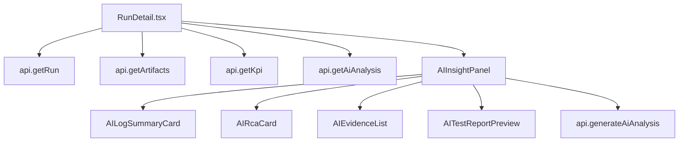
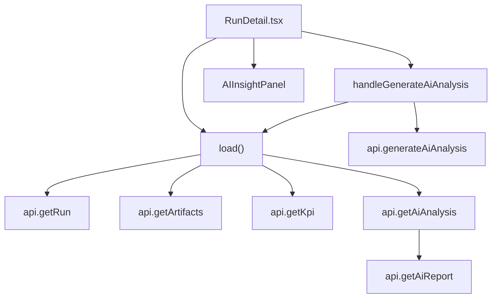

# Step 2：AI Run Detail Experience

## 这一步的目标

这一步规划 `automation-portal` 如何承接 AI-Driven Intelligent Testing Platform 的第一期 MVP。

目标是在现有 Run Detail 页面上增加：

```text
AI Summary Card
AI RCA Card
Evidence List
AI Test Report Preview
Copy Report
```

第一期不新增复杂聊天机器人，也不让 AI 直接触发 Jenkins。

## 预期结果

后续实现完成后，用户进入 `/runs/{run_id}` 应该能看到：

```text
1. 当前 run 的 AI 总结。
2. 失败时的 RCA 分类、confidence、证据片段和建议动作。
3. 本次 AI 使用了哪些 evidence。
4. 可复制的 Markdown 测试报告。
5. 如果分析还没生成，可以点击 Generate Rules Analysis，先走 `rules_first` 可闭环路径。
```

## 页面信息架构

```text
Run Detail
  Header / actions
  Pipeline Progress
  Summary Cards
  AI Insight Panel
    AI Summary Card
    RCA Card
    Evidence List
    Test Report Preview
  Artifacts
  KPI Summary
  Detector Summary
  Raw Metadata
```

## 页面流程图



## 前端 API 类型设计

建议在 `automation-portal/src/api.ts` 增加类型：

```ts
export type AIConfidence = "high" | "medium" | "low";

export type AIEvidenceRef = {
  kind: string;
  label: string;
  path?: string | null;
  url?: string | null;
  available: boolean;
  metadata?: Record<string, unknown>;
};

export type AILogSummary = {
  one_line_summary: string;
  failed_stage?: string | null;
  failed_command?: string | null;
  key_errors: string[];
  impact?: string | null;
  next_step?: string | null;
};

export type AIRootCause = {
  category: string;
  confidence: AIConfidence;
  symptom: string;
  evidence: Array<{
    source: string;
    excerpt: string;
    stage?: string | null;
    artifact_path?: string | null;
  }>;
  recommended_actions: string[];
  needs_human_confirmation: boolean;
};

export type AITestReport = {
  title: string;
  status: string;
  summary_markdown: string;
  sections: Array<{
    title: string;
    content_markdown: string;
  }>;
};

export type AIAnalysisResult = {
  run_id: string;
  analysis_id: string;
  analysis_status: string;
  analysis_version: string;
  generated_at: string;
  input_refs: AIEvidenceRef[];
  log_summary: AILogSummary;
  root_cause: AIRootCause;
  test_report: AITestReport;
  quality_signals: Record<string, unknown>;
};
```

建议新增 API 方法：

```ts
getAiAnalysis(runId: string) {
  return requestJson<AIAnalysisResult>(`/runs/${encodeURIComponent(runId)}/ai-analysis`);
},

generateAiAnalysis(runId: string) {
  return requestJson<{ run_id: string; analysis_id: string; analysis_status: string; message: string }>(
    `/runs/${encodeURIComponent(runId)}/ai-analysis`,
    { method: "POST", body: JSON.stringify({ refresh: true, analysis_mode: "rules_first", include_console: true, include_artifacts: true }) }
  );
},

getAiReport(runId: string) {
  return requestJson<{ run_id: string; report_format: string; content: string; generated_at: string }>(
    `/runs/${encodeURIComponent(runId)}/ai-report`
  );
}
```

## 组件设计

建议新增：

```text
automation-portal/src/pages/components/AIInsightPanel.tsx
```

如果暂时不想新建 components 目录，也可以先在 `RunDetail.tsx` 内部实现局部组件，后续再拆。

### AIInsightPanel

职责：

```text
接收 AIAnalysisResult / loading / error。
展示 AI Summary、RCA、Evidence、Report。
提供 Generate / Refresh 按钮。
```

### AILogSummaryCard

展示：

```text
one_line_summary
failed_stage
key_errors
impact
next_step
```

### AIRcaCard

展示：

```text
category
confidence
symptom
recommended_actions
needs_human_confirmation
```

### AIEvidenceList

展示：

```text
kind
label
available
path / url
metadata
```

### AITestReportPreview

展示：

```text
summary_markdown
sections
Copy Report 按钮
```

## 交互状态

```text
not_generated:
  显示 Generate Rules Analysis 按钮。

generating:
  按钮 disabled，显示 Generating...

completed:
  显示 AI Summary / RCA / Evidence / Report。

failed:
  显示 AI analysis failed，并保留重试按钮。

run_still_running:
  可以允许生成 preliminary analysis，但页面要提示结果可能不完整。
```

## 本次实现记录（2026-06-10）

本次已把第一期 AI Run Detail Experience 落到 `automation-portal` 代码。

已落地能力：

```text
1. api.ts 新增 AIAnalysisResult / Evidence / RCA / Report 类型。
2. api.ts 新增 getAiAnalysis / generateAiAnalysis / getAiReport。
3. getAiAnalysis 会把后端 "AI analysis not generated." 404 转成 null，供页面显示 not_generated 状态。
4. RunDetail.tsx 新增 AIInsightPanel。
5. RunDetail.tsx 在 summary cards 与 artifacts 之间展示 AI Run Insight。
6. AI queued / running 时复用页面轮询刷新。
7. completed 时展示 Summary / RCA / Evidence / Report Preview。
8. failed 或 API 错误时展示错误并保留 Regenerate。
```

### 本次改动文件

```text
automation-portal/src/api.ts
automation-portal/src/pages/RunDetail.tsx
automation-portal/src/styles.css
```

### 当前页面调用链



### UI 状态说明

```text
not_generated:
  aiAnalysis=null，显示 Generate Rules Analysis。

queued / running:
  显示当前状态 badge，并随页面定时刷新。

completed:
  展示 log_summary、root_cause、input_refs 和 Markdown report。

failed:
  展示后端或 worker 失败原因，允许 Regenerate。
```

### 服务器验证命令

由用户在服务器执行：

```bash
cd /path/to/jenkins_robotframework/automation-portal
npm run build
```

预期结果：

```text
1. TypeScript 编译通过。
2. 打开 /runs/<RUN_ID> 能看到 AI Run Insight 区域。
3. 没有分析结果时显示 Generate Rules Analysis。
4. 点击 Generate 后后端收到 POST /api/runs/{run_id}/ai-analysis。
5. worker 完成后页面展示 Summary / RCA / Evidence / Report Preview。
6. Copy Report 可以复制 Markdown 内容。
```

常见失败判断：

```text
AI 区域显示 not generated:
  后端 GET /ai-analysis 返回 404，属于未生成状态。

点击 Generate 后报错:
  优先检查 platform-api 是否已经实现 POST /ai-analysis。

AI 区域一直 queued:
  后端已入队，但 ai_analysis_worker 没有运行或 worker 无法访问 Cursor SDK。

Report Preview 为空:
  后端 /ai-report 未返回 content，或 worker 未生成 report_markdown。
```

## 页面文案建议

AI Summary 标题：

```text
AI Run Insight
```

免责声明：

```text
AI suggestions are generated from Jenkins artifacts and run metadata. Please confirm before changing environment or rerunning jobs.
```

中文说明：

```text
AI 结论来自 Jenkins artifact 和 run metadata，涉及环境修改或重跑操作前请人工确认。
```

## 开发侧验收步骤（服务器侧执行）

后续实现代码后，由用户在服务器执行：

```bash
cd /path/to/jenkins_robotframework/automation-portal
npm run build
```

然后打开：

```text
https://<server>/runs/<RUN_ID>
```

预期结果：

```text
Run Detail 页面出现 AI Run Insight 区域。
没有分析结果时能看到 Generate Rules Analysis。
生成后能看到 Summary / RCA / Evidence / Report。
Copy Report 能复制 Markdown。
```

## 测试侧验收步骤（服务器侧执行）

后续实现代码后，建议用户执行：

```bash
cd /path/to/jenkins_robotframework/automation-portal
npm run test
```

如果当前项目还没有前端测试 runner，先执行：

```bash
npm run build
```

预期结果：

```text
TypeScript 编译通过。
AIAnalysisResult 类型与 platform-api 返回契约一致。
RunDetail 页面在 AI 结果缺失 / 生成中 / 完成 / 失败四种状态下均可显示。
```

## 常见失败判断

```text
页面 404:
  platform-api 还没有实现 /api/runs/{run_id}/ai-analysis。

AI 区域一直 loading:
  前端没有正确处理 404 not generated 状态。

Copy Report 内容为空:
  后端 AI report 没有生成 content，或前端没有从 test_report 拼接 markdown。

RCA 没有 evidence:
  后端 result 缺少 root_cause.evidence，前端不能凭空展示结论。
```

## 复盘问题

```text
1. 为什么第一期把 AI 放在 Run Detail，而不是先做全局 Chatbot？
2. 为什么 RCA 卡片必须展示 confidence 和 evidence？
3. 为什么 AI 建议不能直接触发 Jenkins 重跑？
```
