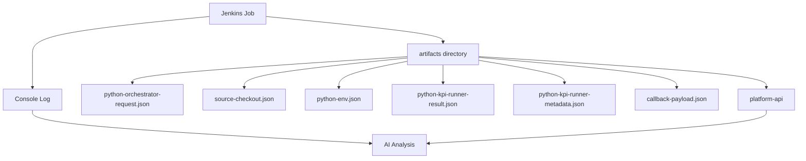

# AI Evidence Collection for Jenkins Runs

## 文档定位

这份文档固定 AI 分析层需要从 Jenkins integration layer 收集哪些证据。

它不实现 AI 推理，只回答：

```text
Jenkins / runner / Robot / KPI 的哪些输出可以成为 AI RCA 和测试报告的证据？
这些证据在哪里产生？
应该怎样归档？
常见缺失时怎么判断？
```

## 证据采集总链路



## Jenkins Console Log

来源：

```text
Jenkins build console output
```

采集方式：

```text
通过 Jenkins API 获取 consoleText，或在后续 Pipeline 中归档为 artifacts/jenkins-console.log。
```

AI 用途：

```text
识别失败 stage。
提取 shell command。
提取 Python traceback。
识别 Jenkins agent / workspace / SCM / credentials 问题。
生成人可读失败摘要。
```

典型证据：

```text
Still waiting to schedule task
No such file or directory
Permission denied (publickey)
script returned exit code
ModuleNotFoundError
```

## KPI Runner Pipeline Evidence

当前 `jenkins-integration/pipelines/kpi-runner.Jenkinsfile` 已归档：

```text
artifacts/**
```

第一期 AI MVP 优先读取以下文件。

### `artifacts/python-orchestrator-request.json`

产生阶段：

```text
Materialize Workflow Request
```

产生脚本：

```text
jenkins-integration/scripts/materialize_python_orchestrator_request.py
```

AI 用途：

```text
还原本次测试请求。
确认 testline / build / workflow_spec / dry_run / taf mode。
判断 runner 是否拿到了正确输入。
```

### `artifacts/source-checkout.json`

产生阶段：

```text
Prepare Workspace
```

产生脚本：

```text
jenkins-integration/scripts/checkout_sources.py
```

AI 用途：

```text
判断 robotws / testline_configuration / test-workflow-runner 的 checkout 计划。
定位 repo URL、branch、credentials_id_env、credential_kind。
辅助判断 SCM 类失败是否来自 URL、branch、key 或网络。
```

### `artifacts/python-env.json`

产生阶段：

```text
Prepare Workspace
```

产生脚本：

```text
jenkins-integration/scripts/prepare_taf_environment.py
```

AI 用途：

```text
判断 Python 环境模式。
确认 activate script。
定位 create-venv / reuse / skip-install 的差异。
辅助分析 pip 源、venv 缺失、TAF 依赖安装失败。
```

### `artifacts/python-kpi-runner-result.json`

产生阶段：

```text
Run Test Workflow Runner
```

产生模块：

```text
test-workflow-runner/test_workflow_runner/result_builder.py
```

AI 用途：

```text
读取 status。
读取 timeline。
读取 artifact_manifest。
读取 preconditions / traffic / sidecars / followups 的 handler results。
读取 kpi_window。
识别哪个 stage/item/model 失败。
```

### `artifacts/python-kpi-runner-metadata.json`

产生阶段：

```text
Collect Runner Metadata
```

AI 用途：

```text
把 runner result、workflow_name、build、dry_run 聚合到统一 metadata。
作为 AI 报告的执行上下文。
```

### `artifacts/callback-payload.json`

产生阶段：

```text
Declarative: Post Actions
```

产生脚本：

```text
jenkins-integration/scripts/post_run_callback.py
```

AI 用途：

```text
确认最终回写给 platform-api 的 status / message / artifact_manifest / kpi_summary / detector_summary。
判断 Jenkins 已经成功回调还是 callback 阶段也失败。
```

## Robot Execution Evidence

Robot 路径的第一期证据源：

```text
Robot output.xml
Robot log.html
Robot report.html
Robot command plan JSON
Jenkins console log
callback payload
```

AI 用途：

```text
从 output.xml 解析 suite / test / keyword 失败点。
从 log.html / report.html 给人工复核入口。
从 command plan 判断 robotcase_path、variables、selected tests 是否正确。
从 Jenkins console 判断环境和命令级失败。
```

第一期最低要求：

```text
Robot job 必须把 output.xml / log.html / report.html 放进 artifact manifest 或 Jenkins archived artifacts。
```

## KPI Generator and Detector Evidence

KPI 后处理证据由 runner result 和 callback payload 承接。

AI 用途：

```text
kpi_summary:
  解释 KPI generator 执行结果、输出文件和业务时间窗口。

detector_summary:
  解释 anomaly detector 发现的异常、阈值、HTML 报告入口。

artifact_manifest:
  定位 Excel、HTML、JSON 报告。
```

后续增强：

```text
把 KPI 关键指标提取成结构化 summary，例如指标名、基线值、当前值、偏差比例、阈值、影响等级。
```

## Evidence Manifest 建议

第一期可以在 `platform-api` 内部组装一个 `evidence_manifest`：

```json
[
  {
    "kind": "runner_result",
    "label": "Python KPI Runner Result",
    "path": "artifacts/python-kpi-runner-result.json",
    "required": true,
    "available": true,
    "ai_usage": ["timeline", "handler_results", "artifact_manifest"]
  },
  {
    "kind": "jenkins_console",
    "label": "Jenkins Console",
    "path": null,
    "required": true,
    "available": false,
    "ai_usage": ["failed_stage", "traceback", "root_cause"]
  }
]
```

## 常见缺失判断

```text
没有 python-orchestrator-request.json:
  Materialize Workflow Request 阶段失败，优先看 Jenkins console。

没有 source-checkout.json:
  Prepare Workspace 前置脚本未跑到或 workspace 缺少当前仓库。

有 source-checkout.json 但没有 runner result:
  checkout / env 阶段之后失败，优先看 prepare-python-env.sh 或 runner 启动日志。

有 runner result 且 status=failed:
  runner 已启动，优先从 timeline / results 定位 stage item。

有 runner result 但没有 callback payload:
  post action 或 callback 脚本失败。

只有 Jenkins console，没有 artifacts:
  Jenkins job 早期失败，例如 agent、SCM、workspace 或 Pipeline syntax。
```

## 验证命令

由用户在 Jenkins agent 或 controller 上执行：

```bash
BUILD_DIR=/automation/workspace/workspace/CIT/KPI_Testing/SBTS26R1/7_5_UTE5G402T813
ls -l "$BUILD_DIR/artifacts"
ls -l "$BUILD_DIR/artifacts/python-orchestrator-request.json"
ls -l "$BUILD_DIR/artifacts/source-checkout.json"
ls -l "$BUILD_DIR/artifacts/python-env.json"
ls -l "$BUILD_DIR/artifacts/python-kpi-runner-result.json"
ls -l "$BUILD_DIR/artifacts/python-kpi-runner-metadata.json"
```

预期结果：

```text
dry-run 或 real-run 成功进入 runner 后，应至少看到 request / checkout / env / result / metadata。
如果 build 早期失败，缺失文件本身就是 RCA 证据。
```

## 复盘问题

```text
1. 为什么 AI RCA 不能只看 Jenkins console？
2. `python-kpi-runner-result.json` 和 `callback-payload.json` 分别代表什么阶段的事实？
3. 如果 artifacts 缺失，AI 应该如何判断失败发生在 Pipeline 早期？
```
