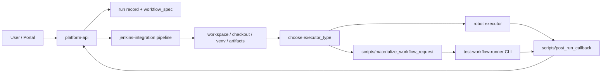

# Jenkins Integration Layer 与执行流程

## 文档目标

这份文档把 `Jenkins integration layer` 的职责边界、目录放置和调用流程固定下来。

当前最重要的目标是明确：

1. 为什么这一层不能继续混在 `test-workflow-runner` 里
2. 哪些东西应该放到 `jcasc / jobs / pipelines / scripts`
3. `platform-api`、Jenkins 和两个执行器怎么协作

## 为什么要单独成层

因为 Jenkins 不只是服务 `python_orchestrator`，它还要同时服务：

- 传统 `robot` 执行链
- `python_orchestrator` 执行链

所以下面这些东西都不应绑死到 `test-workflow-runner`：

- Jenkins job / Pipeline
- agent / node / credentials / workspace 规则
- checkout `robotws` / `testline_configuration`
- callback `platform-api`

## 推荐目录分层

```text
jenkins-integration/
  README.md
  jcasc/
  jobs/
  pipelines/
  scripts/
```

### `jcasc/`

放 Jenkins Configuration as Code：

- controller / node / tool / plugin / credentials 引用

### `jobs/`

放 Jenkins job 定义：

- seed job
- Job DSL
- 参数模板

### `pipelines/`

放 Jenkins Pipeline：

- prepare workspace
- choose executor
- execute
- archive
- callback

### `scripts/`

放被 Pipeline 调用的 helper 脚本：

- checkout / bootstrap
- `workflow_spec -> request.json`
- `robotcase_path -> robot command`
- callback payload 组装

## 推荐协作流程



## 两条执行器路径怎么分

### 1. `robot` 路径

Jenkins integration layer 负责：

- checkout `robotws`
- checkout `testline_configuration`
- 组装 Robot 命令
- 收集 RF 产物
- 统一 callback

### 2. `python_orchestrator` 路径

Jenkins integration layer 负责：

- checkout `test-workflow-runner`
- checkout `testline_configuration`
- checkout bindings 依赖代码
- 把 `workflow_spec` 物化成 `request.json`
- 调 `python -m test_workflow_runner.cli`
- 统一 callback

而 `test-workflow-runner` 自己只负责：

- 读取 request JSON
- 加载本地已准备好的上下文和 bindings
- 执行 workflow
- 产出 `result.json`

## `bindings_module` 放在哪层理解

`bindings_module` 不属于 `platform-api`，也不属于 Jenkins Pipeline 本身。

更合理的理解是：

- Jenkins integration layer 负责把它依赖的代码和 Python 环境准备好
- `test-workflow-runner` 只负责在运行时 import 它
- `bindings_module` 自己负责把 `attach / detach / handover` 这些动作真正落到 TAF / robotws / helper API

## 当前结论

当前仓库已经有：

- `platform-api`
- `automation-portal`
- `test-workflow-runner`

现在新增的第四层是：

- `jenkins-integration`

它的作用不是增加新的业务执行器，而是把“公共 Jenkins 调度和桥接逻辑”从具体执行器里拆出来。
