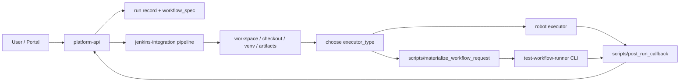

# Jenkins Integration Layer 与执行流程

## 文档目标

这份文档把 `Jenkins integration layer` 的职责边界、目录放置和调用流程固定下来。

当前最重要的目标是明确：

1. 为什么这一层不能继续混在 `test-workflow-runner` 里
2. 哪些东西应该放到 `jcasc / jobs / pipelines / scripts`
3. `platform-api`、Jenkins 和两个执行器怎么协作

## 为什么要单独成层

因为 Jenkins 不只是服务 `python_orchestrator`，它还要同时服务：

- 传统 `robot` 执行链
- `python_orchestrator` 执行链

所以下面这些东西都不应绑死到 `test-workflow-runner`：

- Jenkins job / Pipeline
- agent / node / credentials / workspace 规则
- checkout `robotws` / `testline_configuration`
- callback `platform-api`

## 推荐目录分层

```text
jenkins-integration/
  README.md
  jcasc/
  jobs/
  pipelines/
  scripts/
```

### `jcasc/`

放 Jenkins Configuration as Code：

- controller / node / tool / plugin / credentials 引用

### `jobs/`

放 Jenkins job 定义：

- seed job
- Job DSL
- 参数模板

### `pipelines/`

放 Jenkins Pipeline：

- prepare workspace
- choose executor
- execute
- archive
- callback

### `scripts/`

放被 Pipeline 调用的 helper 脚本：

- checkout / bootstrap
- `workflow_spec -> request.json`
- `robotcase_path -> robot command`
- callback payload 组装

## 推荐协作流程


```mermaid
flowchart LR
    User["User / Portal"]
    Api["platform-api"]
    Store["run record + workflow_spec"]
    Jenkins["jenkins-integration pipeline"]
    Bootstrap["workspace / checkout / venv / artifacts"]
    Router["choose executor_type"]
    RobotExec["robot executor"]
    RunnerBridge["scripts/materialize_workflow_request"]
    Runner["test-workflow-runner CLI"]
    Callback["scripts/post_run_callback"]

    User --> Api
    Api --> Store
    Api --> Jenkins
    Jenkins --> Bootstrap
    Bootstrap --> Router
    Router --> RobotExec
    Router --> RunnerBridge
    RunnerBridge --> Runner
    RobotExec --> Callback
    Runner --> Callback
    Callback --> Api
```

## 两条执行器路径怎么分

### 1. `robot` 路径

Jenkins integration layer 负责：

- checkout `robotws`
- checkout `testline_configuration`
- 组装 Robot 命令
- 收集 RF 产物
- 统一 callback

### 2. `python_orchestrator` 路径

Jenkins integration layer 负责：

- checkout `test-workflow-runner`
- checkout `testline_configuration`
- checkout bindings 依赖代码
- 把 `workflow_spec` 物化成 `request.json`
- 保留 `BUILD` 作为本次 KPI testing 的 CIT 包 / 软件包版本
- 调 `python -m test_workflow_runner.cli`
- 统一 callback

而 `test-workflow-runner` 自己只负责：

- 读取 request JSON
- 加载本地已准备好的上下文和 bindings
- 执行 workflow
- 产出 `result.json`

## `bindings_module` 放在哪层理解

`bindings_module` 不属于 `platform-api`，也不属于 Jenkins Pipeline 本身。

更合理的理解是：

- Jenkins integration layer 负责把它依赖的代码和 Python 环境准备好
- `test-workflow-runner` 只负责在运行时 import 它
- `bindings_module` 自己负责把 `attach / detach / handover` 这些动作真正落到 TAF / robotws / helper API

## 当前结论

当前仓库已经有：

- `platform-api`
- `automation-portal`
- `test-workflow-runner`

现在新增的第四层是：

- `jenkins-integration`

它的作用不是增加新的业务执行器，而是把“公共 Jenkins 调度和桥接逻辑”从具体执行器里拆出来。

## Python KPI Runner 当前落地

当前 `python_orchestrator` Jenkins 路径已经补第一版：

```text
platform-api
  -> Jenkins job: CIT/KPI_Testing/<SBTS>/<testline> 或 CRT/KPI_Testing/<SBTS>/<testline>
  -> materialize_python_orchestrator_request.py
  -> checkout_sources.py
  -> prepare_taf_environment.py
  -> python -m test_workflow_runner.cli
  -> post_run_callback.py
```

对应文件：

- `jenkins-integration/jobs/kpi-runner-job.groovy`
- `jenkins-integration/pipelines/kpi-runner.Jenkinsfile`
- `jenkins-integration/scripts/materialize_python_orchestrator_request.py`

关键字段：

- `RUN_ID`
- `TESTLINE`
- `BUILD`
- `WORKFLOW_SPEC_JSON`
- `DRY_RUN`
- `RUNNER_REPOSITORY_ROOT`
- `RESULT_JSON_PATH`

`BUILD` 会进入 runner request 顶层字段，并补到 `kpi_generator` item 的 `params.build`，避免 KPI followup 阶段拿不到本次 CIT 包版本。

## KPI Runner Dry-Run Dependency Boundary

### 这一步解决的问题

Jenkins build `CIT/KPI_Testing/SBTS26R1/7_5_UTE5G402T813 #2` 已经通过了 pipeline source checkout、request materialize、workspace prepare、`robotws` checkout、`testline_configuration` checkout 和 CIENV activate，但在 `Run Test Workflow Runner` 阶段失败：

```text
ModuleNotFoundError: No module named 'scipy'
```

失败点不是 Jenkins checkout，也不是 testline 配置，而是 `python -m test_workflow_runner.cli` 启动时过早导入了 `kpi_detector` 的真实实现。真实 detector 依赖 `scipy`，但 dry-run 不应该因为没有 `scipy` 而失败。

### 本次文件边界

- `test-workflow-runner/test_workflow_runner/handlers/kpi_detector.py`
  - dry-run 分支先返回，只在真实执行 detector 时导入 `run_detector_from_payload`。
- `test-workflow-runner/test_workflow_runner/handlers/kpi_generator.py`
  - 与 detector 保持一致，只在真实执行 generator 时导入真实 internal tool service。
- `test-workflow-runner/internal_tools/kpi_detector/__init__.py`
  - package import 不再立即导入 `detector.py`，避免 `from scipy import stats` 在 dry-run 启动阶段触发。
- `test-workflow-runner/tests/test_orchestrator.py`
  - dry-run followup 用例增加 import guard，确保 dry-run 不导入真实 generator/detector service。

### 核心调用链

```text
kpi-runner.Jenkinsfile
  -> prepare_taf_environment.py
  -> source /home/ute/CIENV/<TESTLINE>/bin/activate
  -> python -m test_workflow_runner.cli ... --dry-run
  -> OrchestratorRunner
  -> KpiGeneratorHandler / KpiDetectorHandler
  -> dry-run summary
```

dry-run 到这里结束，不进入：

```text
internal_tools.kpi_detector.service
  -> internal_tools.kpi_detector.detector
  -> scipy
```

### 关键字段

- `DRY_RUN=true`
  - dry-run 只验证 request、workspace、handler contract 和 result 形状。
- `TAF_MODE=reuse`
  - 只复用 `/home/ute/CIENV/<TESTLINE>`，不会安装 `test-workflow-runner/requirements.txt`。
- `TAF_MODE=create-venv`
  - 会创建或复用 CIENV，并按 request 里的 `taf.requirements_file` 或 `taf.package_specs` 安装依赖。
- `test-workflow-runner/requirements.txt`
  - 真实 KPI generator / detector 需要的 runner internal tool 依赖，包括 `numpy`、`openpyxl`、`pandas`、`requests`、`scipy`、`urllib3`。

### 服务器验证命令

dry-run 修复后建议在 Jenkins Agent 或服务器执行：

```bash
cd /opt/jenkins_robotframework/test-workflow-runner
source /home/ute/CIENV/7_5_UTE5G402T813/bin/activate
python -m test_workflow_runner.cli configs/sample_request.json --dry-run --result-json artifacts/day2-step3-result.json
```

预期：

- dry-run 不再因为缺少 `scipy` 失败。
- `artifacts/day2-step3-result.json` 生成。
- 如果 workflow 包含 `kpi_generator` / `kpi_detector` followup，summary 中应显示 `implementation_mode=internal_api_dry_run`。

真实 KPI detector / generator 前需要确认 CIENV 依赖：

```bash
source /home/ute/CIENV/7_5_UTE5G402T813/bin/activate
python - <<'PY'
import numpy
import openpyxl
import pandas
import requests
import scipy
import urllib3
print("runner internal tool dependencies ok")
PY
```

如果失败，说明 `TAF_MODE=reuse` 复用的环境还没有安装 runner internal tool 依赖。真实 run 前需要在该 CIENV 安装：

```bash
cd /opt/jenkins_robotframework/test-workflow-runner
source /home/ute/CIENV/7_5_UTE5G402T813/bin/activate
python -m pip install -r requirements.txt
```

### 常见失败判断

- `ModuleNotFoundError: No module named 'scipy'`
  - 如果出现在 dry-run 启动阶段，说明 generator/detector 重依赖又被提前导入。
  - 如果出现在真实 detector 执行阶段，说明 CIENV 缺少 runner internal tool 依赖，需要安装 `requirements.txt`。
- `Missing activate script`
  - `TAF_MODE=reuse` 但 `/home/ute/CIENV/<TESTLINE>/bin/activate` 不存在。
- `checkout_sources.py` 失败
  - 先检查 `ROBOTWS_REPO_URL`、`TESTLINE_CONFIGURATION_REPO_URL`、Agent 本机 SSH key 或 Jenkins 全局环境。

### Review Questions

1. 为什么 dry-run 不应该要求 `scipy` 已安装？
2. `TAF_MODE=reuse` 和 `TAF_MODE=create-venv` 在依赖安装上有什么区别？
3. 如果 `scipy` 只在真实 detector 执行时缺失，应该改代码还是补 CIENV？
