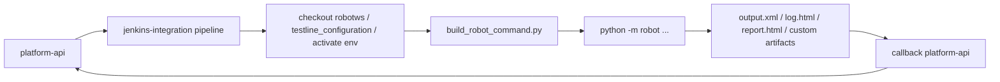

# Robot 最小执行路径

## 文档目标

这份文档固定 `jenkins-integration` 的第一条真实落地路径：

- 先让 Jenkins 能调度起一条 `robotws` 里的 case
- 先把 `TAF / robotws / testline_configuration` 相关前置准备边界固定下来
- 再为后续 `test-workflow-runner` 接入提供基础设施前提

## 为什么先做 `robot`

因为旧链路里最真实的公共前置动作都在 `robot` 路径里已经出现过：

- 激活 UTE / CIENV
- 选择 `TAF install / reuse`
- checkout `robotws`
- checkout `testline_configuration`
- 组装 `python -m robot ...` 命令
- 归档 artifact
- 回调平台

这些动作本来就是后续 `python_orchestrator` 也要复用的基础设施。

## 这一轮先落什么

这一轮先不追求“完整生产 Jenkins 接入一次到位”，而是先收口最容易反复改的 3 个东西：

1. Robot 命令组装 helper
2. 最小 Pipeline 模板
3. 对应测试和文档入口

## 当前已落地文件

- [build_robot_command.py](../../../../jenkins-integration/scripts/build_robot_command.py)
- [test_build_robot_command.py](../../../../jenkins-integration/tests/test_build_robot_command.py)
- [robot-execution.Jenkinsfile](../../../../jenkins-integration/pipelines/robot-execution.Jenkinsfile)

## `build_robot_command.py` 负责什么

它负责把：

```text
testline + robotcase_path + workspace 语义
```

变成：

```text
一份结构化 execution plan
```

当前固定的最小约定是：

- `robotcase_path` 可以是 workspace 相对路径
- 也可以是 `robotws` 相对路径
- `-V` 默认走 `testline_configuration/<testline>`
- `--pythonpath` 默认指向 `robotws`
- 默认会产出 shell 级执行脚本，而不只是 Python 参数数组
- 默认会 blank 掉 `http_proxy / https_proxy`
- 默认 artifact 目录命名为 `artifacts/<artifact_label>/retry-<n>/<suite_stem>`

## 这一步为什么要改成 execution plan

你贴出来的真实 Jenkins log 已经说明旧链路不是简单的：

- 先 `. /home/ute/CIENV/<TL>/bin/activate`
- 再清空代理环境变量
- 再拼一串包含 `-v AF_PATH:...`、`-x quicktest.xml`、`-b debug.log`、`-L TRACE`、多次 `-t` 的 Robot 命令

所以如果 helper 只返回：

```text
["python", "-m", "robot", ...]
```

后面 Jenkinsfile 一定还会重新长出大量 shell 拼接逻辑，框架还是会返工。

现在 helper 会同时产出：

- `command`
    - 结构化 Robot 参数数组
- `execution`
    - retry、artifact label、selected tests、日志文件名等执行语义
- `shell.shell_script_text`
    - 可以直接被 Jenkins 执行的 bash 脚本

这样后续要补 callback、checkout、runner bridge 时，都可以继续围绕同一份 execution plan 走。

## 当前兼容的旧链路输入形态

为了后续迁移旧 Jenkins 参数时少返工，helper 当前已经兼容下面这些旧字段别名：

- `robotPath`
    - 映射到 `robotws_root`
- `configPath`
    - 映射到 `testline_variables_path`
- `pythonPath`
    - 映射到 `python_env_root`
- `retryTimes`
    - 映射到 `retry_index`
- `pkgPath`
    - 解析成 `AF_PATH` 和附带的 `-v key:value` 变量
- `robotSuites`
    - 解析成重复 `-t` 的测试名列表和最终的 `robotcase_path`

## 旧 Log 到新 execution plan 的映射表

下面这张表专门把旧 Jenkins robot log 的关键字段，映射到新框架里已经固定下来的 execution plan 位置。

| 旧 log / 旧字段 | 旧链路含义 | 新 execution plan 去向 | 当前状态 |
| --- | --- | --- | --- |
| `dryrunMode` | 是否 dry run | `execution.dryrun_mode` | 已收口 |
| `robotPath` | `robotws` 根目录 | `resolved_paths.robotws_root` | 已收口 |
| `configPath` | `-V` 指向的 testline 配置目录 | `resolved_paths.testline_variables_path` | 已收口 |
| `pythonPath` | `CIENV` 根目录 | `resolved_paths.python_env_root` / `resolved_paths.activate_script` | 已收口 |
| `retryTimes` | retry 序号 | `execution.retry_index` | 已收口 |
| `pkgPath` | AF 包地址 + 一串 `-v key:value` | `metadata.variables`，其中首个 URL 进入 `AF_PATH` | 已收口 |
| `robotSuites` | 多个 `-t` + 最终 `.robot` suite 路径 | `execution.selected_tests` + `robotcase_path` | 已收口 |
| `. /home/ute/CIENV/<TL>/bin/activate` | 激活执行环境 | `shell.shell_script_text` | 已收口 |
| `http_proxy= https_proxy=` | 清空代理环境变量 | `shell.env_overrides` + `shell.shell_script_text` | 已收口 |
| `-x quicktest.xml` | xUnit 产物文件名 | `execution.xunit_file` | 已收口 |
| `-b debug.log` | debug log 文件名 | `execution.debug_file` | 已收口 |
| `-d artifact/quicktest/retry-0/ca_cases/` | artifact 输出目录规则 | `resolved_paths.output_dir` + `execution.artifact_label` | 已收口 |
| `-L TRACE` | Robot 日志级别 | `execution.log_level` | 已收口 |

这张表要表达的核心不是“我们已经把旧命令复刻出来了”，而是：

- 旧 log 里的关键执行语义，已经开始有稳定的数据落点
- Jenkinsfile 不需要再自己拼每一段 shell 细节
- 后续 checkout / callback / runner bridge 也能继续沿着同一份 execution plan 往下接

## 哪些字段应该进 platform-api public contract，哪些只留在 internal request

当前建议把边界分成两层：

### 1. `platform-api` public contract

这层只保留“业务上应该稳定暴露给调用方”的字段：

| 字段 | 为什么应该公开 |
| --- | --- |
| `run_id` | 平台生成的稳定 run 标识，后续查询和 callback 都依赖它 |
| `executor_type` | 决定这是 `robot` 还是 `python_orchestrator` |
| `testline` | 业务输入，不应该由 Jenkins 私下决定 |
| `robotcase_path` | `robot` 执行器最小必填业务输入 |
| `build` | 如果这次执行和具体 build 有关，它属于业务上下文 |
| `metadata` | 允许暂存少量业务补充信息，但不应直接变成 Jenkins shell 参数堆积区 |

当前 public contract 不建议直接暴露成一堆 Jenkins 执行细节字段，例如：

- `robotws_root`
- `testline_config_root`
- `python_env_root`
- `artifact_label`
- `retry_index`
- `xunit_file`
- `debug_file`
- `log_level`
- `env_overrides`
- `source_repos`
- `taf.mode`

这些字段都更像“执行基础设施控制面”，不是调用方的稳定业务输入。

### 2. `jenkins-integration` internal request

这层负责把 public contract 继续物化成真正可执行的内部请求，因此它可以携带：

| internal request 字段 | 用途 |
| --- | --- |
| `robotws_root` | 约束本地源码布局 |
| `testline_config_root` | 约束 `-V` 对应的配置根目录 |
| `python_env_root` | 约束执行机 Python 环境 |
| `source_repos` | 告诉 checkout helper 去哪里拉 `robotws` / `testline_configuration` |
| `taf.mode` | 控制 `reuse` 还是 `create-venv` |
| `artifact_label` / `retry_index` | 固定 artifact 输出结构 |
| `xunit_file` / `debug_file` / `log_level` | 固定 Robot 执行输出策略 |
| `env_overrides` | 管理代理等执行环境变量 |
| `callback.base_url` / `callback.path` | 让 callback helper 能稳定回传平台 |

当前建议的原则是：

- public contract 负责“用户想跑什么”
- internal request 负责“Jenkins 具体怎么把它跑起来”

如果后面某个字段真的是：

- 用户明确需要稳定传入
- 不同 Jenkins 实现都应该尊重
- 它不只是某个 shell helper 的局部控制项

那它才值得从 internal request 再往上提升到 public contract。

## 明确不再承接的旧字段

下面这类旧链路遗留字段，当前明确不进入新框架建模范围：

- `uufSource`
- 其他 UUF 相关输入和分支逻辑

原因很简单：

- 当前目标是收口通用 `robot` 调度基础设施
- 不是把旧 Jenkins 中所有历史分支原样搬过来
- 你已经明确后续不会引入 UUF 相关能力

因此当前实现策略是：

- 不为 `uufSource` 单独建字段
- 不让它影响 artifact 目录规则
- 不把 UUF 分支逻辑带入新的 execution plan

## 最小流程图



## 这一轮还没做什么

下面这些还没有在代码里真正落地：

- Job DSL / JCasC
- 更完整的 Jenkins credentials catalog / JCasC 固化
- callback fallback 文件的自动补发或重放机制

所以当前这一轮更准确的定位是：

```text
robot 路径第一版 bridge
```

不是完整生产版 Jenkins 实施收口。

## 当前新增的配套 helper

为了把 execution plan 外围的动作也收口进代码，当前已经新增：

- [materialize_run_request.py](../../../../jenkins-integration/scripts/materialize_run_request.py)
    - 负责 `platform-api` run detail 或 ad-hoc 输入到 internal request 的稳定物化
- [checkout_sources.py](../../../../jenkins-integration/scripts/checkout_sources.py)
    - 负责 `robotws` 和 `testline_configuration` 的 checkout plan，并承接 repo URL / branch / credentials 约定
- [prepare_taf_environment.py](../../../../jenkins-integration/scripts/prepare_taf_environment.py)
    - 负责 `TAF install / reuse` 的环境准备计划
- [post_run_callback.py](../../../../jenkins-integration/scripts/post_run_callback.py)
    - 负责 callback payload 的构建与回传，并支持 retry 与 fallback 文件落地

## 为什么这一步对 runner 也是基础

因为后续 `test-workflow-runner` 的很多 stage 在真实执行时同样依赖：

- 本地可读的 `testline_configuration`
- 本地可 import 的 `bindings_module`
- 以及 Jenkins/UTE 侧已经准备好的 Python 环境

也就是说，先把 `robot` 路径跑通，能够更早固定“执行机本地前提”这条边界。
