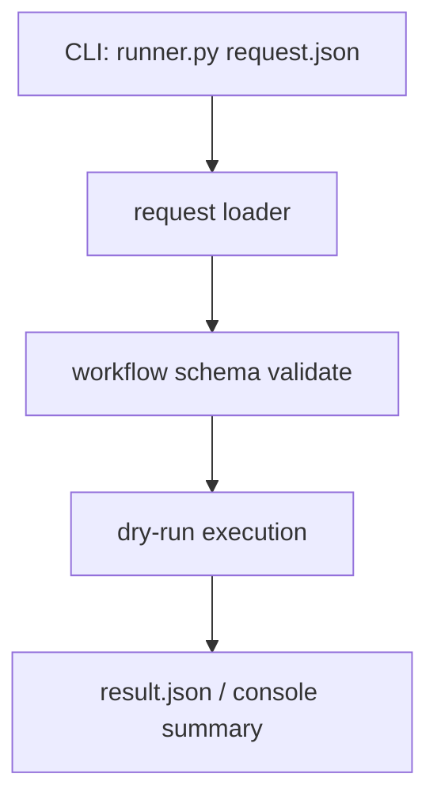

# Step 1：runner request loader / workflow schema / CLI dry-run

## 这一步的目标

先把 runner 的最小输入面固定下来，让执行层具备一个稳定的入口。

这一轮最重要的是先回答 3 个问题：

- runner 从哪里接收 workflow 请求
- workflow JSON 最小长什么样
- 不接真实设备时，能不能先做 CLI dry-run

## 预期结果

这一轮做完后，系统应该具备下面这些可观察结果：

- 有统一的 workflow request schema
- 有统一的 request loader
- 有最小 CLI 入口
- 在不接真实 testline 的情况下，也能先做 dry-run 验证

这一轮先不扩的内容包括：

- 真实 TAF 调用
- 复杂并行调度
- generator / detector 接入

## 这一步的代码设计

这一轮建议先把执行层拆成下面几块：

- request loader
  - 负责读入 workflow JSON
  - 负责最小校验
- workflow schema
  - 负责固定 `workflow -> stages -> items` 结构
- CLI 入口
  - 负责从命令行接收 JSON 文件路径
  - 负责触发 dry-run

最关键的一条链路应该先固定成：

```text
cli -> request loader -> workflow schema -> dry-run result
```

## 函数调用流程图



## 开发侧验收步骤（服务器侧执行）

```bash
cd /path/to/jenkins_robotframework/jenkins-kpi-platform
python3 -m venv .venv
source .venv/bin/activate
python -m pip install --upgrade pip
python -m pytest tests
python -m gnb_kpi_orchestrator.cli configs/sample_request.json --dry-run
```

## 开发侧验收结果

- [ ] request loader 已能加载最小 workflow 请求
- [ ] workflow schema 已能校验最小 JSON 结构
- [ ] CLI dry-run 已可执行
- [ ] 在不接真实 testline 的情况下也能看到最小结果输出

## 测试侧验收步骤（服务器侧执行）

```bash
python -m pytest tests
python -m pytest tests --alluredir=allure-results
```

## 测试侧验收结果

- [ ] pytest 已覆盖 request loader 主路径
- [ ] pytest 已覆盖 schema 校验失败路径
- [ ] pytest 已覆盖 CLI dry-run 最小链路
- [ ] `allure-results` 可正常产出

## 相关专题与测试文档

- [GNB KPI Regression Architecture](../../../overview/gnb-kpi-regression-architecture.md)
- [GNB KPI System Runtime](../../../overview/gnb-kpi-system-runtime.md)
