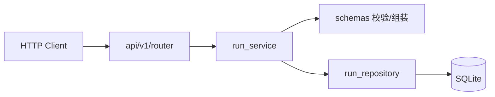

# platform-api 代码框架说明

本文档说明 `platform-api` 的**分层、各 Python 文件职责、请求处理顺序**，以及**新功能/修复应改哪些文件**，与 `test-workflow-runner` 侧《CODE-ARCHITECTURE》对照使用，避免改 API 时动到不该动的层。

## 1. 模块定位

- **本模块**：`platform-api/` 下的 FastAPI 应用 = **平台层**：对 portal / `jenkins-integration` 暴露 **run 维度的 HTTP API**；持久化 run 元数据与 Jenkins 回写；提供 artifact 清单与 kpi_generator / kpi_anomaly_detector 摘要查询。  
- **不在这里做**：Jenkins job / pipeline / workspace bootstrap / checkout / request 物化，也不在 UTE 上实际跑 Robot 或 `test_workflow_runner` 内部 orchestration 逻辑（由其他模块/进程完成）。

## 2. 分层总览

```text
app/main.py
  启动 FastAPI、挂载 /api 路由、application lifespan（如 DB 初始化）

app/api/v1/router.py
  路由表：只负责 HTTP 映射到 service 方法

app/schemas/
  请求/响应的 Pydantic 模型、字段校验、文档模型

app/services/
  业务用例层：create/list/detail/callback/artifacts/kpi 等，调用 repository、抛 HTTP 异常

app/repositories/
  数据访问层：SQLite 表结构、增删改查 run 记录

app/core/config.py
  应用名、等配置
```

**依赖方向**（应单向）：`router` → `services` → `repositories` + `schemas`；**避免**从 `repositories` 回 import 业务大对象。

## 3. 目录与文件职责

| 路径 | 职责 |
|------|------|
| `app/main.py` | 创建 `FastAPI` 实例，注册 `app/api/v1/router` 的 `prefix="/api"`，在 `lifespan` 里调用 `initialize_run_repository()`。 |
| `app/core/config.py` | `pydantic-settings` 等加载应用配置（如 `app_name`）。 |
| `app/api/v1/router.py` | 定义各路由：`GET/POST /runs`、`/runs/{id}`、`/artifacts`、`/kpi`、`/callbacks/jenkins` 等，将入参/路径参数交给 `run_service` / `health_service` 对应函数。 |
| `app/schemas/health.py` | 健康检查响应体。 |
| `app/schemas/run.py` | `RunCreateRequest`、`RunDetailResponse`、`RunCallbackRequest` 等，与产品契约和 Step 10–13 文档一致。 |
| `app/services/health_service.py` | 健康检查业务数据（如版本、简单状态）。 |
| `app/services/run_service.py` | **Run 全生命周期**：`run_create`、列表、详情、Jenkins 回调、artifact 与 KPI 摘要的组装/校验。 |
| `app/repositories/run_repository.py` | SQLite 连接、建表、插入/更新/按 id 查 run 记录、列表查询；不承载 HTTP 与业务叙述。 |
| `app/__init__.py` 等 | 包标记，保持默认即可。 |

## 4. 典型请求路径（以 run 为例）



- **写路径**：`POST /api/runs` → `run_create` → 校验 + `insert_run_record`  
- **Jenkins 回写**：`POST /api/runs/{run_id}/callbacks/jenkins` → `apply_run_callback` → `update_run_record`  
- **读路径**：`GET /api/runs/{run_id}` → `get_run_detail` 从 DB 与 JSON 字段中组装 `RunDetailResponse`

## 5. 以后改代码：应改哪里

| 场景 | 建议改的文件 |
|------|--------------|
| 新增/修改 HTTP 路径、方法、标签 | `app/api/v1/router.py` |
| 增加/改请求或响应字段、校验（契约变更） | `app/schemas/run.py`（并同步 `run_service` 的序列化/落库、Step 文档） |
| 改业务规则（如 executor、KPI 仅某种 executor 可用） | `app/services/run_service.py` 中对应函数，必要时拆私有函数 |
| 改表结构、新列、查询方式 | `app/repositories/run_repository.py` + 如需要 `run_service` 聚合逻辑 |
| 新环境配置项 | `app/core/config.py` + `main` 或 `lifespan` 如需 |
| 仅加健康/就绪检查 | `app/schemas/health.py`、`health_service`、`router` |

## 6. 与 jenkins-integration / test-workflow-runner 的对接点（联调时）

- **不是代码 import 关系**；通过 **API 与约定字段** 协作：如 `testline`、`workflow_spec`、Jenkins 回调体里的 artifact、kpi 摘要、detector 摘要 等。  
- `platform-api` 与 `jenkins-integration` 的边界是：run contract / handoff / callback contract。  
- `platform-api` 与 `test-workflow-runner` 不直接形成执行 import 关系，中间由 `jenkins-integration` 负责桥接。  
- 任一方契约变更，应同时改：`schemas/run.py` + 对应用例 `tests/test_runs.py` + 相应 `docs/modules/platform-api/steps/*`。

## 7. 测试

- 自动化用例在 `platform-api/tests/`（如 `test_runs.py`），与 `pytest` 一致；**验证方式**以项目内规则为准（可由你在服务器执行）。

---

（本文件为「平台层代码地图」；分步实现细节见 `docs/modules/platform-api/steps/`。）
