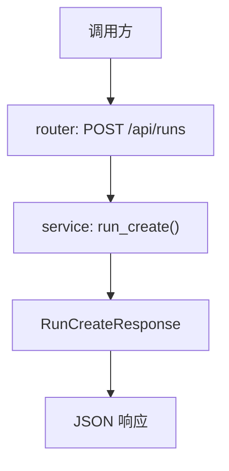

# Step 6：`POST /api/runs` 第一版返回语义

## 这一步的目标

这一步不直接扩代码，而是先把 `POST /api/runs` 第一版应该表达什么语义定清楚。

当前结论：

- `run_id`：平台自己的 run 标识
- `status`：先用 `created`
- `message`：先用 `Run request accepted.`

## 为什么这一步很关键

如果这一步不先统一，后面即使代码写出来，也很容易出现：

- 有人写 `created`
- 有人写 `queued`
- 有人写 `success`
- 有人把 `message` 写得很长、很重

所以这一步的重点是先把“最小返回语义”定稳。

## 这一步的代码设计

这一轮虽然还不是“正式接数据库”的实现步，但已经先把后面代码要围绕什么结构来写定下来了：

- 输出 schema 先收敛成 `RunCreateResponse`
- `service` 负责表达“平台已经接住这次创建请求”的业务语义
- `router` 后续只负责把 service 返回的结果直接返回给调用方

也就是说，这一步先定的不是 SQL 或持久化细节，而是：

```text
POST /api/runs 第一版到底应该返回什么，后面代码都要围绕这个语义来实现。
```

## 当前推荐返回值

```json
{
  "run_id": "run-20260421-0001",
  "status": "created",
  "message": "Run request accepted."
}
```

## 函数调用流程图



最短理解版：

```text
先由 router 接住请求，再由 service 决定最小返回语义，最后按 RunCreateResponse 对外返回。
```

## 当前最值得记住的点

### 为什么推荐 `created`

因为这一阶段最重要的是表达：

```text
平台已经接住了这次 run 创建请求，并创建了平台自己的 run 记录。
```

### 为什么不推荐 `success`

因为 `success` 太容易让人误解成：

- Robot 已经执行成功
- Jenkins 已经跑完成功

但在创建接口刚返回时，这些事情通常都还没发生。

### 为什么当前也先不用 `queued`

`queued` 更适合你已经明确引入了“排队 / 调度”语义时再用。

如果当前只是：

- 接请求
- 生成 `run_id`
- 返回最小结果

那么 `created` 会更稳。

## `message` 的风格

当前建议：

- 简短
- 稳定
- 不夹带太多实现细节

例如：

```text
Run request accepted.
```

## 开发侧验收结果

- [x] 已明确第一版返回字段先收敛为 `run_id / status / message`
- [x] 已明确第一版 `status` 推荐先用 `created`
- [x] 已明确第一版 `message` 保持简短、中性、稳定
- [x] 已明确后续代码应由 `service` 负责组装这份返回语义

## 服务器侧验收 / 测试说明

这一步仍然以返回语义设计验收为主，不依赖单独新增的接口功能或数据库能力。

如果当前基础服务仍可正常启动，就说明这一步可以进入下一轮正式实现：

```text
这一轮先验设计，不先验新增后端能力。
```

## 当前阶段建议怎么复习这一步

你可以只记一句话：

```text
POST /api/runs 第一版先表达“平台已接住请求”，不要误写成“执行已经成功”。
```

## 相关专题

- [API 设计与调用链](../guides/api-design-and-flow.md)
