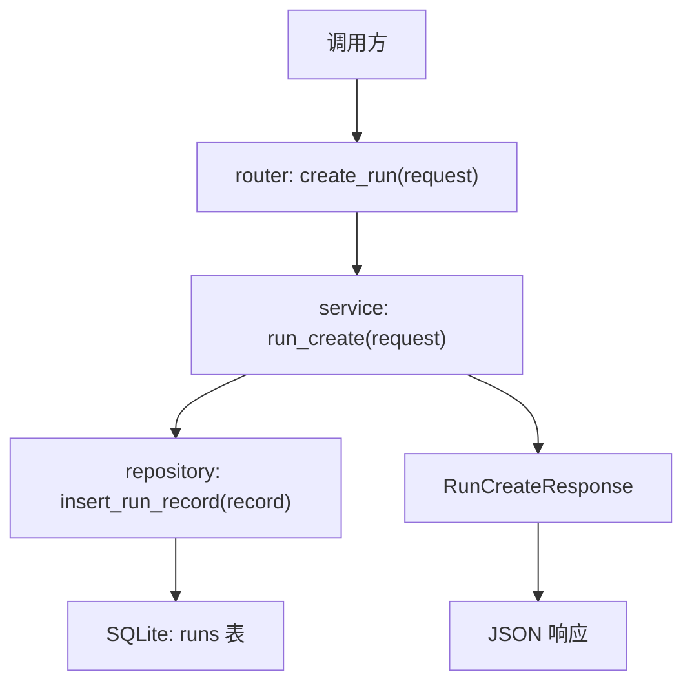

# Step 7：`POST /api/runs` + SQLite 最小闭环

## 这一步的目标

把 `POST /api/runs` 从静态 stub 推进成真正的最小闭环：

- 接口收到请求
- service 生成 `run_id`
- repository 把记录写进 `SQLite`
- 接口返回最小响应

## 当前落地结果

现在这条链路已经具备：

- `POST /api/runs`
- `runs` 表自动初始化
- 最小 run 元数据写入 `SQLite`
- API 测试覆盖创建和落库主链路

## 关键文件

- `platform-api/app/main.py`
- `platform-api/app/services/run_service.py`
- `platform-api/app/repositories/run_repository.py`
- `platform-api/app/schemas/run.py`
- `platform-api/tests/test_runs.py`

## 这一步的代码设计

这一轮代码设计的核心，是把“创建 run”正式拆成 4 层职责：

- `main.py`
  - 在应用启动时初始化 `runs` 表
- `router`
  - 接收 `POST /api/runs`
  - 把已校验的请求交给 `service`
- `service`
  - 生成 `run_id`
  - 组装 `status / message / created_at / updated_at`
  - 决定要写入哪条最小 run 记录
- `repository`
  - 负责建表和插入 `SQLite`

关键函数关系可以先记成：

```text
lifespan() 负责初始化表
create_run() 负责接 HTTP
run_create() 负责业务语义
insert_run_record() 负责真正写库
```

## 当前调用链

```text
POST /api/runs
-> router 接请求
-> schema 校验输入
-> service 生成 run_id、状态和时间戳
-> repository 写入 SQLite
-> service 返回 RunCreateResponse
```

## 函数调用流程图



## 这一步定下来的设计点

### 为什么要加 repository

因为从这一步开始已经进入“数据持久化”阶段了。

如果继续把 SQL 写在 `router` 或 `service` 里，后面扩列表、详情、状态更新时会越来越乱。

### `core` 是做什么的

当前 `core` 负责全局基础配置，例如：

- `app_name`
- `app_env`
- `runs_db_path`

最短记忆版：

```text
core = 全局基础层，不是 run 业务层。
```

### 当前 `run_id` 规则

当前采用更可读的规则：

- 默认先用 `run-时间戳`
- 如果真的冲突，再补 `-01 / -02`

## 开发侧验收结果

- [x] `main.py` 已接入启动期初始化，`runs` 表不再依赖手工预创建
- [x] `router / service / repository` 的职责已经按创建链路拆开
- [x] `run_service.py` 已能生成真实 `run_id` 并组装最小 run record
- [x] `run_repository.py` 已能把 record 写进 `SQLite`
- [x] `POST /api/runs` 的返回值和真实落库动作已经形成最小闭环

## 服务器侧功能验收结果

这一轮服务器侧功能验收，主要确认这轮代码上线到服务器后，最小创建闭环是否真的成立：

- [x] 启动 FastAPI 后，`runs` 表会自动初始化
- [x] 调 `POST /api/runs` 时，接口能返回真实生成的 `run_id`
- [x] 调 `POST /api/runs` 后，run 记录会真实写进 `SQLite`
- [x] 服务器上的 API 行为和当前文档里的代码设计一致

## 服务器侧测试结果

服务器侧最常用：

```bash
python -m pytest tests/test_health.py tests/test_runs.py
python -m uvicorn app.main:app --host 127.0.0.1 --port 8000
curl -X POST http://127.0.0.1:8000/api/runs -H "Content-Type: application/json" -d '{"testline":"smoke","robotcase_path":"cases/login.robot"}'
```

这一轮服务器侧测试主要验 3 件事：

- 接口能不能正常创建 run
- 记录有没有真实写进 `SQLite`
- pytest 是否覆盖“创建并落库”主链路

## 这一步最适合复盘的点

- `router / service / repository / core` 的职责边界
- 为什么当前只返回 `run_id / status / message`
- 为什么列表和详情接口必须建立在真实落库之上

## 相关专题

- [API 设计与调用链](../guides/api-design-and-flow.md)
- [Testing Workflow](../guides/testing-workflow.md)
