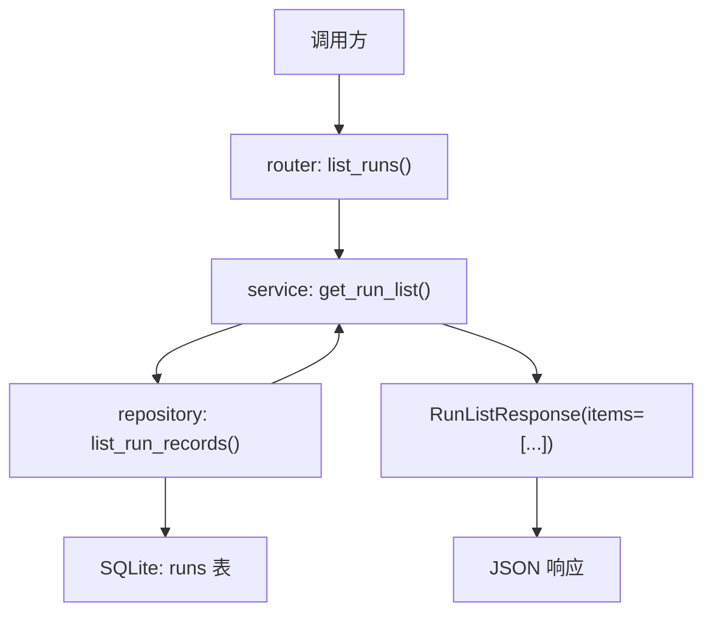

# Step 8：`GET /api/runs` 列表接口

## 这一步的目标

把已经写进 `SQLite` 的 run 记录查出来，并以列表形式返回。

这一步补上的不是新写入能力，而是最小读取能力。

## 当前落地结果

现在已经具备：

- `GET /api/runs`
- 从 `runs` 表真实查询数据
- 按 `created_at` 倒序返回
- 响应结构先用 `items` 包一层

## 当前返回结构

```json
{
  "items": [
    {
      "run_id": "run-20260422104958123",
      "testline": "smoke",
      "robotcase_path": "cases/login.robot",
      "status": "created",
      "message": "Run request accepted.",
      "created_at": "2026-04-22T10:49:58.123+08:00",
      "updated_at": "2026-04-22T10:49:58.123+08:00"
    }
  ]
}
```

## 这一步的代码设计

这一轮代码设计的核心，是把“读取列表”单独建成一条稳定查询链路：

- `router`
  - 暴露 `GET /api/runs`
- `service`
  - 负责调用查询方法
  - 把 repository 返回的数据组装成 `RunListResponse`
- `repository`
  - 只负责从 `runs` 表查询
  - 按 `created_at DESC` 返回原始记录
- `schema`
  - 通过 `RunListItem` 和 `RunListResponse` 固定列表对外结构

这一轮真正新增的关键函数是：

```text
list_runs() -> get_run_list() -> list_run_records()
```

## 当前调用链

```text
GET /api/runs
-> router 接请求
-> service 调 repository 查列表
-> repository 从 SQLite 的 runs 表读取数据
-> service 组装 RunListResponse(items=[...])
```

## 函数调用流程图



## 这一步定下来的设计点

### 为什么一定要查数据库

因为当前 run 列表的真实数据来源就是 `runs` 表。

最短记忆版：

```text
GET /api/runs 不是返回假数据，而是把之前写进去的 run 再查出来。
```

### 为什么先用 `items` 包一层

因为后面如果要扩：

- `total`
- 分页信息
- 筛选条件回显

对象结构会比裸数组更稳。

## 开发侧验收结果

- [x] `GET /api/runs` 已在 `router.py` 暴露为独立接口
- [x] `run_service.py` 已新增列表查询入口，并统一组装 `RunListResponse`
- [x] `run_repository.py` 已能从 `runs` 表按创建时间倒序查询记录
- [x] 列表返回结构已固定为 `items` 包裹的对象格式
- [x] 创建链路与读取链路已经形成“能写也能读”的最小数据闭环

## 服务器侧功能验收结果

这一轮服务器侧功能验收，主要确认这轮代码上线到服务器后，列表读取链路是否真的成立：

- [x] 已创建的 run 能通过 `GET /api/runs` 真实查出来
- [x] 返回结果来自 `SQLite`，不是假数据
- [x] 返回顺序已按 `created_at` 倒序
- [x] 列表接口结构稳定为 `items` 包裹对象

## 服务器侧测试结果

这一轮服务器侧测试主要关注：

- 先创建 run，再查询列表
- 返回顺序是否按最新创建时间在前
- 返回字段是否和数据库中的记录一致

## 当前测试重点

- 创建两条 run 后再查列表
- 最新创建的记录在前面
- 列表字段是否和数据库一致

## 当前最适合复盘的点

- 列表接口和创建接口的职责差异
- 为什么 `items` 包一层更利于扩展
- 为什么“接口能读出来”是和“接口能写进去”不同的闭环

## 相关专题

- [API 设计与调用链](../guides/api-design-and-flow.md)
- [Testing Workflow](../guides/testing-workflow.md)
