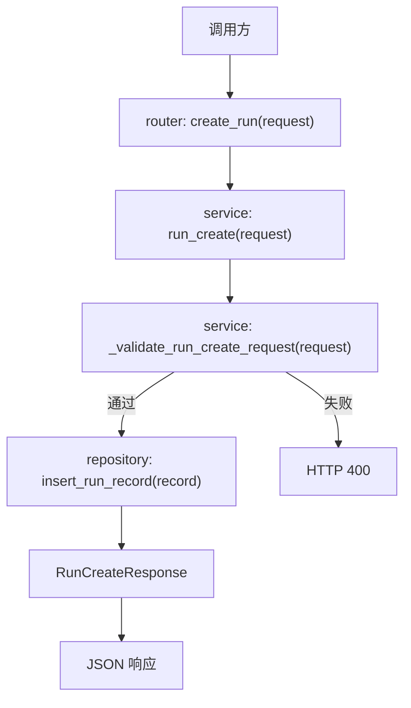

# Step 10：冻结 executor-agnostic run contract

## 这一步的目标

把 `platform-api` 的 `run` 创建语义从“只面向 Robot case”正式冻结成“同时支持 `robot` 和 `python_orchestrator`”的统一 contract。

这一轮最重要的不是再扩更多字段，而是把下面这些核心边界固定下来：

- 哪些字段属于所有执行器共用
- 哪些字段只在 `robot` 模式下必填
- 哪些字段只在 `python_orchestrator` 模式下必填
- KPI 相关开关和配置应该如何并入同一个 `run` 请求

## 预期结果

这一轮做完后，系统应该具备下面这些可观察结果：

- `POST /api/runs` 可以继续支持旧 `robot` 请求
- `POST /api/runs` 也可以接受 `python_orchestrator` 请求
- `executor_type` 成为统一入口字段
- `workflow_spec` 进入 `python_orchestrator` 请求模型
- `kpi_config` 和 KPI 开关作为 `python_orchestrator` 的后处理配置通道
- `run` 记录不再和单一执行器绑定

这一轮先不扩的内容包括：

- Jenkins 真实触发逻辑
- 执行层 handler 细节
- 前端 workflow builder 交互

## 这一步的代码设计

这一轮主要围绕下面这些层：

- `router`
  - 暴露 `POST /api/runs`
  - 接住统一的 `RunCreateRequest`
- `service`
  - 通过 `run_create()` 和 `_validate_run_create_request()` 统一校验执行器语义
  - 生成 `run_id`、默认状态和最小消息
- `repository`
  - 把统一 run 记录写入 `SQLite`
- `schema`
  - 用 `RunCreateRequest`、`RunCreateResponse` 固定第一版统一 contract

这一轮最关键的函数调用链是：

```text
create_run() -> run_create() -> _validate_run_create_request() -> insert_run_record()
```

重点字段边界固定为：

- 共用字段
  - `testline`
  - `executor_type`
  - `build`
- `robot` 模式重点字段
  - `robotcase_path`
- `python_orchestrator` 模式重点字段
  - `workflow_spec`
- KPI 后处理字段
  - `enable_kpi_generator`
  - `enable_kpi_anomaly_detector`
  - `kpi_config`
- 扩展字段
  - `metadata`

这里的分类标准是：

- 共用字段：所有执行器创建 run 时都有业务意义
- 执行器字段：只有对应执行器能解释和执行
- KPI 后处理字段：当前只允许 `python_orchestrator` 使用
- 扩展字段：不是核心 contract，只作为附加上下文保存

当前不再把顶层 `scenario` 和 `workflow_name` 作为 create contract 字段：

- KPI 场景放进 `kpi_config.scenario`
- workflow 名称由 `workflow_spec.name` 表达
- 数据库里旧的 `workflow_name` / `scenario` 列暂时保留，不作为新请求字段

## 函数调用流程图



## 开发侧验收步骤（服务器侧执行）

### 1. 启动服务

```bash
cd /path/to/jenkins_robotframework/platform-api
python3 -m venv .venv
source .venv/bin/activate
python -m pip install --upgrade pip
python -m pip install -r requirements.txt
python -m uvicorn app.main:app --host 127.0.0.1 --port 8000
```

### 2. 验证 `robot` 模式请求

```bash
curl -X POST http://127.0.0.1:8000/api/runs \
  -H "Content-Type: application/json" \
  -d '{
    "testline": "smoke",
    "executor_type": "robot",
    "robotcase_path": "cases/login.robot"
  }'
```

### 3. 验证 `python_orchestrator` 模式请求

```bash
curl -X POST http://127.0.0.1:8000/api/runs \
  -H "Content-Type: application/json" \
  -d '{
    "testline": "gnb-regression",
    "executor_type": "python_orchestrator",
    "workflow_spec": {
      "name": "attach-handover-detach",
      "stages": [],
      "runtime_options": {},
      "portal_followups": {}
    }
  }'
```

### 4. 验证缺失必填字段时返回错误

`python_orchestrator` 缺少 `workflow_spec`：

```bash
curl -X POST http://127.0.0.1:8000/api/runs \
  -H "Content-Type: application/json" \
  -d '{
    "testline": "gnb-regression",
    "executor_type": "python_orchestrator"
  }'
```

`robot` 缺少 `robotcase_path`：

```bash
curl -X POST http://127.0.0.1:8000/api/runs \
  -H "Content-Type: application/json" \
  -d '{
    "testline": "smoke",
    "executor_type": "robot"
  }'
```

预期结果：

- `python_orchestrator` 缺少 `workflow_spec` 时返回 `400`
- `robot` 缺少 `robotcase_path` 时返回 `400`

### 5. 验证 `robot` 模式不能携带 KPI 后处理配置

```bash
curl -X POST http://127.0.0.1:8000/api/runs \
  -H "Content-Type: application/json" \
  -d '{
    "testline": "smoke",
    "executor_type": "robot",
    "robotcase_path": "cases/login.robot",
    "enable_kpi_generator": true,
    "kpi_config": {
      "scenario": "7UE_DL_Burst"
    }
  }'
```

预期返回 `400`，因为 KPI 后处理配置当前只允许 `python_orchestrator` 使用。

## 开发侧验收结果

- [x] `POST /api/runs` 已按统一 contract 接住两类执行器请求
- [x] `robot` 模式缺少 `robotcase_path` 时会明确报错
- [x] `python_orchestrator` 模式缺少 `workflow_spec` 时会明确报错
- [x] `robot` 模式携带 KPI 后处理配置时会明确报错
- [x] `run_id / executor_type / status / message` 的最小响应已稳定
- [x] `SQLite` 中的 run 记录已不再只围绕单一执行器设计

## 测试侧验收步骤（服务器侧执行）

```bash
python -m pytest tests/test_runs.py
python -m pytest tests/test_runs.py --alluredir=allure-results
```

这一轮测试侧重点关注：

- `robot` 和 `python_orchestrator` 两条创建路径
- 缺少必填字段时的 `400`
- `robot` 模式拒绝 KPI 后处理字段
- 创建后落库字段是否与 contract 一致

## 测试侧验收结果

- [x] pytest 已覆盖两类执行器的创建请求
- [x] pytest 已覆盖执行器相关的请求校验
- [x] pytest 已覆盖 `robot` 模式拒绝 KPI 后处理字段
- [x] pytest 已覆盖 run 记录最小持久化结果
- [x] `allure-results` 可正常产出

说明：

- Step 10 只要求产出 `allure-results` 原始结果目录。
- Allure HTML 报告展示不在 Step 10 本身完成，会在后续 Jenkins 接入和测试流程收口时通过 Jenkins Allure Publisher 配置。

## 相关专题与测试文档

- [Testing Workflow](../guides/testing-workflow.md)
- [API 设计与调用链](../guides/api-design-and-flow.md)
- [Step 10 Test Automation](../testing-automation/step-10-test-automation.md)
- [GNB KPI Regression Architecture](../../../overview/gnb-kpi-regression-architecture.md)
- [GNB KPI System Runtime](../../../overview/gnb-kpi-system-runtime.md)

## 学习版说明

### 这一步解决了什么问题

Step 10 解决的是 `run` 创建入口过早绑定单一执行器的问题。

在 Step 10 之前，`POST /api/runs` 更像是围绕 Robot case 的最小创建接口。现在它被固定成统一 contract：同一个入口既能创建传统 `robot` run，也能创建后续给 Python orchestrator / KPI workflow 使用的 `python_orchestrator` run。

这一步不负责真实触发 Jenkins，也不负责执行 workflow。它只负责把“请求语义、必填字段、KPI 开关、持久化字段”先定稳。后面的 Jenkins callback、artifact/KPI 查询、React workflow builder 都依赖这个 contract。

### 改了哪些文件

- `platform-api/app/schemas/run.py`
  - 定义 `RunCreateRequest`、`RunCreateResponse`、`WorkflowSpec`、`KpiConfig`。
  - 这里决定 API 可以接收哪些字段。

- `platform-api/app/services/run_service.py`
  - `run_create()` 负责创建 run。
  - `_validate_run_create_request()` 负责区分不同 executor 的必填字段。

- `platform-api/app/repositories/run_repository.py`
  - 把统一 run 记录写入 SQLite。
  - JSON 字段用于保存 `workflow_spec`、`metadata`、`kpi_config` 等结构化内容。

- `platform-api/app/api/v1/router.py`
  - 暴露 `POST /api/runs`，把请求交给 service 层处理。

- `platform-api/tests/test_runs.py`
  - 覆盖 robot 创建、python_orchestrator 创建、缺少必填字段、落库结果。
  - 本轮补了 `test_create_robot_run_requires_robotcase_path`，防止 robot 模式缺少 case path 时被误放行。

### 核心调用链

```text
POST /api/runs
  -> router.create_run(request)
  -> service.run_create(request)
  -> service._validate_run_create_request(request)
  -> repository.insert_run_record(record)
  -> RunCreateResponse
```

最关键的是 `_validate_run_create_request()`：

- `executor_type = robot` 时，`robotcase_path` 必填
- `executor_type = python_orchestrator` 时，`workflow_spec` 必填

### 关键字段解释

- `executor_type`
  - 决定这条 run 由哪类执行器承接。
  - 当前支持 `robot` 和 `python_orchestrator`。

- `robotcase_path`
  - Robot 模式的核心字段。
  - 后续会被 Jenkins/UTE 用来定位真实 Robot case。

- `workflow_spec`
  - Python orchestrator 模式的核心字段。
  - 后续会承接并行 stage/item、KPI workflow 等结构。
  - `workflow_spec.name` 同时承担 workflow 展示名，不再单独使用顶层 `workflow_name`。

- `enable_kpi_generator` / `enable_kpi_anomaly_detector`
  - 表示这条 run 是否需要 KPI 生成和异常检测后处理。

- `kpi_config`
  - 保存 KPI 后处理需要的参数，例如模板、环境、场景、时间窗口。
  - 当前先作为结构化配置通道打通，字段细节等 generator / detector 接入真实参数后再收紧。
  - KPI 场景使用 `kpi_config.scenario`，不再使用顶层 `scenario`。

- `metadata`
  - 保存附加上下文，例如提交来源、trace id、临时调试信息。
  - 它不是核心业务字段，也不参与执行器必填校验。

### 服务器验证命令

由用户在服务器执行：

```bash
cd /path/to/jenkins_robotframework/platform-api
python -m pytest tests/test_runs.py
python -m pytest tests/test_runs.py --alluredir=allure-results
```

也可以手动验证两个错误分支：

```bash
curl -X POST http://127.0.0.1:8000/api/runs \
  -H "Content-Type: application/json" \
  -d '{"testline":"smoke","executor_type":"robot"}'
```

预期返回 `400`，错误信息为：

```text
robotcase_path is required when executor_type is robot.
```

```bash
curl -X POST http://127.0.0.1:8000/api/runs \
  -H "Content-Type: application/json" \
  -d '{"testline":"gnb-regression","executor_type":"python_orchestrator"}'
```

预期返回 `400`，错误信息为：

```text
workflow_spec is required when executor_type is python_orchestrator.
```

### 你需要确认的点

- 真实 Robot case run 是否只需要 `robotcase_path`，还是还需要 UTE、Robot variables、workspace 等字段提前进入 `RunCreateRequest`。
- `python_orchestrator` 的 `workflow_spec` 是否足够承接你后续想要的并行 KPI case。
- `kpi_config` 目前只作为通道，后续接真实 generator/detector 时再确认最终字段集合。

### 小结

Step 10 的核心不是“多加几个字段”，而是把 run 创建入口从单一 Robot 请求升级成统一执行器 contract。这样后续无论是真实 Robot case，还是并行 KPI workflow，都可以从同一个 `POST /api/runs` 进入系统。当前代码已经有主体实现，本轮主要补齐了 robot 缺失必填字段的自动化测试证据。

### 复盘问题

1. 为什么 `robot` 模式要求 `robotcase_path`，而 `python_orchestrator` 模式要求 `workflow_spec`？
2. `schema`、`service`、`repository` 在创建 run 时分别负责什么？
3. 如果后续 React 页面要创建真实 Robot run，你觉得还需要在请求里增加哪些字段？
