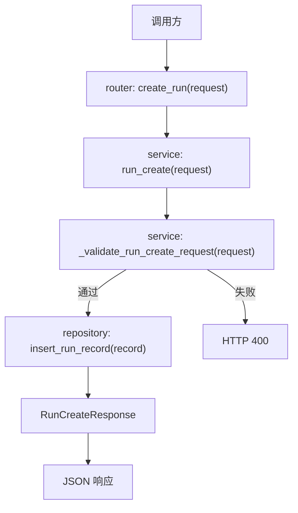

# Step 10：冻结 executor-agnostic run contract

## 这一步的目标

把 `platform-api` 的 `run` 创建语义从“只面向 Robot case”正式冻结成“同时支持 `robot` 和 `python_orchestrator`”的统一 contract。

这一轮最重要的不是再扩更多字段，而是把下面这些核心边界固定下来：

- 哪些字段属于所有执行器共用
- 哪些字段只在 `robot` 模式下必填
- 哪些字段只在 `python_orchestrator` 模式下必填
- KPI 相关开关和配置应该如何并入同一个 `run` 请求

## 预期结果

这一轮做完后，系统应该具备下面这些可观察结果：

- `POST /api/runs` 可以继续支持旧 `robot` 请求
- `POST /api/runs` 也可以接受 `python_orchestrator` 请求
- `executor_type` 成为统一入口字段
- `workflow_spec`、`kpi_config`、KPI 开关进入统一请求模型
- `run` 记录不再和单一执行器绑定

这一轮先不扩的内容包括：

- Jenkins 真实触发逻辑
- 执行层 handler 细节
- 前端 workflow builder 交互

## 这一步的代码设计

这一轮主要围绕下面这些层：

- `router`
  - 暴露 `POST /api/runs`
  - 接住统一的 `RunCreateRequest`
- `service`
  - 通过 `run_create()` 和 `_validate_run_create_request()` 统一校验执行器语义
  - 生成 `run_id`、默认状态和最小消息
- `repository`
  - 把统一 run 记录写入 `SQLite`
- `schema`
  - 用 `RunCreateRequest`、`RunCreateResponse` 固定第一版统一 contract

这一轮最关键的函数调用链是：

```text
create_run() -> run_create() -> _validate_run_create_request() -> insert_run_record()
```

重点字段边界固定为：

- 共用字段
  - `testline`
  - `executor_type`
  - `build`
  - `scenario`
  - `metadata`
  - `enable_kpi_generator`
  - `enable_kpi_anomaly_detector`
  - `kpi_config`
- `robot` 模式重点字段
  - `robotcase_path`
- `python_orchestrator` 模式重点字段
  - `workflow_name`
  - `workflow_spec`

## 函数调用流程图



## 开发侧验收步骤（服务器侧执行）

### 1. 启动服务

```bash
cd /path/to/jenkins_robotframework/platform-api
python3 -m venv .venv
source .venv/bin/activate
python -m pip install --upgrade pip
python -m pip install -r requirements.txt
python -m uvicorn app.main:app --host 127.0.0.1 --port 8000
```

### 2. 验证 `robot` 模式请求

```bash
curl -X POST http://127.0.0.1:8000/api/runs \
  -H "Content-Type: application/json" \
  -d '{
    "testline": "smoke",
    "executor_type": "robot",
    "robotcase_path": "cases/login.robot"
  }'
```

### 3. 验证 `python_orchestrator` 模式请求

```bash
curl -X POST http://127.0.0.1:8000/api/runs \
  -H "Content-Type: application/json" \
  -d '{
    "testline": "gnb-regression",
    "executor_type": "python_orchestrator",
    "workflow_name": "attach-handover-detach",
    "workflow_spec": {
      "name": "attach-handover-detach",
      "stages": [],
      "runtime_options": {},
      "portal_followups": {}
    }
  }'
```

### 4. 验证缺失必填字段时返回错误

```bash
curl -X POST http://127.0.0.1:8000/api/runs \
  -H "Content-Type: application/json" \
  -d '{
    "testline": "gnb-regression",
    "executor_type": "python_orchestrator"
  }'
```

## 开发侧验收结果

- [ ] `POST /api/runs` 已按统一 contract 接住两类执行器请求
- [ ] `robot` 模式缺少 `robotcase_path` 时会明确报错
- [ ] `python_orchestrator` 模式缺少 `workflow_spec` 时会明确报错
- [ ] `run_id / executor_type / status / message` 的最小响应已稳定
- [ ] `SQLite` 中的 run 记录已不再只围绕单一执行器设计

## 测试侧验收步骤（服务器侧执行）

```bash
python -m pytest tests/test_runs.py
python -m pytest tests/test_runs.py --alluredir=allure-results
```

这一轮测试侧重点关注：

- `robot` 和 `python_orchestrator` 两条创建路径
- 缺少必填字段时的 `400`
- 创建后落库字段是否与 contract 一致

## 测试侧验收结果

- [ ] pytest 已覆盖两类执行器的创建请求
- [ ] pytest 已覆盖执行器相关的请求校验
- [ ] pytest 已覆盖 run 记录最小持久化结果
- [ ] `allure-results` 可正常产出

## 相关专题与测试文档

- [Testing Workflow](../guides/testing-workflow.md)
- [API 设计与调用链](../guides/api-design-and-flow.md)
- [GNB KPI Regression Architecture](../../../overview/gnb-kpi-regression-architecture.md)
- [GNB KPI System Runtime](../../../overview/gnb-kpi-system-runtime.md)
