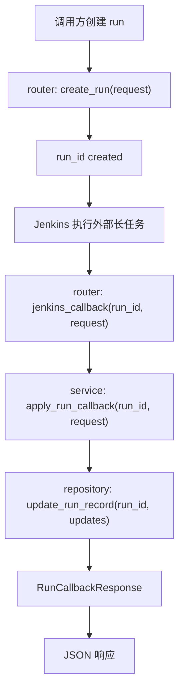

# Step 11：打通 Jenkins callback 最小闭环

## 这一步的目标

把 `platform-api` 在 Jenkins 集成里的职责冻结清楚：

- `platform-api` 负责创建 `run`
- Jenkins 负责执行长任务
- Jenkins 执行完后通过 callback 回写 `run` 状态、时间戳和产物摘要

这一轮先站稳“平台侧 callback 语义”，不把真实 Jenkins Pipeline 触发细节塞进 `platform-api` 模块文档里。

标题里的“trigger”在这一轮只表示：

```text
run 创建后，平台具备把 run_id 交给 Jenkins 的稳定 contract。
```

真实 Jenkins 触发、Job 参数、UTE 节点和 Robot 命令会在后续 `test-workflow-runner` 执行层步骤中完成。

## 预期结果

这一轮做完后，系统应该具备下面这些可观察结果：

- `run` 创建后有稳定的 `run_id`
- Jenkins 侧可以按 `run_id` 回调 `POST /api/runs/{run_id}/callbacks/jenkins`
- callback 可以更新：
  - `status`
  - `message`
  - `jenkins_build_ref`
  - `started_at`
  - `finished_at`
  - `artifact_manifest`
  - `kpi_summary`
  - `detector_summary`
- `platform-api` 保持“记录和聚合”，不直接承载执行动作

这一轮先不扩的内容包括：

- Jenkins 真实触发实现细节
- Pipeline stage 设计
- Runner 侧具体执行逻辑

## 这一步的代码设计

这一轮最关键的是把 callback 这条链路收口清楚：

- `router`
  - 暴露 `jenkins_callback(run_id, request)`
- `service`
  - 通过 `apply_run_callback()` 合并 Jenkins 回写内容和已有 run 元数据
- `repository`
  - 通过 `update_run_record()` 执行状态更新
- `schema`
  - 用 `RunCallbackRequest` / `RunCallbackResponse` 固定回写 contract

这一轮最关键的函数调用链是：

```text
jenkins_callback() -> apply_run_callback() -> update_run_record()
```

这里的边界固定为：

- `platform-api`
  - 负责接 callback、更新记录、对前端提供查询结果
- Jenkins
  - 负责执行、归档、决定何时回调

## 函数调用流程图



## 开发侧验收步骤（服务器侧执行）

### 1. 先创建一条 run

```bash
curl -X POST http://127.0.0.1:8000/api/runs \
  -H "Content-Type: application/json" \
  -d '{
    "testline": "gnb-regression",
    "executor_type": "python_orchestrator",
    "workflow_spec": {
      "name": "attach-handover-detach",
      "stages": [],
      "runtime_options": {},
      "portal_followups": {}
    }
  }'
```

### 2. 记录上一步返回的 `run_id`

假设返回：

```text
run-20260423103000001
```

### 3. 用 Jenkins callback 更新这条 run

把 `<run_id>` 替换成真实值：

```bash
curl -X POST http://127.0.0.1:8000/api/runs/<run_id>/callbacks/jenkins \
  -H "Content-Type: application/json" \
  -d '{
    "status": "finished",
    "message": "Jenkins callback received.",
    "jenkins_build_ref": "gnb-kpi/123",
    "started_at": "2026-04-23T10:30:00+08:00",
    "finished_at": "2026-04-23T10:42:00+08:00",
    "artifact_manifest": [],
    "kpi_summary": {"status": "generated"},
    "detector_summary": {"status": "completed"}
  }'
```

### 4. 再查详情确认回写结果

```bash
curl http://127.0.0.1:8000/api/runs/<run_id>
```

### 5. 验证不存在的 `run_id` 返回 `404`

```bash
curl -X POST http://127.0.0.1:8000/api/runs/run-not-exists/callbacks/jenkins \
  -H "Content-Type: application/json" \
  -d '{
    "status": "finished",
    "message": "Pipeline completed."
  }'
```

预期返回：

```text
404 Run not found.
```

## 开发侧验收结果

- [ ] Jenkins callback 路由可访问
- [ ] callback 可以稳定更新 `status / message / jenkins_build_ref`
- [ ] callback 可以写入时间戳和摘要字段
- [ ] callback 不会破坏已有 run 基本信息
- [ ] `run` 详情已能看到 Jenkins 回写结果
- [ ] 不存在的 `run_id` 会稳定返回 `404`

## 测试侧验收步骤（服务器侧执行）

```bash
python -m pytest tests/test_runs.py
python -m pytest tests/test_runs.py --alluredir=allure-results
```

这一轮测试侧重点关注：

- callback 更新命中路径
- callback 之后详情接口的数据一致性
- 不存在 `run_id` 时的 `404`

## 测试侧验收结果

- [ ] pytest 已覆盖 Jenkins callback 主路径
- [ ] pytest 已覆盖 callback 后详情查询一致性
- [ ] pytest 已覆盖不存在 `run_id` 的错误路径
- [ ] `allure-results` 可正常产出

## 相关专题与测试文档

- [Testing Workflow](../guides/testing-workflow.md)
- [API 设计与调用链](../guides/api-design-and-flow.md)
- [Step 10：冻结 executor-agnostic run contract](step-10-executor-agnostic-run-contract.md)
- [Step 11 Test Automation](../testing-automation/step-11-test-automation.md)
- [GNB KPI System Runtime](../../../overview/gnb-kpi-system-runtime.md)

## 学习版说明

### 这一步解决了什么问题

Step 11 解决的是 Jenkins 执行完以后，平台如何接收执行结果的问题。

在 Step 10 里，`platform-api` 已经能创建一条稳定的 run。Step 11 则补上后半段：Jenkins 或执行层拿到 `run_id` 后，执行完长任务，再通过 callback 把状态、时间、产物和 KPI 摘要回写到同一条 run。

这一轮不做真实 Jenkins trigger。真实 Job 触发、UTE 节点、Robot workspace 和 Pipeline stage 都属于后续 `test-workflow-runner` 执行层。

### 改了哪些文件

- `platform-api/app/schemas/run.py`
  - `RunCallbackRequest` 定义 Jenkins 可以回写哪些字段。
  - `RunCallbackResponse` 固定 callback 成功后的最小响应。

- `platform-api/app/services/run_service.py`
  - `apply_run_callback()` 负责读取已有 run、合并 Jenkins 回写内容、更新数据库。

- `platform-api/app/repositories/run_repository.py`
  - `update_run_record()` 负责把 callback 字段写回 SQLite。

- `platform-api/app/api/v1/router.py`
  - 暴露 `POST /api/runs/{run_id}/callbacks/jenkins`。

- `platform-api/tests/test_runs.py`
  - 覆盖 callback 主路径、详情一致性和不存在 run 的 `404`。

### 核心调用链

```text
POST /api/runs/{run_id}/callbacks/jenkins
  -> router.jenkins_callback(run_id, request)
  -> service.apply_run_callback(run_id, request)
  -> service._get_required_record(run_id)
  -> repository.update_run_record(run_id, updates)
  -> RunCallbackResponse
```

最关键的是 `_get_required_record()`：

- 找到 run：进入更新流程
- 找不到 run：返回 `404 Run not found.`

### 关键字段解释

- `status`
  - Jenkins / 执行层最终回写的 run 状态。

- `message`
  - 执行结果说明，例如成功、失败原因、异常摘要。

- `jenkins_build_ref`
  - Jenkins job/build 的引用，例如 `gnb-kpi/123`。
  - 后续前端可以用它跳转 Jenkins build。

- `started_at` / `finished_at`
  - 执行开始和结束时间。

- `artifact_manifest`
  - Jenkins 归档产物清单，例如 Robot `log.html`、`report.html`、KPI Excel、detector HTML。

- `kpi_summary` / `detector_summary`
  - KPI generator 和 anomaly detector 的摘要结果。

- `metadata`
  - callback 过程中的附加上下文，会和已有 run metadata 合并。

### 服务器验证命令

由用户在服务器执行：

```bash
cd /path/to/jenkins_robotframework/platform-api
python -m pytest tests/test_runs.py
python -m pytest tests/test_runs.py --alluredir=allure-results
```

重点关注：

```text
test_jenkins_callback_updates_artifacts_and_kpi_summary
test_jenkins_callback_returns_404_for_missing_run
```

### 你需要确认的点

- `jenkins_build_ref` 后续是否需要固定格式，例如 `job_name/build_number`。
- `artifact_manifest` 里的 `kind` 是否需要提前枚举，例如 `robot_log`、`robot_report`、`kpi_excel`、`detector_html`。
- callback 的 `status` 是否需要限制为固定状态集合，例如 `running`、`finished`、`failed`。

### 小结

Step 11 的核心是让 `platform-api` 成为 Jenkins 执行结果的接收和聚合入口。Jenkins 不需要直接改数据库，只要按 `run_id` 调 callback，平台就能把执行状态、产物和 KPI 摘要统一挂到 run detail 上。

### 复盘问题

1. 为什么 callback 必须带 `run_id`？
2. `artifact_manifest` 和 `kpi_summary` 为什么不直接存在 Jenkins 日志里就结束？
3. 如果 Jenkins callback 到一个不存在的 `run_id`，为什么应该返回 `404`？
