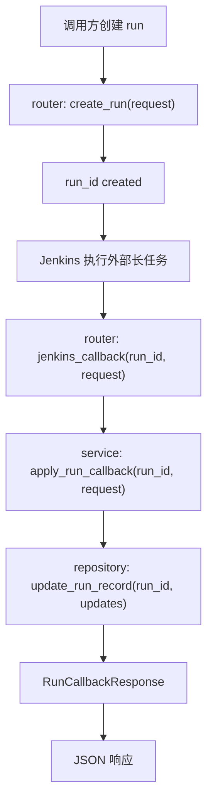

# Step 11：打通 Jenkins trigger / callback 最小闭环

## 这一步的目标

把 `platform-api` 在 Jenkins 集成里的职责冻结清楚：

- `platform-api` 负责创建 `run`
- Jenkins 负责执行长任务
- Jenkins 执行完后通过 callback 回写 `run` 状态、时间戳和产物摘要

这一轮先站稳“平台侧 callback 语义”，不把真实 Jenkins Pipeline 细节塞进 `platform-api` 模块文档里。

## 预期结果

这一轮做完后，系统应该具备下面这些可观察结果：

- `run` 创建后有稳定的 `run_id`
- Jenkins 侧可以按 `run_id` 回调 `POST /api/runs/{run_id}/callbacks/jenkins`
- callback 可以更新：
  - `status`
  - `message`
  - `jenkins_build_ref`
  - `started_at`
  - `finished_at`
  - `artifact_manifest`
  - `kpi_summary`
  - `detector_summary`
- `platform-api` 保持“记录和聚合”，不直接承载执行动作

这一轮先不扩的内容包括：

- Jenkins 真实触发实现细节
- Pipeline stage 设计
- Runner 侧具体执行逻辑

## 这一步的代码设计

这一轮最关键的是把 callback 这条链路收口清楚：

- `router`
  - 暴露 `jenkins_callback(run_id, request)`
- `service`
  - 通过 `apply_run_callback()` 合并 Jenkins 回写内容和已有 run 元数据
- `repository`
  - 通过 `update_run_record()` 执行状态更新
- `schema`
  - 用 `RunCallbackRequest` / `RunCallbackResponse` 固定回写 contract

这一轮最关键的函数调用链是：

```text
jenkins_callback() -> apply_run_callback() -> update_run_record()
```

这里的边界固定为：

- `platform-api`
  - 负责接 callback、更新记录、对前端提供查询结果
- Jenkins
  - 负责执行、归档、决定何时回调

## 函数调用流程图



## 开发侧验收步骤（服务器侧执行）

### 1. 先创建一条 run

```bash
curl -X POST http://127.0.0.1:8000/api/runs \
  -H "Content-Type: application/json" \
  -d '{
    "testline": "gnb-regression",
    "executor_type": "python_orchestrator",
    "workflow_name": "attach-handover-detach",
    "workflow_spec": {
      "name": "attach-handover-detach",
      "stages": [],
      "runtime_options": {},
      "portal_followups": {}
    }
  }'
```

### 2. 记录上一步返回的 `run_id`

假设返回：

```text
run-20260423103000001
```

### 3. 用 Jenkins callback 更新这条 run

把 `<run_id>` 替换成真实值：

```bash
curl -X POST http://127.0.0.1:8000/api/runs/<run_id>/callbacks/jenkins \
  -H "Content-Type: application/json" \
  -d '{
    "status": "finished",
    "message": "Jenkins callback received.",
    "jenkins_build_ref": "gnb-kpi/123",
    "started_at": "2026-04-23T10:30:00+08:00",
    "finished_at": "2026-04-23T10:42:00+08:00",
    "artifact_manifest": [],
    "kpi_summary": {"status": "generated"},
    "detector_summary": {"status": "completed"}
  }'
```

### 4. 再查详情确认回写结果

```bash
curl http://127.0.0.1:8000/api/runs/<run_id>
```

## 开发侧验收结果

- [ ] Jenkins callback 路由可访问
- [ ] callback 可以稳定更新 `status / message / jenkins_build_ref`
- [ ] callback 可以写入时间戳和摘要字段
- [ ] callback 不会破坏已有 run 基本信息
- [ ] `run` 详情已能看到 Jenkins 回写结果

## 测试侧验收步骤（服务器侧执行）

```bash
python -m pytest tests/test_runs.py
python -m pytest tests/test_runs.py --alluredir=allure-results
```

这一轮测试侧重点关注：

- callback 更新命中路径
- callback 之后详情接口的数据一致性
- 不存在 `run_id` 时的 `404`

## 测试侧验收结果

- [ ] pytest 已覆盖 Jenkins callback 主路径
- [ ] pytest 已覆盖 callback 后详情查询一致性
- [ ] pytest 已覆盖不存在 `run_id` 的错误路径
- [ ] `allure-results` 可正常产出

## 相关专题与测试文档

- [Testing Workflow](../guides/testing-workflow.md)
- [API 设计与调用链](../guides/api-design-and-flow.md)
- [Step 10：冻结 executor-agnostic run contract](step-10-executor-agnostic-run-contract.md)
- [GNB KPI System Runtime](../../../overview/gnb-kpi-system-runtime.md)
