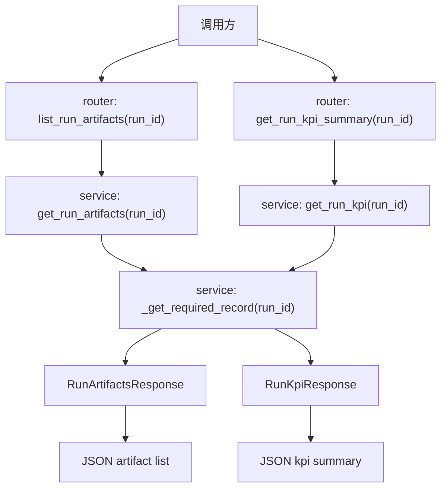

# Step 12：补齐 artifact / KPI / detector metadata 查询面

## 这一步的目标

把执行层回传后的结果，正式整理成前端可查、可展示、可下载的查询面。

这一轮最重要的不是生成文件本身，而是固定：

- `platform-api` 如何暴露 artifact 清单
- `platform-api` 如何暴露 kpi_generator 执行摘要与 detector 摘要
- 哪些信息应该存数据库元数据
- 哪些信息仍然只保留在 Jenkins artifact / 文件系统

## 预期结果

这一轮做完后，系统应该具备下面这些可观察结果：

- `GET /api/runs/{run_id}/artifacts`
- `GET /api/runs/{run_id}/kpi`
- 前端能拿到 artifact manifest
- 前端能拿到 KPI 开关、KPI 配置、kpi_generator 执行摘要、detector 摘要
- `SQLite` 继续只存元数据，不直接存大文件内容

这一轮先不扩的内容包括：

- HTML 报告内嵌展示
- KPI 趋势页
- 历史聚合或跨 run 对比

## 这一步的代码设计

这一轮代码设计的重点，是把“文件本体”和“元数据查询面”明确分开：

- `router`
  - 暴露 `list_run_artifacts(run_id)`
  - 暴露 `get_run_kpi_summary(run_id)`
- `service`
  - 通过 `get_run_artifacts()` 组织 artifact 清单响应
  - 通过 `get_run_kpi()` 组织 kpi_generator / detector 摘要查询响应
- `repository`
  - 继续从同一条 run 记录里读取 `artifact_manifest_json`、`kpi_summary_json`、`detector_summary_json`
- `schema`
  - 用 `RunArtifactsResponse`、`RunKpiResponse` 固定查询面

这一轮最关键的函数调用链是：

```text
list_run_artifacts() -> get_run_artifacts() -> _get_required_record()
get_run_kpi_summary() -> get_run_kpi() -> _get_required_record()
```

## 函数调用流程图



## 开发侧验收步骤（服务器侧执行）

### 1. 先创建一条 run 并触发一次 callback

先按 Step 10 和 Step 11 的方式创建 run，再回写一份最小 artifact / KPI 元数据。

### 2. 查询 artifact 清单

```bash
curl http://127.0.0.1:8000/api/runs/<run_id>/artifacts
```

### 3. 查询 kpi_generator 执行摘要

```bash
curl http://127.0.0.1:8000/api/runs/<run_id>/kpi
```

### 4. 查一个不存在的 `run_id`

```bash
curl http://127.0.0.1:8000/api/runs/run-not-exists/artifacts
curl http://127.0.0.1:8000/api/runs/run-not-exists/kpi
```

## 开发侧验收结果

- [ ] artifact 清单接口可访问
- [ ] kpi_generator 执行摘要接口可访问
- [ ] 接口会返回数据库中的元数据，而不是大文件本体
- [ ] 不存在的 `run_id` 会稳定返回 `404`
- [ ] 前端已经具备稳定的数据查询来源

## 测试侧验收步骤（服务器侧执行）

```bash
python -m pytest tests/test_runs.py
python -m pytest tests/test_runs.py --alluredir=allure-results
```

这一轮测试侧重点关注：

- callback 后 artifact 清单是否可查询
- callback 后 kpi_generator 执行摘要 / detector 摘要是否可查询
- 不存在 `run_id` 时是否稳定返回 `404`

## 测试侧验收结果

- [ ] pytest 已覆盖 artifact 查询主路径
- [ ] pytest 已覆盖 kpi_generator 执行摘要查询主路径
- [ ] pytest 已覆盖不存在 `run_id` 的错误路径
- [ ] `allure-results` 可正常产出

## 相关专题与测试文档

- [Testing Workflow](../guides/testing-workflow.md)
- [API 设计与调用链](../guides/api-design-and-flow.md)
- [Step 11：打通 Jenkins trigger / callback 最小闭环](step-11-jenkins-trigger-and-callback.md)
- [Step 12 Test Automation](../testing-automation/step-12-test-automation.md)
- [GNB KPI System Runtime](../../../overview/gnb-kpi-system-runtime.md)

## 学习版说明

### 这一步解决了什么问题

Step 12 解决的是“执行结果怎么给前端查”的问题。

Step 11 已经让 Jenkins callback 可以把 artifact、kpi_generator 执行摘要、detector summary 回写到同一条 run。Step 12 在这个基础上，把这些回写结果拆成两个专门查询面：

- `GET /api/runs/{run_id}/artifacts`
- `GET /api/runs/{run_id}/kpi`

这样前端不需要自己从完整 run detail 里到处找字段，也不需要直接读 Jenkins 文件系统。它只要调用稳定 API，就能拿到 artifact 清单、kpi_generator 执行摘要和 detector 摘要。

### 改了哪些文件

- `platform-api/app/schemas/run.py`
  - `RunArtifactsResponse` 固定 artifact 查询响应。
  - `RunKpiResponse` 固定 kpi_generator / detector 摘要查询响应。

- `platform-api/app/services/run_service.py`
  - `get_run_artifacts()` 从 run 记录中组织 artifact manifest。
  - `get_run_kpi()` 从 run 记录中组织 KPI config、kpi_generator 执行摘要、detector summary。

- `platform-api/app/api/v1/router.py`
  - 暴露 `GET /api/runs/{run_id}/artifacts`。
  - 暴露 `GET /api/runs/{run_id}/kpi`。

- `platform-api/tests/test_runs.py`
  - 覆盖 callback 后 artifact / kpi_generator 摘要主路径。
  - 覆盖不存在 run 时两个查询接口返回 `404`。

### 核心调用链

```text
GET /api/runs/{run_id}/artifacts
  -> router.list_run_artifacts(run_id)
  -> service.get_run_artifacts(run_id)
  -> service._get_required_record(run_id)
  -> RunArtifactsResponse
```

```text
GET /api/runs/{run_id}/kpi
  -> router.get_run_kpi_summary(run_id)
  -> service.get_run_kpi(run_id)
  -> service._get_required_record(run_id)
  -> RunKpiResponse
```

两个接口都复用 `_get_required_record()`：

- 查得到 run：返回对应元数据
- 查不到 run：返回 `404 Run not found.`

### 关键字段解释

- `artifact_manifest`
  - 保存 Jenkins / 执行层归档产物的元数据。
  - 只保存 `kind`、`label`、`path`、`url`、`content_type`、`source`、`metadata`。
  - 不保存文件内容本身。
  - KPI 文件本体，例如 KPI Excel，应该作为 artifact manifest 中的一项。

- `kpi_config`
  - KPI 后处理配置通道。
  - 当前先保存结构化配置，字段细节后续接真实 generator / detector 时再收紧。

- `kpi_summary`
  - kpi_generator 执行后的摘要结果。
  - 它不是 KPI 文件本体，也不保存 Excel / HTML 内容。
  - 例如 counter 数量、时间窗口、生成状态。

- `detector_summary`
  - anomaly detector 执行后的摘要结果。
  - 例如异常数量、top counter、检测状态。

### 为什么不直接存文件

SQLite 只适合保存元数据，不适合保存 Robot HTML、KPI Excel、detector HTML 这些大文件。

更合理的分工是：

```text
Jenkins / 文件系统 / artifact storage = 保存文件本体
platform-api / SQLite = 保存元数据、链接和摘要
automation-portal = 展示链接和摘要
```

这里要特别区分：

```text
KPI 摘要 = kpi_generator 执行摘要，不是 KPI 文件本体
KPI 文件 = artifact_manifest 里的一个 artifact
```

### 服务器验证命令

由用户在服务器执行：

```bash
cd /path/to/jenkins_robotframework/platform-api
python -m pytest tests/test_runs.py
python -m pytest tests/test_runs.py --alluredir=allure-results
```

重点关注：

```text
test_jenkins_callback_updates_artifacts_and_kpi_summary
test_get_run_artifacts_returns_404_for_missing_run
test_get_run_kpi_returns_404_for_missing_run
```

### 你需要确认的点

- `artifact_manifest.kind` 后续是否需要枚举固定值，例如 `robot_log`、`robot_report`、`kpi_excel`、`detector_html`。
- `artifact_manifest.url` 后续是 Jenkins artifact URL，还是由平台转发下载链接。
- `kpi_summary` 和 `detector_summary` 当前先作为 dict 保存，后续是否需要收紧成明确 schema。

### 小结

Step 12 的核心是把执行结果从“callback 回写到 run”进一步变成“前端可以稳定查询的元数据接口”。它不生成 KPI 文件，也不生成报告，只负责提供 artifact / kpi_generator 摘要 / detector 摘要的查询入口。

### 复盘问题

1. 为什么 artifact 接口只返回 manifest，而不返回文件内容？
2. `GET /artifacts` 和 `GET /kpi` 为什么都要先确认 run 是否存在？
3. 如果后续 portal 要展示 KPI Excel 文件，它应该读 `kpi_summary`，还是读 `artifact_manifest`？
