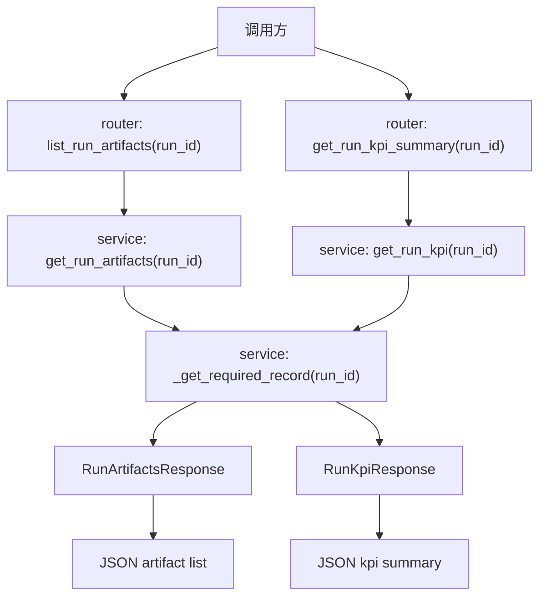

# Step 12：补齐 artifact / KPI / detector metadata 查询面

## 这一步的目标

把执行层回传后的结果，正式整理成前端可查、可展示、可下载的查询面。

这一轮最重要的不是生成文件本身，而是固定：

- `platform-api` 如何暴露 artifact 清单
- `platform-api` 如何暴露 KPI 与 detector 摘要
- 哪些信息应该存数据库元数据
- 哪些信息仍然只保留在 Jenkins artifact / 文件系统

## 预期结果

这一轮做完后，系统应该具备下面这些可观察结果：

- `GET /api/runs/{run_id}/artifacts`
- `GET /api/runs/{run_id}/kpi`
- 前端能拿到 artifact manifest
- 前端能拿到 KPI 开关、KPI 配置、KPI 摘要、detector 摘要
- `SQLite` 继续只存元数据，不直接存大文件内容

这一轮先不扩的内容包括：

- HTML 报告内嵌展示
- KPI 趋势页
- 历史聚合或跨 run 对比

## 这一步的代码设计

这一轮代码设计的重点，是把“文件本体”和“元数据查询面”明确分开：

- `router`
  - 暴露 `list_run_artifacts(run_id)`
  - 暴露 `get_run_kpi_summary(run_id)`
- `service`
  - 通过 `get_run_artifacts()` 组织 artifact 清单响应
  - 通过 `get_run_kpi()` 组织 KPI 查询响应
- `repository`
  - 继续从同一条 run 记录里读取 `artifact_manifest_json`、`kpi_summary_json`、`detector_summary_json`
- `schema`
  - 用 `RunArtifactsResponse`、`RunKpiResponse` 固定查询面

这一轮最关键的函数调用链是：

```text
list_run_artifacts() -> get_run_artifacts() -> _get_required_record()
get_run_kpi_summary() -> get_run_kpi() -> _get_required_record()
```

## 函数调用流程图



## 开发侧验收步骤（服务器侧执行）

### 1. 先创建一条 run 并触发一次 callback

先按 Step 10 和 Step 11 的方式创建 run，再回写一份最小 artifact / KPI 元数据。

### 2. 查询 artifact 清单

```bash
curl http://127.0.0.1:8000/api/runs/<run_id>/artifacts
```

### 3. 查询 KPI 摘要

```bash
curl http://127.0.0.1:8000/api/runs/<run_id>/kpi
```

### 4. 查一个不存在的 `run_id`

```bash
curl http://127.0.0.1:8000/api/runs/run-not-exists/artifacts
curl http://127.0.0.1:8000/api/runs/run-not-exists/kpi
```

## 开发侧验收结果

- [ ] artifact 清单接口可访问
- [ ] KPI 摘要接口可访问
- [ ] 接口会返回数据库中的元数据，而不是大文件本体
- [ ] 不存在的 `run_id` 会稳定返回 `404`
- [ ] 前端已经具备稳定的数据查询来源

## 测试侧验收步骤（服务器侧执行）

```bash
python -m pytest tests/test_runs.py
python -m pytest tests/test_runs.py --alluredir=allure-results
```

这一轮测试侧重点关注：

- callback 后 artifact 清单是否可查询
- callback 后 KPI / detector 摘要是否可查询
- 不存在 `run_id` 时是否稳定返回 `404`

## 测试侧验收结果

- [ ] pytest 已覆盖 artifact 查询主路径
- [ ] pytest 已覆盖 KPI 查询主路径
- [ ] pytest 已覆盖不存在 `run_id` 的错误路径
- [ ] `allure-results` 可正常产出

## 相关专题与测试文档

- [Testing Workflow](../guides/testing-workflow.md)
- [API 设计与调用链](../guides/api-design-and-flow.md)
- [Step 11：打通 Jenkins trigger / callback 最小闭环](step-11-jenkins-trigger-and-callback.md)
- [GNB KPI System Runtime](../../../overview/gnb-kpi-system-runtime.md)
