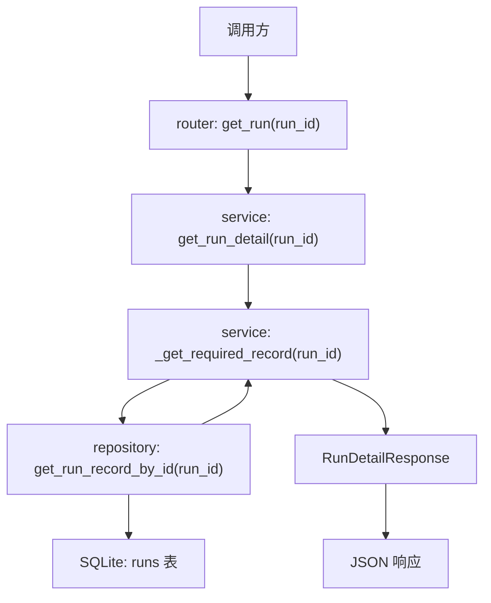

# Step 13：把 run detail 升级为 execution-ready 详情入口

## 这一步的目标

把 `GET /api/runs/{run_id}` 从“最小 run 详情”升级成“能承接 execution 层结果的统一详情入口”。

这一轮最重要的是把详情页语义固定下来：

- `run` 基本信息从哪里看
- Jenkins 回写后的执行状态从哪里看
- workflow 规格从哪里看
- artifact 清单、kpi_generator 执行摘要、kpi_anomaly_detector 执行摘要从哪里挂进来

## 预期结果

这一轮做完后，系统应该具备下面这些可观察结果：

- `GET /api/runs/{run_id}` 返回统一详情对象
- 详情对象不仅包含最初的 run 基本字段
- 详情对象还能承接：
  - `workflow_spec`
  - `metadata`
  - `artifact_manifest`
  - `kpi_summary`（kpi_generator 执行摘要，不是 KPI 文件本体）
  - `detector_summary`（kpi_anomaly_detector 执行摘要）
  - `jenkins_build_ref`
  - `started_at`
  - `finished_at`
- 后续 `automation-portal` 可以把这条接口直接作为 run detail 页主数据源

这一轮先不扩的内容包括：

- kpi_generator 历史对比页
- timeline 可视化页
- 更复杂的筛选和聚合接口

## 这一步的代码设计

这一轮代码设计的关键，是让详情接口成为统一聚合入口：

- `router`
  - 继续暴露 `get_run(run_id)`
- `service`
  - 用 `get_run_detail(run_id)` 把数据库记录标准化成统一详情对象
  - 通过 `_get_required_record(run_id)` 处理“查不到即 404”
- `repository`
  - 保持按 `run_id` 查询单条记录
- `schema`
  - 用 `RunDetailResponse` 固定 execution-ready 详情字段集合

这一轮最关键的函数调用链是：

```text
get_run() -> get_run_detail() -> _get_required_record() -> get_run_record_by_id()
```

## 函数调用流程图



## 开发侧验收步骤（服务器侧执行）

### 1. 创建一条包含 workflow / kpi_generator 后处理参数的 run

```bash
curl -X POST http://127.0.0.1:8000/api/runs \
  -H "Content-Type: application/json" \
  -d '{
    "testline": "gnb-regression",
    "executor_type": "python_orchestrator",
    "workflow_spec": {
      "name": "attach-handover-detach",
      "stages": [],
      "runtime_options": {},
      "portal_followups": {}
    },
    "enable_kpi_generator": true,
    "enable_kpi_anomaly_detector": true
  }'
```

### 2. 用 callback 给这条 run 回写执行结果

```bash
curl -X POST http://127.0.0.1:8000/api/runs/<run_id>/callbacks/jenkins \
  -H "Content-Type: application/json" \
  -d '{
    "status": "finished",
    "jenkins_build_ref": "gnb-kpi/123",
    "artifact_manifest": [],
    "kpi_summary": {"status": "generated", "source": "kpi_generator"},
    "detector_summary": {"status": "completed", "source": "kpi_anomaly_detector"}
  }'
```

### 3. 查询统一详情

```bash
curl http://127.0.0.1:8000/api/runs/<run_id>
```

### 4. 确认详情中的关键字段

重点确认：

- `executor_type`
- `workflow_spec`
- `artifact_manifest`
- `kpi_summary`（kpi_generator 执行摘要）
- `detector_summary`（kpi_anomaly_detector 执行摘要）
- `jenkins_build_ref`
- `started_at / finished_at`

## 开发侧验收结果

- [ ] 详情接口已能作为统一详情入口
- [ ] workflow 规格和执行层摘要字段已能在同一响应里看到
- [ ] callback 写入后的结果可以直接在详情接口中查到
- [ ] 不存在的 `run_id` 会稳定返回 `404`
- [ ] 后续前端详情页已有稳定主数据源

## 测试侧验收步骤（服务器侧执行）

```bash
python -m pytest tests/test_runs.py
python -m pytest tests/test_runs.py --alluredir=allure-results
```

这一轮测试侧重点关注：

- 详情接口是否返回 execution-ready 字段集合
- callback 后详情接口是否同步反映更新结果
- 不存在的 `run_id` 是否稳定返回 `404`

## 测试侧验收结果

- [ ] pytest 已覆盖 execution-ready 详情主路径
- [ ] pytest 已覆盖 callback 后详情一致性
- [ ] pytest 已覆盖不存在 `run_id` 的错误路径
- [ ] `allure-results` 可正常产出

## 相关专题与测试文档

- [Testing Workflow](../guides/testing-workflow.md)
- [API 设计与调用链](../guides/api-design-and-flow.md)
- [Step 12：补齐 artifact 查询面与 KPI 后处理查询面](step-12-artifact-and-kpi-metadata-query-surface.md)
- [Step 13 Test Automation](../testing-automation/step-13-test-automation.md)
- [GNB KPI Regression Architecture](../../../overview/gnb-kpi-regression-architecture.md)

## 学习版说明

### 这一步解决了什么问题

Step 13 解决的是“前端详情页应该从哪里拿主数据”的问题。

Step 11 已经能接收 Jenkins callback，Step 12 已经提供 `/artifacts` 和 `/kpi` 两个专用查询面。但前端详情页不可能每次只看一个局部字段，它需要一个统一入口来展示一条 run 的全貌。

所以 Step 13 把 `GET /api/runs/{run_id}` 升级成 execution-ready detail：

```text
run 基本信息
  + workflow_spec
  + Jenkins 回写状态
  + artifact_manifest
  + kpi_generator 执行摘要
  + kpi_anomaly_detector 执行摘要
```

这一步不生成 artifact，不生成 KPI 文件，也不运行 detector。它只负责把已有记录标准化后返回给前端。

### 改了哪些文件

- `platform-api/app/schemas/run.py`
  - `RunDetailResponse` 固定 execution-ready 详情字段集合。

- `platform-api/app/services/run_service.py`
  - `get_run_detail()` 通过 `_get_required_record()` 返回标准化详情对象。
  - `_normalize_record()` 把 SQLite 中的 JSON 字段还原成 API 响应字段。

- `platform-api/app/repositories/run_repository.py`
  - `get_run_record_by_id()` 按 `run_id` 查询单条记录。

- `platform-api/app/api/v1/router.py`
  - `GET /api/runs/{run_id}` 继续作为详情入口。

- `platform-api/tests/test_runs.py`
  - 覆盖详情主路径、callback 后详情一致性、不存在 run 的 `404`。
  - 本轮补充了 execution-ready detail 中 `workflow_spec`、KPI 后处理开关、kpi_generator 摘要、detector 摘要的断言。

### 核心调用链

```text
GET /api/runs/{run_id}
  -> router.get_run(run_id)
  -> service.get_run_detail(run_id)
  -> service._get_required_record(run_id)
  -> repository.get_run_record_by_id(run_id)
  -> RunDetailResponse
```

最关键的是 `_normalize_record()`：

- 把 `workflow_spec_json` 还原成 `workflow_spec`
- 把 `run_metadata_json` 还原成 `metadata`
- 把 `artifact_manifest_json` 还原成 `artifact_manifest`
- 把 `kpi_summary_json` 还原成 `kpi_summary`
- 把 `detector_summary_json` 还原成 `detector_summary`

### 关键字段解释

- `workflow_spec`
  - python_orchestrator 的结构化 workflow。
  - 前端详情页可以用它展示本次 run 的执行规格。

- `artifact_manifest`
  - 文件清单，包含 Robot 报告、KPI 文件、detector 报告等 artifact 元数据。
  - 文件本体仍在 Jenkins artifact / 文件系统。

- `kpi_summary`
  - kpi_generator 执行摘要。
  - 不是 KPI 文件本体。

- `detector_summary`
  - kpi_anomaly_detector 执行摘要。

- `jenkins_build_ref`
  - Jenkins build 引用，后续可用于前端跳转 Jenkins build。

- `started_at` / `finished_at`
  - 执行层回写的开始和结束时间。

### 和 Step 12 的区别

Step 12 提供两个专用查询面：

```text
/artifacts = 文件在哪里
/kpi = KPI 后处理结果怎么样
```

Step 13 提供统一详情入口：

```text
/runs/{run_id} = 这一条 run 的完整详情是什么
```

后续 `automation-portal` 的 run detail 页面优先使用 Step 13 的详情接口作为主数据源；如果页面只需要文件清单或 KPI 后处理面板，再按需调用 Step 12 的专用接口。

### 服务器验证命令

由用户在服务器执行：

```bash
cd /path/to/jenkins_robotframework/platform-api
python -m pytest tests/test_runs.py
python -m pytest tests/test_runs.py --alluredir=allure-results
```

重点关注：

```text
test_get_run_detail_returns_expected_record
test_get_run_detail_matches_persisted_record
test_get_run_detail_returns_404_for_missing_run
test_jenkins_callback_updates_artifacts_and_kpi_summary
```

### 你需要确认的点

- 前端 run detail 页是否把 `GET /api/runs/{run_id}` 作为主数据源。
- `artifact_manifest` 是否足够承接 Robot 报告、KPI 文件、detector 报告入口。
- `kpi_summary` 和 `detector_summary` 是否先保持 dict，等真实工具接入后再收紧 schema。

### 小结

Step 13 的核心是把 run detail 从“基础记录查询”升级成“execution-ready 详情入口”。它把创建时的 workflow 信息、Jenkins callback 回写结果、artifact 元数据、kpi_generator 摘要和 kpi_anomaly_detector 摘要放在同一个响应里，给后续 portal 详情页提供稳定主数据源。

### 复盘问题

1. 为什么 portal 的 run detail 页需要一个统一详情接口，而不是只调用 `/artifacts` 和 `/kpi`？
2. `kpi_summary` 和 KPI 文件本体分别应该从哪里读？
3. `GET /api/runs/{run_id}` 查不到 run 时为什么应该返回 `404`？
