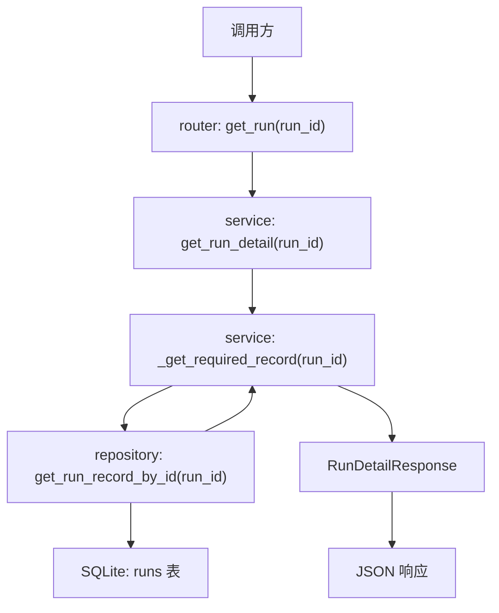

# Step 13：把 run detail 升级为 execution-ready 详情入口

## 这一步的目标

把 `GET /api/runs/{run_id}` 从“最小 run 详情”升级成“能承接 execution 层结果的统一详情入口”。

这一轮最重要的是把详情页语义固定下来：

- `run` 基本信息从哪里看
- Jenkins 回写后的执行状态从哪里看
- workflow 规格从哪里看
- artifact、KPI、detector 摘要从哪里挂进来

## 预期结果

这一轮做完后，系统应该具备下面这些可观察结果：

- `GET /api/runs/{run_id}` 返回统一详情对象
- 详情对象不仅包含最初的 run 基本字段
- 详情对象还能承接：
  - `workflow_spec`
  - `metadata`
  - `artifact_manifest`
  - `kpi_summary`
  - `detector_summary`
  - `jenkins_build_ref`
  - `started_at`
  - `finished_at`
- 后续 `automation-portal` 可以把这条接口直接作为 run detail 页主数据源

这一轮先不扩的内容包括：

- KPI 历史对比页
- timeline 可视化页
- 更复杂的筛选和聚合接口

## 这一步的代码设计

这一轮代码设计的关键，是让详情接口成为统一聚合入口：

- `router`
  - 继续暴露 `get_run(run_id)`
- `service`
  - 用 `get_run_detail(run_id)` 把数据库记录标准化成统一详情对象
  - 通过 `_get_required_record(run_id)` 处理“查不到即 404”
- `repository`
  - 保持按 `run_id` 查询单条记录
- `schema`
  - 用 `RunDetailResponse` 固定 execution-ready 详情字段集合

这一轮最关键的函数调用链是：

```text
get_run() -> get_run_detail() -> _get_required_record() -> get_run_record_by_id()
```

## 函数调用流程图



## 开发侧验收步骤（服务器侧执行）

### 1. 创建一条包含 workflow / KPI 参数的 run

```bash
curl -X POST http://127.0.0.1:8000/api/runs \
  -H "Content-Type: application/json" \
  -d '{
    "testline": "gnb-regression",
    "executor_type": "python_orchestrator",
    "workflow_name": "attach-handover-detach",
    "workflow_spec": {
      "name": "attach-handover-detach",
      "stages": [],
      "runtime_options": {},
      "portal_followups": {}
    },
    "enable_kpi_generator": true,
    "enable_kpi_anomaly_detector": true
  }'
```

### 2. 用 callback 给这条 run 回写执行结果

```bash
curl -X POST http://127.0.0.1:8000/api/runs/<run_id>/callbacks/jenkins \
  -H "Content-Type: application/json" \
  -d '{
    "status": "finished",
    "jenkins_build_ref": "gnb-kpi/123",
    "artifact_manifest": [],
    "kpi_summary": {"status": "generated"},
    "detector_summary": {"status": "completed"}
  }'
```

### 3. 查询统一详情

```bash
curl http://127.0.0.1:8000/api/runs/<run_id>
```

### 4. 确认详情中的关键字段

重点确认：

- `executor_type`
- `workflow_name`
- `workflow_spec`
- `artifact_manifest`
- `kpi_summary`
- `detector_summary`
- `jenkins_build_ref`
- `started_at / finished_at`

## 开发侧验收结果

- [ ] 详情接口已能作为统一详情入口
- [ ] workflow 规格和执行层摘要字段已能在同一响应里看到
- [ ] callback 写入后的结果可以直接在详情接口中查到
- [ ] 不存在的 `run_id` 会稳定返回 `404`
- [ ] 后续前端详情页已有稳定主数据源

## 测试侧验收步骤（服务器侧执行）

```bash
python -m pytest tests/test_runs.py
python -m pytest tests/test_runs.py --alluredir=allure-results
```

这一轮测试侧重点关注：

- 详情接口是否返回 execution-ready 字段集合
- callback 后详情接口是否同步反映更新结果
- 不存在的 `run_id` 是否稳定返回 `404`

## 测试侧验收结果

- [ ] pytest 已覆盖 execution-ready 详情主路径
- [ ] pytest 已覆盖 callback 后详情一致性
- [ ] pytest 已覆盖不存在 `run_id` 的错误路径
- [ ] `allure-results` 可正常产出

## 相关专题与测试文档

- [Testing Workflow](../guides/testing-workflow.md)
- [API 设计与调用链](../guides/api-design-and-flow.md)
- [Step 12：补齐 artifact / KPI / detector metadata 查询面](step-12-artifact-and-kpi-metadata-query-surface.md)
- [GNB KPI Regression Architecture](../../../overview/gnb-kpi-regression-architecture.md)
