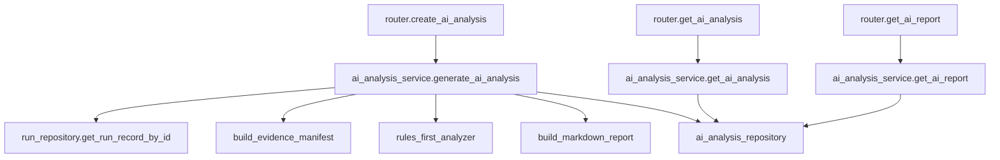
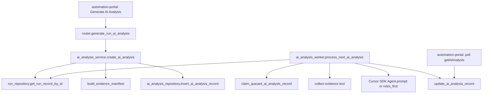

# Step 16：AI Analysis Contract

## 这一步的目标

这一步为 AI-Driven Intelligent Testing Platform 固定后端契约。

目标不是马上接入外部大模型，而是先让 `platform-api` 有稳定的数据结构和 API 边界，能够承接：

```text
AI Log Summary
AI RCA Assistant
AI Test Report Generator
```

## 预期结果

完成后，后续代码实现应具备：

```text
1. 可以对一个 run 触发 AI 分析。
2. 可以查询结构化 AI analysis result。
3. 可以查询适合页面展示 / 复制汇报的 AI report。
4. AI 结论包含 evidence、confidence、recommended actions。
5. AI 结果可以先由规则 + 模板生成，后续再替换为 LLM / RAG。
```

这一步先不做：

```text
AI 自动重跑 Jenkins。
AI 自动修改环境。
AI 自动关闭问题。
AI 自动生成最终 release 结论。
```

## 这一步的代码设计

建议后续新增文件：

```text
platform-api/app/schemas/ai_analysis.py
platform-api/app/services/ai_analysis_service.py
platform-api/app/repositories/ai_analysis_repository.py
```

建议后续扩展现有文件：

```text
platform-api/app/api/v1/router.py
platform-api/app/core/config.py
```

### Schema 设计

核心响应对象：

```text
AIAnalysisResult
```

字段：

```text
run_id:
  被分析的 run。

analysis_id:
  本次 AI 分析记录 ID。

analysis_status:
  queued / running / completed / failed。

analysis_version:
  当前规则 / prompt / 模型版本，例如 ai-mvp-v1。

generated_at:
  生成时间。

input_refs:
  本次分析读取了哪些证据。

log_summary:
  日志摘要。

root_cause:
  RCA 结果。

test_report:
  测试报告。

quality_signals:
  failure_signature、stability_label、release_risk 等。
```

### EvidenceRef

```json
{
  "kind": "runner_result",
  "label": "Python KPI Runner Result",
  "path": "artifacts/python-kpi-runner-result.json",
  "url": null,
  "available": true,
  "metadata": {
    "source": "artifact_manifest"
  }
}
```

### LogSummary

```json
{
  "one_line_summary": "Prepare Workspace failed because robotws checkout failed.",
  "failed_stage": "Prepare Workspace",
  "failed_command": "bash artifacts/checkout-sources.sh",
  "key_errors": [
    "Permission denied (publickey)"
  ],
  "impact": "Runner did not start; no KPI result was generated.",
  "next_step": "Check robotws credentials and Jenkins sshagent binding."
}
```

### RootCauseAnalysis

```json
{
  "category": "scm_credentials",
  "confidence": "high",
  "symptom": "Git checkout failed in Prepare Workspace.",
  "evidence": [
    {
      "source": "jenkins_console",
      "excerpt": "Permission denied (publickey)",
      "stage": "Prepare Workspace",
      "artifact_path": null
    }
  ],
  "recommended_actions": [
    "Verify ROBOTWS_CREDENTIALS_ID or global ROBOTWS credentials.",
    "Confirm Jenkins agent can access GitLab."
  ],
  "needs_human_confirmation": true
}
```

### AITestReport

```json
{
  "title": "KPI Runner Dry Run Report",
  "status": "failed",
  "summary_markdown": "### Summary\nPrepare Workspace failed before runner execution.",
  "sections": [
    {
      "title": "Execution Context",
      "content_markdown": "- testline: 7_5_UTE5G402T813\n- build: SBTS26R1.DRYRUN.001"
    }
  ]
}
```

### QualitySignals

```json
{
  "failure_signature": "python_orchestrator|Prepare Workspace|scm_credentials|permission_denied_publickey|T813",
  "stability_label": "environment_failure",
  "release_risk": "unknown"
}
```

## API 设计

### 1. 触发 AI 分析

```text
POST /api/runs/{run_id}/ai-analysis
```

请求体：

```json
{
  "refresh": false,
  "analysis_mode": "rules_first",
  "include_console": true,
  "include_artifacts": true
}
```

响应：

```json
{
  "run_id": "run-20260522123000000",
  "analysis_id": "ai-run-20260522123100000",
  "analysis_status": "completed",
  "message": "AI analysis generated."
}
```

### 2. 查询 AI 分析结果

```text
GET /api/runs/{run_id}/ai-analysis
```

响应：

```text
AIAnalysisResult
```

### 3. 查询 AI 报告

```text
GET /api/runs/{run_id}/ai-report
```

响应：

```json
{
  "run_id": "run-20260522123000000",
  "report_format": "markdown",
  "content": "### Summary\n...",
  "generated_at": "2026-05-22T12:31:00+08:00"
}
```

## 函数调用流程图



## 数据存储设计

第一期建议新增 SQLite 表：

```sql
CREATE TABLE IF NOT EXISTS ai_analysis (
    analysis_id TEXT PRIMARY KEY,
    run_id TEXT NOT NULL,
    analysis_status TEXT NOT NULL,
    analysis_version TEXT NOT NULL,
    result_json TEXT NOT NULL DEFAULT '{}',
    report_markdown TEXT NOT NULL DEFAULT '',
    created_at TEXT NOT NULL,
    updated_at TEXT NOT NULL
);
```

后续可再加：

```text
failure_signature_index
similar_failure_records
knowledge_base_documents
embedding_vector_store
```

## 第一版规则引擎建议

第一版不依赖外部 LLM，可以先做可解释规则：

```text
1. 如果没有 artifacts，且 console 有 waiting executor：
   category = jenkins_agent

2. 如果 console 有 No such file or directory 且缺少 request JSON：
   category = jenkins_pipeline

3. 如果 console 有 Permission denied 或 publickey：
   category = scm_credentials

4. 如果 runner result 存在且 status=failed：
   优先从 timeline / results 中提取 failed item。

5. 如果 kpi_summary / detector_summary 存在异常：
   category = kpi_generator 或 kpi_detector。
```

LLM 后续只做：

```text
解释规则结果。
压缩长日志。
生成自然语言报告。
根据历史案例补充建议。
```

## 本次实现记录（2026-06-10）

本次已把 Step 16 从契约设计推进到第一期可用代码面。

已落地的能力：

```text
1. platform-api 新增 AI analysis schema。
2. SQLite 新增 ai_analysis 表，和 runs 表分开保存。
3. 新增 POST /api/runs/{run_id}/ai-analysis，用于创建 queued 分析任务。
4. 新增 GET /api/runs/{run_id}/ai-analysis，用于查询结构化分析结果。
5. 新增 GET /api/runs/{run_id}/ai-report，用于返回 Markdown 报告。
6. 新增 AI analysis worker，负责 claim queued 任务、收集 evidence、调用 Cursor SDK 或 rules_first 分析、写回 completed / failed。
```

### 本次改动文件

```text
platform-api/app/schemas/ai_analysis.py
platform-api/app/repositories/ai_analysis_repository.py
platform-api/app/services/ai_analysis_service.py
platform-api/app/services/ai_analysis_worker.py
platform-api/app/api/v1/router.py
platform-api/app/core/config.py
platform-api/app/main.py
platform-api/requirements.txt
platform-api/tests/test_ai_analysis.py
```

### 当前调用链



### 关键字段

```text
analysis_id:
  AI 分析任务 ID，格式为 ai-<run_id>-<timestamp>。

analysis_status:
  queued / running / completed / failed。

analysis_mode:
  cursor_sdk 或 rules_first。portal 第一版默认 cursor_sdk，测试覆盖 rules_first。

request_json:
  保存 include_console / include_artifacts / refresh / analysis_mode。

result_json:
  保存结构化 AIAnalysisResult。

report_markdown:
  保存可复制的 Markdown 报告。

error_message:
  worker 失败时保存失败原因。
```

### 服务器验证命令

后端 API 和 worker 验证由用户在服务器执行：

```bash
cd /path/to/jenkins_robotframework/platform-api
python -m pytest tests/test_ai_analysis.py

python -m uvicorn app.main:app --host 127.0.0.1 --port 8000

curl -s -X POST http://127.0.0.1:8000/api/runs/<RUN_ID>/ai-analysis \
  -H "Content-Type: application/json" \
  -d '{"refresh": true, "analysis_mode": "cursor_sdk", "include_console": true, "include_artifacts": true}'

curl -s http://127.0.0.1:8000/api/runs/<RUN_ID>/ai-analysis
curl -s http://127.0.0.1:8000/api/runs/<RUN_ID>/ai-report
```

worker 验证命令：

```bash
cd /path/to/jenkins_robotframework/platform-api
export CURSOR_API_KEY="cursor api key from Cursor dashboard"
python -m app.services.ai_analysis_worker
```

预期结果：

```text
1. POST 返回 analysis_id 和 queued。
2. worker 处理后 GET /ai-analysis 返回 completed 或 failed。
3. completed 时能看到 input_refs / log_summary / root_cause / test_report / quality_signals。
4. GET /ai-report 返回 Markdown content。
```

常见失败判断：

```text
GET /ai-analysis 返回 404:
  说明该 run 还没有生成 AI analysis，先点 Generate 或调用 POST。

POST /ai-analysis 返回 404:
  run_id 不存在，先查 GET /api/runs/{run_id}。

analysis_status=failed 且提示 CURSOR_API_KEY:
  worker 环境没有配置 Cursor API Key。

analysis_status=failed 且提示 cursor-sdk:
  platform-api 虚拟环境未安装 cursor-sdk，重新 pip install -r requirements.txt。

RCA evidence 很少:
  Jenkins artifact manifest 没有可读 path/url，或 Jenkins consoleText 不能访问。
```

## 开发侧验收步骤（服务器侧执行）

后续实现代码后，由用户在服务器执行：

```bash
curl -s http://127.0.0.1:8000/api/runs/<RUN_ID>/ai-analysis

curl -s -X POST http://127.0.0.1:8000/api/runs/<RUN_ID>/ai-analysis \
  -H "Content-Type: application/json" \
  -d '{"refresh": true, "analysis_mode": "rules_first", "include_console": true, "include_artifacts": true}'

curl -s http://127.0.0.1:8000/api/runs/<RUN_ID>/ai-report
```

预期结果：

```text
GET 在没有分析结果时返回 404 或明确的 not generated。
POST 后返回 analysis_id 和 completed / failed 状态。
GET /ai-report 返回 markdown content。
```

## 测试侧验收步骤（服务器侧执行）

后续实现代码后，由用户执行：

```bash
cd /path/to/jenkins_robotframework/platform-api
python -m pytest tests/test_ai_analysis.py
```

预期结果：

```text
覆盖成功 run、失败 run、缺少 artifact、runner result failed、console pattern 命中等场景。
```

## 常见失败判断

```text
POST /ai-analysis 404:
  run_id 不存在，先查 /api/runs/{run_id}。

POST /ai-analysis 500:
  evidence 读取或 JSON 解析失败，需要检查 artifact manifest。

AI 结论没有 failed_stage:
  说明缺少 console 或 runner timeline，需要补证据源。

报告为空:
  说明 AIAnalysisResult 已生成但 report builder 没有处理对应状态。
```

## 相关专题与测试文档

```text
docs/overview/ai-driven-intelligent-testing-platform.md
docs/modules/jenkins-integration/guides/ai-evidence-collection.md
docs/modules/automation-portal/steps/step-02-ai-run-detail-experience.md
```

## 复盘问题

```text
1. 为什么第一版 AI analysis 可以先用规则 + 模板，而不是一开始就接 LLM？
2. AIAnalysisResult 为什么必须保存 evidence 和 confidence？
3. 为什么 AI report 应该从结构化 result 生成，而不是直接让模型自由写？
```
