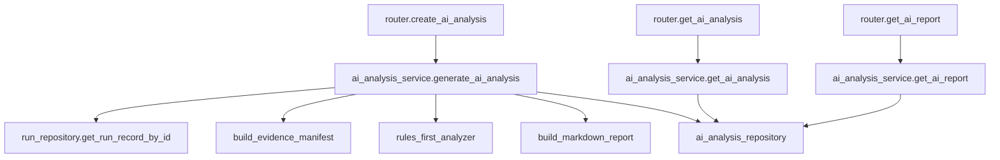

# Step 16：AI Analysis Contract

## 这一步的目标

这一步为 AI-Driven Intelligent Testing Platform 固定后端契约。

目标不是马上接入外部大模型，而是先让 `platform-api` 有稳定的数据结构和 API 边界，能够承接：

```text
AI Log Summary
AI RCA Assistant
AI Test Report Generator
```

## 预期结果

完成后，后续代码实现应具备：

```text
1. 可以对一个 run 触发 AI 分析。
2. 可以查询结构化 AI analysis result。
3. 可以查询适合页面展示 / 复制汇报的 AI report。
4. AI 结论包含 evidence、confidence、recommended actions。
5. AI 结果可以先由规则 + 模板生成，后续再替换为 LLM / RAG。
```

这一步先不做：

```text
AI 自动重跑 Jenkins。
AI 自动修改环境。
AI 自动关闭问题。
AI 自动生成最终 release 结论。
```

## 这一步的代码设计

建议后续新增文件：

```text
platform-api/app/schemas/ai_analysis.py
platform-api/app/services/ai_analysis_service.py
platform-api/app/repositories/ai_analysis_repository.py
```

建议后续扩展现有文件：

```text
platform-api/app/api/v1/router.py
platform-api/app/core/config.py
```

### Schema 设计

核心响应对象：

```text
AIAnalysisResult
```

字段：

```text
run_id:
  被分析的 run。

analysis_id:
  本次 AI 分析记录 ID。

analysis_status:
  queued / running / completed / failed。

analysis_version:
  当前规则 / prompt / 模型版本，例如 ai-mvp-v1。

generated_at:
  生成时间。

input_refs:
  本次分析读取了哪些证据。

log_summary:
  日志摘要。

root_cause:
  RCA 结果。

test_report:
  测试报告。

quality_signals:
  failure_signature、stability_label、release_risk 等。
```

### EvidenceRef

```json
{
  "kind": "runner_result",
  "label": "Python KPI Runner Result",
  "path": "artifacts/python-kpi-runner-result.json",
  "url": null,
  "available": true,
  "metadata": {
    "source": "artifact_manifest"
  }
}
```

### LogSummary

```json
{
  "one_line_summary": "Prepare Workspace failed because robotws checkout failed.",
  "failed_stage": "Prepare Workspace",
  "failed_command": "bash artifacts/checkout-sources.sh",
  "key_errors": [
    "Permission denied (publickey)"
  ],
  "impact": "Runner did not start; no KPI result was generated.",
  "next_step": "Check robotws credentials and Jenkins sshagent binding."
}
```

### RootCauseAnalysis

```json
{
  "category": "scm_credentials",
  "confidence": "high",
  "symptom": "Git checkout failed in Prepare Workspace.",
  "evidence": [
    {
      "source": "jenkins_console",
      "excerpt": "Permission denied (publickey)",
      "stage": "Prepare Workspace",
      "artifact_path": null
    }
  ],
  "recommended_actions": [
    "Verify ROBOTWS_CREDENTIALS_ID or global ROBOTWS credentials.",
    "Confirm Jenkins agent can access GitLab."
  ],
  "needs_human_confirmation": true
}
```

### AITestReport

```json
{
  "title": "KPI Runner Dry Run Report",
  "status": "failed",
  "summary_markdown": "### Summary\nPrepare Workspace failed before runner execution.",
  "sections": [
    {
      "title": "Execution Context",
      "content_markdown": "- testline: 7_5_UTE5G402T813\n- build: SBTS26R1.DRYRUN.001"
    }
  ]
}
```

### QualitySignals

```json
{
  "failure_signature": "python_orchestrator|Prepare Workspace|scm_credentials|permission_denied_publickey|T813",
  "stability_label": "environment_failure",
  "release_risk": "unknown"
}
```

## API 设计

### 1. 触发 AI 分析

```text
POST /api/runs/{run_id}/ai-analysis
```

请求体：

```json
{
  "refresh": false,
  "analysis_mode": "rules_first",
  "include_console": true,
  "include_artifacts": true
}
```

响应：

```json
{
  "run_id": "run-20260522123000000",
  "analysis_id": "ai-run-20260522123100000",
  "analysis_status": "completed",
  "message": "AI analysis generated."
}
```

### 2. 查询 AI 分析结果

```text
GET /api/runs/{run_id}/ai-analysis
```

响应：

```text
AIAnalysisResult
```

### 3. 查询 AI 报告

```text
GET /api/runs/{run_id}/ai-report
```

响应：

```json
{
  "run_id": "run-20260522123000000",
  "report_format": "markdown",
  "content": "### Summary\n...",
  "generated_at": "2026-05-22T12:31:00+08:00"
}
```

## 函数调用流程图



## 数据存储设计

第一期建议新增 SQLite 表：

```sql
CREATE TABLE IF NOT EXISTS ai_analysis (
    analysis_id TEXT PRIMARY KEY,
    run_id TEXT NOT NULL,
    analysis_status TEXT NOT NULL,
    analysis_version TEXT NOT NULL,
    result_json TEXT NOT NULL DEFAULT '{}',
    report_markdown TEXT NOT NULL DEFAULT '',
    created_at TEXT NOT NULL,
    updated_at TEXT NOT NULL
);
```

后续可再加：

```text
failure_signature_index
similar_failure_records
knowledge_base_documents
embedding_vector_store
```

## 第一版规则引擎建议

第一版不依赖外部 LLM，可以先做可解释规则：

```text
1. 如果没有 artifacts，且 console 有 waiting executor：
   category = jenkins_agent

2. 如果 console 有 No such file or directory 且缺少 request JSON：
   category = jenkins_pipeline

3. 如果 console 有 Permission denied 或 publickey：
   category = scm_credentials

4. 如果 runner result 存在且 status=failed：
   优先从 timeline / results 中提取 failed item。

5. 如果 kpi_summary / detector_summary 存在异常：
   category = kpi_generator 或 kpi_detector。
```

LLM 后续只做：

```text
解释规则结果。
压缩长日志。
生成自然语言报告。
根据历史案例补充建议。
```

## 本次实现记录（2026-06-10）

本次已把 Step 16 从契约设计推进到第一期可用代码面。

已落地的能力：

```text
1. platform-api 新增 AI analysis schema。
2. SQLite 新增 ai_analysis 表，和 runs 表分开保存。
3. 新增 POST /api/runs/{run_id}/ai-analysis，用于创建 queued 分析任务。
4. 新增 GET /api/runs/{run_id}/ai-analysis，用于查询结构化分析结果。
5. 新增 GET /api/runs/{run_id}/ai-report，用于返回 Markdown 报告。
6. 新增 AI analysis worker，负责 claim queued 任务、收集 evidence、调用 Cursor SDK 或 rules_first 分析、写回 completed / failed。
```

### 本次改动文件

```text
platform-api/app/schemas/ai_analysis.py
platform-api/app/repositories/ai_analysis_repository.py
platform-api/app/services/ai_analysis_service.py
platform-api/app/services/ai_analysis_worker.py
platform-api/app/api/v1/router.py
platform-api/app/core/config.py
platform-api/app/main.py
platform-api/requirements.txt
platform-api/tests/test_ai_analysis.py
```

### 当前调用链


### 关键字段

```text
analysis_id:
  AI 分析任务 ID，格式为 ai-<run_id>-<timestamp>。

analysis_status:
  queued / running / completed / failed。

analysis_mode:
  rules_first 或 cursor_sdk。当前生产默认 rules_first；cursor_sdk 仅在 Cursor Cloud Agents 权限验证通过后启用。

request_json:
  保存 include_console / include_artifacts / refresh / analysis_mode。

result_json:
  保存结构化 AIAnalysisResult。

report_markdown:
  保存可复制的 Markdown 报告。

error_message:
  worker 失败时保存失败原因。
```

### 服务器验证命令

后端 API 和 worker 验证由用户在服务器执行：

```bash
cd /path/to/jenkins_robotframework/platform-api
python -m pytest tests/test_ai_analysis.py

python -m uvicorn app.main:app --host 127.0.0.1 --port 8000

curl -s -X POST http://127.0.0.1:8000/api/runs/<RUN_ID>/ai-analysis \
  -H "Content-Type: application/json" \
  -d '{"refresh": true, "analysis_mode": "rules_first", "include_console": true, "include_artifacts": true}'

curl -s http://127.0.0.1:8000/api/runs/<RUN_ID>/ai-analysis
curl -s http://127.0.0.1:8000/api/runs/<RUN_ID>/ai-report
```

worker 验证命令：

```bash
sudo cp /opt/jenkins_robotframework/deploy/systemd/platform-api-ai-worker.service \
  /etc/systemd/system/platform-api-ai-worker.service

sudo systemctl daemon-reload
sudo systemctl enable platform-api-ai-worker
sudo systemctl restart platform-api-ai-worker
sudo systemctl status platform-api-ai-worker --no-pager
```

说明：`rules_first` 不需要 `CURSOR_API_KEY`。只有显式使用 `analysis_mode=cursor_sdk` 时才需要 Cursor Cloud Agents API 权限。

worker 日志：

```bash
sudo journalctl -u platform-api-ai-worker -n 100 --no-pager
sudo journalctl -u platform-api-ai-worker -f
```

预期结果：

```text
1. POST 返回 analysis_id 和 queued。
2. worker 处理后 GET /ai-analysis 返回 completed 或 failed。
3. completed 时能看到 input_refs / log_summary / root_cause / test_report / quality_signals。
4. GET /ai-report 返回 Markdown content。
```

常见失败判断：

```text
GET /ai-analysis 返回 404:
  说明该 run 还没有生成 AI analysis，先点 Generate 或调用 POST。

POST /ai-analysis 返回 404:
  run_id 不存在，先查 GET /api/runs/{run_id}。

analysis_status 一直 queued:
  platform-api-ai-worker 没启动，或 worker 没连到同一个 RUNS_DB_PATH。

analysis_status=failed 且提示 Cursor / 403:
  请求走了 cursor_sdk，不是当前默认 rules_first。先确认 Portal 或 curl 请求体里的 analysis_mode。

RCA evidence 很少:
  Jenkins artifact manifest 没有可读 path/url，或 Jenkins consoleText 不能访问。
```

### Cursor SDK 验证进度（2026-06-10）

今天已在服务器和 Windows 本机做 Cursor Python SDK smoke 验证，结论是：`cursor_sdk` 模式已经有代码骨架，但当前还没有验证出可用方案，不能作为默认可用能力。

已验证成功：

```text
1. 服务器 platform-api .venv 可以安装 cursor-sdk==0.1.7。
2. Python import cursor_sdk 成功。
3. CURSOR_API_KEY 已能从环境变量读取，key prefix 确认为 crsr_dac。
4. 服务器请求能进入 cursor_sdk HTTP 调用链。
```

已验证失败：

```text
1. Linux 服务器 Python 3.13 + cursor-sdk==0.1.7:
   Cursor.models.list(api_key=...) 返回 InternalServerError。

2. Linux 服务器取消 HTTP_PROXY / HTTPS_PROXY 后:
   Cursor.models.list(api_key=...) 仍返回 500。

3. Linux 服务器 Agent.prompt(...):
   CreateAgent 阶段返回 InternalServerError。

4. Windows 本机 Python 3.13:
   Cursor.models.list 和 Agent.prompt 都在本地 default client / bridge 层报 WinError 10038。
```

关键错误信息：

```text
Linux:
  cursor_sdk.errors.InternalServerError:
  internal error, code=internal, status=500, request_id=None
  is_retryable=False
  retry_after=None

Windows:
  OSError: [WinError 10038]
  An operation was attempted on something that is not a socket
```

阶段判断：

```text
1. Linux 上不是代理导致，因为取消代理后仍然 500。
2. 显式传 api_key 后仍然 500，说明不是默认 client 未读取 key。
3. Windows 上连 models.list 都触发 bridge/socket 错误，像是 Python 3.13 + Windows bridge 兼容问题。
4. 当前不能把 cursor_sdk mode 视为已验证能力。
5. 当前可验证闭环仍然是 rules_first mode。
```

明天优先继续验证：

```text
1. 在服务器上用 TypeScript @cursor/sdk 验证 Cursor.models.list。
2. 如果 TypeScript models.list 成功，再验证 TypeScript Agent.prompt。
3. 如果 TypeScript Agent.prompt 成功，考虑把后端 worker 调 Cursor 的实现改成 Python worker -> Node sidecar/CLI。
4. 如果 TypeScript 也失败，再回到 API Key / Cursor Dashboard 权限 / SDK beta 后端问题排查。
```

### TypeScript @cursor/sdk 验证进度（2026-06-11）

今天继续在服务器 `/tmp/cursor-sdk-ts-smoke` 验证 TypeScript `@cursor/sdk`。

已验证成功：

```text
1. npm install @cursor/sdk 成功。
2. 显式配置 undici ProxyAgent 后，Cursor.models.list 可成功返回模型列表。
3. 当前 CURSOR_API_KEY、服务器代理、TypeScript SDK 的基础 REST API 链路可用。
4. 可用模型列表里确认存在 gemini-3.5-flash 等模型。
```

已验证失败：

```text
1. 未显式配置 undici ProxyAgent 时：
   Cursor.models.list 报 Network request failed / UND_ERR_CONNECT_TIMEOUT。

2. TypeScript local Agent.prompt:
   本地 agent bridge 走 HTTP/2 直连 Cursor 后端公网 IP，未被 undici ProxyAgent 覆盖。
   结果为 ConnectError [unavailable] / ETIMEDOUT。

3. TypeScript cloud Agent.prompt 第一次尝试:
   cloud.repos 传了字符串数组，接口返回 400 validation_error。
   修正后确认 cloud.repos 需要对象数组：
   repos: [{ url: "https://github.com/stella555359/jenkins_robotframework", startingRef: "main" }]

4. TypeScript cloud Agent.prompt 修正 repo 参数后:
   请求已打到 POST /v1/agents，但返回 403 feature_unavailable / unauthenticated。
```

关键错误信息：

```text
TypeScript models.list without ProxyAgent:
  NetworkError: Network request failed
  cause: UND_ERR_CONNECT_TIMEOUT
  endpoint: GET /v1/models
  operation: Cursor.models.list
  isRetryable=true

TypeScript local Agent.prompt:
  ConnectError: [unavailable]
  cause: ETIMEDOUT to Cursor backend public IPs

TypeScript cloud Agent.prompt:
  status=403
  code=feature_unavailable
  message=[feature_unavailable] [unauthenticated] Error
  endpoint=POST /v1/agents
  operation=agent.send
  isRetryable=false
```

当前阶段判断：

```text
1. TypeScript models.list 已验证通过，说明 API Key、代理和基础模型查询能力可用。
2. TypeScript local Agent.prompt 暂不可用，主要阻塞在本地 bridge 的 HTTP/2 直连不走代理。
3. TypeScript cloud Agent.prompt 暂不可用，主要阻塞在 Cursor Dashboard / API Key / Cloud Agent 功能权限。
4. Python cursor-sdk 仍不可用。
5. 当前项目默认可验证路径仍是 rules_first。
6. cursor_sdk / @cursor/sdk Agent.prompt 只能保留为实验能力，不能作为当前生产默认依赖。
```

下一步继续排查 Cursor Dashboard / 权限：

```text
1. 确认当前 key 是 Cursor Dashboard 里的 User API Key，而不是 Team Admin API Key。
2. 检查 Dashboard 的 Cloud Agents 是否对当前账号可用。
3. 检查 Cloud Agent 默认仓库、base branch、Create PR 等设置是否正常。
4. 尝试在 Dashboard 页面手动创建一个 Cloud Agent 任务，验证账号是否具备 Cloud Agent 能力。
5. 如 Dashboard 手动任务也不可用，需要换 key / 换账号 / 开通 Cloud Agent beta 或联系 Cursor 支持。
```

### Cursor SDK Smoke 完整命令记录（2026-06-10 / 2026-06-11）

本节保留完整验证命令，后续恢复时不用回翻聊天记录。

#### 1. 服务器 Python SDK 环境准备

```bash
cd /opt/jenkins_robotframework/platform-api
source .venv/bin/activate

export CURSOR_API_KEY="crsr_..."

export HTTP_PROXY=http://10.144.1.10:8080
export HTTPS_PROXY=http://10.144.1.10:8080
export http_proxy=$HTTP_PROXY
export https_proxy=$HTTPS_PROXY
export NO_PROXY=localhost,127.0.0.1,::1,0.0.0.0,10.71.210.104
export no_proxy=$NO_PROXY

python -m pip install -r requirements.txt
```

#### 2. 服务器 Python SDK models.list 验证

```bash
python - <<'PY'
import os
from cursor_sdk import Cursor

try:
    print("key_prefix:", os.environ["CURSOR_API_KEY"][:8])
    models = Cursor.models.list(api_key=os.environ["CURSOR_API_KEY"])
    print(models)
except Exception as e:
    print("type:", type(e))
    print("repr:", repr(e))
    print("message:", getattr(e, "message", None))
    print("status_code:", getattr(e, "status_code", None))
    print("is_retryable:", getattr(e, "is_retryable", None))
    print("retry_after:", getattr(e, "retry_after", None))
PY
```

本次结果：

```text
key_prefix: crsr_dac
InternalServerError('internal error', code='internal', status=500, request_id=None)
status_code=500
is_retryable=False
retry_after=None
```

#### 3. 服务器 Python SDK Agent.prompt 验证

```bash
python - <<'PY'
import os
from cursor_sdk import Agent, AgentOptions, LocalAgentOptions

try:
    result = Agent.prompt(
        'Return only this JSON: {"ok": true, "message": "cursor sdk works"}',
        AgentOptions(
            api_key=os.environ["CURSOR_API_KEY"],
            model="auto",
            local=LocalAgentOptions(cwd="."),
        ),
    )
    print("status:", result.status)
    print("result:", result.result)
except Exception as e:
    print("type:", type(e))
    print("repr:", repr(e))
    print("message:", getattr(e, "message", None))
    print("status_code:", getattr(e, "status_code", None))
    print("is_retryable:", getattr(e, "is_retryable", None))
    print("retry_after:", getattr(e, "retry_after", None))
PY
```

本次结果：

```text
CreateAgent 阶段返回 InternalServerError:
internal error, code=internal, status=500, request_id=None
```

#### 4. 服务器取消代理后的 Python SDK 验证

```bash
unset HTTP_PROXY HTTPS_PROXY http_proxy https_proxy

python - <<'PY'
import os
from cursor_sdk import Cursor

try:
    print(Cursor.models.list(api_key=os.environ["CURSOR_API_KEY"]))
except Exception as e:
    print("type:", type(e))
    print("repr:", repr(e))
    print("status_code:", getattr(e, "status_code", None))
    print("is_retryable:", getattr(e, "is_retryable", None))
PY
```

本次结果：

```text
取消代理后仍然 500。
因此 Linux Python SDK 失败不是由 HTTP_PROXY / HTTPS_PROXY 直接导致。
```

#### 5. Windows Python SDK models.list 验证

在 Windows PowerShell 执行：

```powershell
$env:CURSOR_API_KEY="crsr_..."

@'
import os
from cursor_sdk import Cursor

try:
    print(Cursor.models.list(api_key=os.environ["CURSOR_API_KEY"]))
except Exception as e:
    print("type:", type(e))
    print("repr:", repr(e))
    print("status_code:", getattr(e, "status_code", None))
    print("is_retryable:", getattr(e, "is_retryable", None))
'@ | C:\Users\stlin\Python313\python.exe
```

本次结果：

```text
OSError(10038, 'An operation was attempted on something that is not a socket', None, 10038, None)
```

#### 6. Windows Python SDK Agent.prompt 验证

```powershell
$env:CURSOR_API_KEY="crsr_..."

@'
import os
from cursor_sdk import Agent, AgentOptions, LocalAgentOptions

result = Agent.prompt(
    "Reply with exactly: SDK OK",
    AgentOptions(
        api_key=os.environ["CURSOR_API_KEY"],
        model="composer-2.5",
        local=LocalAgentOptions(cwd="."),
    ),
)

print("status:", result.status)
print("result:", result.result)
'@ | C:\Users\stlin\Python313\python.exe
```

本次结果：

```text
OSError: [WinError 10038]
发生在本地 Bridge.launch / _read_discovery 阶段。
```

#### 7. 服务器 TypeScript SDK 环境准备

```bash
cd /opt/jenkins_robotframework/platform-api
source .venv/bin/activate

export CURSOR_API_KEY="crsr_..."

export HTTP_PROXY=http://10.144.1.10:8080
export HTTPS_PROXY=http://10.144.1.10:8080
export http_proxy=$HTTP_PROXY
export https_proxy=$HTTPS_PROXY
export NO_PROXY=localhost,127.0.0.1,::1,0.0.0.0,10.71.210.104
export no_proxy=$NO_PROXY

rm -rf /tmp/cursor-sdk-ts-smoke
mkdir -p /tmp/cursor-sdk-ts-smoke
cd /tmp/cursor-sdk-ts-smoke

npm init -y
npm install @cursor/sdk undici
```

#### 8. TypeScript SDK models.list 未配置 ProxyAgent 的验证

```bash
node --input-type=module <<'JS'
import { Cursor } from "@cursor/sdk";

console.log("key_prefix:", process.env.CURSOR_API_KEY?.slice(0, 8));

try {
  const models = await Cursor.models.list({
    apiKey: process.env.CURSOR_API_KEY,
  });

  console.log("MODELS_LIST_OK");
  console.log(JSON.stringify(models, null, 2));
} catch (err) {
  console.error("MODELS_LIST_FAILED");
  console.error("type:", err?.constructor?.name);
  console.error("message:", err?.message);
  console.error("status:", err?.status);
  console.error("statusCode:", err?.statusCode);
  console.error("isRetryable:", err?.isRetryable);
  console.error("retryAfter:", err?.retryAfter);
  console.error("requestId:", err?.requestId);
  console.error("endpoint:", err?.endpoint);
  console.error("operation:", err?.operation);
  console.error(err);
  process.exit(1);
}
JS
```

本次结果：

```text
Network request failed
UND_ERR_CONNECT_TIMEOUT
endpoint=GET /v1/models
operation=Cursor.models.list
isRetryable=true
```

判断：

```text
Node fetch / undici 默认没有自动使用 shell HTTP_PROXY / HTTPS_PROXY。
```

#### 9. TypeScript SDK models.list 显式 ProxyAgent 验证

```bash
node --input-type=module <<'JS'
import { setGlobalDispatcher, ProxyAgent } from "undici";

const proxy = process.env.HTTPS_PROXY || process.env.HTTP_PROXY || process.env.https_proxy || process.env.http_proxy;
console.log("proxy:", proxy || "<empty>");
console.log("key_prefix:", process.env.CURSOR_API_KEY?.slice(0, 8));

if (proxy) {
  setGlobalDispatcher(new ProxyAgent(proxy));
}

const { Cursor } = await import("@cursor/sdk");

try {
  const models = await Cursor.models.list({
    apiKey: process.env.CURSOR_API_KEY,
  });

  console.log("MODELS_LIST_OK");
  console.log(JSON.stringify(models, null, 2));
} catch (err) {
  console.error("MODELS_LIST_FAILED");
  console.error("type:", err?.constructor?.name);
  console.error("message:", err?.message);
  console.error("status:", err?.status);
  console.error("statusCode:", err?.statusCode);
  console.error("isRetryable:", err?.isRetryable);
  console.error("retryAfter:", err?.retryAfter);
  console.error("requestId:", err?.requestId);
  console.error("endpoint:", err?.endpoint);
  console.error("operation:", err?.operation);
  console.error(err);
  process.exit(1);
}
JS
```

本次结果：

```text
MODELS_LIST_OK
可返回模型列表，包括 gemini-3.5-flash 等模型。
```

#### 10. TypeScript SDK local Agent.prompt 验证

```bash
node --input-type=module <<'JS'
import { setGlobalDispatcher, ProxyAgent } from "undici";

const proxy = process.env.HTTPS_PROXY || process.env.HTTP_PROXY || process.env.https_proxy || process.env.http_proxy;
console.log("proxy:", proxy || "<empty>");
console.log("key_prefix:", process.env.CURSOR_API_KEY?.slice(0, 8));

if (proxy) {
  setGlobalDispatcher(new ProxyAgent(proxy));
}

const { Agent } = await import("@cursor/sdk");

try {
  const result = await Agent.prompt("Reply with exactly: SDK OK", {
    apiKey: process.env.CURSOR_API_KEY,
    model: { id: "gemini-3.5-flash" },
    local: { cwd: "/opt/jenkins_robotframework" },
  });

  console.log("AGENT_PROMPT_OK");
  console.log("status:", result.status);
  console.log("result:", result.result);
} catch (err) {
  console.error("AGENT_PROMPT_FAILED");
  console.error("type:", err?.constructor?.name);
  console.error("message:", err?.message);
  console.error("status:", err?.status);
  console.error("statusCode:", err?.statusCode);
  console.error("isRetryable:", err?.isRetryable);
  console.error("retryAfter:", err?.retryAfter);
  console.error("requestId:", err?.requestId);
  console.error("endpoint:", err?.endpoint);
  console.error("operation:", err?.operation);
  console.error(err);
  process.exit(1);
}
JS
```

本次结果：

```text
Ripgrep path not configured.
随后 ConnectError [unavailable] / ETIMEDOUT。
本地 agent bridge 使用 HTTP/2 直连 Cursor 后端公网 IP，未被 undici ProxyAgent 覆盖。
```

#### 11. TypeScript SDK cloud Agent.prompt repo 参数错误验证

```bash
node --input-type=module <<'JS'
import { setGlobalDispatcher, ProxyAgent } from "undici";

const proxy = process.env.HTTPS_PROXY || process.env.HTTP_PROXY || process.env.https_proxy || process.env.http_proxy;
if (proxy) {
  setGlobalDispatcher(new ProxyAgent(proxy));
}

const { Agent } = await import("@cursor/sdk");

try {
  const result = await Agent.prompt("Reply with exactly: SDK OK", {
    apiKey: process.env.CURSOR_API_KEY,
    model: { id: "gemini-3.5-flash" },
    cloud: {
      repos: ["stella555359/jenkins_robotframework"],
    },
  });
  console.log(result);
} catch (err) {
  console.error("type:", err?.constructor?.name);
  console.error("message:", err?.message);
  console.error("status:", err?.status);
  console.error("endpoint:", err?.endpoint);
  console.error("operation:", err?.operation);
}
JS
```

本次结果：

```text
status=400
code=validation_error
message=[validation_error] Expected object, received string
endpoint=POST /v1/agents
operation=agent.send
```

修正结论：

```text
cloud.repos 必须是对象数组，而不是字符串数组。
```

#### 12. TypeScript SDK cloud Agent.prompt 修正 repo 参数后的验证

```bash
node --input-type=module <<'JS'
import { setGlobalDispatcher, ProxyAgent } from "undici";

const proxy = process.env.HTTPS_PROXY || process.env.HTTP_PROXY || process.env.https_proxy || process.env.http_proxy;
console.log("proxy:", proxy || "<empty>");
console.log("key_prefix:", process.env.CURSOR_API_KEY?.slice(0, 8));

if (proxy) {
  setGlobalDispatcher(new ProxyAgent(proxy));
}

const { Agent } = await import("@cursor/sdk");

try {
  const result = await Agent.prompt("Reply with exactly: SDK OK", {
    apiKey: process.env.CURSOR_API_KEY,
    model: { id: "gemini-3.5-flash" },
    cloud: {
      repos: [
        {
          url: "https://github.com/stella555359/jenkins_robotframework",
          startingRef: "main",
        },
      ],
    },
  });

  console.log("CLOUD_AGENT_PROMPT_OK");
  console.log("status:", result.status);
  console.log("result:", result.result);
  console.log("agentId:", result.agentId);
  console.log("runId:", result.id);
  console.log("git:", JSON.stringify(result.git, null, 2));
} catch (err) {
  console.error("CLOUD_AGENT_PROMPT_FAILED");
  console.error("type:", err?.constructor?.name);
  console.error("message:", err?.message);
  console.error("status:", err?.status);
  console.error("statusCode:", err?.statusCode);
  console.error("isRetryable:", err?.isRetryable);
  console.error("retryAfter:", err?.retryAfter);
  console.error("requestId:", err?.requestId);
  console.error("endpoint:", err?.endpoint);
  console.error("operation:", err?.operation);
  console.error(err);
  process.exit(1);
}
JS
```

本次结果：

```text
status=403
code=feature_unavailable
message=[feature_unavailable] [unauthenticated] Error
endpoint=POST /v1/agents
operation=agent.send
isRetryable=false
```

当前结论：

```text
TypeScript @cursor/sdk models.list 已验证通过。
TypeScript Agent.prompt 还没有通过。
local Agent.prompt 阻塞在代理 / HTTP2 直连。
cloud Agent.prompt 阻塞在 Cursor Dashboard / API Key / Cloud Agent 功能权限。
```

### REST 直调与 smoke 脚本（2026-06-11 实现记录）

worker 已从 Python `cursor-sdk` 改为 **Cursor Cloud Agents REST API** 直调：

```text
platform-api/app/services/cursor_rest_client.py
platform-api/scripts/cursor_api_smoke.py
docs/modules/platform-api/guides/cursor-background-api-inventory.md
```

集成路径选型：**方案 A REST 直调**（不再依赖 cursor-sdk / Node sidecar）。

核心调用链：

```text
ai_analysis_worker._invoke_cursor_rest()
  -> cursor_rest_client.prompt_cloud_no_repo()
  -> POST /v1/agents (no repos)
  -> GET /v1/agents/{id}/runs/{runId} 轮询至 FINISHED
  -> 解析 result JSON
```

#### 13. REST smoke：GET /v1/me

```bash
cd /opt/jenkins_robotframework/platform-api
source .venv/bin/activate
export CURSOR_API_KEY="crsr_..."
export HTTPS_PROXY=http://10.144.1.10:8080
export https_proxy=$HTTPS_PROXY
python scripts/cursor_api_smoke.py
```

或单独测：

```bash
python - <<'PY'
import os, json
from app.services.cursor_rest_client import get_me, CursorApiError
try:
    print(json.dumps(get_me(), indent=2))
except CursorApiError as e:
    print("FAILED", e.status_code, e.code, e)
PY
```

预期：返回 `apiKeyName`、`userEmail`（User API Key）或仅 `apiKeyName`（Service Account Key）。

#### 14. REST smoke：POST /v1/agents no-repo

smoke 脚本第 3 步即此验证。不传 `repos`，绕过 GitHub default branch 问题。

预期成功：

```text
agent_id=bc-...
run_id=run-...
final_status: FINISHED
result_preview: {"ok": true, ...}
```

预期失败（当前账号状态）：

```text
FAILED status=403 code=feature_unavailable
```

403 处理：见 `docs/modules/platform-api/guides/cursor-background-api-inventory.md` 中「联系 Cursor 支持」章节。

## 开发侧验收步骤（服务器侧执行）

后续实现代码后，由用户在服务器执行：

```bash
curl -s http://127.0.0.1:8000/api/runs/<RUN_ID>/ai-analysis

curl -s -X POST http://127.0.0.1:8000/api/runs/<RUN_ID>/ai-analysis \
  -H "Content-Type: application/json" \
  -d '{"refresh": true, "analysis_mode": "rules_first", "include_console": true, "include_artifacts": true}'

curl -s http://127.0.0.1:8000/api/runs/<RUN_ID>/ai-report
```

预期结果：

```text
GET 在没有分析结果时返回 404 或明确的 not generated。
POST 后返回 analysis_id 和 completed / failed 状态。
GET /ai-report 返回 markdown content。
```

## 测试侧验收步骤（服务器侧执行）

后续实现代码后，由用户执行：

```bash
cd /path/to/jenkins_robotframework/platform-api
python -m pytest tests/test_ai_analysis.py
```

预期结果：

```text
覆盖成功 run、失败 run、缺少 artifact、runner result failed、console pattern 命中等场景。
```

## 常见失败判断

```text
POST /ai-analysis 404:
  run_id 不存在，先查 /api/runs/{run_id}。

POST /ai-analysis 500:
  evidence 读取或 JSON 解析失败，需要检查 artifact manifest。

AI 结论没有 failed_stage:
  说明缺少 console 或 runner timeline，需要补证据源。

报告为空:
  说明 AIAnalysisResult 已生成但 report builder 没有处理对应状态。
```

## 相关专题与测试文档

```text
docs/overview/ai-driven-intelligent-testing-platform.md
docs/modules/jenkins-integration/guides/ai-evidence-collection.md
docs/modules/automation-portal/steps/step-02-ai-run-detail-experience.md
```

## 复盘问题

```text
1. 为什么第一版 AI analysis 可以先用规则 + 模板，而不是一开始就接 LLM？
2. AIAnalysisResult 为什么必须保存 evidence 和 confidence？
3. 为什么 AI report 应该从结构化 result 生成，而不是直接让模型自由写？
```
