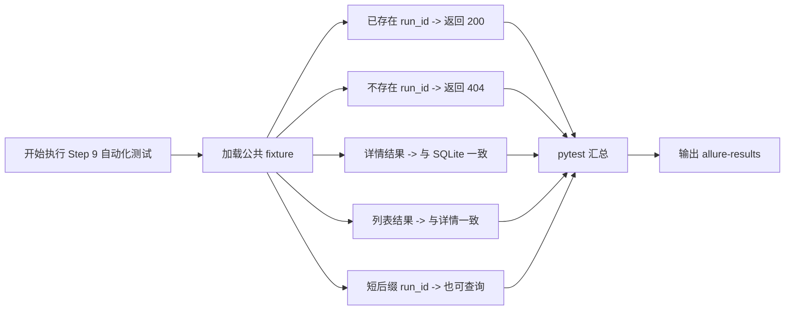

# Step 9 Test Automation

## 文档目标

这份文档只记录 `Step 9：GET /api/runs/{run_id}` 这一轮真正已经落地的自动化测试内容。

后面你 review 和去服务器执行时，优先看这份文档，不需要再反推：

- 哪些场景只是提过
- 哪些场景已经真的写成了 pytest
- 哪些场景这轮还没自动化，以及为什么

## 当前测试目标

围绕 `GET /api/runs/{run_id}`，当前这一轮测试自动化要覆盖 3 件事：

1. 接口契约正确
2. 返回数据真实，不是 fake data
3. 关键异常语义稳定

## 本轮已自动化场景

### 1. 已存在 `run_id` 时返回详情

目的：

- 确认 `GET /api/runs/{run_id}` 的 happy path 成立
- 返回 `200`
- 返回字段完整

对应测试：

- `test_get_run_detail_returns_expected_record`

### 2. 不存在 `run_id` 时返回 `404`

目的：

- 确认缺失资源时的错误语义稳定
- 避免被改成 `200 + {}`

对应测试：

- `test_get_run_detail_returns_404_for_missing_run`

### 3. 详情返回值与 SQLite 真实记录一致

目的：

- 确认详情接口不是“看起来查到了”，而是真的返回数据库里那条记录

对应测试：

- `test_get_run_detail_matches_persisted_record`

### 4. 列表接口与详情接口一致

目的：

- 确认同一条 run 在列表中能看到，在详情中也能按同一 `run_id` 查到
- 避免列表和详情出现语义分叉

对应测试：

- `test_run_list_and_detail_are_consistent`

### 5. 带短后缀的 `run_id` 也能查详情

目的：

- 确认详情接口不会偷偷依赖“无后缀 run_id”格式
- 覆盖当前 `run_id` 规则里的补序号场景

对应测试：

- `test_get_run_detail_supports_suffixed_run_ids`

## 当前 fixture / 工程配套

这轮自动化复用了下面这些工程能力：

- `tests/conftest.py`
- `client`
- `db_connection`
- `create_run_via_api`
- `fetch_run_record`

Allure 侧：

- `feature = Run API`
- `story = Run detail`
- `title = ...`

## 测试用例执行流程图

这张图回答的不是“业务代码怎么调用”，而是：

```text
Step 9 这一轮自动化测试在执行时，测试数据和测试场景是怎么串起来跑的。
```



每条用例怎么跑，拆开记最清楚：

- `test_get_run_detail_returns_expected_record`
  - 先创建一条普通 run
  - 再调用 `GET /api/runs/{run_id}`
  - 断言返回 `200`，并且详情字段完整

- `test_get_run_detail_returns_404_for_missing_run`
  - 不创建数据，直接查询一个不存在的 `run_id`
  - 断言返回 `404`

- `test_get_run_detail_matches_persisted_record`
  - 先创建一条真实持久化 run
  - 再从 SQLite 读取同一条记录
  - 然后调用详情接口
  - 断言接口返回值和数据库记录一致

- `test_run_list_and_detail_are_consistent`
  - 先创建一条 run
  - 先调用 `GET /api/runs`
  - 再调用 `GET /api/runs/{run_id}`
  - 断言同一个 `run_id` 在列表和详情里语义一致

- `test_get_run_detail_supports_suffixed_run_ids`
  - 先创建一条带短后缀的 `run_id`
  - 再调用详情接口
  - 断言该类 `run_id` 也能正常命中

最短记忆版：

```text
先加载公共 fixture，再分 5 条测试分支覆盖命中 / 未命中 / DB 一致性 / 列表一致性 / 特殊 run_id，最后统一输出 pytest 与 Allure 结果。
```

## 本轮已自动化文件

- `platform-api/tests/conftest.py`
- `platform-api/tests/test_runs.py`

## 本轮未自动化场景

### 1. 非法 `run_id` 格式校验

当前未自动化原因：

- 现在接口层还没有定义“run_id 格式非法时必须返回什么”
- 当前逻辑只区分“查到 / 查不到”

也就是说，现在像：

- `run-unknown`
- `abc`

都会归到“查不到”这一类，而不是“格式不合法”。

如果后面你想把 `run_id` 格式校验单独做实，再补对应自动化更合适。

### 2. 并发 / 性能场景

当前未自动化原因：

- 这已经超出当前最小接口闭环阶段
- 需要专门的并发测试工具或性能测试设计

当前阶段优先级不高。

### 3. Jenkins 回写后的详情一致性

当前未自动化原因：

- 现在还没有真正接 Jenkins / 回写链路
- 当前数据库里也还没有 Jenkins build、artifact、KPI 这些字段

所以这一类要等后续系统 / 集成阶段再自动化。

## 服务器执行方式

普通执行：

```bash
python -m pytest tests/test_health.py tests/test_runs.py
```

带 Allure 结果文件：

```bash
python -m pytest tests/test_health.py tests/test_runs.py --alluredir=allure-results
```

如果服务器已安装 Allure CLI：

```bash
allure serve allure-results
```

## Review 时建议重点看什么

这轮你 review 时，最值得重点看的不是“测试写没写”，而是：

1. 自动化场景是否真的覆盖了 Step 9 的核心风险
2. 哪些场景现在还只是风险提示，没有落成代码
3. 未自动化原因是否合理，而不是偷懒

## 当前结论

这一轮开始，我们正式把“AI 自动化测试”从文档设计推进到可执行用例层：

- 不只是告诉你该测什么
- 还会尽量把关键场景直接落成 pytest
- 没落地的场景也必须明确写出原因

## 相关文档

- [Step 9：`GET /api/runs/{run_id}` 详情接口](../steps/step-09-get-run-detail.md)
- [Step 9 测试设计训练](../testing-training/step-09-test-training.md)
- [Testing Workflow](../guides/testing-workflow.md)
