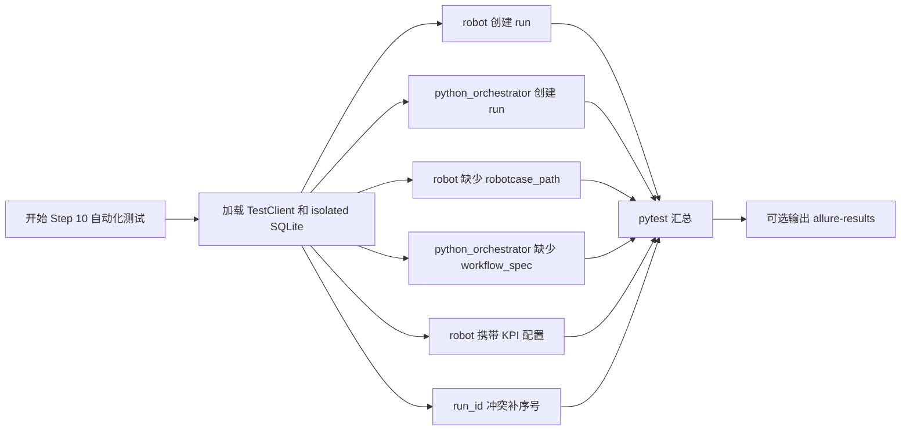

# Step 10 Test Automation

## 文档目标

这份文档记录 `Step 10：冻结 executor-agnostic run contract` 已落地和需要服务器确认的自动化测试内容。

Step 10 的测试目标不是验证 Jenkins 是否真实触发，而是验证：

1. `POST /api/runs` 能按统一 contract 接住不同执行器。
2. 不同执行器的必填字段校验稳定。
3. 创建后的 run 记录能按统一字段落入 SQLite。

## 当前测试目标

围绕 `POST /api/runs`，这一轮重点覆盖：

- `robot` 创建路径
- `python_orchestrator` 创建路径
- `robot` 缺少 `robotcase_path` 时返回 `400`
- `python_orchestrator` 缺少 `workflow_spec` 时返回 `400`
- `robot` 携带 KPI 后处理配置时返回 `400`
- 创建后 SQLite 中保存 executor、workflow、KPI 相关字段

## 本轮已自动化场景

### 1. `robot` run 创建后写入 SQLite

目的：

- 确认旧的 Robot case 创建路径没有被破坏。
- 确认默认 `executor_type` 是 `robot`。
- 确认 `robotcase_path`、`status`、`message` 等最小字段落库。

对应测试：

- `test_create_run_persists_record`

### 2. `python_orchestrator` run 支持 workflow spec

目的：

- 确认统一 contract 可以接受 `python_orchestrator`。
- 确认 `workflow_spec`、KPI 开关、`kpi_config` 能被保存。

对应测试：

- `test_create_python_orchestrator_run_persists_workflow_spec`

### 3. `python_orchestrator` 缺少 `workflow_spec` 返回 `400`

目的：

- 确认 workflow 执行器不会在缺少核心执行规格时被创建。
- 避免后续 Jenkins/runner 收到不可执行的空 workflow。

对应测试：

- `test_create_python_orchestrator_run_requires_workflow_spec`

### 4. `robot` 缺少 `robotcase_path` 返回 `400`

目的：

- 确认 Robot 执行器不会在缺少 case path 时被创建。
- 避免后续 Jenkins/UTE 侧无法定位真实 Robot case。

对应测试：

- `test_create_robot_run_requires_robotcase_path`

### 5. `run_id` 冲突时补序号

目的：

- 确认短时间内创建多条 run 时不会因为 `run_id` 冲突直接失败。

对应测试：

- `test_run_create_retries_with_next_sequence_on_conflict`

### 6. `robot` 模式拒绝 KPI 后处理配置

目的：

- 确认 KPI 后处理字段不会污染 Robot run contract。
- 确认 `enable_kpi_generator`、`enable_kpi_anomaly_detector`、`kpi_config` 当前只允许 `python_orchestrator` 使用。

对应测试：

- `test_create_robot_run_rejects_kpi_options`

## 测试用例执行流程图



## 服务器验证命令

由用户在服务器执行。

普通 pytest：

```bash
cd /path/to/jenkins_robotframework/platform-api
python -m pytest tests/test_runs.py
```

带 Allure 结果文件：

```bash
python -m pytest tests/test_runs.py --alluredir=allure-results
```

## 预期结果

预期 pytest 中与 Step 10 相关的用例全部通过，尤其关注：

- `test_create_run_persists_record`
- `test_create_python_orchestrator_run_persists_workflow_spec`
- `test_create_python_orchestrator_run_requires_workflow_spec`
- `test_create_robot_run_requires_robotcase_path`
- `test_create_robot_run_rejects_kpi_options`
- `test_run_create_retries_with_next_sequence_on_conflict`

如果失败，优先按下面方向判断：

- `400` 断言失败：检查 `_validate_run_create_request()` 的错误语义是否被改动。
- SQLite 字段断言失败：检查 `run_repository.py` 的 JSON / boolean 编解码。
- `workflow_spec` 字段失败：检查 `RunCreateRequest` 和 `WorkflowSpec` schema。
- Robot KPI 配置未被拒绝：检查 `_validate_run_create_request()` 是否仍限制 KPI 字段只能用于 `python_orchestrator`。

## 服务器验证结果

- [x] 用户已在服务器执行 Step 10 验证。
- [x] Step 10 相关 pytest 已通过。
- [x] `allure-results` 可正常产出。

说明：

- 当前 Step 10 只验证 Allure 原始结果目录产出。
- Allure HTML 页面展示需要 Jenkins Allure 插件或 Allure CLI。
- Jenkins 中展示 Allure HTML 会在后续 Jenkins 接入和测试流程收口时完成。

## 本轮未自动化场景

### 1. 真实 Jenkins 触发

未自动化原因：

- Step 10 只冻结创建 contract。
- 真实 Jenkins/Robot/UTE 接入放到后续执行层和 Step 11 之后。

### 2. React workflow builder

未自动化原因：

- 当前还没有 `automation-portal` 实现。
- Step 10 只确保后端 contract 能承接后续前端请求。

### 3. 复杂并行 KPI workflow

未自动化原因：

- 当前只验证 `workflow_spec` 可以保存。
- 具体并行执行语义属于 `jenkins-kpi-platform` runner 和后续 portal workflow builder 的范围。

## 当前结论

Step 10 的自动化重点是把 `POST /api/runs` 的输入 contract 守住。

这一轮新增的关键测试是：

```text
test_create_robot_run_requires_robotcase_path
```

它补齐了 Step 10 文档中提到、但此前缺少测试证据的 Robot 必填字段校验。

## 相关文档

- [Step 10：冻结 executor-agnostic run contract](../steps/step-10-executor-agnostic-run-contract.md)
- [Testing Workflow](../guides/testing-workflow.md)
- [API 设计与调用链](../guides/api-design-and-flow.md)
