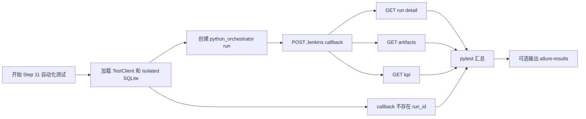

# Step 11 Test Automation

## 文档目标

这份文档记录 `Step 11：打通 Jenkins callback 最小闭环` 已落地和需要服务器确认的自动化测试内容。

Step 11 的测试目标不是验证真实 Jenkins Pipeline，而是验证：

1. Jenkins callback 路由可访问。
2. callback 能按 `run_id` 更新同一条 run。
3. callback 后 detail / artifacts / kpi 查询能读到回写结果。
4. 不存在的 `run_id` 会返回 `404`。

## 当前测试目标

围绕 `POST /api/runs/{run_id}/callbacks/jenkins`，这一轮重点覆盖：

- callback 主路径
- callback 后 run detail 数据一致性
- callback 后 artifact 查询
- callback 后 KPI / detector 查询
- callback 到不存在 run 时返回 `404`

## 本轮已自动化场景

### 1. Jenkins callback 更新 artifacts 和 KPI 摘要

目的：

- 确认 Jenkins 回写可以更新 `status`、`message`、`jenkins_build_ref`。
- 确认可以写入 `started_at`、`finished_at`。
- 确认可以写入 `artifact_manifest`、`kpi_summary`、`detector_summary`。
- 确认 callback metadata 会合并到 run metadata。

对应测试：

- `test_jenkins_callback_updates_artifacts_and_kpi_summary`

### 2. callback 后 detail / artifacts / kpi 查询一致

目的：

- 确认 callback 后 `GET /api/runs/{run_id}` 能看到回写字段。
- 确认 `GET /api/runs/{run_id}/artifacts` 能看到 artifact manifest。
- 确认 `GET /api/runs/{run_id}/kpi` 能看到 KPI / detector 摘要。

对应测试：

- `test_jenkins_callback_updates_artifacts_and_kpi_summary`

说明：

当前这个测试同时覆盖 callback 主路径和 callback 后查询一致性。

### 3. callback 到不存在的 run 返回 `404`

目的：

- 确认 Jenkins 回写时如果 `run_id` 不存在，不会创建假记录。
- 确认错误语义稳定为 `404 Run not found.`。

对应测试：

- `test_jenkins_callback_returns_404_for_missing_run`

## 测试用例执行流程图



## 服务器验证命令

由用户在服务器执行。

普通 pytest：

```bash
cd /path/to/jenkins_robotframework/platform-api
python -m pytest tests/test_runs.py
```

带 Allure 结果文件：

```bash
python -m pytest tests/test_runs.py --alluredir=allure-results
```

## 预期结果

预期 pytest 中与 Step 11 相关的用例全部通过，尤其关注：

- `test_jenkins_callback_updates_artifacts_and_kpi_summary`
- `test_jenkins_callback_returns_404_for_missing_run`

如果失败，优先按下面方向判断：

- callback 返回 `404`：检查创建 run 是否成功，以及测试里的 `run_id` 是否正确。
- callback 返回 `422`：检查 `RunCallbackRequest` schema 和请求体字段。
- detail 看不到回写结果：检查 `apply_run_callback()` 是否写入了对应字段。
- artifact / KPI 查询为空：检查 `artifact_manifest_json`、`kpi_summary_json`、`detector_summary_json` 是否正确落库。

## 本轮未自动化场景

### 1. 真实 Jenkins job 触发

未自动化原因：

- Step 11 只冻结 `platform-api` callback contract。
- 真实 Jenkins job、UTE 节点、Robot 命令放到 `test-workflow-runner` 执行层。

### 2. Jenkins callback 鉴权

未自动化原因：

- 当前 MVP 先打通回写语义。
- callback token、签名或来源校验后续接真实 Jenkins 时再设计。

### 3. callback 状态枚举校验

未自动化原因：

- 当前 `status` 仍是自由字符串。
- 是否限制为 `running / finished / failed` 需要结合 Jenkins/runner 状态模型再定。

## 当前结论

Step 11 的自动化重点是确认：

```text
已有 run -> Jenkins callback -> SQLite 更新 -> detail/artifacts/kpi 可查询
```

这一轮新增的关键测试是：

```text
test_jenkins_callback_returns_404_for_missing_run
```

它补齐了 Step 11 文档中提到、但此前缺少专门测试证据的错误路径。

## 相关文档

- [Step 11：打通 Jenkins callback 最小闭环](../steps/step-11-jenkins-trigger-and-callback.md)
- [Step 10：冻结 executor-agnostic run contract](../steps/step-10-executor-agnostic-run-contract.md)
- [Testing Workflow](../guides/testing-workflow.md)
- [API 设计与调用链](../guides/api-design-and-flow.md)
