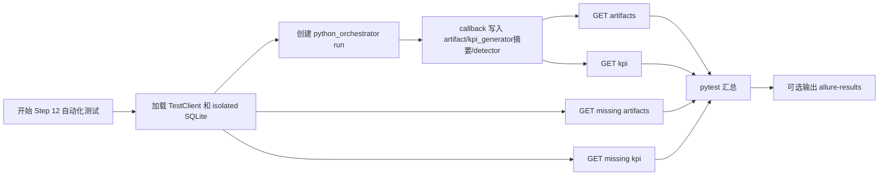

# Step 12 Test Automation

## 文档目标

这份文档记录 `Step 12：补齐 artifact / KPI / detector metadata 查询面` 已落地和需要服务器确认的自动化测试内容。

Step 12 的测试目标不是验证 KPI 文件真的生成，而是验证两个查询面：

1. artifact 查询面：callback 后 artifact manifest 可以通过 `/artifacts` 查询。
2. KPI 查询面：callback 后 kpi_generator 执行摘要 / detector 摘要可以通过 `/kpi` 查询。
3. 不存在的 run 查询 metadata 接口会返回 `404`。

这里没有单独的 detector 查询接口。`detector_summary` 是 `/kpi` 响应的一部分。

## 当前测试目标

围绕下面两个接口：

- `GET /api/runs/{run_id}/artifacts`
- `GET /api/runs/{run_id}/kpi`

这一轮重点覆盖：

- artifact 查询面主路径
- KPI 查询面主路径，包含 kpi_generator 执行摘要和 detector 摘要
- artifacts 查询不存在 run 时返回 `404`
- kpi 查询不存在 run 时返回 `404`

## 本轮已自动化场景

### 1. callback 后 artifact 清单可查询

目的：

- 确认 Jenkins callback 写入的 `artifact_manifest` 可以通过专用接口查询。
- 确认接口返回的是 manifest 元数据，而不是文件本体。

对应测试：

- `test_jenkins_callback_updates_artifacts_and_kpi_summary`

### 2. callback 后 KPI 查询面可查询

目的：

- 确认 kpi_generator 执行摘要可以通过 `/kpi` 查询。
- 确认 detector summary 可以通过 `/kpi` 查询。
- 确认 KPI 开关和 artifact manifest 也能一起返回给前端。
- 确认 KPI 文件本体仍然属于 `artifact_manifest`，不属于 `kpi_summary`。
- 确认 detector 摘要属于 KPI 查询面，不需要单独 `/detector` 接口。

对应测试：

- `test_jenkins_callback_updates_artifacts_and_kpi_summary`

### 3. artifacts 查询不存在 run 返回 `404`

目的：

- 确认不存在的 run 不会返回空 artifact 清单伪装成功。
- 保持资源不存在语义稳定。

对应测试：

- `test_get_run_artifacts_returns_404_for_missing_run`

### 4. kpi 查询不存在 run 返回 `404`

目的：

- 确认不存在的 run 不会返回空 KPI 摘要伪装成功。
- 保持资源不存在语义稳定。

对应测试：

- `test_get_run_kpi_returns_404_for_missing_run`

## 测试用例执行流程图



## 服务器验证命令

由用户在服务器执行。

普通 pytest：

```bash
cd /path/to/jenkins_robotframework/platform-api
python -m pytest tests/test_runs.py
```

带 Allure 结果文件：

```bash
python -m pytest tests/test_runs.py --alluredir=allure-results
```

## 预期结果

预期 pytest 中与 Step 12 相关的用例全部通过，尤其关注：

- `test_jenkins_callback_updates_artifacts_and_kpi_summary`
- `test_get_run_artifacts_returns_404_for_missing_run`
- `test_get_run_kpi_returns_404_for_missing_run`

如果失败，优先按下面方向判断：

- `/artifacts` 返回空：检查 callback 是否写入 `artifact_manifest_json`。
- `/kpi` 返回空：检查 callback 是否写入 `kpi_summary_json` 和 `detector_summary_json`。
- 不存在 run 返回 `200`：检查 `get_run_artifacts()` / `get_run_kpi()` 是否复用了 `_get_required_record()`。

## 本轮未自动化场景

### 1. artifact URL 是否真实可下载

未自动化原因：

- Step 12 只验证 metadata 查询面。
- 真实 Jenkins artifact URL 要等 Jenkins/Robot 接入后验证。

### 2. kpi_generator 执行摘要字段 schema

未自动化原因：

- 当前 `kpi_summary` 仍是 dict。
- 具体字段要等 generator 接入真实输出后再收紧。

### 3. detector summary 字段 schema

未自动化原因：

- 当前 `detector_summary` 仍是 dict。
- 具体字段要等 anomaly detector 接入真实输出后再收紧。

## 当前结论

Step 12 的自动化重点是确认：

```text
callback 写入元数据 -> artifacts/kpi 专用查询接口可读取 -> 不存在 run 稳定返回 404
```

这里的命名约定是：

```text
KPI 摘要 = kpi_generator 执行摘要，不是 KPI 文件本体
KPI 文件 = artifact_manifest 里的一个 artifact
```

这一轮新增的关键测试是：

```text
test_get_run_artifacts_returns_404_for_missing_run
test_get_run_kpi_returns_404_for_missing_run
```

它们补齐了 Step 12 文档中提到、但此前缺少专门测试证据的错误路径。

## 相关文档

- [Step 12：补齐 artifact / KPI / detector metadata 查询面](../steps/step-12-artifact-and-kpi-metadata-query-surface.md)
- [Step 11：打通 Jenkins callback 最小闭环](../steps/step-11-jenkins-trigger-and-callback.md)
- [Testing Workflow](../guides/testing-workflow.md)
- [API 设计与调用链](../guides/api-design-and-flow.md)
