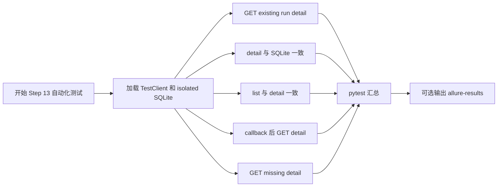

# Step 13 Test Automation

## 文档目标

这份文档记录 `Step 13：把 run detail 升级为 execution-ready 详情入口` 已落地和需要服务器确认的自动化测试内容。

Step 13 的测试目标不是验证真实 Jenkins 或 kpi_generator 是否执行，而是验证：

1. `GET /api/runs/{run_id}` 能作为统一详情入口。
2. callback 后详情接口能同步反映 execution 层回写结果。
3. 不存在的 run 查询详情时返回 `404`。

## 当前测试目标

围绕 `GET /api/runs/{run_id}`，这一轮重点覆盖：

- 基础 run 详情主路径
- 详情返回值与 SQLite 记录一致
- 列表与详情一致
- callback 后 execution-ready 字段可见
- 不存在 run 时返回 `404`

## 本轮已自动化场景

### 1. 已存在 run 时返回详情

目的：

- 确认详情接口返回 `200`。
- 确认基础字段完整，例如 `run_id`、`executor_type`、`testline`、`robotcase_path`、`status`、`message`。

对应测试：

- `test_get_run_detail_returns_expected_record`

### 2. 详情返回值与 SQLite 记录一致

目的：

- 确认详情接口不是 fake data。
- 确认 artifact、kpi_generator 摘要、kpi_anomaly_detector 摘要来自同一条数据库记录。

对应测试：

- `test_get_run_detail_matches_persisted_record`

### 3. 列表与详情一致

目的：

- 确认 `GET /api/runs` 中同一条 run 的摘要字段和 detail 字段保持一致。

对应测试：

- `test_run_list_and_detail_are_consistent`

### 4. callback 后详情可见 execution-ready 字段

目的：

- 确认 Jenkins callback 回写后，详情接口能看到执行状态、Jenkins build、artifact manifest、metadata。
- 确认详情接口能看到 `workflow_spec`。
- 确认详情接口能看到 kpi_generator 执行摘要和 kpi_anomaly_detector 执行摘要。
- 确认详情接口能看到 KPI 后处理开关。

对应测试：

- `test_jenkins_callback_updates_artifacts_and_kpi_summary`

### 5. 不存在 run 时返回 `404`

目的：

- 确认缺失资源时不会返回空详情。

对应测试：

- `test_get_run_detail_returns_404_for_missing_run`

## 测试用例执行流程图



## 服务器验证命令

由用户在服务器执行。

普通 pytest：

```bash
cd /path/to/jenkins_robotframework/platform-api
python -m pytest tests/test_runs.py
```

带 Allure 结果文件：

```bash
python -m pytest tests/test_runs.py --alluredir=allure-results
```

## 预期结果

预期 pytest 中与 Step 13 相关的用例全部通过，尤其关注：

- `test_get_run_detail_returns_expected_record`
- `test_get_run_detail_matches_persisted_record`
- `test_run_list_and_detail_are_consistent`
- `test_get_run_detail_returns_404_for_missing_run`
- `test_jenkins_callback_updates_artifacts_and_kpi_summary`

如果失败，优先按下面方向判断：

- detail 缺少字段：检查 `RunDetailResponse` 是否包含该字段。
- detail 字段为空：检查 `_normalize_record()` 是否正确还原 JSON 字段。
- callback 后 detail 没更新：检查 `apply_run_callback()` 是否写入对应列。
- 不存在 run 返回 `200`：检查 `get_run_detail()` 是否复用了 `_get_required_record()`。

## 本轮未自动化场景

### 1. 前端 run detail 页面

未自动化原因：

- 当前还没有 `automation-portal` 实现。
- Step 13 只固定后端详情接口主数据源。

### 2. timeline 可视化

未自动化原因：

- 当前响应只包含基础时间字段 `started_at` / `finished_at`。
- 复杂 timeline 属于后续展示增强。

### 3. kpi_generator / detector 真实输出 schema

未自动化原因：

- 当前 `kpi_summary` / `detector_summary` 仍是 dict。
- 真实字段要等 Day 2 执行层接入后再收紧。

## 当前结论

Step 13 的自动化重点是确认：

```text
已有 run -> GET detail
callback 回写 -> GET detail 能看到 execution-ready 字段
不存在 run -> 404
```

这一轮补充的关键断言是：

```text
workflow_spec
enable_kpi_generator
enable_kpi_anomaly_detector
kpi_summary
detector_summary
artifact_manifest
metadata
```

## 相关文档

- [Step 13：把 run detail 升级为 execution-ready 详情入口](../steps/step-13-execution-ready-run-detail.md)
- [Step 12：补齐 artifact 查询面与 KPI 后处理查询面](../steps/step-12-artifact-and-kpi-metadata-query-surface.md)
- [Testing Workflow](../guides/testing-workflow.md)
- [API 设计与调用链](../guides/api-design-and-flow.md)
