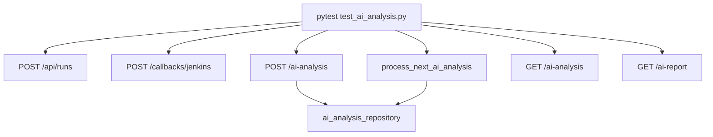

# Step 16 AI Analysis Test Automation

## 这一步测试解决的问题

本次测试覆盖 `platform-api` AI log analysis 第一版后端契约，重点确认：

```text
1. AI analysis 不存在时有明确 404。
2. POST /api/runs/{run_id}/ai-analysis 会创建 queued 记录。
3. GET /api/runs/{run_id}/ai-analysis 能返回结构化结果。
4. GET /api/runs/{run_id}/ai-report 能返回 Markdown 报告。
5. rules_first worker 能把 queued 任务推进到 completed。
```

## 涉及文件

```text
platform-api/tests/test_ai_analysis.py
platform-api/app/schemas/ai_analysis.py
platform-api/app/repositories/ai_analysis_repository.py
platform-api/app/services/ai_analysis_service.py
platform-api/app/services/ai_analysis_worker.py
platform-api/app/api/v1/router.py
```

## 测试用例清单

```text
test_get_ai_analysis_returns_404_before_generation:
  验证还没有生成 AI analysis 时 GET 返回 404。

test_create_ai_analysis_returns_404_for_missing_run:
  验证 run_id 不存在时不能创建 AI analysis。

test_create_ai_analysis_queues_record:
  验证 POST 会写入 ai_analysis 表，并保存 request_json / input_refs。

test_get_ai_analysis_returns_queued_result:
  验证 queued 状态可被详情接口查询。

test_get_ai_report_returns_markdown:
  验证 report API 能从结构化 result 生成 Markdown。

test_ai_worker_processes_rules_first_analysis:
  验证 worker 可以 claim queued 任务，并基于本地 artifact 文本生成 completed 结果。
```

## 核心调用流



## 关键字段

```text
analysis_status:
  测试覆盖 queued 和 completed。

analysis_mode:
  测试使用 rules_first，避免单元测试依赖真实 Cursor API Key。

request_json:
  验证 include_artifacts 等参数被保存。

result_json.input_refs:
  验证 artifact manifest 会转成 AI evidence refs。

root_cause.category:
  worker rules_first 根据 Permission denied publickey 识别 scm_credentials。
```

## 服务器验证命令

由用户在服务器执行：

```bash
cd /path/to/jenkins_robotframework/platform-api
python -m pytest tests/test_ai_analysis.py
```

如果需要生成 Allure 原始结果：

```bash
python -m pytest tests/test_ai_analysis.py --alluredir=allure-results
```

## 预期结果

```text
1. tests/test_ai_analysis.py 全部通过。
2. 404 场景返回稳定 detail。
3. queued 记录写入 ai_analysis 表。
4. rules_first worker 完成后返回 completed。
5. root_cause.category 命中 scm_credentials。
```

## 常见失败判断

```text
ImportError: cursor_sdk:
  单元测试不应该触发 cursor_sdk 路径；如果触发，说明测试 payload 没有使用 rules_first。

GET /ai-analysis 不是 404:
  可能测试数据库没有隔离，检查 isolated_runs_db fixture。

worker 没有处理 queued:
  检查 ai_analysis 表的 analysis_status 是否确实是 queued。

root_cause.category 不等于 scm_credentials:
  检查测试 artifact 是否包含 Permission denied publickey 文本。
```

## 复盘问题

```text
1. 为什么单元测试使用 rules_first，而不是直接调用 Cursor SDK？
2. 为什么 AI analysis 要单独建表，而不是写进 runs.metadata？
3. 为什么 worker 测试需要准备 artifact 文本，而不是只看 run metadata？
```
