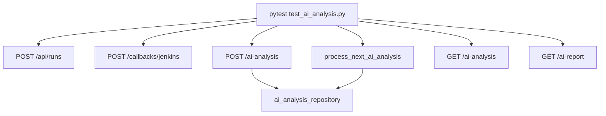

# Step 16 AI Analysis Test Automation

## 这一步测试解决的问题

本次测试覆盖 `platform-api` AI log analysis 第一版后端契约，重点确认：

```text
1. AI analysis 不存在时有明确 404。
2. POST /api/runs/{run_id}/ai-analysis 会创建 queued 记录。
3. GET /api/runs/{run_id}/ai-analysis 能返回结构化结果。
4. GET /api/runs/{run_id}/ai-report 能返回 Markdown 报告。
5. rules_first worker 能把 queued 任务推进到 completed。
6. 不传 analysis_mode 时默认使用 rules_first，避免误触发 Cursor Cloud Agent。
```

## 涉及文件

```text
platform-api/tests/test_ai_analysis.py
platform-api/app/schemas/ai_analysis.py
platform-api/app/repositories/ai_analysis_repository.py
platform-api/app/services/ai_analysis_service.py
platform-api/app/services/ai_analysis_worker.py
platform-api/app/api/v1/router.py
```

## 测试用例清单

```text
test_get_ai_analysis_returns_404_before_generation:
  验证还没有生成 AI analysis 时 GET 返回 404。

test_create_ai_analysis_returns_404_for_missing_run:
  验证 run_id 不存在时不能创建 AI analysis。

test_create_ai_analysis_queues_record:
  验证 POST 会写入 ai_analysis 表，并保存 request_json / input_refs。

test_create_ai_analysis_defaults_to_rules_first:
  验证 POST 未显式传 analysis_mode 时，后端默认保存 rules_first。

test_get_ai_analysis_returns_queued_result:
  验证 queued 状态可被详情接口查询。

test_get_ai_report_returns_markdown:
  验证 report API 能从结构化 result 生成 Markdown。

test_ai_worker_processes_rules_first_analysis:
  验证 worker 可以 claim queued 任务，并基于本地 artifact 文本生成 completed 结果。
```

## 核心调用流



## 关键字段

```text
analysis_status:
  测试覆盖 queued 和 completed。

analysis_mode:
  测试使用 rules_first，并覆盖默认 rules_first，避免单元测试依赖真实 Cursor API Key。

request_json:
  验证 include_artifacts 等参数被保存。

result_json.input_refs:
  验证 artifact manifest 会转成 AI evidence refs。

root_cause.category:
  worker rules_first 根据 Permission denied publickey 识别 scm_credentials。
```

## 服务器验证命令

由用户在服务器执行：

```bash
cd /path/to/jenkins_robotframework/platform-api
python -m pytest tests/test_ai_analysis.py
```

如果需要生成 Allure 原始结果：

```bash
python -m pytest tests/test_ai_analysis.py --alluredir=allure-results
```

## 预期结果

```text
1. tests/test_ai_analysis.py 全部通过。
2. 404 场景返回稳定 detail。
3. queued 记录写入 ai_analysis 表。
4. rules_first worker 完成后返回 completed。
5. root_cause.category 命中 scm_credentials。
6. 默认请求不传 analysis_mode 时仍保存为 rules_first。
```

## Cursor SDK Smoke 验证记录（2026-06-10）

本次自动化测试只覆盖 `rules_first`，没有把真实 Cursor SDK 调用放进 pytest。

原因：

```text
1. Cursor SDK 调用依赖真实 CURSOR_API_KEY。
2. Cursor SDK 调用依赖外部 Cursor 后端和网络路径。
3. 当前 Python SDK smoke 尚未通过。
```

今天手工 smoke 结果：

```text
Linux Python 3.13:
  cursor-sdk 安装成功，import 成功。
  Cursor.models.list(api_key=...) 返回 500 InternalServerError。
  Agent.prompt(...) 返回 500 InternalServerError。
  取消 HTTP_PROXY / HTTPS_PROXY 后仍然 500。
  is_retryable=False，retry_after=None，request_id=None。

Windows Python 3.13:
  Cursor.models.list 和 Agent.prompt 均触发 WinError 10038。
```

当前测试结论：

```text
rules_first:
  可作为当前可验证闭环。

cursor_sdk:
  已有代码路径，但还没有验证出可用方案。
  不应把它作为 pytest 的必过依赖。
```

明天建议手工验证：

```text
1. 服务器 TypeScript @cursor/sdk Cursor.models.list。
2. 服务器 TypeScript @cursor/sdk Agent.prompt。
3. 如果 TypeScript 路径通过，再评估 Python worker 调 Node sidecar 的测试方案。
```

## TypeScript @cursor/sdk 手工验证记录（2026-06-11）

今天已在服务器 `/tmp/cursor-sdk-ts-smoke` 对 TypeScript `@cursor/sdk` 做手工 smoke。

完整手工命令已沉淀到：

```text
docs/modules/platform-api/steps/step-16-ai-analysis-contract.md
  -> Cursor SDK Smoke 完整命令记录（2026-06-10 / 2026-06-11）
```

验证结果：

```text
Cursor.models.list:
  显式设置 undici ProxyAgent 后验证通过，可以返回模型列表。

TypeScript local Agent.prompt:
  未通过。本地 agent bridge 使用 HTTP/2 直连 Cursor 后端公网 IP，报 ETIMEDOUT。

TypeScript cloud Agent.prompt:
  参数结构修正后可以打到 POST /v1/agents，但返回 403 feature_unavailable / unauthenticated。
```

测试结论更新：

```text
1. TypeScript SDK models list 可用，说明 API Key、代理、基础模型查询链路可用。
2. TypeScript Agent.prompt 尚不可用。
3. Cloud Agent.prompt 当前更像是 Dashboard/API Key/Cloud Agent 权限问题。
4. Local Agent.prompt 当前更像是服务器网络代理无法覆盖 SDK bridge HTTP/2 连接。
5. pytest 仍然只应覆盖 rules_first，不应依赖 Cursor Agent.prompt。
```

后续如果要把 `@cursor/sdk` 纳入自动化测试，前提是：

```text
1. Cloud Agent 权限问题解决，或 local bridge 代理问题解决。
2. 有稳定的非生产 API Key / service account key。
3. 用手工 smoke 先验证 Agent.prompt 能稳定返回。
4. 再设计单独的 integration test，不放进默认 pytest 必跑集。
```

## Cursor REST 客户端单元测试（2026-06-11）

worker 已改为 REST 直调。pytest 覆盖 `tests/test_cursor_rest_client.py`（mock HTTP，不调用真实 Cursor API）：

```bash
cd platform-api
python -m pytest tests/test_cursor_rest_client.py tests/test_ai_analysis.py
```

覆盖点：

```text
get_me() 基本请求与鉴权头
prompt_cloud_no_repo() 创建 + 轮询 + 取 result
create_cloud_agent() 403 错误映射
wait_for_run() 轮询直到 FINISHED
```

手工 smoke（服务器，真实 API Key）：

```bash
export CURSOR_API_KEY="crsr_..."
export HTTPS_PROXY=http://10.144.1.10:8080
python scripts/cursor_api_smoke.py
```

详见 `docs/modules/platform-api/guides/cursor-background-api-inventory.md`。

## 常见失败判断

```text
cursor_sdk / Cursor REST 相关失败:
  单元测试应使用 rules_first 或 mock REST；真实 Cursor 调用只走 scripts/cursor_api_smoke.py。

GET /ai-analysis 不是 404:
  可能测试数据库没有隔离，检查 isolated_runs_db fixture。

worker 没有处理 queued:
  检查 ai_analysis 表的 analysis_status 是否确实是 queued。

root_cause.category 不等于 scm_credentials:
  检查测试 artifact 是否包含 Permission denied publickey 文本。
```

## 复盘问题

```text
1. 为什么单元测试使用 rules_first，而不是直接调用 Cursor SDK？
2. 为什么 AI analysis 要单独建表，而不是写进 runs.metadata？
3. 为什么 worker 测试需要准备 artifact 文本，而不是只看 run metadata？
```
