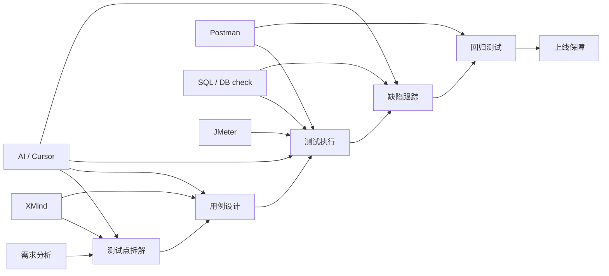

# 测试全流程表达与工具位置图

## 这份文档的目标

这份文档不是让你背一套空话，而是帮你在面试里稳定回答几个高频问题：

1. 你理解的测试全流程是什么
2. `XMind / Postman / JMeter / SQL` 各自放在测试流程的哪个位置
3. `Cursor / AI` 在测试流程里应该怎么用，才算是加分项而不是风险点

最短目标：

```text
把“我会测试”讲成一条有顺序、有工具、有证据链的故事。
```

## 面试里最推荐的测试全流程口径

你可以按下面 7 步来讲：

### 1. 需求分析

先确认：

- 业务目标是什么
- 输入输出是什么
- 主流程是什么
- 异常分支和边界条件是什么

### 2. 测试点拆解

把测试点拆成：

- 功能点
- 异常点
- 边界值
- 接口层
- 数据层
- 非功能点（性能、稳定性、兼容性）

### 3. 用例设计

把测试点沉淀成：

- 主流程用例
- 分支流程用例
- 异常流程用例
- 回归范围

### 4. 测试执行

通常先做：

- 冒烟测试
- 主流程验证
- 异常与边界验证
- 接口和数据库联合校验

### 5. 缺陷跟踪

要能记录清楚：

- 现象
- 复现步骤
- 预期结果
- 实际结果
- 环境
- 日志 / 请求 / 数据库证据

### 6. 回归测试

根据风险决定：

- 全量回归
- 重点回归

同时重点验证：

- 缺陷修复点
- 关联功能
- 易受影响的主流程

### 7. 上线保障

上线前后通常要做：

- 上线前冒烟
- 关键链路抽检
- 上线后日志 / 数据 / 接口快速验证

## 一句话版本口语稿

如果面试时间很短，可以直接用下面这版：

```text
我理解的测试全流程是：先做需求分析，确认业务规则、输入输出和异常分支；再拆测试点并设计主流程、异常和边界用例；执行时先做冒烟，再做功能、接口和数据验证；发现问题后记录现象、步骤和证据并跟踪修复；修复后按风险做重点回归或全量回归；上线前后再做关键链路验证，保证功能稳定。
```

## 工具位置图

下面这张图，是你面试里最应该讲清楚的工具位置关系。



最短记忆版：

```text
XMind 放前面做整理，Postman 放中间做接口验证，SQL 贯穿执行和排障，JMeter 放在非功能测试，AI 贯穿拆点、草拟脚本和日志分析。
```

## 每个工具在流程里的定位

### `XMind`

最适合放在：

- 需求分析之后
- 测试点拆解和用例整理阶段

它解决的问题是：

- 测试点容易漏
- 主流程和分支流程不清晰
- 回归范围不好整理

面试表达建议：

```text
我会用 XMind 先把需求拆成主流程、异常流程、边界场景和接口/数据校验点，这样后面设计测试用例时更不容易漏。
```

### `Postman`

最适合放在：

- 接口测试
- 联调验证
- 回归测试中的关键接口抽检

它解决的问题是：

- 快速验证状态码、响应体、错误语义
- 串接口场景
- 保存环境变量和公共请求

面试表达建议：

```text
我会用 Postman 做接口调试和最小场景串联，比如先创建数据，再查列表、查详情，再验证错误分支和回调结果。
```

### `SQL / 数据库校验`

最适合放在：

- 测试执行阶段
- 缺陷定位阶段
- 回归确认阶段

它解决的问题是：

- 接口返回成功但数据没写对
- 状态更新了但数据库没同步
- 列表和详情不一致

面试表达建议：

```text
我会结合 SQL 做数据校验，因为很多业务问题不能只看接口返回，还要确认数据库里的真实状态是否正确。
```

### `JMeter`

最适合放在：

- 非功能测试
- 基础性能认知

它解决的问题是：

- 单接口并发下是否稳定
- 响应时间是否异常
- 基础吞吐和错误率观察

面试表达建议：

```text
JMeter 我目前理解它更偏性能和并发验证，用来做最小压测、看响应时间和错误率，不会和功能测试混在一起讲。
```

### `AI / Cursor`

最适合放在：

- 测试点拆解阶段
- 接口测试草稿准备阶段
- SQL 校验思路整理阶段
- Jenkins / API / 数据库失败日志分析阶段

它解决的问题是：

- 帮你更快起草第一版测试点、断言和查询语句
- 帮你缩小排障范围，减少“盲查”
- 帮你把零散信息整理成面试里可复述的话术

它不应该代替你的部分是：

- 最终断言是否正确
- 边界值是否充分
- 风险判断是否可靠
- 字段名、接口名、表结构是否真实存在

面试表达建议：

```text
我会用 Cursor 辅助生成 Postman 用例、JMeter smoke 脚本、SQL 校验语句和失败日志分析，但我会自己审核断言、字段和测试边界，避免完全依赖 AI。
```

## 用当前仓库怎么讲“测试全流程”

当前仓库里，最适合拿来举例的是 `platform-api`。

### 例子：围绕 run API 的一条最小测试链路

```text
需求：平台要能创建 run、查列表、查详情，并支持 Jenkins 回调更新状态
```

你可以这样讲：

1. 先看需求
   - 需要有哪些接口
   - run 的状态怎么变化
2. 再拆测试点
   - 创建成功
   - 参数校验失败
   - 列表返回顺序
   - 详情查询命中 / 未命中
   - 回调后 artifacts / KPI 是否更新
3. 再选工具
   - `XMind`：整理测试点
   - `Postman`：调接口串联流程
   - `SQL`：验证 SQLite 落库和更新
   - `pytest`：把关键路径自动化
   - `JMeter`：后面只压最小接口

## 针对当前仓库的最小工具映射

### `XMind`

建议只做仓库外脑图，不必深度接入。

### `Postman`

最适合练的接口：

- `GET /api/health`
- `POST /api/runs`
- `GET /api/runs`
- `GET /api/runs/{run_id}`
- `POST /api/runs/{run_id}/callbacks/jenkins`
- `GET /api/runs/{run_id}/artifacts`
- `GET /api/runs/{run_id}/kpi`

### `SQL`

最适合练的表：

- `runs`

最适合练的动作：

- 创建后查库
- 回调后查库
- 列表和详情一致性

### `JMeter`

当前只建议压：

- `GET /api/health`
- `GET /api/runs`

不要在这一周去压：

- orchestrator CLI
- Jenkins pipeline
- 复杂业务链路

## AI 如何正确辅助这些工具

这里最重要的原则只有一句：

```text
AI 负责先给你草稿和思路，你负责做最终校验和取舍。
```

### AI 辅助 `Postman`

最适合让 AI 帮你的动作：

- 根据接口说明生成第一版请求体
- 生成 `pm.test(...)` 断言草稿
- 帮你整理变量依赖，例如 `run_id` 从哪里来

你自己必须复核：

- 路径、方法、字段名是否和真实接口一致
- 断言是不是只测了“200”，却没测业务字段
- 有没有漏掉失败路径和边界值

### AI 辅助 `SQL`

最适合让 AI 帮你的动作：

- 先起草查库语句
- 根据业务目标补充校验维度
- 帮你把“接口成功但数据不对”的排查思路说清楚

你自己必须复核：

- 表名和列名是否真实存在
- 查询条件是否真的对应当前 `run_id`
- SQL 结果是否真的支持你的测试结论

### AI 辅助 `JMeter`

最适合让 AI 帮你的动作：

- 生成最小 smoke 脚本思路
- 给出线程数、循环数、ramp-up 的保守建议
- 帮你解释响应时间、错误率、吞吐量这些基础概念

你自己必须复核：

- 压测目标是不是当前该压的接口
- 并发参数是否过大，是否会影响真实环境
- 性能测试目标是不是被误讲成了功能测试

### AI 辅助日志分析

最适合让 AI 帮你的动作：

- 根据 Jenkins 日志猜测失败层级
- 根据接口报错缩小排查范围
- 帮你把“先查接口、再查 DB、再查 Jenkins”的顺序整理出来

你自己必须复核：

- AI 给的根因是否有真实日志证据支持
- 是否真的排除了网络、参数、权限、环境问题
- 最终结论是不是和数据库状态、接口返回互相印证

详细做法见：

- [AI 辅助 API / DB / JMeter / 日志分析方法](ai-assisted-api-and-db-testing.md)

## 面试时常见追问怎么答

### 问：你怎么做需求分析？

推荐答法：

```text
我会先确认业务目标、主流程、输入输出和异常分支，再把测试点拆成功能、异常、边界、接口和数据校验几个维度，保证后面设计用例时不会只盯主流程。
```

### 问：你怎么做接口测试？

推荐答法：

```text
我会先按接口文档和业务规则设计 happy path、异常分支和边界场景，再用 Postman 或自动化测试去验证状态码、返回字段和错误语义。如果接口涉及落库或状态变化，我还会结合 SQL 做数据校验。
```

### 问：你怎么做回归测试？

推荐答法：

```text
我会先看本次改动影响范围，按风险决定做重点回归还是全量回归。重点回归通常会覆盖缺陷修复点、关联主流程、关键接口和关键数据校验点。
```

### 问：这些工具你分别怎么用？

推荐答法：

```text
XMind 主要用来做测试点梳理和用例整理，Postman 主要用来做接口调试和场景串联，SQL 主要用来做数据校验和问题定位，JMeter 主要放在性能和并发验证场景，AI 工具则主要用来辅助我生成第一版草稿、补测试点和分析日志，但最终断言和边界我会自己复核。
```

### 问：你怎么理解 AI 测试工具？

推荐答法：

```text
我理解 AI 测试工具不是替代测试工程师，而是提高效率。比如我会用 Cursor 辅助生成 Postman 请求和断言、起草 SQL 校验语句、补 JMeter smoke 参数建议、分析 Jenkins 失败日志，但我不会直接照搬结果，而是会自己核对接口字段、表结构、业务断言和边界场景，保证测试结论可靠。
```

## 最小自测清单

- [ ] 你能按 7 步讲清测试全流程
- [ ] 你能说清 `XMind / Postman / SQL / JMeter / AI` 各自放在哪里
- [ ] 你能结合当前仓库举一个 run API 的测试例子
- [ ] 你能说清功能测试和性能测试的区别
- [ ] 你能说清 AI 为什么只能辅助，不能替你做最终判断

## 相关训练材料

- [1 周测试岗面试训练总览](interview-1week-test-engineer-training.md)
- [数据库与 SQL 面试专项训练](database-sql-interview-drill.md)
- [AI 辅助 API / DB / JMeter / 日志分析方法](ai-assisted-api-and-db-testing.md)
- [Testing Workflow](../guides/testing-workflow.md)
