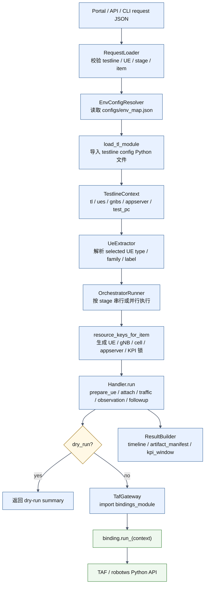
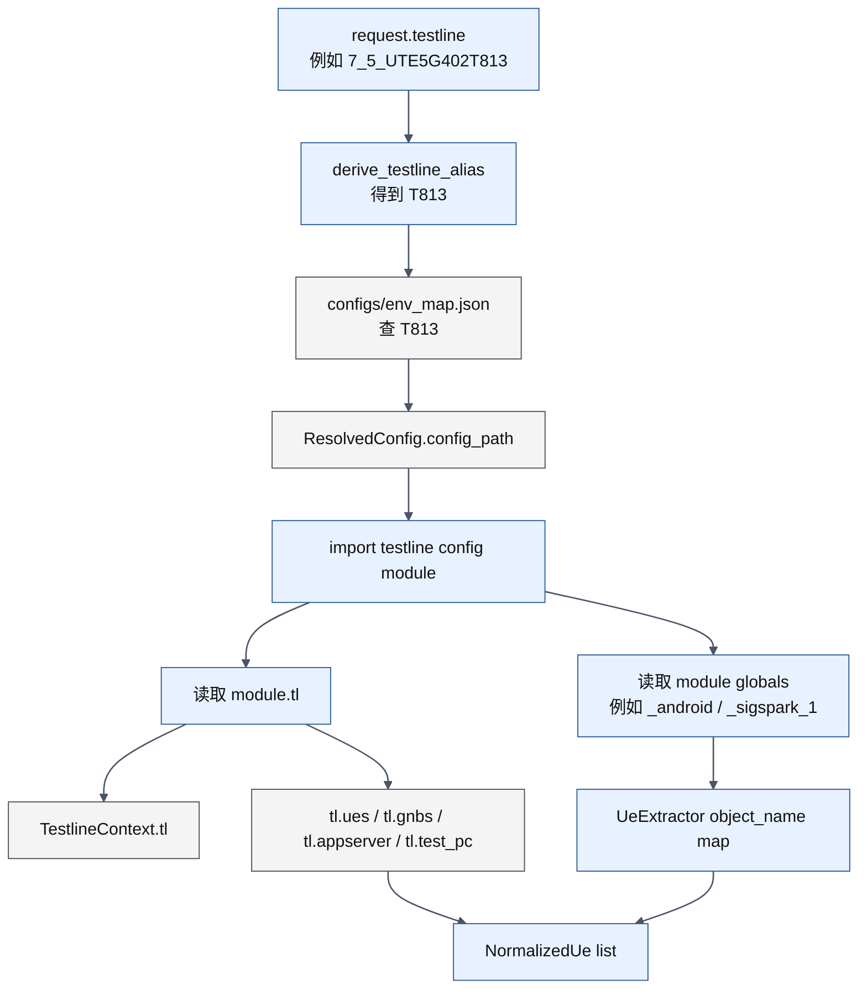
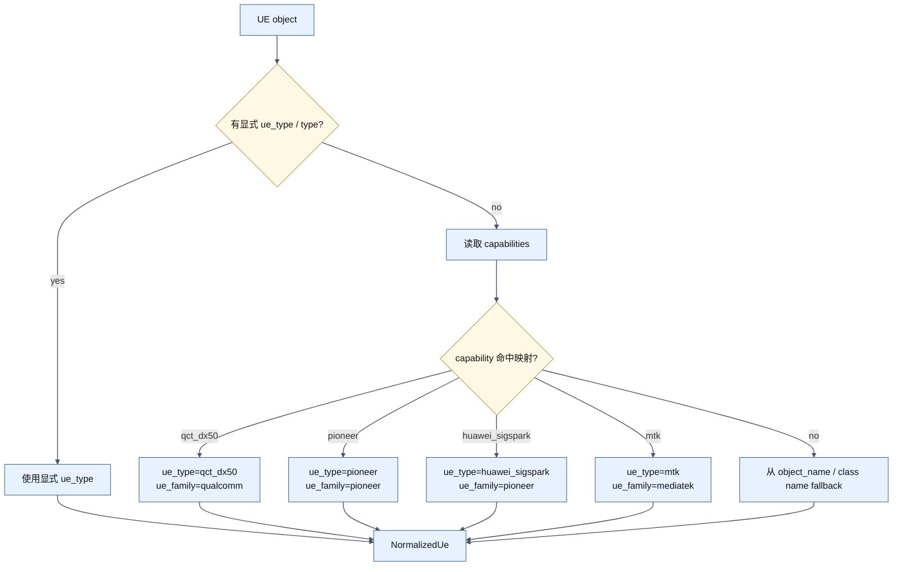
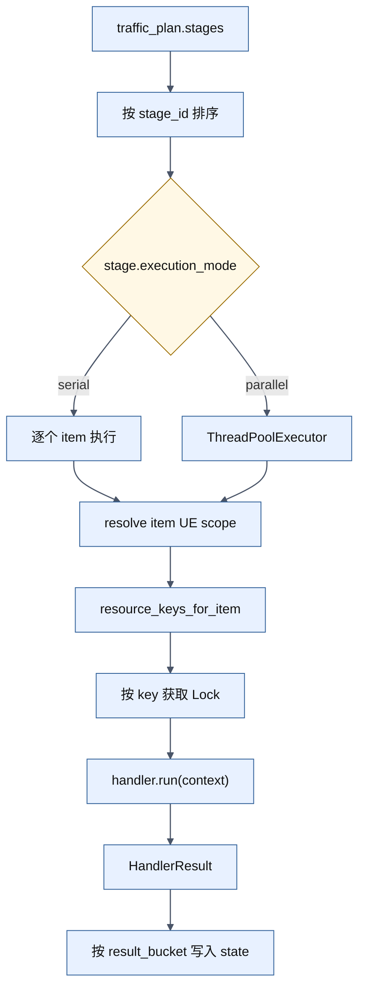
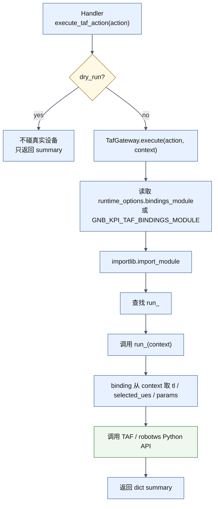
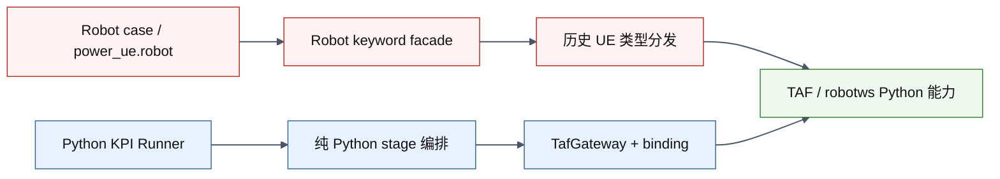
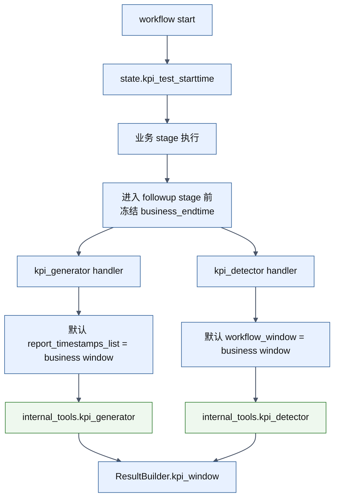

# Python KPI Runner 当前实现流程图

## 文档目标

这份文档解释当前 `test-workflow-runner` 的 Python KPI Runner MVP 到底怎么执行，以及它如何复用：

- `testline_configuration`
- `TAF`
- `robotws`
- 已有 `internal_tools.kpi_generator`
- 已有 `internal_tools.kpi_detector`

一句话总结当前实现：

```text
runner 负责纯 Python 编排、UE 解析、串并行 stage、资源锁和 KPI window；
真实设备动作不在 runner 里重写，而是通过 TafGateway 动态加载 binding module 后调用 TAF/robotws Python 能力。
```

## 1. 当前总流程



## 1.1 当前先落实的 Dry-Run 范围

当前阶段可以先完全不碰真实设备，也就是不进入 `TafGateway` 的真实 binding 调用。目标先固定两类 dry-run 编排：

### 场景 1：需要 UE 的 KPI 测试

```text
stage 1: prepare_ue
stage 2: attach
stage 3: optional ul_traffic / dl_traffic / handover / swap
stage 4: detach
stage 5: kpi_generator / kpi_detector
```

说明：

- `ue_selection.selected_ues` 必须至少有一个 UE。
- `prepare_ue / attach / detach / ul_traffic / dl_traffic / handover / swap` 都属于需要 UE 的动作。
- stage 3 可以选择一个或多个 item 并行；runner 会用 resource lock 保证同一 UE、同一 appserver、同一 gNB 资源不会在同一 runner 进程里互相抢。
- `kpi_generator / kpi_detector` 仍然作为 followup，默认 serial。

示例文件：

```text
test-workflow-runner/configs/sample_ue_kpi_request.json
```

### 场景 2：不需要 UE 的 gNB WebUI 操作

```text
stage 1: site_reset / ru_reset / cell_lock_unlock 任选一种，重复执行 N 次
stage 2: alarm_check + syslog_check 检查 workflow 时间窗口
```

说明：

- `ue_selection.selected_ues` 可以为空。
- gNB WebUI 操作使用 `ue_scope.mode=none`。
- 每次测试只选择一种 gNB 操作，通过 `params.repeat_count` 表达重复次数。
- 操作结束后，`alarm_check` 和 `syslog_check` 可以并行检查同一个 workflow window。

示例文件：

```text
test-workflow-runner/configs/sample_gnb_webui_request.json
```

## 2. 如何复用 `testline_configuration`

当前入口是 `EnvConfigResolver`：

```text
configs/env_map.json
  -> config_id / config_path / allowed_script_roots
  -> importlib.util.spec_from_file_location(...)
  -> module.tl
  -> TestlineContext
```

流程图：



当前实现重点：

- `config_resolver.py` 使用 `env_map.json` 里的 `config_path` 加载真实 testline Python 文件。
- 加载后必须存在 `tl` 对象，否则直接报错。
- `TestlineContext` 会保存：
  - `tl`
  - `ues`
  - `gnbs`
  - `enbs`
  - `appserver`
  - `test_pc`
  - `repository_root`
- `UeExtractor.extract(tl, module_globals=vars(module))` 会把 `_android`、`_sigspark_1` 这种变量名拿来作为 UE label fallback。

注意：

- 当前 `external_repositories.testline_configuration` 只是示例配置里的说明字段，主加载逻辑仍然看 `config_path`。
- 如果真实服务器上 `testline_configuration` 在仓库外，可以把 `config_path` 配成绝对路径，或者在仓库下做稳定软链接。

## 3. UE 类型和 Family 如何解析

当前 `UeExtractor` 的解析顺序是：



以 T813 为例，当前预期理解是：

- `_android`
  - `capabilities` 包含 `qct_dx50`
  - 解析为 `ue_type=qct_dx50`
  - 解析为 `ue_family=qualcomm`
- `_sigspark_1`
  - `capabilities` 包含 `pioneer` / `huawei_sigspark`
  - 解析为 `ue_type=pioneer`
  - 解析为 `ue_family=pioneer`
- `_sigspark_2~_sigspark_6`
  - 如果 `capabilities` 包含 `huawei_sigspark`
  - 解析为 `ue_type=huawei_sigspark`
  - 解析为 `ue_family=pioneer`

这层的目的不是替代 TAF 的设备差异处理，而是让 runner 能在 request / stage 层按业务分组选择 UE。

当前实现已按 `robotws` 中 `resources/RAN_PZ_HAZ_34/python/ue.py` 的 `translate_power_ue_type_from_testline` 思路对齐：

- `Qualcomm / Android / TafUeFastmile / TafUeAndroid / TafUeAt / TafUeMtk` 这类 UE 优先使用 `capabilities[-1].lower()`。
- `MediaTek` 映射为 `mtk`，并保留 `mtk_lte` 这类更具体能力值。
- dict 型 CPE UE 按 `AndroidUePool.inline_config` key 推断 `askey / nokia_cpe / cpe_lte / inseego`。

没有直接调用 `translate_power_ue_type_from_testline`，原因是它内部通过 `robot.libraries.BuiltIn.BuiltIn().get_variable_value("${tl}")` 读取 Robot 运行时变量。Python KPI Runner 不运行在 Robot Framework runtime 中，因此这里实现的是同等语义的纯 Python 解析逻辑。

## 4. Stage、Handler 和资源锁

当前 runner 仍以 `traffic_plan.stages` 作为最外层编排单位。



当前资源锁 key：

- UE lifecycle：`ue:<ue_index>`
- Traffic：`ue:<ue_index>` + 可选 `appserver:<id>`
- gNB control：`gnb:<id>` + 可选 `cell:<id>`
- RU control：可选 `ru:<id>`
- KPI followup：`kpi_followup`
- Observation：`observation`

这意味着：

- 同一个 UE 上的 `prepare_ue / attach / detach / traffic` 不会在同一个 runner 进程内抢同一把 UE 锁。
- 同一个 appserver 的 UL/DL traffic 可以通过 `appserver_id` 互斥。
- KPI generator / detector 默认不会并发抢 followup。
- `site_reset / ru_reset / rf_reset / cell_lock_unlock` 仍建议放 serial stage，并通过 `repeat_count` 表达重复执行次数。
- `handover / swap` 在 UE 场景的 optional stage 可以和 traffic 一起放 parallel；实际执行时同资源会被 lock 串住。

## 5. 如何复用 TAF / robotws

当前复用点是 `TafGateway` + binding module。

重要边界：

- 当前 `TafGateway` 只支持 Python module/function 调用。
- 当前 `TafGateway` 不直接执行 Robot keyword，例如不直接 `Run Keyword`、不依赖 `BuiltIn()`。
- 如果后续确实需要调用 Robot keyword，应作为单独 fallback adapter 设计，而不是混进默认 `TafGateway` 主路径。



当前已经提供的 binding skeleton：

```text
test_workflow_runner/bindings/taf_power_ue.py
  run_prepare_ue(context)
  run_attach(context)
  run_detach(context)
  run_ul_traffic(context)
  run_dl_traffic(context)
  run_handover(context)
  run_site_reset(context)
  run_rf_reset(context)
  run_cell_lock(context)
  run_cell_unlock(context)
  run_alarm_check(context)
  run_syslog_check(context)
```

当前 skeleton 的真实含义：

- 对 UE 动作：
  - 遍历 `context.selected_ues`
  - 从 `normalized_ue.raw_object` 取真实 UE 对象
  - 尝试调用 `prepare_ue` / `run_prepare_ue` / `prepareue` 这类同名 callable
- 对 gNB / observation 动作：
  - 从 `context.testline_context.tl` 取 testline 对象
  - 尝试调用 `site_reset` / `run_site_reset` 等同名 callable

也就是说，现在 runner 已经把“在哪里接 TAF/robotws”留好了，但真实 TAF/robotws 的函数名、参数名、对象路径还需要进一步对齐。

## 6. 当前实现与 Robot Framework 的边界



当前目标不是调用 Robot Framework runtime，也不是逐行翻译 `power_ue.robot`。

当前目标是：

- 保留 Robot 现有 case 线，继续由 Jenkins / Robot 执行。
- Python KPI Runner 走另一条纯 Python 编排线。
- 两条线在底层复用 TAF/robotws 的 Python 能力。

## 7. KPI Followup 如何接入



当前逻辑：

- runner 启动时记录 `state.kpi_test_starttime`。
- 进入全部为 followup 的 stage 前，冻结 `state.business_endtime`。
- 如果 `kpi_generator` 没有显式传 `report_timestamps_list`，默认使用业务窗口。
- result JSON 顶层输出：

```json
{
  "kpi_window": {
    "business_start_time": "...",
    "business_end_time": "...",
    "workflow_start_time": "...",
    "workflow_end_time": "..."
  }
}
```

## 8. 后续需要你提供或确认的输入

### 8.1 testline 配置路径

需要确认服务器上的真实路径：

```text
/opt/jenkins_robotframework/test-workflow-runner/configs/env_map.json
T813.config_path = ?
```

可以是：

- 仓库内相对路径，例如 `testline_configuration/T813.py`
- 绝对路径，例如 `/opt/testline_configuration/7_5_UTE5G402T813/__init__.py`

### 8.2 T813 UE 清单和能力字段

需要确认真实 `tl.ues` 中：

- `_android` 是否在 `tl.ues` 第 1 个。
- `_sigspark_1~_sigspark_6` 是否都在 `tl.ues` 中。
- 每个 UE 的 `capabilities` 实际字段内容。
- 是否存在显式 `ue_type`，如果有，是否可信。

### 8.3 TAF / robotws 真实 Python API

这是下一步最关键的输入。

需要你提供或确认：

- `prepare_ue` 对应哪个 Python module / class / function。
- `attach` 对应哪个 Python module / class / function。
- `detach` 对应哪个 Python module / class / function。
- UL / DL traffic 当前是调用 UE 对象、appserver 对象，还是 robotws helper。
- gNB control 的 `site_reset / rf_reset / cell_lock / cell_unlock` 真实函数在哪里。
- alarm/syslog check 的真实函数在哪里，以及时间窗口参数格式。

建议你给出类似下面的映射：

```text
prepare_ue:
  source: robotws.xxx.yyy
  callable: xxx
  params:
    ue object:
    ue_type:
    attach_mode:
    retry:
    timeout:

attach:
  source:
  callable:
  params:

detach:
  source:
  callable:
  params:
```

### 8.4 request 业务模板

需要确认最小真实 MVP 是否按下面顺序跑：

```text
stage 1: prepare_ue
stage 2: attach
stage 3: optional ul_traffic / dl_traffic
stage 4: detach
stage 5: kpi_generator / kpi_detector
```

以及每个 stage 是：

- `serial`
- `parallel`
- 按 UE 并行，但同 UE 串行
- 按 UE family 分组执行

### 8.5 KPI followup 参数

需要确认：

- `kpi_generator` 是否总是使用业务窗口。
- 是否需要给不同 stage 单独生成 KPI window。
- `kpi_detector` 输入文件是否固定来自 generator 输出。
- Portal 展示需要哪些 summary 字段。

## 9. 当前实现风险

当前实现已经把编排框架搭起来，但真实设备执行还没有完全闭环，主要风险是：

- `taf_power_ue.py` 现在是 skeleton，不知道真实 TAF/robotws callable 名字。
- 如果真实 UE 对象没有 `prepare_ue / attach / detach` 同名方法，需要在 binding 中改成调用真实 helper。
- 如果 `testline_configuration` 是 package 目录而不是单文件，需要确认 `config_path` 指向 `__init__.py`。
- 如果某些 UE 类型只有 Robot keyword，没有 Python API，需要做薄 adapter 或临时 fallback。
- 当前 resource lock 是 runner 进程内锁；如果未来多个 Jenkins build 同时跑同一 testline，需要 Jenkins 层、平台层或外部锁做跨进程互斥。

## 10. 服务器验证命令

按项目约定，这些命令由你在目标服务器执行：

```bash
cd /opt/jenkins_robotframework/test-workflow-runner
source .venv/bin/activate
python -m pytest tests/test_orchestrator.py
python -m test_workflow_runner.cli configs/sample_request.json --dry-run --result-json artifacts/python-kpi-runner-flow-check.json
python -m test_workflow_runner.cli configs/sample_ue_kpi_request.json --dry-run --result-json artifacts/python-kpi-runner-ue-flow-check.json
python -m test_workflow_runner.cli configs/sample_gnb_webui_request.json --dry-run --result-json artifacts/python-kpi-runner-gnb-webui-flow-check.json
```

预期结果：

- `pytest` 通过。
- CLI exit code 为 `0`。
- result JSON 顶层有 `kpi_window`。
- dry-run 日志中每个 item 会输出 `locks=...`。
- UE 场景 result 中包含 `prepare_ue / attach / optional stage / detach / kpi_generator`。
- gNB-only 场景 result 中 `used_ues=[]`，gNB 操作 summary 中包含 `repeat_count`，sidecar 中包含 `alarm_check / syslog_check`。

常见失败模式：

- `testline alias is not defined in env_map.json`
  - `configs/env_map.json` 没配置 `T813`。
- `testline configuration file not found`
  - `config_path` 不正确。
- `No TAF bindings module configured`
  - 非 dry-run 时没设置 `runtime_options.bindings_module` 或 `GNB_KPI_TAF_BINDINGS_MODULE`。
- `does not expose a callable for action`
  - binding skeleton 找不到真实 TAF/robotws callable，需要补映射。

## 11. 我的当前理解

我当前对这条线的理解是：

```text
Python KPI Runner 不替代 Robot case，也不复制 power_ue.robot；
它只负责 KPI 测试编排和结果窗口。

真实设备动作仍然复用已有 TAF/robotws。
testline_configuration 提供测试线对象、UE 对象、gNB/appserver/test_pc 对象。
binding module 是 runner 与 TAF/robotws 之间的适配层。
```

如果这符合你的预期，下一步应该集中确认真实 `prepare_ue / attach / detach` 的 Python API 映射，然后把 `taf_power_ue.py` 从 skeleton 改成真实 adapter。
