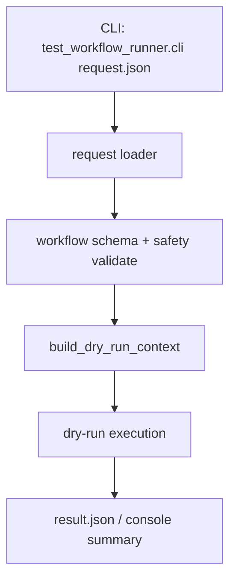

# Step 1：runner request loader / workflow schema / CLI dry-run

## 这一步的目标

先把 runner 的最小输入面固定下来，让执行层具备一个稳定的入口。

这一轮最重要的是先回答 3 个问题：

- runner 从哪里接收 workflow 请求
- workflow JSON 最小长什么样
- 不接真实设备时，能不能先做 CLI dry-run

## 预期结果

这一轮做完后，系统应该具备下面这些可观察结果：

- 有统一的 workflow request schema
- 有统一的 request loader
- 有最小 CLI 入口
- 在不接真实 testline 的情况下，也能先做 dry-run 验证
- 受保护资源域的不安全并行 stage 会在标准 CLI 主路径中被直接拒绝

这一轮先不扩的内容包括：

- 真实 TAF 调用
- 复杂并行调度
- generator / detector 接入

本次收口后，`--dry-run` 的边界明确为：

- 不要求真实 `configs/env_map.json`
- 不要求真实 `testline_configuration/T813.py`
- 不调用 TAF bindings
- 直接根据 request JSON 里的 `ue_selection.selected_ues` 构造最小 `TestlineContext`
- 产出可被后续 Jenkins / platform-api callback 消费的 `result.json`

补充约定：

- 标准 CLI 主路径里，protected domain 的并行冲突会先在 `RequestLoader.validate_payload()` 中作为请求校验失败直接拦截
- 只有调用方绕过 loader 直接调用 `OrchestratorRunner` 时，这类信息才会以 `validation_warnings` 的形式出现在结果里

## 这一步的代码设计

这一轮建议先把执行层拆成下面几块：

- request loader
  - 负责读入 workflow JSON
  - 负责最小校验和并行 safety 硬校验
- workflow schema
  - 负责固定 `workflow -> stages -> items` 结构
- CLI 入口
  - 负责从命令行接收 JSON 文件路径
  - 负责触发 dry-run

最关键的一条链路应该先固定成：

```text
cli -> request loader -> workflow schema / safety validate -> build_dry_run_context -> dry-run result
```

## 函数调用流程图



## 开发侧验收步骤（服务器侧执行）

```bash
cd /opt/jenkins_robotframework/test-workflow-runner
python3 -m venv .venv
source .venv/bin/activate
python -m pip install --upgrade pip
python -m pytest tests
python -m test_workflow_runner.cli configs/sample_request.json --dry-run --result-json artifacts/day2-step1-result.json
grep -R '"[e]nv"' -n configs test_workflow_runner tests ../docs/modules/test-workflow-runner
```

## 开发侧验收结果

- [x] request loader 已能加载最小 workflow 请求
- [x] workflow schema 已能校验最小 JSON 结构
- [x] CLI dry-run 已可执行
- [x] 在不接真实 testline 的情况下也能看到最小结果输出
- [x] workflow request 顶层字段已统一为 `testline`，不再使用 `env`
- [ ] 等待用户在服务器执行命令并回贴结果

## 测试侧验收步骤（服务器侧执行）

```bash
python -m pytest tests
python -m pytest tests --alluredir=allure-results
```

## 测试侧验收结果

- [ ] pytest 已覆盖 request loader 主路径
- [ ] pytest 已覆盖 schema 校验失败路径
- [ ] pytest 已覆盖 CLI dry-run 最小链路
- [ ] `allure-results` 可正常产出

## 本次修改文件

- `test-workflow-runner/test_workflow_runner/request_loader.py`
  - 顶层输入从 `env` 改为 `testline`。
  - 增加 `require_env_map` 开关，让 CLI dry-run 可以跳过真实 testline 配置。
- `test-workflow-runner/test_workflow_runner/cli.py`
  - 增加 `--dry-run` 和 `--result-json` 参数。
  - 增加 dry-run 专用 `TestlineContext` 构造逻辑。
- `test-workflow-runner/test_workflow_runner/models.py`
  - 增加 `testline -> testline_alias` 派生逻辑，例如 `7_5_UTE5G402T813 -> T813`。
- `test-workflow-runner/test_workflow_runner/result_builder.py`
  - 写结果前自动创建输出目录，并输出 `testline` / `testline_alias`。
- `test-workflow-runner/test_workflow_runner/handlers/kpi_generator.py`
  - 从 `testline_alias` 注入 kpi_generator 需要的 `environment`。
- `test-workflow-runner/test_workflow_runner/handlers/kpi_detector.py`
  - 从 `testline_alias` 注入 detector 需要的 `environment`。
- `test-workflow-runner/configs/sample_request.json`
  - 提供可直接用于 CLI dry-run 的示例请求。
- `test-workflow-runner/tests/test_orchestrator.py`
  - 增加 CLI dry-run 不依赖 env_map 的测试。

## 学习版说明

这一步解决的是“执行层入口能不能独立跑起来”的问题。

在 Day 1 里，`platform-api` 已经能创建 run、接 callback、查 artifact 和 kpi_generator / detector 摘要。Day 2 开始，执行层必须先有一个稳定入口，否则后面 Jenkins、Robot、UTE 都没有地方接。

本次核心调用链是：

```text
python -m test_workflow_runner.cli configs/sample_request.json --dry-run
  -> RequestLoader.load_json_file()
  -> RequestLoader.validate_payload()
  -> build_dry_run_context()
  -> OrchestratorRunner.execute()
  -> ResultBuilder.write()
  -> artifacts/day2-step1-result.json
```

关键字段：

- `testline`
  - 当前 workflow 要跑在哪条测试线，例如 `7_5_UTE5G402T813`。
- `testline_alias`
  - runner 从 `testline` 派生出的短名，例如 `T813`，用于查 `env_map.json` 和注入 kpi_generator / detector 参数。
- `ue_selection.selected_ues`
  - dry-run 时直接用它构造最小 UE 上下文。
- `traffic_plan.stages`
  - workflow 的 stage 列表。
- `traffic_plan.stages[].items`
  - 每个 stage 里真正要执行的动作，例如 `attach`、`dl_traffic`、`ul_traffic`。
- `runtime_options.dry_run`
  - 控制是否跳过真实 TAF / Robot 调用。
- `result_json`
  - runner 输出的结果文件，后续会作为 Jenkins artifact 或 callback payload 的来源。

常见失败判断：

- 如果报 `ModuleNotFoundError: No module named 'test_workflow_runner'`
  - 先确认当前目录是 `/opt/jenkins_robotframework/test-workflow-runner`。
- 如果报 `traffic_plan.stages is required`
  - 说明 request JSON 没有提供最小 workflow。
- 如果报 `Only these traffic models are supported`
  - 说明 item 里的 `model` 不在 runner 当前支持列表内。
- 如果报 `stage X requests parallel execution ... protected domain ...`
  - 说明受保护资源域的并行组合在标准 CLI 主路径里被 `RequestLoader` 直接拒绝了，需要把对应 stage 改成串行或重新隔离资源边界。
- 如果没有生成 `artifacts/day2-step1-result.json`
  - 先确认 `--result-json` 路径是否正确，以及命令是否返回 0。

复盘问题：

1. 为什么 request 顶层应该统一使用 `testline`，而不是再引入 `env`？
2. `RequestLoader` 负责校验哪些内容，`OrchestratorRunner` 又负责什么？
3. 为什么 `result.json` 是 Day 2 后续 Jenkins / callback 联调的关键文件？
4. 如果未来接真实 UTE，`--dry-run` 和真实执行模式最大的差异在哪里？
5. 为什么 protected parallel stage 要优先在 loader 阶段拦截，而不是等 runner 里只挂 warning？

## 相关专题与测试文档

- [GNB KPI Regression Architecture](../../../overview/gnb-kpi-regression-architecture.md)
- [GNB KPI System Runtime](../../../overview/gnb-kpi-system-runtime.md)
