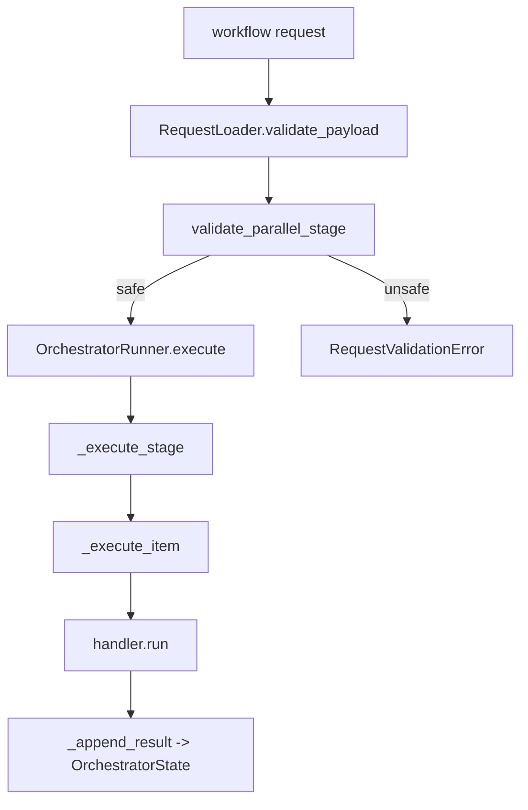

# Step 2：实现 stage / item engine 与并行安全边界

## 这一步的目标

把 `test-workflow-runner` 从“只是能读 request 的 CLI”推进成一个真正有执行语义的 workflow engine。

这一轮最重要的是冻结下面 4 件事：

- `workflow -> stages -> items` 的执行顺序
- stage 级串行 / 并行语义
- item 级 handler 分发方式
- protected domain 的并行安全边界

## 预期结果

这一轮做完后，执行层应当具备下面这些可观察结果：

- `OrchestratorRunner` 能遍历 stage 和 item 并分发到对应 handler
- `execution_mode=serial` 和 `execution_mode=parallel` 都有明确执行语义
- `stop_on_failure` 和 `continue_on_failure` 有稳定行为
- `apply_preconditions / traffic / sidecars / followups` 会落到不同结果桶
- 不安全的 protected parallel stage 会被 safety 规则识别并拦截

这一轮先不扩的内容包括：

- 真实 Jenkins 参数拼装
- 真实 callback 回传
- portal 可视化 timeline
- 更复杂的资源隔离建模

## 这一步的代码设计

这一轮的主线由下面 3 个文件组成：

- `test_workflow_runner/runner.py`
  - 负责 stage / item 的执行主循环
- `test_workflow_runner/safety.py`
  - 负责 protected domain 的并行安全规则
- `test_workflow_runner/request_loader.py`
  - 负责在标准 CLI 主路径里把不安全并行请求提前挡住

这一步的关键判断是：

```text
执行编排和安全校验要分层，但安全边界必须在标准入口尽早失败。
```

也就是说：

- `runner.py` 负责“怎么执行”
- `safety.py` 负责“哪些并行组合默认不安全”
- `request_loader.py` 负责“在标准入口何时直接拒绝请求”

## 典型调用链

```text
RequestLoader.validate_payload()
  -> request.traffic_stages()
  -> validate_parallel_stage(stage)
  -> 不安全则抛 RequestValidationError

OrchestratorRunner.execute()
  -> for each stage
  -> _execute_stage()
  -> _execute_item()
  -> handler.run()
  -> _append_result()
```

## 函数调用流程图



## 当前执行语义

### 1. stage 级执行模式

- `serial`
  - 按 item 顺序逐个执行
- `parallel`
  - 使用 `ThreadPoolExecutor` 并发执行多个 item
  - `max_workers = min(max_parallel_workers, len(items))`

### 2. item 分发

当前 `runner.py` 通过 `handler_registry[item.model]` 分发到具体 handler，例如：

- `attach`
- `handover`
- `dl_traffic`
- `ul_traffic`
- `swap`
- `detach`
- `syslog_check`
- `kpi_generator`
- `kpi_detector`

### 3. 失败控制

- stage 串行执行时：
  - 如果 item 失败，且 `stop_on_failure=true`，并且当前 item 没有 `continue_on_failure=true`
  - 则停止当前 stage 的后续 item
- 整个 workflow 执行后：
  - 任一结果桶出现失败，则 `state.status = failed`
  - 否则 `state.status = completed`

### 4. 结果分桶

当前 `OrchestratorState` 会把结果分进 4 类：

- `precondition_results`
- `traffic_results`
- `sidecar_results`
- `followup_results`

这为 Step 4 的 `timeline / artifact_manifest / results` 输出提供了稳定上游。

## protected parallel stage 安全边界

当前 safety 规则通过资源域做第一层保护：

- `gnb_control`
  - 如 `handover`、`swap`、`apply_preconditions`
- `followup`
  - 如 `kpi_generator`、`kpi_detector`
- `traffic_plane`
  - 如 `dl_traffic`、`ul_traffic`
- `observation`
  - 如 `syslog_check`
- `ue_lifecycle`
  - 如 `attach`、`detach`

默认串行保护域：

- `gnb_control`
- `followup`

这意味着：

- `dl_traffic / ul_traffic` 更适合做受控并行
- `handover / swap` 默认不应该并行堆在一个 stage
- `generator / detector` 默认应该放在串行 followup stage

## 关键实现约定

### 1. loader 阶段的硬拦截

在标准 CLI 主路径里，`RequestLoader.validate_payload()` 会先调用 `validate_parallel_stage()`。

如果发现 protected domain 的危险并行组合：

- 当前行为不是只记 warning
- 而是直接抛 `RequestValidationError`

### 2. runner 阶段的 warning 保留

`runner.py` 里仍然会再次调用 `validate_parallel_stage(stage)` 并把 warning 写进 `state.validation_warnings`。

这层逻辑的意义是：

- 如果调用方绕过了 loader，runner 仍然能保留风险信息
- 但标准入口默认以前置拦截为主

## 开发侧验收步骤（服务器侧执行）

```bash
cd /opt/jenkins_robotframework/test-workflow-runner
python3 -m venv .venv
source .venv/bin/activate
python -m pip install --upgrade pip
python -m pytest tests/test_orchestrator.py
```

重点确认：

- `test_request_loader_rejects_protected_parallel_stage` 通过
- `test_orchestrator_runner_executes_dry_run_workflow` 通过
- runner 执行后 `traffic_results / sidecar_results / followup_results` 分桶正确

## 开发侧验收结果

- [x] stage / item 执行主循环已具备
- [x] parallel stage 已使用并发执行器
- [x] protected domain 的不安全并行已在标准入口被拦截
- [x] 结果桶已按 preconditions / traffic / sidecars / followups 分开
- [ ] 等待用户在服务器执行命令并回贴结果

## 测试侧验收步骤（服务器侧执行）

```bash
python -m pytest tests/test_orchestrator.py
```

## 测试侧验收结果

- [x] 已覆盖 loader 拒绝 protected parallel stage 的路径
- [x] 已覆盖 runner dry-run 最小 workflow 的主路径
- [ ] 等待用户在服务器执行 pytest 并回贴结果

## 本次对应实现文件

- `test-workflow-runner/test_workflow_runner/runner.py`
  - stage / item 执行主循环
  - serial / parallel 执行语义
  - 结果分桶
- `test-workflow-runner/test_workflow_runner/safety.py`
  - protected domain 与串行保护域定义
- `test-workflow-runner/test_workflow_runner/request_loader.py`
  - 在标准入口预先拦截不安全并行

## 学习版说明

Step 1 解决的是“runner 有没有入口”。

Step 2 解决的是：

```text
runner 到底是不是一个真正有执行语义和安全边界的 workflow engine。
```

如果没有这一步：

- workflow 只是一个 JSON 壳子
- stage / item 没有稳定执行规则
- 并行也没有默认安全边界

所以 Step 2 的本质是：

```text
冻结执行语义，避免后续每接一个 handler 就重写一遍 orchestrator 行为。
```

## 相关专题与测试文档

- [模块总索引](../index.md)
- [Step 1：runner request loader / workflow schema / CLI dry-run](step-01-runner-request-loader-and-cli.md)
- [Step 3：接入 testline_configuration / robotws / TAF gateway 的运行时契约](step-03-testline-robotws-taf-gateway-runtime-contract.md)
- [Step 4：统一 result.json / timeline / artifact manifest 输出](step-04-result-timeline-and-artifact-manifest.md)
- [Step 5：generator / detector internal API params contract](step-05-generator-detector-internal-api-contract.md)