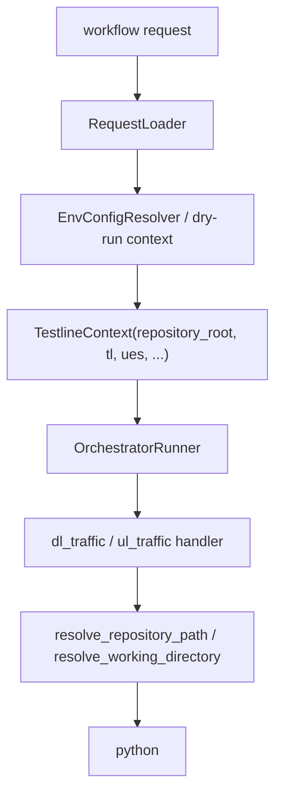

# Step 3：接入 testline_configuration / robotws / TAF gateway 的运行时契约

## 这一步的目标

把执行层从“能 dry-run”继续推进到“更接近 Jenkins / UTE 真实运行方式”。

这一轮最重要的不是一次性把所有真实调用都跑起来，而是先把运行时契约收口，让下面这些东西不再依赖当前进程 cwd 碰运气：

- `testline_configuration` 上下文
- `robotws` / script 路径解析
- TAF bindings 入口

## 预期结果

这一轮做完后，执行层应当具备下面这些稳定约定：

- `TestlineContext` 能携带 `repository_root`
- 真实 `testline_configuration` 加载路径和 dry-run 构造路径都能保留仓库根目录上下文
- `dl_traffic / ul_traffic` 在使用 `script_path` 时，默认会把相对路径解析到仓库根目录
- `working_directory` 未显式指定时，默认回到仓库根目录，而不是依赖外部调用 cwd
- TAF 仍然通过 `bindings_module` 注入，不把 install/reuse 逻辑放进 runner

这一轮先不扩的内容包括：

- Jenkins job 参数组装
- 真实 callback 回传
- robotws 中更多 Python helper 的批量收编
- TAF install/reuse 策略本身

## 这一步的代码设计

这一步的关键，是把“仓库根目录”视为运行时契约的一部分，而不是隐含前提。

当前建议固定成：

- `config_resolver.py`
  - 真实 testline context 加载时，把 `repository_root` 放进 `TestlineContext`
- `cli.py`
  - dry-run 构造最小上下文时，同样带上 `repository_root`
- `handlers/base.py`
  - 统一提供相对路径到仓库根目录的解析能力
- `handlers/dl_traffic.py` / `handlers/ul_traffic.py`
  - 默认把 `script_path` 变成绝对路径命令
  - 默认把 `cwd` 收口到 `repository_root`

这一轮最关键的判断是：

```text
script_path / cwd 的稳定解析，属于运行时契约，不属于 Jenkins 脚本拼接细节。
```

## 函数调用流程图



## 当前收口后的行为

### 1. repository_root 进入 `TestlineContext`

这意味着后续 handler 不需要自己猜当前仓库根目录在哪。

### 2. `script_path` 的默认行为

如果 item 里写的是：

```json
"params": {
  "script_path": "scripts/traffic/dl.py"
}
```

当前默认命令会变成：

```text
python <repository_root>/scripts/traffic/dl.py
```

而不是单纯：

```text
python scripts/traffic/dl.py
```

### 3. `working_directory` 的默认行为

如果没有显式传 `working_directory`，当前默认 `cwd` 会回到 `repository_root`。

这更符合真实链路：

```text
Jenkins bootstrap -> 激活环境 -> 进入 workspace/repo -> runner 执行相对脚本
```

### 4. TAF gateway 的边界

当前仍然保持：

- `runner` 只消费 `bindings_module`
- `TAF install/reuse` 属于 Jenkins/UTE 公共 bootstrap
- runner 不负责安装 TAF

## 开发侧验收步骤（服务器侧执行）

```bash
cd /opt/jenkins_robotframework/test-workflow-runner
python3 -m venv .venv
source .venv/bin/activate
python -m pip install --upgrade pip
python -m pytest tests/test_orchestrator.py
python -m test_workflow_runner.cli configs/sample_request.json --dry-run --result-json artifacts/day2-step3-result.json
```

重点确认：

- `dl_traffic` 的 dry-run `summary.command[1]` 是绝对脚本路径
- `ul_traffic` 的 dry-run `summary.command[1]` 是绝对脚本路径
- `summary.cwd` 默认是仓库根目录

## 开发侧验收结果

- [x] `TestlineContext` 已显式携带 `repository_root`
- [x] `dl_traffic / ul_traffic` 默认脚本命令已切到绝对路径
- [x] 默认 `cwd` 已收口到 `repository_root`
- [ ] 等待用户在服务器执行命令并回贴结果

## 测试侧验收步骤（服务器侧执行）

```bash
python -m pytest tests/test_orchestrator.py
```

## 测试侧验收结果

- [x] 已补 dry-run 下 `script_path` 绝对化断言
- [x] 已补 dry-run 下默认 `cwd` = `repository_root` 断言
- [ ] 等待用户在服务器执行 pytest 并回贴结果

## 本次修改文件

- `test-workflow-runner/test_workflow_runner/models.py`
  - `TestlineContext` 增加 `repository_root`
- `test-workflow-runner/test_workflow_runner/config_resolver.py`
  - 真实 context 加载时注入 `repository_root`
- `test-workflow-runner/test_workflow_runner/cli.py`
  - dry-run context 也显式保留 `repository_root`
- `test-workflow-runner/test_workflow_runner/handlers/base.py`
  - 增加 repository-aware 路径和工作目录解析
- `test-workflow-runner/test_workflow_runner/handlers/dl_traffic.py`
  - 默认脚本命令改为绝对路径
- `test-workflow-runner/test_workflow_runner/handlers/ul_traffic.py`
  - 默认脚本命令改为绝对路径
- `test-workflow-runner/tests/test_orchestrator.py`
  - 补充相对脚本路径和默认 cwd 的断言

## 学习版说明

这一步解决的是“runner 在真实 Jenkins workspace 里怎么稳定找到自己的脚本和目录”。

如果不把这层契约固定下来：

- 本地 dry-run 可能能跑
- Jenkins 上切了工作目录后就找不到脚本
- 真实 UTE workspace 会出现相对路径漂移

所以这一步的本质是：

```text
把执行层从“依赖当前 cwd 的脚本”升级成“依赖明确 repository_root 的脚本”。
```

## 相关专题与测试文档

- [模块总索引](../index.md)
- [Step 1：runner request loader / workflow schema / CLI dry-run](step-01-runner-request-loader-and-cli.md)
- [Step 4：统一 result.json / timeline / artifact manifest 输出](step-04-result-timeline-and-artifact-manifest.md)
- [Step 5：generator / detector internal API params contract](step-05-generator-detector-internal-api-contract.md)
- [GNB KPI Regression Architecture](../../../overview/gnb-kpi-regression-architecture.md)
- [GNB KPI System Runtime](../../../overview/gnb-kpi-system-runtime.md)