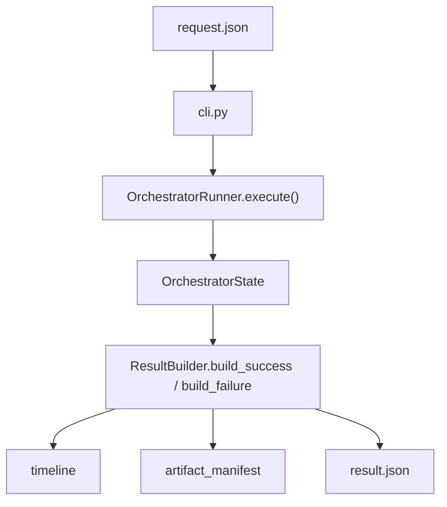

# Step 4：统一 result.json / timeline / artifact manifest 输出

## 这一步的目标

把执行层的结果输出面固定下来，让 runner 产出的 `result.json` 不只是“有一坨 results”，而是能被 Jenkins 归档、能被 `platform-api` 接住、也能被后续 portal 展示使用的标准化结果对象。

这一轮最重要的是把下面 3 件事收口：

- `result.json` 的顶层结构长什么样
- timeline 应该怎么从 orchestrator 结果里组装出来
- artifact manifest 应该怎么统一表达 request / result / handler 产物

## 预期结果

这一轮做完后，执行层应当具备下面这些可观察结果：

- `result.json` 顶层除了 `summary` 和 `results`，还会稳定产出 `timeline`
- `result.json` 顶层会稳定产出 `artifact_manifest`
- `artifact_manifest` 能统一承接：
  - workflow request JSON
  - workflow result JSON
  - handler 返回的 artifact 列表
- timeline 至少能表达：
  - workflow started
  - item completed / failed
  - workflow completed / failed
- 输出形状尽量贴近 `platform-api` 现有 `ArtifactDescriptor` 约定，减少后续 callback 适配成本

这一轮先不扩的内容包括：

- timeline 的前端可视化
- 更细的 stage/span 甘特图表达
- Jenkins artifact URL 的自动反填
- portal 侧的复杂聚合展示

## 这一步的代码设计

这一轮的最小实现优先落在 `result_builder.py`，不去改 handler 主逻辑。

建议固定成下面这条职责线：

- `runner.py`
  - 继续只负责执行和收集 `OrchestratorState`
- `handlers/*`
  - 继续各自返回 `HandlerResult.summary` / `HandlerResult.artifacts`
- `result_builder.py`
  - 负责把 `OrchestratorState` 变成：
    - 顶层 `summary`
    - 顶层 `timeline`
    - 顶层 `artifact_manifest`
    - 分桶 `results`

这一轮最关键的判断是：

```text
timeline / artifact_manifest 是结果组装问题，不是执行编排问题。
```

所以优先改 `ResultBuilder`，不要把格式化输出逻辑散到 `runner.py` 或各个 handler 里。

## 函数调用流程图



## 结果输出约定

### 1. timeline

当前最小 timeline 采用 item 级别输出：

- `workflow_started`
- `item_completed` / `item_failed`
- `workflow_completed` / `workflow_failed`

每条 item timeline 至少带：

- `bucket`
- `status`
- `model`
- `stage_id`
- `item_id`
- `started_at`
- `completed_at`

这意味着：

- 当前 timeline 更接近“标准化执行事件列表”
- 还不是前端最终展示需要的完整甘特图结构
- 但已经足够作为 Jenkins callback / portal timeline 页的上游数据源

### 2. artifact_manifest

当前 artifact manifest 统一承接 3 类来源：

1. CLI / runner 自带产物
   - `workflow_request_json`
   - `workflow_result_json`
2. `artifacts.extra_artifacts`
3. handler 在 `HandlerResult.artifacts` 中回传的产物

统一后的单条 artifact 尽量贴近 `platform-api` 的 `ArtifactDescriptor`：

- `kind`
- `label`
- `path`
- `url`
- `content_type`
- `source`
- `metadata`

其中：

- `source` 默认来自当前 handler 的 `model`
- `metadata` 会补入 `bucket / stage_id / item_id / status`

## 推荐最小输出示例

```json
{
  "status": "completed",
  "testline": "7_5_UTE5G402T813",
  "testline_alias": "T813",
  "artifact_manifest": [
    {
      "kind": "workflow_request_json",
      "label": "Workflow request JSON",
      "path": "configs/sample_request.json",
      "content_type": "application/json",
      "source": "cli",
      "metadata": {}
    },
    {
      "kind": "workflow_result_json",
      "label": "Workflow result JSON",
      "path": "artifacts/day2-step4-result.json",
      "content_type": "application/json",
      "source": "runner",
      "metadata": {}
    },
    {
      "kind": "kpi_excel",
      "label": "KPI workbook",
      "path": "artifacts/kpi.xlsx",
      "source": "kpi_generator",
      "metadata": {
        "bucket": "followups",
        "stage_id": 90,
        "item_id": "generator-1",
        "status": "completed"
      }
    }
  ],
  "timeline": [
    {
      "event": "workflow_started",
      "scope": "workflow",
      "status": "running",
      "started_at": "2026-04-22T10:00:00+08:00",
      "completed_at": "2026-04-22T10:00:00+08:00"
    },
    {
      "event": "item_completed",
      "scope": "item",
      "bucket": "traffic",
      "status": "completed",
      "model": "attach",
      "stage_id": 1,
      "item_id": "attach-1",
      "started_at": "2026-04-22T10:00:01+08:00",
      "completed_at": "2026-04-22T10:00:20+08:00"
    },
    {
      "event": "workflow_completed",
      "scope": "workflow",
      "status": "completed",
      "started_at": "2026-04-22T10:30:00+08:00",
      "completed_at": "2026-04-22T10:30:00+08:00"
    }
  ]
}
```

## 开发侧验收步骤（服务器侧执行）

```bash
cd /opt/jenkins_robotframework/test-workflow-runner
python3 -m venv .venv
source .venv/bin/activate
python -m pip install --upgrade pip
python -m pytest tests/test_orchestrator.py
python -m test_workflow_runner.cli configs/sample_request.json --dry-run --result-json artifacts/day2-step4-result.json
```

然后重点确认：

- `artifacts/day2-step4-result.json` 顶层存在 `timeline`
- `artifacts/day2-step4-result.json` 顶层存在 `artifact_manifest`
- `artifact_manifest` 至少包含 request / result JSON 两项
- timeline 首尾分别是 `workflow_started` 和 `workflow_completed`

## 开发侧验收结果

- [x] `result.json` 顶层已补 `timeline`
- [x] `result.json` 顶层已补 `artifact_manifest`
- [x] `artifact_manifest` 已能统一 request / result / handler artifact
- [x] timeline 已能表达 workflow 与 item 级执行事件
- [ ] 等待用户在服务器执行命令并回贴结果

## 测试侧验收步骤（服务器侧执行）

```bash
python -m pytest tests/test_orchestrator.py
```

## 测试侧验收结果

- [x] 已补 CLI dry-run 结果形状断言
- [x] 已补 `ResultBuilder` 的 timeline / artifact_manifest 单元断言
- [ ] 等待用户在服务器执行 pytest 并回贴结果

## 本次修改文件

- `test-workflow-runner/test_workflow_runner/result_builder.py`
  - 增加顶层 `timeline` 组装逻辑。
  - 增加顶层 `artifact_manifest` 组装逻辑。
  - 增加 artifact 标准化和去重逻辑。
- `test-workflow-runner/tests/test_orchestrator.py`
  - 补充 CLI dry-run 输出中的 `timeline` / `artifact_manifest` 断言。
  - 增加 `ResultBuilder` 的最小结果组装测试。

## 学习版说明

这一步解决的不是“怎么执行”，而是“怎么把执行结果稳定地说出来”。

如果没有统一的 `result.json / timeline / artifact_manifest`：

- Jenkins 不知道该归档什么
- `platform-api` 不知道该接什么
- portal 后续也没有稳定的数据面可展示

所以 Step 4 的本质是：

```text
把执行层结果从“内部状态对象”升级成“可协作的标准化输出”。
```

## 相关专题与测试文档

- [模块总索引](../index.md)
- [Step 1：runner request loader / workflow schema / CLI dry-run](step-01-runner-request-loader-and-cli.md)
- [Step 5：generator / detector internal API params contract](step-05-generator-detector-internal-api-contract.md)
- [GNB KPI Regression Architecture](../../../overview/gnb-kpi-regression-architecture.md)
- [GNB KPI System Runtime](../../../overview/gnb-kpi-system-runtime.md)