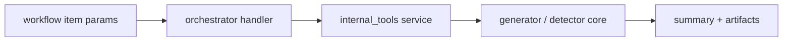

# Step 5：generator / detector internal API params contract

## 这一步的目标

把执行层后处理能力的调用方式固定下来。

这一轮的关键不是再引入新的外部脚本入口，而是明确：

- `kpi_generator`
- `kpi_detector`

在 orchestrator 里都已经改成内部 API 调用；

也就是说，这一步要冻结的是：

- item 的 `model` 应该怎么写
- `params` 最小需要哪些字段
- 哪些字段属于业务输入
- 哪些字段属于执行期输出目录 / 凭据 / 调试开关

## 预期结果

这一轮做完后，执行层应当具备下面这些稳定约定：

- followup item 可以直接使用 `model: kpi_generator`
- followup item 可以直接使用 `model: kpi_detector`
- handler 不再依赖 `params.command`
- `params` 的最小合同已经固定
- Jenkins / runner / platform-api 后续都能围绕同一份参数面继续推进

## 当前实现边界

当前代码路径已经切成下面这条链路：

```text
traffic item params -> orchestrator handler -> internal_tools service -> result summary / artifacts
```

当前这里先不再采用：

- `params.command`
- 额外 subprocess 包装脚本
- 旧项目目录结构下的脚本入口

## 通用上下文字段注入

当前两个 followup handler 都会先对 `params` 做一层上下文补全：

- 如果没有显式传 `environment`，默认注入 `context.testline_context.resolved_config.config_id`，例如 `T813`
- 如果没有显式传 `test_line`，默认注入本次 request 的完整 `testline`
- 如果调用方已经显式传值，handler 保留调用方提供的值，不会强制覆盖

这意味着：

- 从 workflow 作者视角，`environment` / `test_line` 不一定需要每次都手工填写
- 但如果你要和历史脚本、外部平台或特殊目录约定精确对齐，仍然可以在 `params` 里显式覆盖

## 函数调用流程图



## `kpi_generator` params 约定

### 最小必填字段

- `build`
- `scenario`
- `report_timestamps_list`
- `template_set_name` 或 `template_names`

其中：

- `template_set_name` 适合沿用模板集合名
- `template_names` 适合显式指定模板列表
- `environment` 如未显式传值，当前 handler 会默认使用当前 testline 的 `config_id`
- `test_line` 如未显式传值，当前 handler 会默认使用本次 request 的完整 `testline`

### 常用可选字段

- `environment`
- `timestamp_delta_minutes`
- `test_line`
- `output_dir`
- `result_json_path`
- `verbose`
- `compass_username`
- `compass_password`

### 字段分层建议

建议把 `kpi_generator` 的 `params` 按下面理解：

- 业务输入
  - `build`
  - `scenario`
  - `template_set_name`
  - `template_names`
  - `report_timestamps_list`
  - `timestamp_delta_minutes`
  - `environment`
  - `test_line`
- 执行控制
  - `output_dir`
  - `result_json_path`
  - `verbose`
- 凭据输入
  - `compass_username`
  - `compass_password`

如果没有在 `params` 里传 `compass_username` / `compass_password`，当前实现会回退到环境变量：

- `COMPASS_USERNAME`
- `COMPASS_PASSWORD`

不再允许把 Compass 默认账号密码直接写死在仓库里。

### 推荐示例

```json
{
  "item_id": "generator-1",
  "model": "kpi_generator",
  "enabled": true,
  "order": 10,
  "execution_mode": "serial",
  "continue_on_failure": false,
  "ue_scope": {
    "mode": "all_selected_ues"
  },
  "params": {
    "template_names": ["Throughput", "Accessibility"],
    "build": "SBTS26R3.ENB.9999.260319.000005",
    "environment": "T813.SCF.T813.gNB.25R3.20260224",
    "scenario": "7UE_DL_Burst",
    "report_timestamps_list": [
      ["2026-04-22 10:00:00", "2026-04-22 10:05:00"],
      ["2026-04-22 10:10:00", "2026-04-22 10:15:00"]
    ],
    "timestamp_delta_minutes": 5,
    "output_dir": "artifacts/kpi/generator",
    "result_json_path": "artifacts/kpi/generator/result.json"
  }
}
```

### dry-run 下的行为

当 `runtime_options.dry_run=true` 时：

- handler 不会真的调用 Compass
- 返回的 summary 会标记 `implementation_mode=internal_api_dry_run`
- dry-run summary 会带上最终生效的 `environment` / `test_line`
- 主要用于先验证 workflow 结构和参数面

## `kpi_detector` params 约定

### 最小必填字段

- `source_file` 或 `input_file`

当前 detector 的入口首先要求有一个已经存在的 KPI Excel 文件。

### 常用可选字段

- `environment`
- `test_line`
- `runtime_root`
- `reports_dir`
- `docs_dir`
- `sheet_name`
- `history_sheet_name`
- `history_filename`
- `report_suffix`
- `allow_scout_summary`
- `generate_html`

### 字段分层建议

建议把 `kpi_detector` 的 `params` 按下面理解：

- 业务输入
  - `source_file` / `input_file`
  - `sheet_name`
  - `history_sheet_name`
  - `history_filename`
  - `report_suffix`
  - `allow_scout_summary`
  - `generate_html`
- 执行目录
  - `runtime_root`
  - `reports_dir`
  - `docs_dir`

如果没有显式传目录参数，当前实现会默认落到：

```text
<cwd>/kpi-artifacts/kpi_detector/<item_id or source_file_stem>/
```

### 推荐示例

```json
{
  "item_id": "detector-1",
  "model": "kpi_detector",
  "enabled": true,
  "order": 20,
  "execution_mode": "serial",
  "continue_on_failure": false,
  "ue_scope": {
    "mode": "all_selected_ues"
  },
  "params": {
    "source_file": "artifacts/kpi/generator/exec20260422T100000_SBTS26R3.ENB.9999.260319.000005_T813.SCF.T813.gNB.25R3.20260224_7UE_DL_Burst_1csv.xlsx",
    "reports_dir": "artifacts/kpi/detector/reports",
    "docs_dir": "artifacts/kpi/detector/docs",
    "report_suffix": "main",
    "generate_html": true,
    "allow_scout_summary": true
  }
}
```

### dry-run 下的行为

当 `runtime_options.dry_run=true` 时：

- handler 不会真的读取 Excel 文件
- 返回的 summary 会标记 `implementation_mode=internal_api_dry_run`
- dry-run summary 会带上最终生效的 `environment` / `test_line`
- 可以先验证 followup 链路是否挂接正确

## 推荐的 followup stage 组织方式

推荐把后处理阶段固定成串行 followup：

```json
{
  "stage_id": 90,
  "stage_name": "kpi_followups",
  "execution_mode": "serial",
  "items": [
    {
      "item_id": "generator-1",
      "model": "kpi_generator",
      "enabled": true,
      "order": 10,
      "execution_mode": "serial",
      "continue_on_failure": false,
      "ue_scope": { "mode": "all_selected_ues" },
      "params": {
        "template_names": ["Throughput"],
        "build": "SBTS26R3.ENB.9999.260319.000005",
        "environment": "T813.SCF.T813.gNB.25R3.20260224",
        "scenario": "7UE_DL_Burst",
        "report_timestamps_list": [
          ["2026-04-22 10:00:00", "2026-04-22 10:05:00"]
        ]
      }
    },
    {
      "item_id": "detector-1",
      "model": "kpi_detector",
      "enabled": true,
      "order": 20,
      "execution_mode": "serial",
      "continue_on_failure": false,
      "ue_scope": { "mode": "all_selected_ues" },
      "params": {
        "source_file": "artifacts/kpi/generator/latest.xlsx",
        "generate_html": true
      }
    }
  ]
}
```

这条组织方式的核心意义是：

- generator 先产出 Excel
- detector 再消费 Excel
- 不把两者做成互相独立且无序的并行项

补充说明：这不只是风格建议。当前 safety 规则里，`kpi_generator` / `kpi_detector` 都属于 `followup` 保护域；如果把多个 followup item 放进并行 stage，标准 CLI 主路径会在 `RequestLoader` 阶段直接拒绝这类请求。

## 开发侧验收步骤（服务器侧执行）

```bash
cd /opt/jenkins_robotframework/test-workflow-runner
python3 -m venv .venv
source .venv/bin/activate
python -m pip install --upgrade pip
python -m pytest tests/test_orchestrator.py
python -m test_workflow_runner.cli configs/sample_request.json --dry-run --result-json artifacts/day2-step5-result.json
```

## 开发侧验收结果

- [ ] `kpi_generator` item 已可被 request loader 接受
- [ ] `kpi_detector` item 已可被 request loader 接受
- [ ] dry-run 下 followup handler 已走 internal API 模式
- [ ] 文档中的 `params` 示例已可作为后续 Jenkins / API 对齐基线

## 测试侧验收步骤（服务器侧执行）

```bash
python -m pytest tests/test_orchestrator.py
```

## 测试侧验收结果

- [ ] pytest 已覆盖 followup handler 的 dry-run 主路径
- [ ] `kpi_generator` 不再依赖 `params.command`
- [ ] `kpi_detector` 不再依赖 `params.command`
- [ ] followup 结果仍能进入 orchestrator 的 `followup_results`

## 相关专题与测试文档

- [模块总索引](../index.md)
- [Step 1：runner request loader / workflow schema / CLI dry-run](step-01-runner-request-loader-and-cli.md)
- [GNB KPI Regression Architecture](../../../overview/gnb-kpi-regression-architecture.md)
- [GNB KPI System Runtime](../../../overview/gnb-kpi-system-runtime.md)
