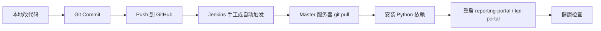
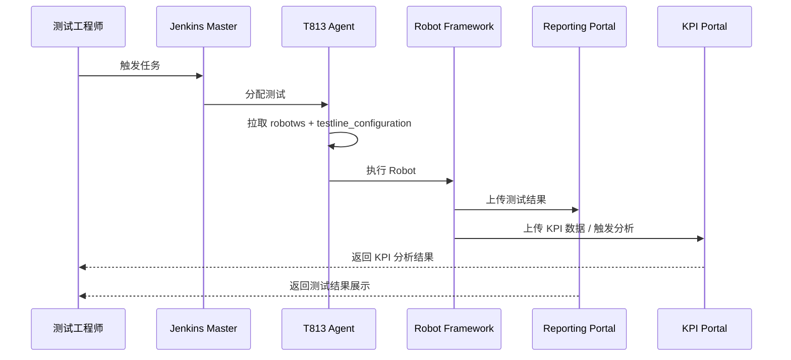

# Jenkins 自动化测试平台轻量化部署方案
## 本地 IDE 开发 + GitHub 同步 + Jenkins/KPI/Reporting 一体化部署

**文档版本**：v2.0  
**更新日期**：2026-04-16  
**适用环境**：Windows 本地开发机 + Debian 13 / Ubuntu 22.04+  
**GitHub 仓库**：https://github.com/stella555359/jenkins_robotframework

---

## 文档概述

本文档用于指导你以轻量化方式搭建 Jenkins 自动化测试平台，并集成 KPI Portal 与 Reporting Portal。

这份版本已经统一为以下原则：

- `jenkins-kpi-platform`、`kpi-portal`、`reporting-portal` 三块代码统一在本地 IDE 开发
- 所有代码统一 push 到 GitHub 仓库 `jenkins_robotframework`
- Debian 服务器只负责 `git pull`、安装依赖、配置 systemd、启动服务
- Jenkins、KPI Portal、Reporting Portal 统一通过 Nginx 暴露为 HTTPS 入口

---

## 一、当前环境参数

- 本地 Windows 用户：`stlin`
- 本地仓库路径：`C:\TA\jenkins_robotframework`
- Master 服务器：`10.71.210.104`
- Agent 服务器：`10.57.159.149`
- Debian SSH 用户：`ute`
- 服务器统一部署路径：`/opt/jenkins_robotframework`

---

## 二、项目目标

### 2.1 核心目标

- 在当前已有 2 台服务器基础上完成平台上线
- 支持测试线 `7_5_UTE5G402T813` 的自动化测试执行
- 实现 Jenkins 调度 -> Robot Framework 执行 -> KPI 分析 -> 结果展示的闭环
- 以最小可维护成本部署 Jenkins、KPI Portal、Reporting Portal
- 后续所有代码修改都通过 GitHub 同步，而不是在服务器直接改代码

### 2.2 轻量化原则

- 单台 Master 服务器承载 Jenkins + KPI Portal + Reporting Portal
- 单台 Agent 服务器承载测试线执行
- 先使用 FastAPI + Python venv + systemd + Nginx
- 先支持 IP + HTTPS，自签名或公司内部 CA 证书均可
- 先保证链路跑通，再逐步补强自动化发布和扩展能力

---

## 三、总体架构

### 3.1 架构图

```mermaid
flowchart TB
    subgraph Local[本地开发环境]
        IDE[本地 IDE]
        REPO[GitHub Repo\njenkins_robotframework]
        IDE --> REPO
    end

    subgraph Master[Master 10.71.210.104]
        NGINX[Nginx HTTPS 入口\n443]
        JENKINS[Jenkins\n127.0.0.1:8080/jenkins]
        KPI[KPI Portal\n127.0.0.1:8001]
        REPORT[Reporting Portal\n127.0.0.1:8000]
        CODE[/opt/jenkins_robotframework]
        NGINX --> JENKINS
        NGINX --> KPI
        NGINX --> REPORT
        CODE --> JENKINS
        CODE --> KPI
        CODE --> REPORT
    end

    subgraph Agent[Agent 10.57.159.149]
        JA[Jenkins Agent]
        RW[robotws]
        TL[testline_configuration]
        RF[Robot Framework]
        JA --> RW
        JA --> TL
        JA --> RF
    end

    REPO -->|git pull| CODE
    JENKINS -->|SSH / Job Dispatch| JA
    RF -->|POST test results| REPORT
    RF -->|POST KPI data / trigger analysis| KPI
```

### 3.2 发布链路图



### 3.3 数据流图



---

## 四、部署边界与职责

### 4.1 本地 IDE 负责

- `jenkins-kpi-platform` 配置和 Pipeline 开发
- `kpi-portal` 代码开发
- `reporting-portal` 代码开发
- 自测和提交 Git 版本

### 4.2 GitHub 仓库负责

- 保存主线代码
- 记录历史版本
- 作为服务器部署同步源

### 4.3 Debian 服务器负责

- 拉取仓库代码
- 安装依赖
- 提供 Jenkins / KPI / Reporting 运行环境
- 执行 systemd 服务管理
- 通过 Nginx 提供统一 HTTPS 访问入口

### 4.4 不再采用的方式

- 不在 Debian 服务器直接长期维护业务代码
- 不在服务器本地单独保存一份“特殊版本”源码
- 不允许服务器代码与 GitHub 主线脱节

---

## 五、推荐目录结构

### 5.1 本地仓库结构

```text
C:\TA\jenkins_robotframework
├── jenkins-kpi-platform/
│   ├── jcasc/
│   ├── jobs/
│   ├── pipelines/
│   └── scripts/
├── kpi-portal/
│   ├── app/
│   └── requirements.txt
├── reporting-portal/
│   ├── app/
│   └── requirements.txt
├── deploy/
│   ├── systemd/
│   ├── nginx/
│   └── scripts/
└── docs/
```

### 5.2 服务器目录结构

```text
/opt/jenkins_robotframework
├── jenkins-kpi-platform/
├── kpi-portal/
├── reporting-portal/
├── deploy/
└── docs/
```

### 5.3 FastAPI 入口说明

当前 `kpi-portal` 和 `reporting-portal` 的实际入口文件都是：

- `app/main.py`

也就是说，当前推荐启动方式是：

```bash
uvicorn app.main:app
```

当前仓库没有单独创建根目录 `main.py`，这是为了保持结构简单；如果后续你想补一个根目录启动包装器，也可以再增加，但不是必须项。

---

## 六、实施步骤

### 第一步：本地 GitHub 仓库准备

本地执行：

```powershell
cd C:\TA
git clone https://github.com/stella555359/jenkins_robotframework.git
cd C:\TA\jenkins_robotframework
```

推荐分支策略：

- `main`: 稳定发布
- `dev`: 日常集成
- `feature/*`: 新功能
- `fix/*`: 修复

### 第二步：服务器基础环境准备

Master 执行：

```bash
sudo apt update
sudo apt upgrade -y
sudo apt autoremove -y

sudo apt install -y \
    curl \
    wget \
    git \
    vim \
    htop \
    tree \
    unzip \
    net-tools \
    python3 \
    python3-pip \
    python3-venv \
    python3-dev \
    build-essential \
    openjdk-21-jdk \
    nginx

sudo mkdir -p /opt/jenkins_robotframework
sudo chown -R $USER:$USER /opt/jenkins_robotframework
```

Agent 执行：

```bash
sudo apt update
sudo apt upgrade -y

sudo apt install -y \
    python3 \
    python3-pip \
    python3-venv \
    openjdk-21-jre \
    git \
    openssh-server \
    curl \
    vim

sudo useradd -m -s /bin/bash jenkins || true
echo "jenkins ALL=(ALL) NOPASSWD:ALL" | sudo tee /etc/sudoers.d/jenkins
sudo mkdir -p /automation/{workspace,venv,logs,downloads}
sudo chown -R jenkins:jenkins /automation
```

### 第三步：Jenkins Master 部署

```bash
sudo wget -O /usr/share/keyrings/jenkins-keyring.asc \
  https://pkg.jenkins.io/debian-stable/jenkins.io.key

echo "deb [signed-by=/usr/share/keyrings/jenkins-keyring.asc] https://pkg.jenkins.io/debian-stable binary/" | \
  sudo tee /etc/apt/sources.list.d/jenkins.list > /dev/null

sudo apt update
sudo apt install -y jenkins
sudo systemctl enable jenkins
sudo systemctl start jenkins
sudo cat /var/lib/jenkins/secrets/initialAdminPassword
```

初始化访问：

```powershell
ssh -L 8080:localhost:8080 ute@10.71.210.104
```

本地浏览器打开：

```text
http://localhost:8080
```

### 第四步：配置 Jenkins 子路径

为了后面通过 `/jenkins/` 反向代理，需要先配置 Jenkins 前缀。

```bash
sudo systemctl edit jenkins
```

写入：

```ini
[Service]
Environment="JENKINS_PREFIX=/jenkins"
```

然后执行：

```bash
sudo systemctl daemon-reload
sudo systemctl restart jenkins
sudo systemctl status jenkins
```

Jenkins Web 中将 `Jenkins URL` 设置为：

- `https://10.71.210.104/jenkins/`

### 第五步：Jenkins Agent 配置

Master 上生成 SSH 密钥：

```bash
ssh-keygen -t rsa -b 4096 -C "jenkins-master" -f ~/.ssh/jenkins_agent_rsa -N ""
```

配置到 Agent 后验证：

```bash
ssh -i ~/.ssh/jenkins_agent_rsa jenkins@10.57.159.149 "echo 'SSH OK'"
```

在 Jenkins Web 添加 Agent：

- Name: `t813-agent`
- Remote root directory: `/automation/workspace`
- Labels: `t813 robot`
- Launch method: `Launch agents via SSH`
- Host: `10.57.159.149`

### 第六步：服务器同步 GitHub 仓库

服务器第一次部署：

```bash
cd /opt
sudo git clone https://github.com/stella555359/jenkins_robotframework.git
sudo chown -R $USER:$USER /opt/jenkins_robotframework
```

后续同步：

```bash
cd /opt/jenkins_robotframework
git fetch origin
git checkout main
git pull --ff-only origin main
```

### 第七步：KPI Portal 和 Reporting Portal 部署

安装 `reporting-portal` 依赖：

```bash
cd /opt/jenkins_robotframework/reporting-portal
python3 -m venv venv
source venv/bin/activate
pip install --upgrade pip
pip install -r requirements.txt
deactivate
```

安装 `kpi-portal` 依赖：

```bash
cd /opt/jenkins_robotframework/kpi-portal
python3 -m venv venv
source venv/bin/activate
pip install --upgrade pip
pip install -r requirements.txt
deactivate
```

配置 systemd：

```bash
sudo cp /opt/jenkins_robotframework/deploy/systemd/reporting-portal.service /etc/systemd/system/reporting-portal.service
sudo cp /opt/jenkins_robotframework/deploy/systemd/kpi-portal.service /etc/systemd/system/kpi-portal.service
sudo systemctl daemon-reload
sudo systemctl enable reporting-portal
sudo systemctl enable kpi-portal
sudo systemctl restart reporting-portal
sudo systemctl restart kpi-portal
```

### 第八步：Nginx 与 HTTPS 配置

如果当前没有正式域名，先用自签名证书测试：

```bash
sudo openssl req -x509 -nodes -days 365 -newkey rsa:4096 \
  -keyout /etc/ssl/private/jenkins-kpi-platform.key \
  -out /etc/ssl/certs/jenkins-kpi-platform.crt \
  -subj "/CN=10.71.210.104"
```

推荐 Nginx 配置：

```nginx
server {
    listen 80;
    server_name 10.71.210.104;

    return 301 https://$host$request_uri;
}

server {
    listen 443 ssl;
    server_name 10.71.210.104;

    ssl_certificate /etc/ssl/certs/jenkins-kpi-platform.crt;
    ssl_certificate_key /etc/ssl/private/jenkins-kpi-platform.key;
    ssl_protocols TLSv1.2 TLSv1.3;

    proxy_set_header Host $host;
    proxy_set_header X-Real-IP $remote_addr;
    proxy_set_header X-Forwarded-For $proxy_add_x_forwarded_for;
    proxy_set_header X-Forwarded-Proto $scheme;

    location /jenkins/ {
        proxy_pass http://127.0.0.1:8080/jenkins/;
        proxy_http_version 1.1;
        proxy_set_header Connection "";
    }

    location /reports/ {
        proxy_pass http://127.0.0.1:8000/;
    }

    location /kpi/ {
        proxy_pass http://127.0.0.1:8001/;
    }
}
```

启用：

```bash
sudo cp /opt/jenkins_robotframework/deploy/nginx/jenkins-kpi-platform.conf /etc/nginx/sites-available/jenkins-kpi-platform.conf
sudo ln -sf /etc/nginx/sites-available/jenkins-kpi-platform.conf /etc/nginx/sites-enabled/jenkins-kpi-platform.conf
sudo rm -f /etc/nginx/sites-enabled/default
sudo nginx -t
sudo systemctl restart nginx
```

验证：

```bash
curl -k -I https://10.71.210.104/jenkins/
curl -k -I https://10.71.210.104/reports/health
curl -k -I https://10.71.210.104/kpi/health
```

### 第九步：代码开发与发布方式

以后所有代码修改统一按这个流程：

1. 在本地 IDE 修改代码
2. 本地自测
3. `git add` / `git commit`
4. `git push` 到 GitHub
5. Master 服务器 `git pull`
6. 安装依赖
7. 重启 `reporting-portal` / `kpi-portal`

标准命令：

```powershell
cd C:\TA\jenkins_robotframework
git checkout -b feature/my-change
git add .
git commit -m "feat: my change"
git push origin feature/my-change
```

服务器发布：

```bash
cd /opt/jenkins_robotframework
git fetch origin
git checkout main
git pull --ff-only origin main
bash deploy/scripts/deploy_all.sh
```

### 第十步：Jenkins 自动发布

Jenkins 可使用仓库根目录的 `Jenkinsfile` 自动发布，但有一个原则：

- Jenkins 的自动部署任务里默认不要重启 Jenkins 自己

Jenkins 自身重启只放在以下场景：

- 修改 Jenkins 插件
- 修改 JCasC
- 修改 Jenkins Prefix 或系统配置
- 维护窗口内手工操作

---

## 七、验证清单

- [ ] Jenkins Web 可通过 `https://10.71.210.104/jenkins/` 访问
- [ ] Agent 成功在线
- [ ] `reporting-portal` 服务正常
- [ ] `kpi-portal` 服务正常
- [ ] `/reports/health` 返回 200
- [ ] `/kpi/health` 返回 200
- [ ] 服务器代码路径为 `/opt/jenkins_robotframework`
- [ ] 本地代码路径为 `C:\TA\jenkins_robotframework`

常用检查命令：

```bash
cd /opt/jenkins_robotframework
git log -1 --oneline
git status

sudo systemctl status jenkins
sudo systemctl status reporting-portal
sudo systemctl status kpi-portal

curl --noproxy localhost http://localhost:8000/health
curl --noproxy localhost http://localhost:8001/health
```

---

## 八、回滚策略

推荐做法不是在服务器 `git checkout <commit>` 长期运行，而是在本地生成回滚提交。

本地执行：

```powershell
cd C:\TA\jenkins_robotframework
git log --oneline
git revert <problem_commit>
git push origin main
```

服务器同步：

```bash
cd /opt/jenkins_robotframework
git fetch origin
git checkout main
git pull --ff-only origin main
sudo systemctl restart reporting-portal
sudo systemctl restart kpi-portal
```

稳定发布后建议打 tag：

```powershell
git tag -a release-2026-04-16 -m "stable release"
git push origin release-2026-04-16
```

---

## 九、现阶段执行建议

如果你已经完成了 Jenkins Master 部署，后续建议按这个顺序继续：

1. 配 Jenkins Prefix `/jenkins`
2. 配 Agent 和 SSH 免密
3. 同步 GitHub 仓库到 `/opt/jenkins_robotframework`
4. 启动 `reporting-portal` 和 `kpi-portal`
5. 配 Nginx 和 HTTPS
6. 做健康检查
7. 最后再接 Jenkins 自动发布

这个顺序最稳，因为它先保证基础设施通，再上应用，再做自动化。