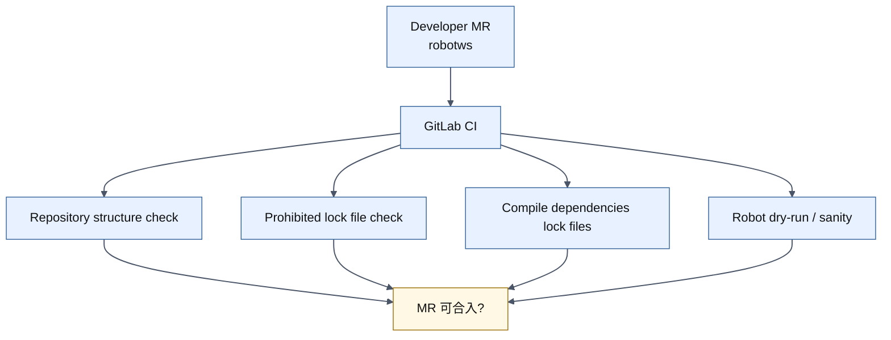
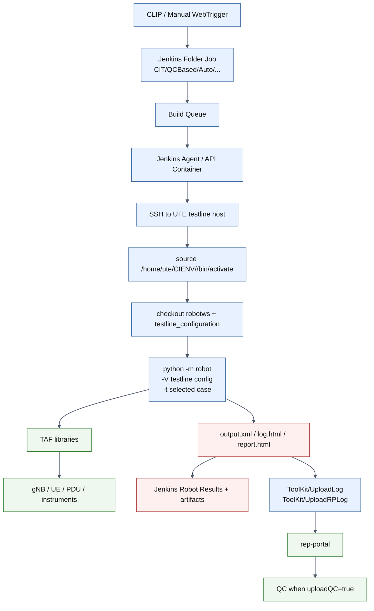
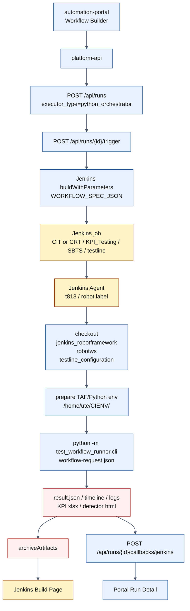

# Jenkins CI/CD Flow

## 文档目标

这份文档总结当前部门自动化框架在 Jenkins 上的 CI/CD 组织方式，并分析 `C:\TA\jenkins_robotframework\test-workflow-runner` 后续做 KPI testing 时哪些部分可以借鉴。

已知当前小组：

```text
5G_PZ_HZ_6_SG
```

从现有 Jenkins 页面和历史架构资料看，部门主流程不是单纯“一个 Jenkinsfile 跑完”，而是：

```text
CLIP / 手工入口
  -> Jenkins folder/job 层级调度
  -> UTE 执行机
  -> robotws + testline_configuration
  -> Robot Framework + TAF
  -> DUT(gNB/UE)
  -> Jenkins artifacts / Robot Results
  -> rep-portal / QC
```

## 1. 当前 Jenkins 目录层级理解

从截图可以看到，部门 Jenkins 大致采用多级 Folder 组织：

```text
Dashboard
  ├─ CIT
  │   └─ QCBased
  │       └─ Auto
  │           ├─ SBTS00
  │           │   ├─ 5G_PZ_HZ_1_SG
  │           │   ├─ 5G_PZ_HZ_2_SG
  │           │   ├─ ...
  │           │   └─ VRF_HAZ_T06
  │           ├─ SBTS25R1
  │           ├─ SBTS25R2
  │           ├─ SBTS25R3
  │           ├─ SBTS26R1
  │           └─ SBTS26R2
  ├─ CRT
  ├─ TesterOperateCases
  └─ ToolKit
```

这个层级可以这样理解：

| Jenkins 层级 | 作用 |
|---|---|
| `CIT` | 持续集成测试主域。 |
| `QCBased` | 和 QC / case set / robot result 关联的自动化测试域。 |
| `Auto` | 自动化执行入口集合。 |
| `SBTS00`、`SBTS25R1`、`SBTS26R2` | 按软件版本或 release train 分组。 |
| `5G_PZ_HZ_6_SG` | 小组 / testline group / feature domain 执行入口。 |
| `VRF_HAZ_T06` | 具体 case line 或 job，页面中能看到 Robot Results、artifacts、build history。 |
| `ToolKit` | 公共工具 job，例如上传 log、上传 rep-portal、补传结果等。 |
| `TesterOperateCases` | 看起来是手工/半自动触发单 case 或操作类 case 的入口。 |

因此，当前部门 Jenkins 的核心思想是：

```text
按业务域和版本建 Folder；
按小组或测试线建 Job；
具体 Job 负责把参数翻译成 UTE 上的 Robot/TAF 执行。
```

## 2. 当前部门 CI/CD 的两条线

### 2.1 代码质量 CI：GitLab CI

`robotws` 仓库本身有 `.gitlab-ci.yml`，主要用于 MR 阶段的 sanity check、依赖锁、dry-run 等。

关键点：

- MR 到 `master` 时触发。
- 检查 `testsuite/` 目录结构。
- 禁止普通用户直接改 `dependencies.py*.lock`，要求改 `requirements.cfg` 后由 CI 生成 lock。
- 按 Python / Robot Framework 版本矩阵生成依赖锁，例如 Python 3.10/3.11/3.12/3.13 + RF 5.0。
- 使用内部 Docker runner，例如 `5G_docker_runner`。
- 使用 `taf-ci` 或 `ci_base_image` 镜像。

这条线的目的不是操作真实 gNB，而是保证代码、依赖和 Robot 脚本结构可合入。



### 2.2 真实执行 CD/CT：Jenkins

Jenkins 负责真实 testline 上的执行，包括：

- 接收 CLIP 或手工 WebTrigger 参数。
- 按 Folder / Job 定位小组和版本。
- 选择 agent。
- SSH 到 UTE 执行机。
- 准备 `robotws` 和 `testline_configuration`。
- 激活 `/home/ute/CIENV/<testline>/` 下的 Python venv。
- 拼 `python -m robot` 命令。
- 跑真实 gNB/UE 操作。
- 归档 Robot artifacts。
- 上传 rep-portal / QC。



## 3. 以 `5G_PZ_HZ_6_SG` 的执行入口理解

截图中 `SBTS00` 下面有多个小组/测试线入口，例如：

```text
5G_PZ_HZ_1_SG
5G_PZ_HZ_2_SG
...
5G_PZ_HZ_6_SG
```

这说明部门不是把所有测试塞进一个大 job，而是按小组或测试域拆开。这样做的好处：

- 各小组可以独立看自己的 build history。
- 每个 job 可以绑定自己的 testline、case set、参数默认值。
- Jenkins 页面直接展示小组维度的 Robot Results。
- 失败定位更直接：进入小组 job 后看具体 build 的 `log.html / output.xml / report.html`。

`VRF_HAZ_T06` 这种具体 job 页面中能看到：

- Build history。
- Last Successful Artifacts。
- `log.html`、`output.xml`、`report.html`。
- Robot Results 汇总，例如 total/failed/passed/pass%。
- build name 中包含 testline、版本、是否 dryrun 等信息。

这对我们后续做 KPI testing 很有参考价值：KPI testing 也应该在 Jenkins 上保留清晰的业务路径，而不是只有一个技术型 job。

## 4. 一次真实执行的关键阶段

结合现有历史资料，一次部门 Jenkins 执行大致分为 8 个阶段。

| 阶段 | 动作 | 关键产物 / 参数 |
|---|---|---|
| 1. 触发 | CLIP 或 WebTrigger 调 Jenkins `buildWithParameters` | testline、case、版本、branch、reservationId |
| 2. 入队 | Jenkins Master 进入 Build Queue | build number、queue item |
| 3. 选 agent | 按 label 选 API container / agent | `Docker && APIServer`、具体 agent |
| 4. 准备 UTE | SSH 到目标 UTE，激活 venv | `/home/ute/CIENV/<testline>/` |
| 5. 准备源码 | checkout `robotws` + `testline_configuration` | caseBranch、testline config |
| 6. 执行 Robot | 拼 `python -m robot` 命令 | `-V testline_configuration/<TL>`、`-t <case>` |
| 7. 归档结果 | Jenkins Robot Plugin + artifacts | `output.xml`、`log.html`、`report.html` |
| 8. 回流结果 | `ToolKit/UploadLog`、`ToolKit/UploadRPLog` | rep-portal link、QC 更新 |

## 5. 对 `test-workflow-runner` / KPI testing 的借鉴

最新方案只考虑 Jenkins CI/CD，不再考虑：

```text
automation-portal -> platform-api -> worker -> test-workflow-runner
```

后续 `test-workflow-runner` 的 KPI testing 主链路固定为：

```text
automation-portal
  -> platform-api
  -> Jenkins
  -> Jenkins agent / UTE workspace
  -> checkout jenkins_robotframework + robotws + testline_configuration
  -> prepare Python / TAF environment
  -> test-workflow-runner CLI
  -> archive artifacts + callback platform-api
```

本项目不动现有部门 Jenkins。我们只在 `C:\TA\jenkins_robotframework` 自己的 `jenkins-integration` 中新增/扩展 KPI runner job，让它在结构、参数、artifact 和命名上尽量贴近部门习惯。

### 5.1 Jenkins Folder 结构要按 KPI 使用场景简化

KPI testing 是本小组自用入口，不需要完整复刻部门 Robot case 的 `CIT/QCBased/Auto/<SBTS>/<group>` 层级。

更推荐按下面结构组织：

```text
CIT
  └─ KPI_Testing
      └─ <SBTS release>
          └─ <testline>

CRT
  └─ KPI_Testing
      └─ <SBTS release>
          └─ <testline>
```

原因：

- 当前项目本来就是小组内使用，不需要再用 `5G_PZ_HZ_6_SG` 做一层分组。
- `CIT` / `CRT` 可以区分常规持续测试和问题复现 / 回归测试入口。
- `<SBTS release>` 保留版本维度，方便按 release train 查历史。
- `<testline>` 是 KPI testing 最重要的归档维度，能直接按测试线查看 build history、artifacts、runner result、KPI 报告。

短期可以让 `<testline>` 直接作为可执行 job，例如：

```text
CIT/KPI_Testing/SBTS26R1/7_5_UTE5G402T813
CRT/KPI_Testing/SBTS26R1/7_5_UTE5G402T813
```

如果后续一个 testline 下需要拆多类 KPI job，再扩展为：

```text
CIT/KPI_Testing/SBTS26R1/7_5_UTE5G402T813/Python_KPI_Runner
CRT/KPI_Testing/SBTS26R1/7_5_UTE5G402T813/Python_KPI_Runner
```

当前更建议先用短期结构，避免过早增加目录层级。

### 5.2 保留 `robotws + testline_configuration + TAF` 的三段关系

部门现有流程已经证明这三者是稳定边界：

```text
robotws = case / keyword / test logic
testline_configuration = tl.ues / tl.gnbs / appserver / test_pc
TAF = 操作真实设备的 Python 能力
```

`test-workflow-runner` 做 KPI testing 时也应该沿用这条边界：

- 不在 runner 中硬编码 testline。
- 不复制 Robot keyword 的历史分发逻辑。
- runner 只做 Python 编排、stage、resource lock、KPI window。
- 真实设备动作后续通过 adapter 调 TAF / robotws Python API。

### 5.3 是否需要 checkout `robotws` 和 `testline_configuration`

需要。

原因是 Python KPI Runner 后续会通过 `TafGateway` / binding adapter 复用 TAF 和 robotws Python 能力，且 runner 自身的 `config_resolver` 需要读取 `testline_configuration` 来拿到：

- `tl.ues`
- `tl.gnbs`
- `tl.appserver`
- `tl.test_pc`
- UE type / family 推断所需的 capability 信息

所以即使不执行 Robot Framework，也仍然需要和 Robot case Jenkins 流程一样，在 Jenkins 前置步骤准备这些源码与环境：

```text
jenkins_robotframework
  - test-workflow-runner
robotws
  - resources / python helpers / possible binding dependencies
testline_configuration
  - 7_5_UTE5G402T813/__init__.py
TAF / site-packages
  - taf.* libraries
```

当前本项目已经有一部分可复用能力：

| 现有能力 | 是否可复用 | 说明 |
|---|---|---|
| `jenkins-integration/scripts/checkout_sources.py` | 可复用 | 已支持 checkout `robotws` 和 `testline_configuration`，默认目录分别为 `robotws`、`testline_configuration`。 |
| `jenkins-integration/scripts/prepare_taf_environment.py` | 可复用 | 已支持复用 `/home/ute/CIENV/<testline>` 或按 robotws lock/requirements 创建 venv。 |
| `jenkins-integration/scripts/materialize_run_request.py` | 需要扩展 | 当前只接受 `executor_type=robot`，要扩展为支持 `python_orchestrator`。 |
| `jenkins-integration/pipelines/robot-execution.Jenkinsfile` 的 `Prepare Workspace` stage | 可复用设计 | checkout + venv 准备逻辑可以抽到 KPI runner pipeline 继续用。 |
| `Build Robot Command` / `Run Robot Case` stage | 不能直接复用 | KPI runner 不拼 `python -m robot`，要改为 `python -m test_workflow_runner.cli ...`。 |

结论：

```text
checkout robotws/testline_configuration 的功能已经有基础实现，可以复用；
但 materialize request 和执行 stage 需要为 python_orchestrator 新增专用逻辑。
```

### 5.4 Jenkins 执行时也应保留 UTE venv 模式

部门当前真实执行依赖：

```text
/home/ute/CIENV/<testline>/
```

这说明 Python 环境不是随便临时建的，而是和 testline/UTE 绑定。KPI testing 如果走 Jenkins，也建议：

- 在 Jenkins agent 或 UTE 上复用 testline 对应 venv。
- 明确 `PYTHONPATH` 包含 `test-workflow-runner`、`robotws`、`testline_configuration`、TAF site-packages。
- 不把 TAF 安装策略塞进 Portal。

### 5.5 结果产物要向 Jenkins / Portal / rep-portal 三方兼容

部门 Jenkins 的使用习惯是：

- Jenkins 页面能看到 build history。
- Jenkins artifacts 里有 `log.html / output.xml / report.html`。
- Robot Results Plugin 能显示 pass/fail。
- rep-portal / QC 能做长期归档。

KPI testing 不一定天然有 Robot output，但应该至少提供等价产物：

| 部门 Robot 产物 | KPI testing 对应产物 |
|---|---|
| `output.xml` | `result.json` / `timeline.json` |
| `log.html` | runner log / HTML summary |
| `report.html` | KPI HTML report / detector report |
| Robot Results | Portal run detail + summary |
| `ToolKit/UploadRPLog` | 后续可选 rep-portal upload adapter |
| QC 回写 | 后续可选 QC metadata mapping |

短期建议先保证：

- Jenkins archive artifacts。
- `platform-api` callback。
- Portal detail 展示 `artifact_manifest`。
- KPI xlsx / detector html 可点击。

### 5.6 build 命名要沿用部门可读风格

截图里的 build name 包含类似：

```text
7_5_UTE5G402T... + SBTS00_ENB_9999... + dryrun
```

KPI testing 也建议保留这种命名习惯：

```text
<testline> + <build> + <scenario> + <dryrun/realrun>
```

这样 Jenkins build history、Portal run list 和后续 rep-portal 之间更容易人工对账。

## 6. 推荐的 KPI testing CI/CD 目标流程

当前只保留 Portal + Jenkins 路径。

适用目标：

- 不动现有部门 Jenkins。
- 本项目 Jenkins 新增独立 KPI runner job。
- 对齐部门 Jenkins 的 build history / artifacts / 命名习惯。
- 复用 Robot 线已有的 checkout 和 TAF 环境准备能力。
- 后续真实设备执行时可以复用 UTE venv、robotws、testline_configuration、TAF。



### 6.1 目标 Jenkins Pipeline 阶段

建议新增独立 KPI runner Jenkinsfile，不改现有 Robot Jenkinsfile 主流程。

推荐阶段：

| Stage | 作用 | 可复用情况 |
|---|---|---|
| `Materialize Workflow Request` | 从 `WORKFLOW_SPEC_JSON` 或 `RUN_ID` 生成 runner request JSON | 参考 `materialize_run_request.py`，但需新增 python_orchestrator 版本 |
| `Prepare Workspace` | checkout `robotws`、`testline_configuration`，确认 `jenkins_robotframework` 本仓库路径 | 复用 `checkout_sources.py` |
| `Prepare Python Environment` | 复用或创建 `/home/ute/CIENV/<testline>`，确保 TAF/robotws 依赖可用 | 复用 `prepare_taf_environment.py` |
| `Run Test Workflow Runner` | 执行 `python -m test_workflow_runner.cli ... --result-json ...` | 新增 |
| `Collect Artifacts` | 收集 `result.json`、runner log、KPI xlsx、detector html | 新增 |
| `Callback Platform API` | POST `/api/runs/{run_id}/callbacks/jenkins` | 复用 `post_run_callback.py` 思路 |
| `Archive` | `archiveArtifacts` | 复用 Jenkins 标准能力 |

### 6.2 最小 Jenkins 参数

`platform-api` 当前 `build_python_orchestrator_jenkins_parameters()` 已能提供：

- `RUN_ID`
- `TESTLINE`
- `EXECUTOR_TYPE=python_orchestrator`
- `WORKFLOW_SPEC_JSON`
- `WORKFLOW_NAME`
- `BUILD`
- `PLATFORM_API_BASE_URL`
- `CALLBACK_URL`
- `DRY_RUN`
- `RUNNER_REPOSITORY_ROOT`
- `RESULT_JSON_PATH`
- `CALLBACK_INSECURE_TLS`

后续建议补充或明确：

- `ROBOTWS_REPO_URL_OVERRIDE`
- `ROBOTWS_GIT_REF`
- `TESTLINE_CONFIGURATION_REPO_URL_OVERRIDE`
- `TESTLINE_CONFIGURATION_GIT_REF`
- `TAF_MODE`
- `PYTHON_ENV_ROOT`
- `ARTIFACT_LABEL`
- `RETRY_INDEX`

这些参数和 Robot 线保持一致，便于复用已有 checkout/env 脚本。

## 7. 和当前项目实现的对应关系

| 部门现有 CI/CD | 当前项目已有/建议对应 |
|---|---|
| CLIP 门户 | `automation-portal` |
| CLIP 后端调 Jenkins | `platform-api` trigger run |
| Jenkins Folder / Job | `jenkins-integration` Job DSL / 后续 KPI runner job |
| UTE venv | runner 执行节点的 Python 环境 |
| `robotws` | 后续真实 adapter 可继续复用 |
| `testline_configuration` | `test_workflow_runner.config_resolver` |
| Robot Framework | Robot case 线继续保留；KPI runner 线不强依赖 Robot runtime |
| TAF | `TafGateway` / binding adapter |
| Robot artifacts | runner `artifact_manifest` |
| rep-portal / QC | 后续可选上传 adapter |

## 8. 后续建议实施顺序

### Step A：先完成本项目 Jenkins 下的独立 KPI runner job

目标：

```text
platform-api -> Jenkins -> test-workflow-runner CLI -> callback
```

最小参数：

- `RUN_ID`
- `TESTLINE`
- `BUILD`
- `WORKFLOW_SPEC_JSON`
- `PLATFORM_API_BASE_URL`
- `CALLBACK_URL`
- `RUNNER_REPOSITORY_ROOT`
- `DRY_RUN`

注意：

```text
不改现有部门 Jenkins；
只在本项目 Jenkins / jenkins-integration 中新增 Job DSL + Jenkinsfile。
```

### Step B：复用 checkout 和环境准备脚本

优先复用：

```text
jenkins-integration/scripts/checkout_sources.py
jenkins-integration/scripts/prepare_taf_environment.py
```

但要新增：

```text
python_orchestrator request materializer
runner CLI execution stage
```

### Step C：对齐 KPI testing Folder / build 命名

建议在本项目 Jenkins 中创建：

```text
CIT/KPI_Testing/<SBTS>/<testline>
CRT/KPI_Testing/<SBTS>/<testline>
```

如果后续同一 testline 下需要多个 job，再扩展为：

```text
CIT/KPI_Testing/<SBTS>/<testline>/Python_KPI_Runner
CRT/KPI_Testing/<SBTS>/<testline>/Python_KPI_Runner
```

build display name 中仍建议保留：

```text
<testline> + <build> + <scenario> + <dryrun/realrun>
```

### Step D：真实设备前再接 TAF/robotws adapter

在真实设备阶段，仍要沿用部门边界：

- testline config 决定 `tl`。
- TAF/robotws Python API 做真实设备动作。
- runner 只做 orchestration。

## 9. 当前判断

`test-workflow-runner` 的 KPI testing 应该借鉴部门 CI/CD，但不直接改部门 Jenkins，也不完全照搬 Robot case job。

当前确认方案：

```text
automation-portal -> platform-api -> Jenkins -> Jenkins agent / UTE -> test-workflow-runner
```

关键结论：

1. 不动现有部门 Jenkins。
2. 新增本项目自己的 Jenkins KPI runner job。
3. `robotws` 和 `testline_configuration` checkout 仍然需要。
4. 现有 `checkout_sources.py` / `prepare_taf_environment.py` 可以复用。
5. `materialize_run_request.py` 当前只支持 `robot`，需要新增或扩展为 `python_orchestrator`。
6. Robot 专用的 command build/run stage 不能复用，需要新增 runner CLI stage。

## 10. 验证与交接

这一步是文档分析，不主动执行服务器验证。

建议后续验证命令：

```bash
cd /opt/jenkins_robotframework/platform-api
source .venv/bin/activate
python -m pytest tests/test_runs.py
```

```bash
cd /opt/jenkins_robotframework/automation-portal
npm run build
```

预期结果：

- 后端 `python_orchestrator` 的 Jenkins trigger contract 仍通过。
- Portal workflow builder 可创建 KPI testing run。
- Jenkins 路径后续补 job 后，可以在 Jenkins build history 中看到 `testline + build + scenario` 风格的构建记录。

常见失败模式：

- Jenkins job path 未配置：`platform-api` trigger 返回 Jenkins dispatch error。
- `WORKFLOW_SPEC_JSON` 太长或包含特殊字符：需要确认 Jenkins parameter 类型和 shell quoting。
- UTE 环境缺 runner 依赖：需要在 Jenkins prepare stage 中固定 venv 或 requirements。
- rep-portal/QC 上传不适配 runner JSON：需要新增 KPI testing 专用 upload adapter，而不是强行伪造 Robot output。

## 11. 待确认方案

在写代码前，建议先确认下面这版方案：

```text
1. 不改部门 Jenkins。
2. 在本项目 jenkins-integration 中新增 KPI runner Job DSL + Jenkinsfile。
3. Job folder 按 KPI testing 自用结构整理，优先使用：
   CIT/KPI_Testing/<SBTS>/<testline>
   CRT/KPI_Testing/<SBTS>/<testline>
   如果同一 testline 下后续需要多个 job，再扩展为：
   CIT/KPI_Testing/<SBTS>/<testline>/Python_KPI_Runner
   CRT/KPI_Testing/<SBTS>/<testline>/Python_KPI_Runner
4. BUILD 作为一等参数保留，表示每次测试的 CIT 包 / 软件包版本。
5. Pipeline 前置 stage 复用 checkout_sources.py checkout robotws/testline_configuration。
6. Pipeline 前置 stage 复用 prepare_taf_environment.py 准备 TAF/Python 环境。
7. 新增 python_orchestrator request materializer，将 WORKFLOW_SPEC_JSON 转成 test-workflow-runner CLI request。
8. 新增 runner 执行 stage：python -m test_workflow_runner.cli <request.json> --result-json <result.json>。
9. post 阶段 archiveArtifacts + callback platform-api。
```

当前代码落地：

```text
jenkins-integration/jobs/kpi-runner-job.groovy
jenkins-integration/pipelines/kpi-runner.Jenkinsfile
jenkins-integration/scripts/materialize_python_orchestrator_request.py
```

其中 `BUILD` 会进入 Jenkins 参数、runner request 顶层字段，并自动补到 `kpi_generator` item 的 `params.build` 中。

`platform-api` 侧需要把 Python KPI Runner 指到新 job：

```text
JENKINS_PYTHON_ORCHESTRATOR_JOB_PATH=job/CIT/job/KPI_Testing/job/SBTS26R1/job/7_5_UTE5G402T813
```

Robot case 线仍然使用：

```text
JENKINS_ROBOT_JOB_PATH=job/robot/job/robot-execution
```
