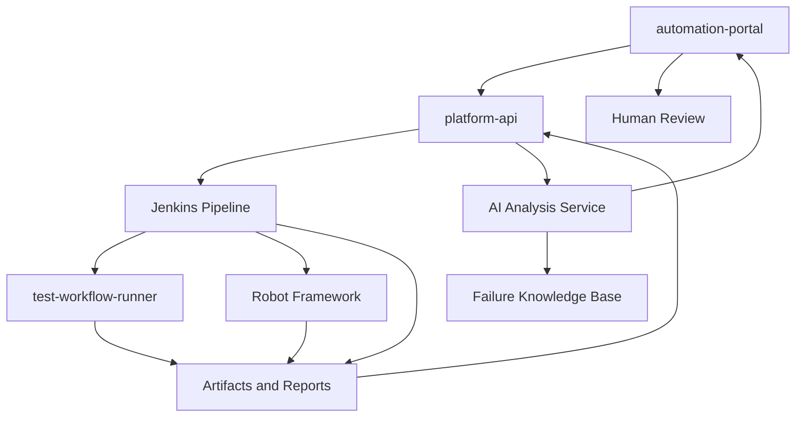

# AI-Driven Intelligent Testing Platform

## 文档定位

这份文档把 `C:\TA\jenkins_robotframework` 从现有 KPI 自动化测试平台演进为 AI-Driven Intelligent Testing Platform 的方向固定下来。

当前平台已经具备纵向闭环：

```text
automation-portal
  -> platform-api
  -> Jenkins
  -> robot / test-workflow-runner
  -> artifacts / KPI / detector
  -> callback
  -> portal detail
```

AI 化不从“让 AI 直接控制 Jenkins”开始，而是先从“AI 读懂运行证据并辅助判断”开始。

## 第一阶段 MVP 边界

第一期只做三个能力：

```text
AI Log Summary
AI RCA Assistant
AI Test Report Generator
```

第一期不做：

```text
AI 自动重跑 Jenkins
AI 自动修改测试环境
AI 自动关闭问题
AI 自动决定 release go / no-go
```

原因：

```text
当前平台最稳定的数据面是 run detail、Jenkins artifact、runner result、KPI summary 和 detector summary。
这些数据足够支撑日志摘要、根因辅助和测试报告。
测试选择、workflow 自动生成、release risk score 需要更多历史样本，放到后续阶段更合适。
```

## 总体架构



## 证据源清单

第一期 AI 分析只使用已经存在或容易归档的数据。

| 证据源 | 产生位置 | 当前状态 | AI 用途 |
|---|---|---|---|
| Jenkins console log | Jenkins build | 需要通过 Jenkins API 或 artifact fetch 获取 | 提取失败 stage、命令、异常栈、调度问题 |
| `artifacts/python-orchestrator-request.json` | `kpi-runner.Jenkinsfile` | 已归档 | 还原 workflow input、testline、build、dry-run、TAF 参数 |
| `artifacts/source-checkout.json` | `checkout_sources.py` | 已归档 | 判断 robotws / testline_configuration checkout 计划与 credentials 来源 |
| `artifacts/python-env.json` | `prepare_taf_environment.py` | 已归档 | 判断 venv、TAF mode、activate script、pip 配置 |
| `artifacts/python-kpi-runner-result.json` | `test-workflow-runner` | 已归档 | 读取 status、timeline、artifact manifest、handler result、KPI window |
| `artifacts/python-kpi-runner-metadata.json` | `kpi-runner.Jenkinsfile` | 已归档 | 聚合 runner result 与 build metadata |
| `artifacts/callback-payload.json` | `post_run_callback.py` | 已归档 | 确认回写给 platform-api 的最终状态 |
| Robot `output.xml` | Robot job | 已规划归档 | 精确解析 suite / test / keyword failure |
| Robot `log.html` / `report.html` | Robot job | 已规划展示 | 给人工快速跳转复核 |
| KPI generator output | runner followup | 已通过 artifact manifest 承接 | 支撑 KPI 报告摘要 |
| KPI detector output | runner followup | 已通过 detector summary 承接 | 支撑 KPI 异常解释 |

## AI 分析结果 Schema

第一期固定一个稳定的 `AIAnalysisResult` 结构，后端和前端都围绕它展开。

```json
{
  "run_id": "run-20260522123000000",
  "analysis_id": "ai-run-20260522123100000",
  "analysis_status": "completed",
  "analysis_version": "ai-mvp-v1",
  "generated_at": "2026-05-22T12:31:00+08:00",
  "input_refs": [
    {
      "kind": "jenkins_console",
      "label": "Jenkins Console",
      "path": null,
      "url": "https://jenkins.example/job/xxx/1/console",
      "available": true
    }
  ],
  "log_summary": {
    "one_line_summary": "Prepare Workspace failed because robotws checkout could not access GitLab.",
    "failed_stage": "Prepare Workspace",
    "failed_command": "bash artifacts/checkout-sources.sh",
    "key_errors": [
      "Permission denied (publickey)"
    ],
    "impact": "Runner did not start; no KPI result was generated.",
    "next_step": "Check robotws credentials and Jenkins sshagent binding."
  },
  "root_cause": {
    "category": "scm_credentials",
    "confidence": "high",
    "symptom": "Git checkout failed in Prepare Workspace.",
    "evidence": [
      {
        "source": "jenkins_console",
        "excerpt": "Permission denied (publickey)",
        "stage": "Prepare Workspace"
      }
    ],
    "recommended_actions": [
      "Verify ROBOTWS_CREDENTIALS_ID or global ROBOTWS credentials.",
      "Re-run only after Jenkins agent can access GitLab."
    ],
    "needs_human_confirmation": true
  },
  "test_report": {
    "title": "KPI Runner Dry Run Report",
    "status": "failed",
    "summary_markdown": "### Summary\nPrepare Workspace failed before runner execution.",
    "sections": [
      {
        "title": "Execution Context",
        "content_markdown": "- testline: 7_5_UTE5G402T813\n- build: SBTS26R1.DRYRUN.001"
      }
    ]
  },
  "quality_signals": {
    "failure_signature": "Prepare Workspace|git|Permission denied publickey",
    "stability_label": "environment_failure",
    "release_risk": "unknown"
  }
}
```

## Failure Signature

`failure_signature` 用于后续聚类和历史召回。

推荐组合：

```text
executor_type
failed_stage
root_cause_category
normalized_error
testline
job_name
```

示例：

```text
python_orchestrator|Prepare Workspace|scm_credentials|permission_denied_publickey|7_5_UTE5G402T813|CIT/KPI_Testing/SBTS26R1/7_5_UTE5G402T813
```

## RCA 分类

第一期先固定以下分类，避免自由文本失控：

```text
jenkins_agent
jenkins_pipeline
scm_checkout
scm_credentials
python_environment
runner_request
runner_execution
robot_case
testline_configuration
kpi_generator
kpi_detector
product_environment
callback
unknown
```

## Platform API 目标接口

第一期建议新增三个查询面：

```text
POST /api/runs/{run_id}/ai-analysis
GET  /api/runs/{run_id}/ai-analysis
GET  /api/runs/{run_id}/ai-report
```

职责：

```text
POST /ai-analysis:
  触发或刷新 AI 分析。

GET /ai-analysis:
  返回结构化 AIAnalysisResult。

GET /ai-report:
  返回适合页面展示或复制汇报的 Markdown / HTML 报告。
```

第一期可以先用规则 + 模板生成，不强依赖外部大模型。

## Automation Portal 目标页面

第一期只增强 Run Detail 页面：

```text
Run Detail
  -> AI Summary Card
  -> RCA Card
  -> Evidence List
  -> Test Report Preview
  -> Copy Report
```

页面原则：

```text
AI 结论必须能看到证据来源。
AI 建议必须标注 confidence。
涉及真实环境操作时必须提示人工确认。
```

## 分阶段路线

### Phase 1：AI Evidence and Report MVP

目标：

```text
让单次 run 完成后可以生成 AI 摘要、RCA 建议和 Markdown 测试报告。
```

交付：

```text
AIAnalysisResult schema
AI evidence mapping
platform-api AI endpoint contract
portal Run Detail AI card design
```

### Phase 2：AI RCA and Failure Knowledge Base

目标：

```text
把单次 RCA 结果沉淀为可检索历史知识。
```

交付：

```text
failure_signature
相似失败查询
Top root cause
flaky / environment noise 标签
```

### Phase 3：AI Test Planning and KPI Intelligence

目标：

```text
从事后分析升级为事前测试推荐和 KPI 风险解释。
```

交付：

```text
基于 Git diff / 历史失败推荐测试
workflow_spec 草案生成
KPI 异常解释
release risk score
```

## 安全边界

必须遵守：

```text
AI 不直接修改生产环境。
AI 不直接重跑 Jenkins。
AI 不直接关闭问题。
AI 不直接给 release go / no-go 最终结论。
敏感日志必须脱敏后再进入外部模型。
企业环境优先考虑本地模型或脱敏代理。
```

## 当前小结

第一期 MVP 的核心不是“AI 替代测试工程师”，而是：

```text
Jenkins / runner / Robot / KPI 继续负责产生事实。
platform-api 负责组织事实。
AI 负责解释事实、归纳证据、生成报告。
测试工程师负责确认结论和执行动作。
```
