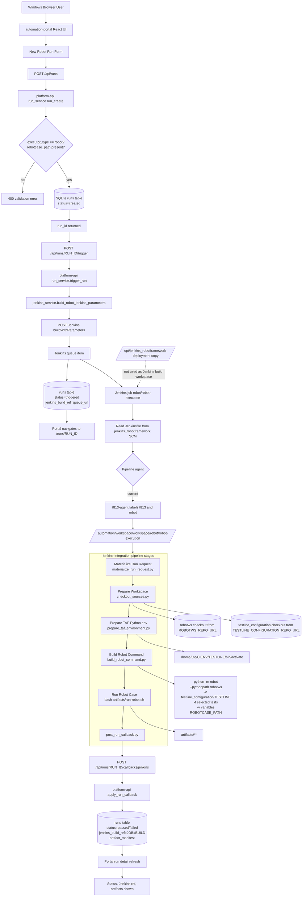

# Automation Portal 触发真实 Robot Case 流程

本文说明部署完成后，如何从 `automation-portal` 页面创建真实 Robot case run，以及这个 run 如何经过 `platform-api`、Jenkins、`jenkins-integration`、Robot 执行、callback，最终回到 Portal 详情页。

## 1. 是否可以直接从 Portal 创建

可以创建，但建议先确认下面几项已经就绪。只要其中一项没配置好，Portal 仍然能创建 run 记录，但触发 Jenkins 或执行 Robot 时会失败。

| 检查项 | 目标状态 | 相关位置 |
|---|---|---|
| Portal | `https://10.71.210.104/` 能打开 | Nginx `/` 指向 `automation-portal/dist` |
| API | `https://10.71.210.104/api/health` 正常 | `platform-api` systemd + Nginx `/api/` |
| Jenkins | `https://10.71.210.104/jenkins/` 能访问 | Jenkins prefix `/jenkins` |
| platform-api Jenkins 配置 | `.env` 中 Jenkins URL、job path、用户名和 token 正确 | `/opt/jenkins_robotframework/platform-api/.env` |
| Jenkins job | `robot/robot-execution` 已存在 | `jenkins-integration/jobs/robot-execution-job.groovy` |
| Jenkins Agent | 目标 Agent 在线且有 executor | Jenkins Nodes 页面 |
| 源码 checkout | Jenkins 全局环境或 job 参数能提供 `robotws` 和 `testline_configuration` repo URL / credentials | Jenkins global env / credentials / job 参数 |
| Python 环境 | Agent 上存在 `/home/ute/CIENV/<TESTLINE>/bin/activate`，除非 job 另行覆盖 | `prepare_taf_environment.py` |

最小 smoke 建议：

```bash
curl -k https://127.0.0.1/api/health
curl -k -I https://127.0.0.1/jenkins/
```

Jenkins job 页面建议也先手动点一次 `Build with Parameters`，确认 Agent、checkout、Python 环境和 Robot 基础链路是通的。

## 2. Jenkins 侧最短配置清单

Portal 能否真正把 run 跑起来，关键不在 Portal 页面本身，而在 Jenkins 这几项是否已经配齐。

### 2.1 Jenkins 全局环境变量

`checkout_sources.py` 默认从 Jenkins 全局环境里拿下面这些值。如果不配，Jenkins 虽然能启动 Pipeline，但会在 checkout 阶段失败。

路径：

```text
Manage Jenkins -> System -> Global properties -> Environment variables
```

建议至少配置：

| 环境变量 | 作用 | 推荐值示例 |
|---|---|---|
| `ROBOTWS_REPO_URL` | `robotws` 源码仓库地址 | `git@your-git-host:team/robotws.git` 或对应 HTTPS 地址 |
| `TESTLINE_CONFIGURATION_REPO_URL` | `testline_configuration` 源码仓库地址 | `git@your-git-host:team/testline_configuration.git` 或对应 HTTPS 地址 |
| `ROBOTWS_CREDENTIALS_ID` | checkout `robotws` 时默认使用的 Jenkins credentials ID | `robotws-ssh` |
| `TESTLINE_CONFIGURATION_CREDENTIALS_ID` | checkout `testline_configuration` 时默认使用的 Jenkins credentials ID | `testline-config-ssh` |

如果你使用的是 JCasC，这几个值也可以通过 [jenkins-integration/jcasc/jenkins.yaml](c:/TA/jenkins_robotframework/jenkins-integration/jcasc/jenkins.yaml) 注入。

### 2.2 Jenkins 全局凭据

路径：

```text
Manage Jenkins -> Credentials -> System -> Global credentials
```

建议至少有两类凭据：

| Credentials ID | 类型 | 用途 |
|---|---|---|
| `t813-agent-ssh` | SSH Username with private key | Jenkins Master 连接 `t813-agent` 节点 |
| `robotws-ssh` | SSH Username with private key | checkout `robotws` |
| `testline-config-ssh` | SSH Username with private key | checkout `testline_configuration` |

如果 `robotws` 和 `testline_configuration` 使用 HTTPS 并允许匿名拉取，可以不配 checkout credentials；但只要仓库需要鉴权，`ROBOTWS_CREDENTIALS_ID` 和 `TESTLINE_CONFIGURATION_CREDENTIALS_ID` 就必须能在 Jenkins 里找到对应 ID。

### 2.3 最短手工创建 `robot/robot-execution` job

如果当前 Jenkins 里还没有 `robot/robot-execution`，第一轮可以直接在 Jenkins 页面手工创建，不必先走 Job DSL。

操作步骤：

1. 打开 Jenkins：`https://10.71.210.104/jenkins/`
2. 登录 Jenkins。
3. 点击 `New Item`。
4. 名称填 `robot/robot-execution`。
5. 如果 Jenkins 不允许直接带 `/` 创建，就先建 Folder `robot`，再在里面新建 Pipeline `robot-execution`。
6. 类型选择 `Pipeline`。
7. 在 `Pipeline` 配置区按下面填写：

```text
Definition: Pipeline script from SCM
SCM: Git
Repository URL: https://github.com/stella555359/jenkins_robotframework.git
Credentials: public repo 第一轮可留空；受限网络或私有仓库再改成 PAT / SSH credentials
Branch Specifier: */feature/jenkins-integration
Script Path: jenkins-integration/pipelines/robot-execution.Jenkinsfile
Repository browser: Auto / 不填 / GitHub
Additional Behaviours: 先留空
Lightweight checkout: 第一轮不要勾选
```

如果你使用 SSH 读取当前仓库，`Repository URL` 改成：

```text
git@github.com:stella555359/jenkins_robotframework.git
```

此时 `Credentials` 不能留空，而应选择 Jenkins 中可访问 GitHub 的 SSH 凭据。

### 2.4 创建后立即验证

保存后，预期 job 页面地址是：

```text
https://10.71.210.104/jenkins/job/robot/job/robot-execution/
```

先在 Jenkins 页面打开 `Build with Parameters`，确认至少能看到这些参数：

```text
RUN_ID
TESTLINE
ROBOTCASE_PATH
CASE_NAME
ROBOT_SELECTED_TESTS
ROBOT_VARIABLES_JSON
PYTHON_ENV_ROOT
ROBOTWS_ROOT
TESTLINE_VARIABLES_PATH
PLATFORM_API_BASE_URL
```

第一轮建议手工点一次 smoke：

```text
TESTLINE=7_5_UTE5G402T813
ROBOTCASE_PATH=testsuite/Hangzhou/RRM/example.robot
PLATFORM_API_BASE_URL=https://10.71.210.104
```

如果 job 页面没有 `Build with Parameters`，或者参数不全，通常说明：

1. `Script Path` 不对。
2. 分支不对。
3. Jenkins 还没成功从 SCM 读取 Jenkinsfile。

## 3. Portal 表单字段怎么填

Portal 的 `New Robot Run` 表单当前会做两件事：

1. `POST /api/runs` 创建 run 记录。
2. `POST /api/runs/{run_id}/trigger` 触发 Jenkins job。

字段含义如下。

| Portal 字段 | 是否必填 | 传到 platform-api / Jenkins 的字段 | 含义 | 示例 |
|---|---:|---|---|---|
| `Testline` | 是 | `testline` / Jenkins `TESTLINE` | 目标测试线标识。Jenkins 默认会用它找 Python 环境 `/home/ute/CIENV/<TESTLINE>`，并找变量目录 `testline_configuration/<TESTLINE>`。 | `7_5_UTE5G402T813` 或现场实际 testline 名称 |
| `Robot case path` | 是 | `robotcase_path` / Jenkins `ROBOTCASE_PATH` | Robot suite 文件路径。可以相对 Jenkins workspace，也可以相对 checkout 后的 `robotws` 根目录。 | `testsuite/Hangzhou/RRM/example.robot` |
| `Case name` | 否 | metadata `case_name` / Jenkins `CASE_NAME` | 单个 Robot test case 名称。最终会转换为 Robot 命令中的 `-t <case name>`。 | `Attach UE` |
| `Build` | 否 | `build`，并自动进入 `ROBOT_VARIABLES_JSON.BUILD` | 版本号或构建号。platform-api 会把它补成 Robot 变量 `BUILD`，除非 JSON 里已经显式提供 `BUILD`。 | `SBTS26R3.ENB.9999` |
| `Selected tests` | 否 | metadata `selected_tests` / Jenkins `ROBOT_SELECTED_TESTS` | 多个 Robot test case 名称，每行一个。最终每行都会转换为一个 `-t`。 | `Attach UE` 换行 `Detach UE` |
| `Robot variables JSON` | 否 | metadata `robot_variables` / Jenkins `ROBOT_VARIABLES_JSON` | Robot `-v KEY:VALUE` 变量映射。必须是 JSON object。 | `{ "AF_PATH": "/path/to/af", "UE_COUNT": "7" }` |

注意：

1. `Case name` 和 `Selected tests` 都会变成 Robot `-t`。如果两边都填，最终会合并去重后一起传给 Robot。
2. `Build` 不直接变成 Jenkins 参数里的 `BUILD`，而是进入 `ROBOT_VARIABLES_JSON`，最终成为 Robot 变量 `-v BUILD:<value>`。
3. `Robot variables JSON` 必须是对象，不能是数组或普通字符串。
4. 如果不确定 testline 的完整名称，应优先使用 Agent 上实际 Python 环境目录和 `testline_configuration` 目录里的名称。

一个较完整的示例：

```text
Testline: 7_5_UTE5G402T813
Robot case path: testsuite/Hangzhou/RRM/example.robot
Case name: Attach UE
Build: SBTS26R3.ENB.9999
Selected tests:
  Attach UE
  Detach UE
Robot variables JSON:
{
  "AF_PATH": "/automation/downloads/SBTS26R3.ENB.9999",
  "UE_COUNT": "7"
}
```

如果只是第一轮连通性验证，可以先只填必填项，并让 `Robot variables JSON` 保持一个合法空对象：

```json
{}
```

## 4. Run 如何对应到 Jenkins Agent

当前链路里，Portal 表单不选择 Agent，platform-api 也不向 Jenkins 传 Agent 参数。

实际由 Jenkins 决定在哪个 Agent 上跑：

```text
Portal 表单 -> platform-api -> Jenkins job robot/robot-execution -> Jenkins 调度 Agent
```

当前 `jenkins-integration/pipelines/robot-execution.Jenkinsfile` 已固定为：

```groovy
pipeline {
  agent { label 't813 && robot' }
    ...
}
```

这表示 Jenkins 只会把构建分配给同时带有 `t813` 和 `robot` label 的 Agent。它仍然不会根据 Portal 的 `Testline` 动态切换到别的节点。

如果后续需要改成别的固定 Agent，常见方式有两种：

### 4.1 推荐方式：在 Jenkinsfile 中固定 label

把 `agent any` 改成目标 label，例如：

```groovy
pipeline {
    agent { label 't813 && robot' }
    ...
}
```

前提是目标 Agent 的 label 包含 `t813` 和 `robot`。

### 4.2 运维方式：让 job 只能调度到目标节点

在 Jenkins 页面中限制 `robot/robot-execution` 的运行节点，或只让目标 Agent 具备可用 executor。这样即使 Jenkinsfile 是 `agent any`，实际也只能落到指定 Agent。

建议第一轮真实 Robot case 前确认：

```text
Manage Jenkins -> Nodes
目标 Agent 在线
目标 Agent labels 包含期望 label
目标 Agent executors > 0
```

JCasC 示例里有一个参考节点：

```yaml
labelString: "robot linux ute"
```

但你当前页面里提到的 `t813-agent` 如果 label 是 `t813 robot`，那 Jenkinsfile label 应该按实际 label 写，例如：

```groovy
agent { label 't813 && robot' }
```

## 5. 端到端流程图



  ## 6. 关键配置关系

### 6.1 platform-api `.env`

`platform-api` 触发 Jenkins 时使用这些配置：

```text
JENKINS_BASE_URL=http://127.0.0.1:8080/jenkins
JENKINS_ROBOT_JOB_PATH=job/robot/job/robot-execution
JENKINS_USERNAME=<jenkins-user>
JENKINS_API_TOKEN=<jenkins-api-token>
PUBLIC_BASE_URL=https://10.71.210.104
```

含义：

| 配置 | 作用 |
|---|---|
| `JENKINS_BASE_URL` | platform-api 触发 Jenkins 的内部地址。 |
| `JENKINS_ROBOT_JOB_PATH` | 要触发的 Jenkins job 路径。当前目标是 `robot/robot-execution`。 |
| `JENKINS_USERNAME` / `JENKINS_API_TOKEN` | Jenkins buildWithParameters 鉴权。 |
| `PUBLIC_BASE_URL` | 传给 Jenkins，供 callback 回写 `https://10.71.210.104/api/runs/{run_id}/callbacks/jenkins`。 |

### 6.2 Jenkins job 参数

platform-api 会把 run record 转成 Jenkins 参数。核心映射如下：

| Jenkins 参数 | 来源 | 用途 |
|---|---|---|
| `RUN_ID` | platform-api 生成 | callback 时定位 run。 |
| `TESTLINE` | Portal `Testline` | Python env 和 testline variables 默认路径。 |
| `ROBOTCASE_PATH` | Portal `Robot case path` | Robot suite 文件路径。 |
| `CASE_NAME` | Portal `Case name` | 作为 Robot `-t`。 |
| `ROBOT_SELECTED_TESTS` | Portal `Selected tests` | 每行一个 Robot `-t`。 |
| `ROBOT_VARIABLES_JSON` | Portal `Robot variables JSON` + `Build` | 转成 Robot `-v KEY:VALUE`。 |
| `PLATFORM_API_BASE_URL` | `PUBLIC_BASE_URL` 或 metadata override | Jenkins callback 目标根地址。 |
| `ROBOTWS_GIT_REF` | metadata override，否则 `master` | checkout `robotws` ref。 |
| `TESTLINE_CONFIGURATION_GIT_REF` | metadata override，否则 `master` | checkout `testline_configuration` ref。 |

### 6.3 Jenkins global env / credentials

`checkout_sources.py` 默认需要这些 Jenkins 全局环境或 job 参数：

```text
ROBOTWS_REPO_URL
TESTLINE_CONFIGURATION_REPO_URL
ROBOTWS_CREDENTIALS_ID
TESTLINE_CONFIGURATION_CREDENTIALS_ID
```

如果这些变量没配，Jenkins 会像你已经看到的那样生成 `source-checkout.json`，但其中 `repo_url` 会是 `null`，后续 `checkout-sources.sh` 会直接报：

```text
Missing repo URL for robotws. Set ROBOTWS_REPO_URL.
Missing repo URL for testline_configuration. Set TESTLINE_CONFIGURATION_REPO_URL.
```

推荐的最小对应关系：

| Jenkins 全局变量 | 建议来源 |
|---|---|
| `ROBOTWS_REPO_URL` | `robotws` 实际 Git 地址 |
| `TESTLINE_CONFIGURATION_REPO_URL` | `testline_configuration` 实际 Git 地址 |
| `ROBOTWS_CREDENTIALS_ID` | Jenkins Credentials 中的 `robotws-ssh` 或同类 ID |
| `TESTLINE_CONFIGURATION_CREDENTIALS_ID` | Jenkins Credentials 中的 `testline-config-ssh` 或同类 ID |

如果 workspace 下已经存在非 git 目录 `robotws/` 或 `testline_configuration/`，脚本可以复用目录。但真实部署建议配置 repo URL 和 credentials，让 Jenkins 每次能同步源码。

### 6.4 Jenkins workspace 与服务器部署代码的关系

当前链路里至少有三份代码副本：

| 副本 | 典型位置 | 用途 |
|---|---|---|
| 开发副本 | 开发机本地仓库 | 改代码、提交、push |
| 部署副本 | `/opt/jenkins_robotframework` | 给 `platform-api`、`automation-portal`、文档和部署侧使用 |
| Jenkins 构建副本 | `/automation/workspace/workspace/robot/robot-execution` | 给 `robot/robot-execution` job 运行时使用 |

关键点：

1. Jenkins job 运行时不会直接读取 `/opt/jenkins_robotframework`。
2. Jenkins job 会按它自己的 SCM 配置重新拉取 `jenkins_robotframework`。
3. `/opt/jenkins_robotframework` 上的本地修改，如果没有 push 到 GitHub，Jenkins job 看不到。
4. 你改了部署侧代码后，如果服务器本机要生效，仍然需要在 `/opt/jenkins_robotframework` 手动 `git pull`，然后重启对应服务或重新构建。

### 6.5 Robot 命令最终形态

`build_robot_command.py` 最终会生成类似命令：

```bash
. /home/ute/CIENV/<TESTLINE>/bin/activate
export http_proxy=''
export https_proxy=''
python -m robot \
  --pythonpath <workspace>/robotws \
  -v AF_PATH:<value> \
  -v BUILD:<build> \
  -x quicktest.xml \
  -b debug.log \
  -d <workspace>/artifacts/quicktest/retry-0/<suite-name> \
  -V <workspace>/testline_configuration/<TESTLINE> \
  -L TRACE \
  -t "Attach UE" \
  <workspace>/robotws/testsuite/Hangzhou/RRM/example.robot
```

如果 `Robot case path` 在 workspace 根目录下找不到，脚本会继续在 `<workspace>/robotws/` 下找。

## 7. Run 状态如何变化

| 阶段 | status | 说明 |
|---|---|---|
| Portal 创建 run | `created` | 已写入 SQLite，还没触发 Jenkins。 |
| trigger 成功 | `triggered` | Jenkins build 已进入 queue，`jenkins_build_ref` 暂时可能是 queue URL。 |
| trigger 失败 | `trigger_failed` | Jenkins URL、token、job path 或权限有问题。 |
| Jenkins callback 成功 | `passed` 或 `failed` | Jenkins 执行完后回写结果，`jenkins_build_ref` 变为 `JOB_NAME#BUILD_NUMBER`。 |

Portal 详情页显示的数据来自：

```text
GET /api/runs/{run_id}
GET /api/runs/{run_id}/artifacts
GET /api/runs/{run_id}/kpi
```

## 8. 第一轮真实 Robot Case 操作建议

1. 先在 Jenkins 页面确认 `robot/robot-execution` 可以手动 `Build with Parameters`。
2. 如果要固定 Agent，先把 Jenkinsfile 或 job 调度限制改好。
3. 在 Portal 只填最小字段：`Testline`、`Robot case path`、合法 JSON `{}`。
4. 创建后进入 run detail，确认状态从 `created` 到 `triggered`。
5. 到 Jenkins 对应 build 页面看 Console Output。
6. Jenkins 结束后回到 Portal detail，确认状态变为 `passed` 或 `failed`，并出现 `jenkins_build_ref` 和 artifacts。

第一轮建议不要同时填很多 Robot 变量。先跑一个最小 smoke case，链路通了再逐步补 `Build`、`Selected tests`、`AF_PATH` 等业务参数。

## 9. 常见失败点

| 现象 | 常见原因 | 排查方向 |
|---|---|---|
| Portal 创建失败 | `Robot variables JSON` 不是 object，或必填项为空 | 浏览器错误提示、platform-api 日志 |
| 创建成功但 trigger 失败 | Jenkins token、job path、crumb/权限、Jenkins URL 错误 | `journalctl -u platform-api -f` |
| Jenkins 一直排队 | 没有在线 Agent，或 label / executor 不匹配 | Jenkins Queue、Nodes 页面 |
| Jenkins checkout 失败 | repo URL 或 credentials 未配置 | Console Output、Jenkins global env / credentials |
| `source-checkout.json` 里 `repo_url: null` | Jenkins 全局环境未配置 `ROBOTWS_REPO_URL` / `TESTLINE_CONFIGURATION_REPO_URL` | Jenkins System -> Global properties |
| Missing activate script | `/home/ute/CIENV/<TESTLINE>/bin/activate` 不存在 | Agent 文件系统、`PYTHON_ENV_ROOT` |
| Robot case path not found | `ROBOTCASE_PATH` 不在 workspace 或 robotws 下 | Jenkins artifacts 中 `robot-request.json`、`robot-command.json` |
| Portal 不更新最终状态 | Jenkins callback 到 `PLATFORM_API_BASE_URL` 失败 | Jenkins Console Output、`callback-fallback.json` |
