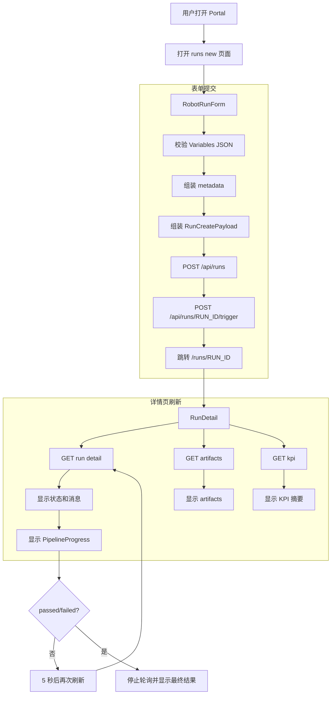
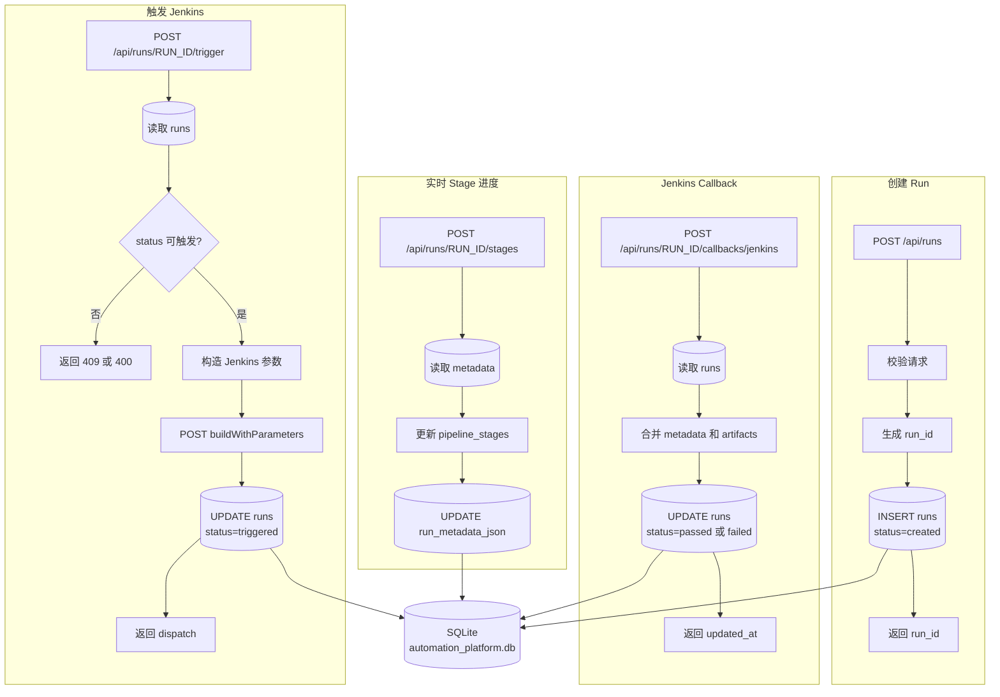
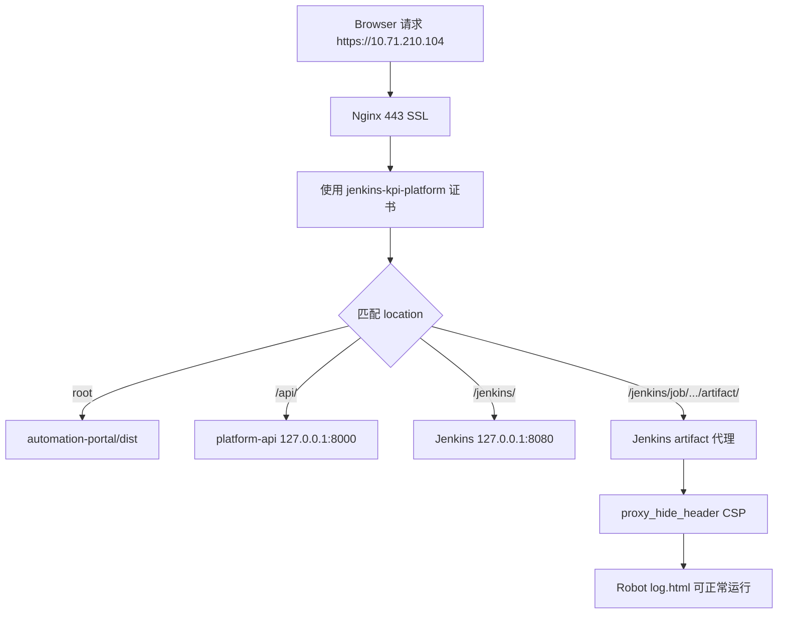
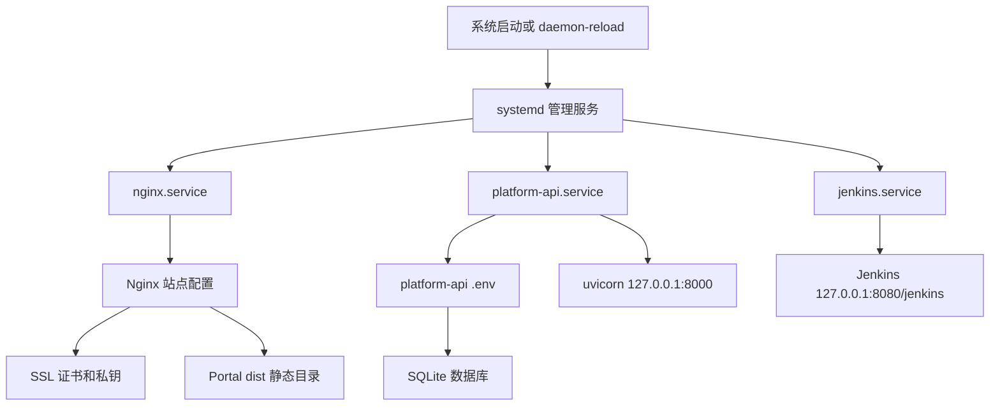
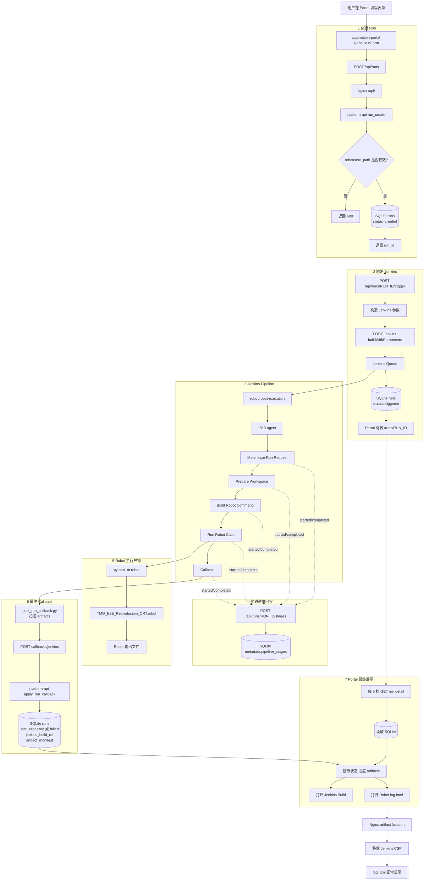
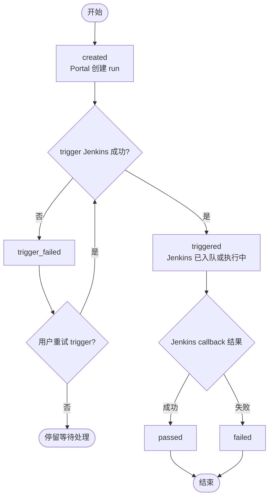
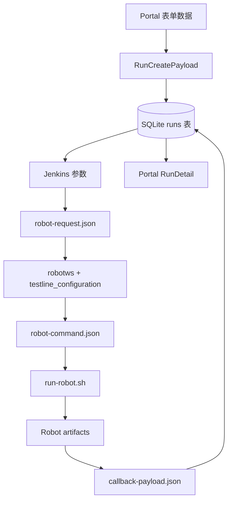

# 端到端 Robot Case 执行链路详解

本文以真实 Robot case 为例，详细拆解从 **automation-portal → platform-api → Jenkins Pipeline → callback 回写** 的完整链路，涵盖每个模块的代码分工、数据流、配置项和 TLS 处理。

**示例 Robot case：**

```text
testsuite/Hangzhou/RRM/RAN_PZ_HAZ_34/None_Feature_SG6/TMO_E2E_Reproduction_CRT.robot
```

---

## 目录

1. [Part 1：automation-portal（前端）](#part-1automation-portal前端)
2. [Part 2：platform-api（后端）](#part-2platform-api后端)
3. [Part 3：jenkins-integration（Pipeline 执行层）](#part-3jenkins-integrationpipeline-执行层)
4. [Part 4：Nginx 反向代理](#part-4nginx-反向代理)
5. [Part 5：systemd 服务管理](#part-5systemd-服务管理)
6. [Part 6：端到端完整交互流程图](#part-6端到端完整交互流程图)

---

## Part 1：automation-portal（前端）

### 1.1 技术栈

- React 18 + TypeScript + Vite
- react-router-dom v6 做路由
- 纯 fetch 调用 API，无 axios
- 构建产物为静态文件 `dist/`，由 Nginx 直接 serve

### 1.2 文件分工

| 文件 | 职责 |
|---|---|
| `src/main.tsx` | 应用入口，注册路由 |
| `src/App.tsx` | 布局骨架：侧栏 + 内容区 |
| `src/api.ts` | API 客户端、TypeScript 类型定义、Jenkins URL 构造函数 |
| `src/pages/RobotRunForm.tsx` | 创建/重建 Robot Run 的表单页 |
| `src/pages/RunList.tsx` | Run 列表页 |
| `src/pages/RunDetail.tsx` | Run 详情页，含 Pipeline 进度条 |
| `src/styles.css` | 全局样式 |

### 1.3 路由结构

```text
/               → 重定向到 /runs
/runs           → RunList（列表页）
/runs/new       → RobotRunForm（新建表单）
/runs/:runId    → RunDetail（详情页）
```

### 1.4 API 客户端 (`api.ts`)

核心设计：

```typescript
const apiBaseUrl = (import.meta.env.VITE_API_BASE_URL || "/api").replace(/\/$/, "");
const jenkinsBaseUrl = (import.meta.env.VITE_JENKINS_BASE_URL || "").replace(/\/$/, "");
```

- `VITE_API_BASE_URL`：Vite 构建时注入，默认 `/api`（通过 Nginx 反代到 `127.0.0.1:8000/api/`）
- `VITE_JENKINS_BASE_URL`：用于构造 Jenkins build 页面链接，如 `https://10.71.210.104/jenkins`

API 方法：

| 方法 | HTTP | 路径 | 用途 |
|---|---|---|---|
| `api.createRun(payload)` | `POST` | `/runs` | 创建 run 记录 |
| `api.triggerRun(runId)` | `POST` | `/runs/{run_id}/trigger` | 触发 Jenkins job |
| `api.listRuns()` | `GET` | `/runs` | 获取所有 run |
| `api.getRun(runId)` | `GET` | `/runs/{run_id}` | 获取单个 run 详情 |
| `api.getArtifacts(runId)` | `GET` | `/runs/{run_id}/artifacts` | 获取 artifact 列表 |
| `api.getKpi(runId)` | `GET` | `/runs/{run_id}/kpi` | 获取 KPI 数据 |

Jenkins URL 辅助函数：

- `jenkinsJobUrl("robot/robot-execution#42")` → `https://10.71.210.104/jenkins/job/robot/job/robot-execution/42`
- `jenkinsArtifactUrl(buildRef, path)` → 从 artifact 的文件系统路径提取相对路径，拼成 Jenkins artifact URL

### 1.5 RobotRunForm 表单流程

用户填写表单并点击"Run"后，执行 `handleSubmit()`：

```text
1. parseJsonObject(variablesJson)   → 校验 JSON 合法性
2. 组装 metadata 对象               → { case_name, selected_tests, robot_variables, taf_mode, robotws_ref }
3. 组装 RunCreatePayload            → { testline, robotcase_path, executor_type: "robot", build?, metadata }
4. api.createRun(payload)           → POST /api/runs → 拿到 run_id
5. api.triggerRun(run_id)           → POST /api/runs/{run_id}/trigger → 触发 Jenkins
6. navigate(`/runs/${run_id}`)      → 跳转到详情页
```

如果 `createRun` 成功但 `triggerRun` 失败，仍然跳转详情页，并通过 `location.state.triggerError` 携带错误信息。

**Rebuild 模式：** URL 带 `?from=<run_id>` 时，`useEffect` 调用 `api.getRun(fromRunId)` 预填充表单字段。

以示例 Robot case 为例，表单填写：

```text
Testline:         7_5_UTE5G402T813
Robot case path:  testsuite/Hangzhou/RRM/RAN_PZ_HAZ_34/None_Feature_SG6/TMO_E2E_Reproduction_CRT.robot
Case name:        (留空或填具体 test case 名)
Build:            SBTS26R3.ENB.9999
TAF mode:         reuse
Robotws git ref:  master
Robot variables JSON:
{
  "AF_PATH": "/automation/downloads/SBTS26R3.ENB.9999"
}
```

### 1.6 RunDetail 详情页

详情页功能拆分：

| 组件/区域 | 功能 |
|---|---|
| `PipelineProgress` | 5 阶段管线进度条（Materialize → Prepare Workspace → Build Robot Command → Run Robot Case → Callback） |
| Summary Grid | Status、Testline、Build、Robot case、Jenkins Build 链接、Robot Log 链接、Message |
| Artifacts | artifact chips + 全量 ZIP 下载按钮 |
| Details（可展开） | Timing / Metadata JSON / KPI Summary |

**自动轮询机制：** 当 run 状态不是 `passed` 或 `failed` 时，每 5 秒调用一次 `load()` 刷新数据：

```typescript
useEffect(() => {
  if (!detail || ["passed", "failed"].includes(detail.status)) return;
  const timer = window.setInterval(() => { void load(); }, 5000);
  return () => window.clearInterval(timer);
}, [detail, load]);
```

**Pipeline 进度解析：** 从 `metadata.pipeline_stages` 读取实时 stage 数据，如果没有 stage 数据但 `status=triggered`，则推断第一阶段为"started"。

### 1.7 automation-portal 流程图



---

## Part 2：platform-api（后端）

### 2.1 技术栈

- Python 3.11 + FastAPI + Pydantic v2
- SQLite 单文件数据库
- 无 ORM，直接使用 `sqlite3` 标准库
- uvicorn 作为 ASGI server
- `pydantic_settings` 从 `.env` 加载配置

### 2.2 文件分工

| 文件 | 职责 |
|---|---|
| `app/main.py` | FastAPI 应用入口，注册 router，应用启动时初始化数据库 |
| `app/core/config.py` | `Settings` 类，从 `.env` 加载所有配置项 |
| `app/api/v1/router.py` | 路由定义，所有 API endpoint 注册 |
| `app/schemas/run.py` | Pydantic 请求/响应模型（20+ 个 schema） |
| `app/services/run_service.py` | 业务逻辑：创建/触发/回调/Stage 更新 |
| `app/services/jenkins_service.py` | Jenkins 集成：构造参数 + 触发 job |
| `app/repositories/run_repository.py` | 数据库操作：CRUD + schema 自动迁移 |

### 2.3 配置项 (`app/core/config.py`)

```python
class Settings(BaseSettings):
    app_name: str = "Platform API"
    runs_db_path: str = "data/results/automation_platform.db"
    public_base_url: str = "http://127.0.0.1:8000"

    # Jenkins 集成
    jenkins_base_url: str = ""              # 内部 Jenkins 地址
    jenkins_robot_job_path: str = "job/robot/job/robot-execution"
    jenkins_username: str = ""
    jenkins_api_token: str = ""
    jenkins_trigger_token: str = ""
    jenkins_timeout_seconds: int = 30
    jenkins_insecure_tls: bool = False       # 触发 Jenkins 时是否跳过 TLS
    jenkins_callback_insecure_tls: bool = True  # 透传给 Jenkins，callback 时是否跳过 TLS
```

**生产 `.env` 示例：**

```ini
JENKINS_BASE_URL=http://127.0.0.1:8080/jenkins
JENKINS_ROBOT_JOB_PATH=job/robot/job/robot-execution
JENKINS_USERNAME=admin
JENKINS_API_TOKEN=<token>
JENKINS_INSECURE_TLS=false
JENKINS_CALLBACK_INSECURE_TLS=true
PUBLIC_BASE_URL=https://10.71.210.104
RUNS_DB_PATH=/var/lib/test-workflow-runner/data/automation_platform.db
```

### 2.4 SQLite 数据库 Schema

单表 `runs`，自动建表 + 自动增列迁移（启动时 `PRAGMA table_info` 检查缺失列并 `ALTER TABLE ADD COLUMN`）：

| 列名 | 类型 | 说明 |
|---|---|---|
| `run_id` | `TEXT PRIMARY KEY` | 格式 `run-YYYYMMDDHHmmSSfff[-NN]` |
| `executor_type` | `TEXT` | `robot` / `python_orchestrator` / `internal_tool` |
| `workflow_name` | `TEXT` | robotcase_path 或 workflow 名 |
| `testline` | `TEXT` | 目标测试线 |
| `robotcase_path` | `TEXT` | Robot suite 文件路径 |
| `build` | `TEXT` | 版本号 |
| `scenario` | `TEXT` | 场景标识 |
| `status` | `TEXT` | `created` / `triggered` / `trigger_failed` / `passed` / `failed` |
| `message` | `TEXT` | 状态说明 |
| `enable_kpi_generator` | `INTEGER` | 布尔 0/1 |
| `enable_kpi_anomaly_detector` | `INTEGER` | 布尔 0/1 |
| `workflow_spec_json` | `TEXT` | JSON 序列化的 workflow 定义 |
| `run_metadata_json` | `TEXT` | JSON 序列化的元数据（包含 pipeline_stages） |
| `artifact_manifest_json` | `TEXT` | JSON 序列化的 artifact 列表 |
| `kpi_config_json` | `TEXT` | JSON 序列化的 KPI 配置 |
| `kpi_summary_json` | `TEXT` | JSON 序列化的 KPI 结果 |
| `detector_summary_json` | `TEXT` | JSON 序列化的异常检测结果 |
| `jenkins_build_ref` | `TEXT` | Jenkins build 引用，格式 `robot/robot-execution#42` |
| `started_at` | `TEXT` | ISO 时间戳 |
| `finished_at` | `TEXT` | ISO 时间戳 |
| `created_at` | `TEXT` | ISO 时间戳 |
| `updated_at` | `TEXT` | ISO 时间戳 |

JSON 列的编解码在 repository 层自动处理：写入时 `json.dumps()`，读出时 `json.loads()`。

### 2.5 API Endpoint 详解

#### 2.5.1 `POST /api/runs` — 创建 Run

请求体（`RunCreateRequest`）：

```json
{
  "testline": "7_5_UTE5G402T813",
  "robotcase_path": "testsuite/Hangzhou/RRM/RAN_PZ_HAZ_34/None_Feature_SG6/TMO_E2E_Reproduction_CRT.robot",
  "executor_type": "robot",
  "build": "SBTS26R3.ENB.9999",
  "metadata": {
    "case_name": "",
    "selected_tests": [],
    "robot_variables": { "AF_PATH": "/automation/downloads/SBTS26R3.ENB.9999" },
    "taf_mode": "reuse",
    "robotws_ref": "master"
  }
}
```

处理流程：

```text
1. _validate_run_create_request()
   - executor_type == "robot" 时必须有 robotcase_path
   - robot 类型不能带 KPI 选项
2. 生成时间戳 run_id: run-20260511143025123
3. INSERT INTO runs (...)
4. 返回 { run_id, executor_type, status: "created", message }
```

#### 2.5.2 `POST /api/runs/{run_id}/trigger` — 触发 Jenkins

处理流程：

```text
1. 读取 run 记录，校验 status ∈ {created, trigger_failed}
2. build_robot_jenkins_parameters(record) → 构造 30+ Jenkins 参数
3. trigger_jenkins_job(parameters) → HTTP POST Jenkins buildWithParameters
4. 更新 run: status="triggered", jenkins_build_ref=queue_url
5. 返回 { run_id, status, scheduler: "jenkins", dispatch: {...} }
```

#### 2.5.3 `POST /api/runs/{run_id}/stages` — Stage 进度更新

请求体（`RunStageUpdateRequest`）：

```json
{
  "stage_name": "Materialize Run Request",
  "stage_status": "started"
}
```

处理流程：

```text
1. 读取 run 的 metadata.pipeline_stages
2. 查找同名 stage entry，没有则新建
3. 更新 status / started_at / finished_at / message
4. 写回 metadata → UPDATE runs SET run_metadata_json = ...
```

#### 2.5.4 `POST /api/runs/{run_id}/callbacks/jenkins` — Jenkins 回调

请求体（`RunCallbackRequest`）：

```json
{
  "status": "passed",
  "message": "Robot execution completed.",
  "jenkins_build_ref": "robot/robot-execution#42",
  "started_at": "2026-05-11T14:30:25+08:00",
  "finished_at": "2026-05-11T14:45:10+08:00",
  "metadata": {},
  "artifact_manifest": [
    { "kind": "artifact", "label": "log.html", "path": "/automation/.../artifacts/quicktest/retry-0/TMO_E2E_Reproduction_CRT/log.html" }
  ],
  "kpi_summary": {},
  "detector_summary": {}
}
```

处理流程：

```text
1. 读取现有 run 记录
2. 合并 artifact_manifest（callback 覆盖已有）
3. 合并 metadata（callback 增量合并）
4. UPDATE runs SET status, message, jenkins_build_ref, started_at, finished_at, ...
5. 返回 { run_id, status, updated_at }
```

### 2.6 Jenkins 集成服务 (`jenkins_service.py`)

#### 参数构造 `build_robot_jenkins_parameters()`

从 run 记录的 metadata 中提取所有字段，映射为 Jenkins job 参数：

| Jenkins 参数 | 来源 |
|---|---|
| `RUN_ID` | `record["run_id"]` |
| `TESTLINE` | `record["testline"]` |
| `ROBOTCASE_PATH` | `record["robotcase_path"]` |
| `CASE_NAME` | `metadata.case_name` |
| `ROBOT_SELECTED_TESTS` | `metadata.selected_tests` 换行拼接 |
| `ROBOT_VARIABLES_JSON` | `metadata.robot_variables` + `build` → JSON |
| `PLATFORM_API_BASE_URL` | `settings.public_base_url` |
| `TAF_MODE` | `metadata.taf_mode` 默认 `reuse` |
| `ROBOTWS_GIT_REF` | `metadata.robotws_ref` 默认 `master` |
| `CALLBACK_INSECURE_TLS` | `settings.jenkins_callback_insecure_tls` |
| ... | 其余约 15 个参数 |

#### 触发 `trigger_jenkins_job()`

```text
1. 拼接 URL: {jenkins_base_url}/{jenkins_robot_job_path}/buildWithParameters
   → http://127.0.0.1:8080/jenkins/job/robot/job/robot-execution/buildWithParameters
2. 构造 Basic Auth header: base64(username:api_token)
3. 请求体: application/x-www-form-urlencoded 编码的参数
4. TLS: 如果 jenkins_insecure_tls=true，使用 ssl._create_unverified_context()
5. 响应: 读取 Location header 作为 queue_url
```

### 2.7 platform-api 流程图



---

## Part 3：jenkins-integration（Pipeline 执行层）

### 3.1 技术栈

- Jenkins Declarative Pipeline（Groovy DSL）
- 5 个 Python 脚本（生成 JSON 计划 + bash 脚本）
- 运行时生成的 bash 脚本（不入仓库）
- Agent 标签调度：`agent { label 't813 && robot' }`

### 3.2 文件分工

| 文件 | 职责 |
|---|---|
| `pipelines/robot-execution.Jenkinsfile` | Pipeline 定义：4 stages + post block |
| `scripts/materialize_run_request.py` | 标准化 run 请求为内部格式 |
| `scripts/checkout_sources.py` | 生成 checkout 计划 + `checkout-sources.sh` |
| `scripts/prepare_taf_environment.py` | 生成 Python 环境准备计划 + `prepare-python-env.sh` |
| `scripts/build_robot_command.py` | 生成 Robot 命令计划 + `run-robot.sh` |
| `scripts/post_run_callback.py` | 构建 callback payload 并 POST 回 platform-api |
| `jobs/robot-execution-job.groovy` | Job DSL seed 脚本 |
| `jcasc/jenkins.yaml` | JCasC 参考配置 |

### 3.3 Pipeline 参数（30+）

Pipeline 接收 platform-api 传来的参数。核心参数与示例值：

| 参数 | 示例值 |
|---|---|
| `RUN_ID` | `run-20260511143025123` |
| `TESTLINE` | `7_5_UTE5G402T813` |
| `ROBOTCASE_PATH` | `testsuite/Hangzhou/RRM/RAN_PZ_HAZ_34/None_Feature_SG6/TMO_E2E_Reproduction_CRT.robot` |
| `ROBOT_VARIABLES_JSON` | `{"AF_PATH":"/automation/downloads/...","BUILD":"SBTS26R3.ENB.9999"}` |
| `TAF_MODE` | `reuse` |
| `ROBOTWS_GIT_REF` | `master` |
| `PLATFORM_API_BASE_URL` | `https://10.71.210.104` |
| `CALLBACK_INSECURE_TLS` | `true` |

### 3.4 Pipeline 阶段详解

#### Stage 1：Materialize Run Request

**目的：** 将 Jenkins 参数或 platform-api run 详情标准化为内部 `robot-request.json`。

```text
1. mkdir -p artifacts
2. 生成 artifacts/notify-stage.sh（stage 进度通知 helper）
3. 如果有 RUN_REQUEST_JSON 参数 → 直接写文件
   否则 → 内联 Python 从环境变量提取参数，生成 run-request-source.json
4. 如果有 RUN_ID + PLATFORM_API_BASE_URL（无 RUN_REQUEST_JSON）
   → materialize_run_request.py --run-id ... --platform-api-base-url ...
   → 从 platform-api 拉取 run 详情并标准化
   否则
   → materialize_run_request.py --input-json artifacts/run-request-source.json
5. 输出：artifacts/robot-request.json
```

`robot-request.json` 核心结构：

```json
{
  "run_id": "run-20260511143025123",
  "executor_type": "robot",
  "testline": "7_5_UTE5G402T813",
  "robotcase_path": "testsuite/Hangzhou/RRM/.../TMO_E2E_Reproduction_CRT.robot",
  "variables": { "AF_PATH": "...", "BUILD": "..." },
  "selected_tests": [],
  "python_env_root": "/home/ute/CIENV/7_5_UTE5G402T813",
  "robotws_root": "/automation/workspace/.../robotws",
  "testline_config_root": "/automation/workspace/.../testline_configuration",
  "source_repos": {
    "robotws": { "path": "robotws", "repo_url": "git@...:RAN/robotws.git", "ref": "master" },
    "testline_configuration": { "path": "testline_configuration", "repo_url": "git@...", "ref": "master" }
  },
  "taf": { "mode": "reuse" },
  "callback": {
    "base_url": "https://10.71.210.104",
    "path": "/api/runs/run-20260511143025123/callbacks/jenkins"
  }
}
```

**Stage 进度通知（`notify-stage.sh`）：**

运行时生成的 bash 脚本，使用 curl POST 到 `POST /api/runs/{run_id}/stages`：

```bash
curl -s -k -X POST \
  -H "Content-Type: application/json" \
  -d '{"stage_name": "Materialize Run Request", "stage_status": "started"}' \
  https://10.71.210.104/api/runs/run-xxx/stages
```

每个 stage 开头调用 `started`，结尾调用 `completed`，Portal 通过轮询读取 `metadata.pipeline_stages` 渲染实时进度条。

#### Stage 2：Prepare Workspace

**目的：** checkout 源码 + 准备 Python/TAF 环境。

```text
1. checkout_sources.py → 生成 source-checkout.json + checkout-sources.sh
2. prepare_taf_environment.py → 生成 python-env.json + prepare-python-env.sh
3. 从 source-checkout.json 提取 credential IDs
4. 如果有 credential IDs → sshagent(credentials) { bash checkout-sources.sh }
   否则 → bash checkout-sources.sh
5. bash prepare-python-env.sh
```

**checkout_sources.py 逻辑：**

```text
对每个 repo (robotws, testline_configuration)：
  - 如果目标目录已存在且是 git 仓库 → git fetch + git checkout
  - 如果 repo_url 存在 → git clone
  - 如果目录已存在但非 git 仓库 → 跳过（reuse existing）
  - 否则 → 报错
```

生成的 `checkout-sources.sh` 示例：

```bash
#!/bin/bash
set -euo pipefail
echo "[checkout] robotws → git clone git@wrgitlab.ext.net.nokia.com:RAN/robotws.git robotws"
git clone --branch master --single-branch git@wrgitlab.ext.net.nokia.com:RAN/robotws.git robotws
echo "[checkout] testline_configuration → git clone ..."
git clone --branch master --single-branch git@...:RAN/.../testline_configuration.git testline_configuration
```

**prepare_taf_environment.py 逻辑：**

三种 TAF mode：

| mode | 行为 |
|---|---|
| `reuse` | 假定 `/home/ute/CIENV/7_5_UTE5G402T813` 已存在，仅激活 |
| `create-venv` | 新建 venv，从 `robotws/dependencies.py311-rf50.lock` 安装 TAF |
| `skip-install` | 新建 venv 但跳过包安装 |

生成的 `prepare-python-env.sh` 在 `reuse` 模式下可能仅为空操作或 echo。

#### Stage 3：Build Robot Command

**目的：** 构建完整的 `python -m robot ...` 命令。

```text
1. build_robot_command.py 读取 robot-request.json
2. 解析 robotcase_path：先在 workspace 下找，找不到再去 robotws/ 下找
3. 构造 Robot 命令参数：
   - --pythonpath robotws
   - -V testline_configuration/7_5_UTE5G402T813
   - -v AF_PATH:... -v BUILD:...
   - -t "test case name"（如果有）
   - -x quicktest.xml -b debug.log -L TRACE
   - -d artifacts/quicktest/retry-0/TMO_E2E_Reproduction_CRT/
4. 输出：artifacts/robot-command.json + 内嵌 shell_script_text
```

以示例 case 为例，最终 Robot 命令：

```bash
#!/bin/bash
set -euo pipefail
. /home/ute/CIENV/7_5_UTE5G402T813/bin/activate
export http_proxy=''
export https_proxy=''
python -m robot \
  --pythonpath /automation/workspace/.../robotws \
  -v AF_PATH:/automation/downloads/SBTS26R3.ENB.9999 \
  -v BUILD:SBTS26R3.ENB.9999 \
  -x quicktest.xml \
  -b debug.log \
  -d /automation/workspace/.../artifacts/quicktest/retry-0/TMO_E2E_Reproduction_CRT \
  -V /automation/workspace/.../testline_configuration/7_5_UTE5G402T813 \
  -L TRACE \
  /automation/workspace/.../robotws/testsuite/Hangzhou/RRM/RAN_PZ_HAZ_34/None_Feature_SG6/TMO_E2E_Reproduction_CRT.robot
```

#### Stage 4：Run Robot Case

**目的：** 执行 Robot case。

```text
1. 从 robot-command.json 中提取 shell_script_text
2. 写入 artifacts/run-robot.sh
3. bash artifacts/run-robot.sh
```

#### Post Block：Callback

**目的：** 无论成功/失败，回写结果到 platform-api。

```text
1. archiveArtifacts artifacts: 'artifacts/**'
2. 如果有 CALLBACK_RUN_ID + PLATFORM_API_BASE_URL：
   → post_run_callback.py 构建 callback payload 并 POST
3. 否则跳过回调
```

**post_run_callback.py 逻辑：**

```text
1. collect_artifact_manifest(artifact_dir)
   → 递归扫描 artifacts/ 目录，收集所有文件
   → 对每个文件记录: kind, label, path, content_type (guess_type)
2. build_callback_payload()
   → { status, message, jenkins_build_ref, started_at, finished_at, artifact_manifest }
3. send_callback_with_retry()
   → POST https://10.71.210.104/api/runs/{run_id}/callbacks/jenkins
   → 最多 3 次重试，线性退避 2s * attempt
   → TLS: CALLBACK_INSECURE_TLS=true → ssl._create_unverified_context()
   → 失败时写入 callback-fallback.json（如 --ignore-send-failure 不抛异常）
```

### 3.5 Jenkins 全局环境变量

在 `Manage Jenkins → System → Global properties → Environment variables` 配置：

| 环境变量 | 值 |
|---|---|
| `ROBOTWS_REPO_URL` | `git@wrgitlab.ext.net.nokia.com:RAN/robotws.git` |
| `TESTLINE_CONFIGURATION_REPO_URL` | `git@wrgitlab.ext.net.nokia.com:RAN/.../testline_configuration.git` |
| `ROBOTWS_CREDENTIALS_ID` | `robotws-ssh` |
| `TESTLINE_CONFIGURATION_CREDENTIALS_ID` | `testline-config-ssh` |
| `PIP_INDEX_URL` | 内部 Artifactory PyPI URL |
| `PIP_EXTRA_INDEX_URL` | 备用 Artifactory PyPI URL |
| `PIP_TRUSTED_HOST` | Artifactory host 列表 |

### 3.6 Jenkins 凭据

| Credentials ID | 类型 | 用途 |
|---|---|---|
| `t813-agent-ssh` | SSH Username with private key | Master → Agent 连接 |
| `robotws-ssh` | SSH Username with private key | checkout robotws |
| `testline-config-ssh` | SSH Username with private key | checkout testline_configuration |

### 3.7 TLS 配置要点

| 连接 | 方向 | TLS 处理 |
|---|---|---|
| platform-api → Jenkins | 内部 HTTP | `JENKINS_BASE_URL=http://127.0.0.1:8080/jenkins`，不走 TLS |
| Jenkins → platform-api（materialize） | 通过 HTTPS | `CALLBACK_INSECURE_TLS=true` → `--insecure-skip-tls-verify` |
| Jenkins → platform-api（stage notify） | 通过 HTTPS | `curl -k`（notify-stage.sh 内） |
| Jenkins → platform-api（callback） | 通过 HTTPS | `CALLBACK_INSECURE_TLS=true` → `ssl._create_unverified_context()` |
| Browser → Nginx | HTTPS | 自签名证书 `jenkins-kpi-platform.crt` |

### 3.8 jenkins-integration 流程图

```mermaid
flowchart TD
    Start[Jenkins 收到 buildWithParameters] --> AgentSelect[调度到 t813 && robot]
    AgentSelect --> Workspace[进入 Jenkins workspace]

    subgraph S1[Stage 1 Materialize]
        Workspace --> S1Start[通知 started]
        S1Start --> NotifyScript[生成 notify-stage.sh]
        NotifyScript --> RequestSource[生成 run-request-source.json]
        RequestSource --> Materialize[materialize_run_request.py]
        Materialize --> RobotRequest[输出 robot-request.json]
        RobotRequest --> S1Done[通知 completed]
    end

    subgraph S2[Stage 2 Prepare Workspace]
        S1Done --> S2Start[通知 started]
        S2Start --> CheckoutPlan[checkout_sources.py]
        CheckoutPlan --> CheckoutSh[输出 checkout-sources.sh]
        CheckoutSh --> CredentialCheck{需要 SSH 凭据?}
        CredentialCheck -->|是| SSHAgent[sshagent 包裹 checkout]
        CredentialCheck -->|否| DirectCheckout[直接 checkout]
        SSHAgent --> SourceReady[源码目录就绪]
        DirectCheckout --> SourceReady
        SourceReady --> EnvPlan[prepare_taf_environment.py]
        EnvPlan --> PrepareSh[执行 prepare-python-env.sh]
        PrepareSh --> S2Done[通知 completed]
    end

    subgraph S3[Stage 3 Build Command]
        S2Done --> S3Start[通知 started]
        S3Start --> BuildCmd[build_robot_command.py]
        BuildCmd --> RobotCommand[输出 robot-command.json]
        RobotCommand --> S3Done[通知 completed]
    end

    subgraph S4[Stage 4 Run Robot]
        S3Done --> S4Start[通知 started]
        S4Start --> RunSh[生成 run-robot.sh]
        RunSh --> RobotExec[python -m robot 执行 case]
        RobotExec --> RobotArtifacts[生成 Robot 输出文件]
        RobotArtifacts --> S4Done[通知 completed]
    end

    subgraph Post[Post always Callback]
        S4Done --> CallbackStart[通知 Callback started]
        CallbackStart --> Archive[归档 artifacts]
        Archive --> CallbackPy[post_run_callback.py]
        CallbackPy --> CallbackAPI["POST callbacks/jenkins"]
        CallbackAPI --> CallbackDone[通知 Callback completed]
    end
```



### 3.9 运行时生成文件一览

Pipeline 执行期间在 `artifacts/` 下生成以下文件：

| 文件 | 生成阶段 | 说明 |
|---|---|---|
| `notify-stage.sh` | Stage 1 | stage 进度通知 helper |
| `run-request-source.json` | Stage 1 | 原始请求来源 |
| `robot-request.json` | Stage 1 | 标准化后的内部请求 |
| `callback-run-id.txt` | Stage 1 | run_id 文本 |
| `source-checkout.json` | Stage 2 | checkout 计划 |
| `checkout-sources.sh` | Stage 2 | checkout 执行脚本 |
| `checkout-credential-ids.txt` | Stage 2 | 需要的 credential ID 列表 |
| `python-env.json` | Stage 2 | Python 环境准备计划 |
| `prepare-python-env.sh` | Stage 2 | 环境准备执行脚本 |
| `robot-command.json` | Stage 3 | Robot 命令计划 |
| `run-robot.sh` | Stage 4 | Robot 执行脚本 |
| `quicktest/retry-0/TMO_E2E_Reproduction_CRT/` | Stage 4 | Robot 输出目录（log.html, output.xml 等） |
| `callback-payload.json` | Post | callback 发送内容 |
| `callback-send-result.json` | Post | callback 发送结果 |
| `callback-fallback.json` | Post | callback 失败时的兜底文件 |

---

## Part 4：Nginx 反向代理

### 4.1 配置文件

仓库位置：`deploy/nginx/jenkins-kpi-platform.conf`
服务器位置：`/etc/nginx/sites-available/jenkins-kpi-platform.conf`

### 4.2 配置内容

```nginx
# HTTP → HTTPS 强制跳转
server {
    listen 80;
    server_name 10.71.210.104;
    return 301 https://$host$request_uri;
}

server {
    listen 443 ssl;
    server_name 10.71.210.104;

    # 自签名证书
    ssl_certificate /etc/ssl/certs/jenkins-kpi-platform.crt;
    ssl_certificate_key /etc/ssl/private/jenkins-kpi-platform.key;
    ssl_protocols TLSv1.2 TLSv1.3;
    ssl_prefer_server_ciphers on;

    # 公共 proxy headers
    proxy_set_header Host $host;
    proxy_set_header X-Real-IP $remote_addr;
    proxy_set_header X-Forwarded-For $proxy_add_x_forwarded_for;
    proxy_set_header X-Forwarded-Proto $scheme;

    # Jenkins artifact CSP 修复
    # Jenkins 默认 CSP 会阻止 Robot Framework log.html 的内联 JavaScript
    # 此 location 必须在 /jenkins/ 之前
    location ~ ^/jenkins/job/.+/artifact/ {
        proxy_pass http://127.0.0.1:8080;
        proxy_http_version 1.1;
        proxy_set_header Connection "";
        proxy_hide_header Content-Security-Policy;
    }

    # Jenkins 反代
    location /jenkins/ {
        proxy_pass http://127.0.0.1:8080/jenkins/;
        proxy_http_version 1.1;
        proxy_set_header Connection "";
    }

    # platform-api 反代
    location /api/ {
        proxy_pass http://127.0.0.1:8000/api/;
        proxy_http_version 1.1;
        proxy_set_header Connection "";
    }

    # Portal 静态文件
    location / {
        root /opt/jenkins_robotframework/automation-portal/dist;
        try_files $uri $uri/ /index.html;
    }
}
```

### 4.3 路由映射

```text
浏览器请求                          →  Nginx 转发到
────────────────────────────────────────────────────────
https://10.71.210.104/              →  本地文件 automation-portal/dist/
https://10.71.210.104/api/...       →  http://127.0.0.1:8000/api/...    (platform-api)
https://10.71.210.104/jenkins/...   →  http://127.0.0.1:8080/jenkins/... (Jenkins)
https://10.71.210.104/jenkins/job/.../artifact/...
                                    →  http://127.0.0.1:8080/...         (Jenkins, 剥离 CSP)
```

### 4.4 自签名证书生成

```bash
sudo openssl req -x509 -nodes -days 3650 \
  -newkey rsa:2048 \
  -keyout /etc/ssl/private/jenkins-kpi-platform.key \
  -out /etc/ssl/certs/jenkins-kpi-platform.crt \
  -subj "/CN=10.71.210.104"
```

### 4.5 Nginx 启用

```bash
sudo cp /opt/jenkins_robotframework/deploy/nginx/jenkins-kpi-platform.conf \
        /etc/nginx/sites-available/jenkins-kpi-platform.conf
sudo ln -sf /etc/nginx/sites-available/jenkins-kpi-platform.conf \
            /etc/nginx/sites-enabled/jenkins-kpi-platform.conf
sudo rm -f /etc/nginx/sites-enabled/default
sudo nginx -t
sudo systemctl reload nginx
```

### 4.6 Nginx 流程图



---

## Part 5：systemd 服务管理

### 5.1 platform-api.service

```ini
[Unit]
Description=Platform API Service
After=network.target

[Service]
Type=simple
User=ute
WorkingDirectory=/opt/jenkins_robotframework/platform-api
Environment="PATH=/opt/jenkins_robotframework/platform-api/venv/bin"
ExecStart=/opt/jenkins_robotframework/platform-api/venv/bin/uvicorn app.main:app --host 127.0.0.1 --port 8000
Restart=always
RestartSec=5

[Install]
WantedBy=multi-user.target
```

**关键点：**

| 配置 | 说明 |
|---|---|
| `User=ute` | 以 `ute` 用户运行，拥有数据目录权限 |
| `--host 127.0.0.1` | 仅监听本地，外部访问通过 Nginx 反代 |
| `--port 8000` | 对应 Nginx `proxy_pass http://127.0.0.1:8000` |
| `Restart=always` | 崩溃自动重启 |
| `Environment="PATH=..."` | 确保使用 venv 里的 Python |

### 5.2 Jenkins

Jenkins 作为独立服务运行（通常通过 APT/systemd 安装），监听 `127.0.0.1:8080`，配置 `--prefix=/jenkins`。

### 5.3 管理命令

```bash
# platform-api
sudo systemctl start platform-api
sudo systemctl stop platform-api
sudo systemctl restart platform-api
sudo systemctl status platform-api --no-pager
journalctl -u platform-api -f          # 实时日志

# nginx
sudo systemctl reload nginx             # 修改配置后重载
sudo nginx -t                           # 配置语法检查

# jenkins
sudo systemctl restart jenkins
sudo systemctl status jenkins --no-pager
```

### 5.4 systemd 流程图



---

## Part 6：端到端完整交互流程图

以 `TMO_E2E_Reproduction_CRT.robot` 为例的完整生命周期：



### 状态流转总览



### 数据流总览


