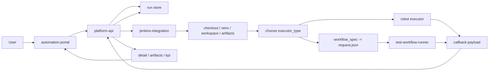

# 四模块边界与最终流程图

## 文档目标

这份文档把当前仓库里的 4 个核心模块边界彻底固定下来：

- `automation-portal`
- `platform-api`
- `jenkins-integration`
- `test-workflow-runner`

同时回答两个容易混的问题：

1. `platform-api` 里有没有需要移到公共 Jenkins 层的东西
2. 最终跨模块调用链到底应该怎么走

## 先说检查结论

对 `platform-api/app/` 当前代码检查后的结论是：

- 没有发现需要移到公共 Jenkins 层的执行代码
- 当前 `platform-api` 代码主要承担的是：
  - run contract
  - run 持久化
  - callback contract
  - detail / artifacts / kpi 查询

这些内容都应该继续留在 `platform-api`。

当前真正应该放到公共 Jenkins 层，而不是 `platform-api` 的内容是：

- Jenkins job / pipeline 定义
- workspace / venv / checkout bootstrap
- checkout `robotws / testline_configuration / bindings code`
- `workflow_spec -> request.json` 物化
- `robotcase_path -> robot command` 组装
- callback payload 发送脚本

## 四个模块最终怎么分

### 1. `automation-portal`

负责：

- 配置 run 参数
- 配置 workflow / stage / item
- 展示 run 列表、详情、timeline、artifact、KPI 摘要

不负责：

- 直接执行测试
- 直接触发 Jenkins 底层细节
- 直接访问 UTE / TAF / `robotws`

### 2. `platform-api`

负责：

- 接收前端 run 请求
- 固定 `executor_type` / `workflow_spec` / KPI 配置 contract
- 生成并保存 `run_id`
- 提供 list / detail / artifacts / kpi 查询接口
- 接收 callback 并更新 run 记录

不负责：

- 写 Jenkinsfile
- 组装 Jenkins job 参数细节
- checkout 代码
- 执行 `robot` 或 `test_workflow_runner`

### 3. `jenkins-integration`

负责：

- Jenkins 公共调度层
- `jcasc / jobs / pipelines / scripts` 资产
- workspace / venv / artifact / callback 的公共组织
- checkout `robotws / testline_configuration / bindings code`
- 按 `executor_type` 分发执行路径
- 把 `workflow_spec` 物化成 `request.json`

不负责：

- `platform-api` 的 API / DB 语义
- `test_workflow_runner` 内部 orchestration 逻辑
- `robotws` 用例内容本身

### 4. `test-workflow-runner`

负责：

- 读取 `request.json`
- 加载本地已准备好的 `testline_configuration`
- import 本地已准备好的 `bindings_module`
- 执行 workflow 的 stage / item orchestration
- 产出 `result.json / timeline / artifact_manifest`

不负责：

- checkout 代码
- 安装 / 复用 TAF
- 选择 Jenkins job / agent
- 发送 callback

## 外部依赖怎么理解

下面这些是执行依赖，但不属于当前仓库的 4 个核心模块：

- `robotws`
- `testline_configuration`
- `bindings_module`
- `TAF`
- UTE / DUT / Compass 等真实环境

它们的准备职责应该落在 `jenkins-integration`，
它们的消费职责才分别落到 `robot` 执行路径或 `test-workflow-runner` 执行路径。

## 最终四模块流程图



## 最终职责链怎么记

最短记忆版：

```text
Portal 决定要跑什么
platform-api 负责记账、给 run_id、收 callback、提供查询
jenkins-integration 负责公共调度和桥接
test-workflow-runner 负责真正执行 python workflow
```

## 为什么不能让 automation-portal 直接对接 Jenkins

这个问题最容易被低估。

如果没有 `platform-api`，而是让 `automation-portal` 直接和 Jenkins 交互，表面上会少一层，实际上会让前端被迫承担本来不属于它的 3 类职责：

1. 理解 Jenkins 细节
2. 理解执行器差异
3. 承担 run 状态中心

### 1. 前端会被 Jenkins 细节绑死

例如前端需要直接知道：

- 调哪个 Jenkins job
- 传哪些 job 参数
- `robot` 和 `python_orchestrator` 分别需要什么字段
- Jenkins build 编号怎么回查
- artifact URL 怎么拼

这样一来，只要 Jenkins job 参数或 Pipeline 结构变化，前端就要跟着改。

### 2. 前端会被执行器差异绑死

例如：

- `robot` 需要 `robotcase_path`
- `python_orchestrator` 需要 `workflow_spec`
- 以后如果再加第三种执行器，前端还要继续理解新的执行参数

这样会让 `automation-portal` 越来越像调度后台，而不是业务配置和展示层。

### 3. 没有统一 run 记录中心

Jenkins 天然擅长的是 build 视角，不是平台 run 视角。

前端真正想展示的是：

- 这次 run 属于哪个 `testline`
- 用的是哪种执行器
- 当前状态是什么
- artifact 有哪些
- KPI / detector 摘要是什么
- 历史记录怎么查

这些更适合统一收口到 `platform-api` 的 run 记录和查询接口里，而不是让前端自己去拼 Jenkins build 数据。

## 一个通俗例子

可以把这 4 层理解成：

- `automation-portal` = 点单页面
- `platform-api` = 前台收银 + 订单系统
- `jenkins-integration` = 后厨调度
- `test-workflow-runner` = 某一类具体厨师/工位

如果没有 `platform-api`，就等于让点单页面直接去跟后厨说：

- 叫哪个厨师做
- 先走哪个灶台
- 订单号是多少
- 做完后把菜放哪
- 如果厨房流程改了，点单页面也得跟着改

这会让点单页面直接知道太多后厨内部细节。

有 `platform-api` 之后，页面只需要表达业务语义：

```text
我要发起一条 run
我要传 testline / workflow / 执行器配置
我要查询这条 run 的详情和结果
```

至于后面是哪个 Jenkins job、哪个 agent、哪个执行器、哪些 artifact，这些变化都由后端和公共调度层吸收。

## `platform-api` 这一层对其他模块的好处

### 对 `automation-portal`

好处是：

- 前端只处理业务输入和结果展示
- 不需要理解 Jenkins job / build / callback 细节
- 页面模型更稳定

### 对 `jenkins-integration`

好处是：

- 可以只专注公共调度、bootstrap、checkout、callback sender
- 不需要同时承担前端展示和平台查询语义
- 只需要消费稳定的 run contract 和回调 contract

### 对 `test-workflow-runner`

好处是：

- 可以专注 request loader、stage / item orchestration、handler 执行
- 不需要关心 Web API、历史记录、前端页面
- 不需要承担统一 run 状态中心职责

### 对整个架构

好处是：

- 有统一的 `run_id`
- 有统一的状态中心
- 有统一的 detail / artifacts / kpi 查询入口
- Jenkins 细节变化不会直接冲击前端
- 新增执行器时，不需要把前端和执行器一起重写

## 一句话结论

`platform-api` 的价值，不是单纯“多转发一层请求”，而是把：

```text
业务 run 语义
```

和：

```text
Jenkins 执行细节
```

稳定隔离开，让整个系统拥有统一 contract、统一 run 记录和统一查询面。

## 对后续扩展的直接意义

这套边界固定后，后续扩展会更稳：

- 新增执行器时，不需要污染 `platform-api`
- Jenkins 公共逻辑不再混进 `test-workflow-runner`
- `platform-api` 可以继续保持 API/DB 层清晰
- `test-workflow-runner` 可以专注 orchestration 和 handler 实现
