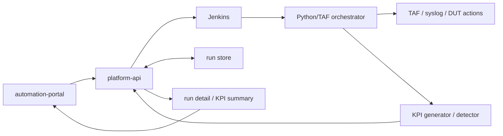

# GNB KPI Regression Architecture

## 文档目标

这份文档专门收口 `GNB KPI` 持续自动化回归测试的新架构，回答 4 件事：

- 为什么这类新能力不再以 `Robot Framework` 作为主执行层
- 为什么仍然保留 `Jenkins` 作为长任务调度器
- `automation-portal / platform-api / Jenkins / orchestrator / generator / detector` 应该怎么分工
- 后续代码实现时，哪些边界从现在开始就固定下来

如果你后面要继续推进：

- 前端 workflow builder
- `platform-api` 执行契约
- Jenkins pipeline
- `kpi-generator / kpi-anomaly-detector`

优先看这份文档。

## 最终推荐方案

推荐采用：

```text
automation-portal + platform-api + Jenkins + Python/TAF orchestrator + KPI generator/detector
```

不是下面两条路：

1. 继续把新 KPI 回归主流程写成 `.robot`
2. 为这条新链路额外引入新的工作流平台来替代 Jenkins

最短原因：

- `.robot` 更适合稳定步骤编排，不适合这类可视化组合、串并行混合执行、时间窗 sidecar 和后置分析流程
- Jenkins 已经天然适合做长任务、日志、超时、artifact、回调和 credential 管理
- `TAF` 本质就是 Python 库，完全可以跳过 Robot DSL 直接绑定

## 为什么新能力不再以 Robot 为主

从现有公司框架看，`Robot Framework` 的优势是：

- 用例表达清晰
- 对固定串行流程友好
- 便于复用成熟 keyword

但这次 `GNB KPI regression` 需要的是另一类能力：

- 前端自由选择 test model
- 自由增删 stage 和 item
- stage 内既可能串行，也可能并行
- 单次 run 内同时挂接 syslog 观察、KPI 取数、anomaly detector
- 结果还要以 timeline 和摘要形式回传平台

这类能力更像：

```text
workflow orchestrator
```

而不是传统 `.robot` case。

所以从当前开始，建议把新能力切成两层：

- 旧 Robot case 继续保留
- 新 GNB KPI workflow 走纯 Python orchestrator

## 分层职责



按阅读顺序，可以直接理解成：

1. `automation-portal` 负责提交 workflow 请求。
2. `platform-api` 负责记 run、触发 Jenkins、回收结果。
3. `Jenkins` 负责把执行任务派到真正的执行环境。
4. `Python/TAF orchestrator` 负责具体 workflow 编排。
5. `KPI generator / detector` 负责测试后处理，再把结果回传平台。

### `automation-portal`

负责：

- 让用户选择 `testline / env / build / scenario`
- 让用户配置 `stage + item`
- 让用户控制串并行、syslog、generator、detector 开关
- 展示 run timeline、artifact 和 detector 摘要

不负责：

- 直接跑 TAF
- 直接连接 Compass
- 直接执行长耗时任务

### `platform-api`

负责：

- 接收 workflow 请求
- 保存 run / workflow / artifact / KPI summary
- 调 Jenkins
- 接收 Jenkins 回调
- 对前端提供统一查询接口

不负责：

- 在 Web 进程里直接跑长任务
- 直接替代 Jenkins 成为执行器

### `Jenkins`

负责：

- 作为长任务执行器
- 激活运行环境
- 执行 orchestrator
- 可选执行 `kpi-generator`
- 可选执行 `kpi-anomaly-detector`
- 归档 artifact
- 回调 `platform-api`

### `Python/TAF orchestrator`

负责：

- 执行 `stage + item` workflow
- 管理串行 / 并行执行
- 记录 item 级别时间戳与结果
- 调用 TAF 或外围脚本
- 产出标准化结果 JSON

### `kpi-generator` / `kpi-anomaly-detector`

负责：

- `generator`：按测试时间区间取 KPI 数据并生成 `.xlsx`
- `detector`：读取 `.xlsx`，输出 HTML / Excel / summary

它们在新平台里的定位是：

```text
测试后处理模块
```

不是新的独立门户系统。

## 后端契约从现在开始怎么定

新的 run 请求不应该只围绕：

- `testline`
- `robotcase_path`

而应该升级成执行器无关的模型，至少支持：

- `executor_type`
- `workflow_spec`
- `build`
- `scenario`
- `artifacts`
- `kpi_summary`
- `detector_summary`
- `jenkins_build_ref`

推荐把执行器分成两类：

1. `robot`
2. `python_orchestrator`

这样旧能力和新能力可以共存，不需要一次性推翻现有接口。

## Workflow 建模建议

推荐统一采用：

```text
workflow
  -> stages[]
    -> items[]
```

每个 `stage` 决定阶段级串并行。

每个 `item` 决定：

- 执行动作类型
- 作用到哪些 UE / 资源
- 参数
- 是否允许失败后继续

典型 item 包括：

- `attach`
- `handover`
- `dl_traffic`
- `ul_traffic`
- `swap`
- `detach`
- `syslog_check`

## 并行边界怎么理解

不是所有 item 都适合并行。

建议从现在开始默认这样约束：

- `syslog_check`
  - 可以作为观察型 sidecar，并行风险低
- `dl_traffic / ul_traffic`
  - 可以在资源明确隔离时并行
- `attach / detach`
  - 只建议在 UE 作用域明确时并行
- `handover / swap`
  - 默认按受控资源串行，避免互相抢占 gNB 控制面
- `generator / detector`
  - 默认后处理串行，不和主流量动作混跑

也就是说：

```text
并行不是 UI 勾上就一定跑，
而是要受 orchestrator 的安全边界校验。
```

## Syslog 能力怎么建模

不要把 syslog 检查埋进某一个 traffic item 里。

更推荐两种独立能力：

1. `windowed_syslog_watch`
   - 在 workflow 执行期间开始观察
   - 在 workflow 结束时输出摘要

2. `post_window_syslog_scan`
   - 用最终开始 / 结束时间窗口回溯采集

这样前端更容易组合，后端也更容易复用。

## Jenkins Pipeline 推荐阶段

```text
Stage 1  Checkout code
Stage 2  Prepare runtime
Stage 3  Run Python/TAF orchestrator
Stage 4  Archive orchestrator artifacts
Stage 5  Generate KPI Workbook (optional)
Stage 6  Run KPI Anomaly Detector (optional)
Stage 7  Archive KPI artifacts
Stage 8  Callback platform-api
```

## 前端实现顺序

虽然最终目标是拖拽式 builder，但后端契约不能依赖拖拽。

最推荐顺序：

1. 先做结构化 builder
   - stage 列表
   - item 列表
   - 串并行切换
   - JSON 预览

2. 再做交互增强
   - 排序
   - 复制
   - 批量删改

3. 最后再补拖拽

## 当前最重要的落地结论

从现在开始，`GNB KPI regression` 的主线固定为：

```text
前端负责编排，
FastAPI 负责聚合，
Jenkins 负责执行，
Python/TAF orchestrator 负责工作流，
generator/detector 负责后处理。
```

后面即使继续迭代 UI 形态或 handler 细节，也不再改变这条主线。
