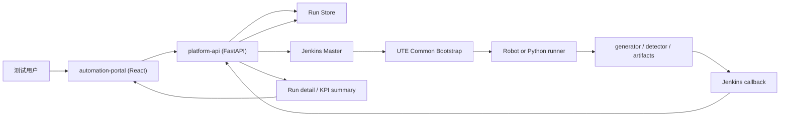
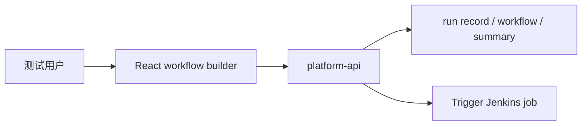
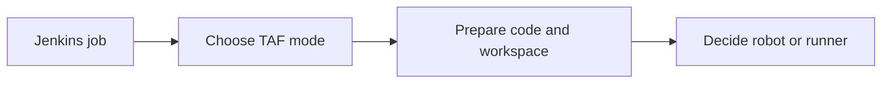
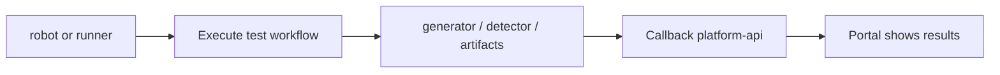

# GNB KPI System Runtime

## 文档目标

这份文档不再讨论“要不要引入 runner”这种选型问题，而是直接把当前已经确认的系统运行方式写清楚：

- `React / FastAPI / Jenkins / runner` 各自做什么
- 哪些能力属于 `Jenkins` 公共前置层
- 哪些能力是 `Robot` 和 `runner` 共用的
- 哪些能力只属于 `runner`
- 在当前更贴近真实环境的前提下，整个系统最终怎么运作

如果你后面再遇到：

- `runner` 跟 `FastAPI` 到底有没有直接关系
- `TAF` 安装逻辑应该放哪层
- `testline_configuration / robotws / TAF` 在哪台机器上准备
- 旧 `Robot` 链路和新 `runner` 链路怎么共存

优先看这份文档。

## 当前冻结前提

从当前讨论开始，后续架构默认按下面这些前提理解：

1. `Agent = UTE`
   - 在当前真实环境里，Jenkins Agent 和 UTE 执行机视为同一台执行机器
2. 新能力不再把 `Robot Framework` 作为主执行层
   - 旧 `.robot` case 继续保留
   - 新的 `GNB KPI workflow` 走 Python runner
3. `TAF install/reuse` 不属于 runner
   - 它属于 Jenkins/UTE 侧的公共前置环境准备
4. `runner` 和 `FastAPI` 没有直接执行关系
   - 中间通过 Jenkins 串起来

最短记忆版：

```text
前端提需求，
FastAPI 记账和查状态，
Jenkins 派活和准备环境，
UTE 上的 Robot 或 runner 真正执行。
```

## 整体分层



这张图只保留主干链路：

1. 用户在前端发起 run。
2. `platform-api` 记 run 并触发 Jenkins。
3. Jenkins 在 `Agent = UTE` 上先做公共前置准备。
4. 准备完之后，真正执行 `Robot` 或 `Python runner`。
5. 执行产物、generator、detector 结果再统一回传 `platform-api`。

## 四层职责

### `automation-portal`

负责：

- 选择 `testline / env / build / scenario`
- 配置 workflow
- 指定哪些动作串行、哪些动作并行
- 选择 `TAF` 是否安装
- 选择是否启用 `generator / detector`
- 展示 timeline、artifact、结果摘要

不负责：

- 直接执行测试
- 直接 import `TAF`
- 直接管理执行机环境

### `platform-api`

负责：

- 接住前端的 run/workflow 请求
- 保存 run 记录、workflow、执行参数、artifact 摘要
- 触发 Jenkins
- 接收 Jenkins 回调
- 对前端提供查询接口

不负责：

- 直接跑 `Robot`
- 直接跑 `runner`
- 直接处理 `TAF install/reuse`

### `Jenkins`

负责：

- 作为任务调度入口
- 根据 run 参数准备 UTE 运行环境
- 决定本次执行 `Robot` 还是 `runner`
- 执行完成后归档 artifact
- 回调 `platform-api`

它在这里的本质是：

```text
调度层 + 公共前置环境准备层 + 结果回传桥接层
```

### `runner`

负责：

- 读取 workflow JSON
- 解析 `stage / item`
- 决定串行 / 并行执行
- 加载 `testline_configuration`
- 复用 `robotws` 中可直接由 Python 使用的能力
- 调用 `TAF`
- 记录 item 级时间戳、执行结果和摘要

不负责：

- 安装 `TAF`
- checkout 仓库
- 激活 venv
- 直接回调前端

## 哪些能力属于 Jenkins 公共前置层

这一层是最关键的“公共 bootstrap”。

它属于 Jenkins/UTE 侧公共能力，而且旧 `Robot` 链路和新 `runner` 链路都应该复用这一层。

### 1. 运行环境激活

- 选择目标 UTE/testline
- `source /home/ute/CIENV/<testline>/bin/activate`
- 校验 Python、pip、路径、环境变量

### 2. `TAF install/reuse`

从当前开始，`TAF` 安装策略只保留两个选项：

- `install`
  - 本次执行前重新安装 `TAF`
- `reuse`
  - 不安装，直接使用 UTE 上现有的 `TAF`

这件事必须属于公共前置层，而不是 `runner` 内部逻辑。

原因：

- 旧 `Robot` case 也依赖同样前提
- 新 `runner` 也依赖同样前提
- 这是“执行环境准备”，不是“业务执行动作”

### 3. 仓库代码准备

在当前运行模型里，通常需要准备：

- `runner` 代码
- `robotws`
- `testline_configuration`

这些动作由 Jenkins job 在 UTE 上完成，例如：

- `git clone`
- `git checkout`
- `git pull`

它们是运行时代码准备，不属于 `runner` 本身。

### 4. workspace 和参数文件准备

- 生成 workflow JSON
- 生成 Robot 参数或 runner 参数
- 准备 artifact 输出目录
- 准备日志路径

### 5. 凭据和访问能力准备

- Compass 凭据
- DUT 访问凭据
- syslog 查询凭据
- 需要的环境变量、token、证书

## 哪些能力属于 Robot/runner 共用

这部分不要绑死在 `Robot` 或 `runner` 任一方。

### 1. UTE 执行环境

- UTE 主机本身
- testline 对应 venv
- 网络可达性
- 对 DUT 的访问权限

### 2. `TAF`

无论是 `.robot` 还是新 `runner`，底层最终都依赖：

- `taf.gnb.*`
- `taf.cloud.*`
- `taf.transport.*`
- 以及其他内部 Python 能力

### 3. `testline_configuration`

它是环境模型，不应该只属于 `Robot`。

旧 `Robot` 链路通过：

- `-V testline_configuration/<TL>`

来使用它。

新 `runner` 链路则通过：

- Python import / 加载 `tl`

来使用它。

### 4. `robotws`

需要区分：

- `.robot` 文件本身
  - 只属于旧 `Robot` 执行链
- `robotws` 里可直接被 Python import 的 helper/resource/library
  - `runner` 可以复用

所以：

```text
robotws 不是天然只属于 Robot，
里面的 Python 能力后续可以被 runner 直接复用。
```

## 哪些能力只属于 runner

这部分是新链路专有的。

### 1. workflow 解释能力

- 解析 `workflow -> stages -> items`
- 根据 item 类型决定调用什么动作
- 根据 stage 决定串行还是并行

### 2. item 级结果记录

- 每个 item 的开始时间
- 每个 item 的结束时间
- 每个 item 的状态
- 每个 item 的参数回显
- 每个 item 的摘要

### 3. 受控并行执行

旧 `Robot` 以串行为主。

新 `runner` 需要显式支持：

- `attach -> operation -> detach`
- 其中 `operation` 内部允许受控并行

但并行不是无条件开放。

建议默认边界：

- `dl_traffic / ul_traffic / syslog_check`
  - 更适合做受控并行
- `handover / swap`
  - 默认按受控资源串行
- `generator / detector`
  - 默认后处理串行

### 4. workflow JSON 结果输出

`runner` 应产出标准化结果，例如：

- `result.json`
- timeline
- item 级执行摘要
- sidecar 摘要

然后由 Jenkins 统一归档并回调 `platform-api`。

## runner 和 FastAPI 的关系

这点后续不要再混。

### 不是这种关系

```text
FastAPI -> import runner -> 直接执行
```

### 更接近这种关系

```text
FastAPI -> Jenkins -> UTE -> runner
```

也就是说：

- `FastAPI` 负责发起和记录
- `runner` 负责实际执行
- 中间通过 `Jenkins` 串起来

所以它们之间没有直接执行耦合。

## 当前推荐执行链

### A. 旧 Robot case

```text
React
-> FastAPI
-> Jenkins
-> UTE 公共 bootstrap
-> python -m robot ...
-> artifact / portal / callback
```

### B. 新 GNB KPI workflow

```text
React
-> FastAPI
-> Jenkins
-> UTE 公共 bootstrap
-> python runner.py workflow.json
-> artifact / generator / detector / callback
```

你可以看到，两条链的分叉点不在前端，也不在 FastAPI，而是在：

```text
公共 bootstrap 完成之后，
最终执行的是 Robot 还是 runner。
```

## 详细系统流程图

为了避免一张大图太密，下面改成 3 张小图来看。

### A. 提交流程



- 前端负责提交 workflow 参数和运行选项。
- `platform-api` 先保存 run 记录，再触发 Jenkins。

### B. UTE 公共前置层



- 这一段是 `Robot` 和 `runner` 共用的公共 bootstrap。
- 重点只有三件事：
  1. 选 `TAF install/reuse`
  2. 准备 `runner / robotws / testline_configuration`
  3. 准备 workflow JSON、日志路径、artifact 输出目录
- 读图时不要往细里看，直接按这条主线理解：
  `Jenkins job -> 选 TAF 模式 -> 准备代码和工作目录 -> 决定执行 robot 还是 runner`

### C. 执行与结果回传



- 到这一步才真正分成 `Robot` 链和 `runner` 链。
- 最后统一回到 artifact 归档和 `platform-api` 回调，不让前端直接对执行层耦合。
- 如果你只想抓主线，就记这一句：
  `决定执行器 -> 真正执行 -> 产出结果 -> 回调 platform-api -> 前端展示`
- 两条链的差别只在“真正执行”这一步：
  1. `robot`：执行 `.robot` case
  2. `runner`：执行 workflow JSON，并可带 `syslog / generator / detector`

## 最终固定结论

从当前开始，建议把下面这些原则当作固定边界：

1. `Agent = UTE`
   - 在当前真实环境里按同一台执行机理解
2. `TAF install/reuse` 属于公共前置层
   - 不属于 `runner`
3. `runner` 和 `FastAPI` 没有直接执行关系
   - 中间由 `Jenkins` 串联
4. 旧 `Robot` 链路和新 `runner` 链路共用同一套 UTE/bootstrap 基础设施
5. 系统真正的分叉点在：

```text
公共前置准备完成后，
最终执行 Robot 还是 runner。
```

## 相关文档

- [GNB KPI Regression Architecture](gnb-kpi-regression-architecture.md)
- [项目路线图](roadmap.md)
- [5G 自动化测试平台 — 架构与流程](../archive/5g_jenkins_robotframework.md)
