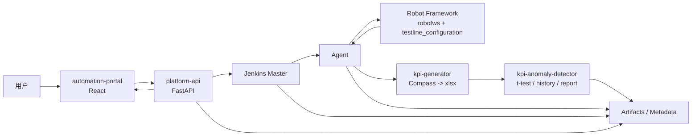
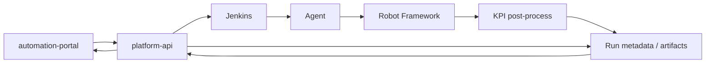
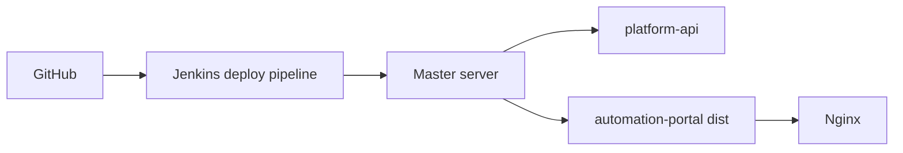
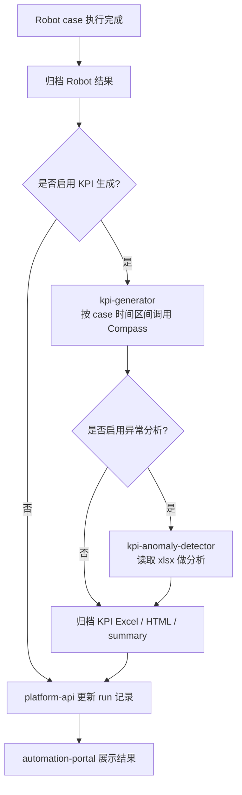

# Jenkins 自动化测试平台轻量化完整实施方案
## Jenkins + React + FastAPI + KPI 后处理统一主文档

**文档版本**：v3.0  
**更新日期**：2026-04-20  
**适用环境**：Windows 本地开发机 + Debian 13 / Ubuntu 22.04+  
**当前仓库**：`C:\TA\jenkins_robotframework`

---

## 1. 文档目标

这份文档的目标是把轻量化项目的完整实现统一收口到一处，后续不再把“前四步部署”“第五步后改造”“KPI 功能接入”分散在多份文档里。

当前统一方案的核心结构是：

- `jenkins-kpi-platform`：Jenkins 配置、Pipeline、部署编排
- `platform-api`：FastAPI 后端，统一 API、任务记录、结果聚合
- `automation-portal`：React 门户层，负责触发、查看、分析

前端构建策略统一采用：

- 本机不强依赖安装 `Node.js`
- `automation-portal` 由 Jenkins 或具备 Node.js 的构建机完成 `npm install` 与 `npm run build`
- 服务器最终只部署前端打包产物 `dist/`

本文档覆盖：

1. 前四步基础实施内容
2. 第五步以后基于 `Jenkins + React + FastAPI` 的完整轻量化方案
3. 原先 `kpi-generator` 与 `kpi-anomaly-detector` 的接入方案

---

## 2. 当前状态

你当前已经完成并验证：

- Jenkins Master 已安装
- Jenkins Prefix 已配置为 `/jenkins`
- Nginx 反向代理与 HTTPS 已打通
- `https://jenkins.company.com/jenkins/` 已可以登录

因此，本文档既保留前四步的完整手册，也把第五步以后改造成当前真正要走的主线。

---

## 3. 实施原则

后续所有步骤固定遵循下面这些原则：

1. 所有业务代码统一在本地 IDE 开发。
2. GitHub 仓库是唯一代码真源。
3. Debian 服务器只负责部署和运行，不直接写业务源码。
4. Jenkins 是调度与执行层，不是业务门户层。
5. React 门户层只面向用户交互，不直接保存 Jenkins 凭据。
6. FastAPI 是统一 API 与结果聚合层。
7. KPI 生成与 KPI 异常检测属于测试后处理能力，不属于 React 页面本身。

### 3.1 开发与部署边界

**本地 IDE 负责**：

- 代码开发
- Bug 修复
- 测试
- 配置维护
- Git 提交

**GitHub 仓库负责**：

- 保存主线代码
- 管理版本历史
- 作为服务器同步源

**Debian 服务器负责**：

- `git pull`
- 安装运行依赖
- systemd / Nginx / Jenkins 运行配置
- 启动或重启服务

### 3.2 服务器动作总原则

允许或谨慎执行的，通常是：

- `apt install`
- `git clone`
- `git pull`
- `python3 -m venv`
- `npm install` / `npm run build`
- `systemctl`
- `cp`
- `tee`
- `mkdir`

禁止在服务器上直接长期维护的，通常是：

- `app/main.py`
- `app/api/*.py`
- `requirements.txt`
- `tests/*`
- `src/*.tsx`
- `package.json` 中的业务改动

一句话记忆：

- 和系统运行、部署配置、服务控制有关的，可以在服务器做
- 和业务源码实现有关的，不在服务器直接做

---

## 4. 为什么要加门户层

这是这次方案改造最关键的背景。

原始平台和现在的轻量化方案，都值得保留一层门户层，不是因为“多一层更高级”，而是因为要把：

- 用户操作入口
- Jenkins 执行入口

明确拆开。

### 4.1 直接用 Jenkins 与带门户层方案对比

| 对比点 | 直接进入 Jenkins 调 Job | `automation-portal + platform-api + Jenkins` |
|---|---|---|
| 面向对象 | 自动化工程师、平台维护者 | 普通测试用户、测试管理者、平台维护者 |
| 用户看到的概念 | Job、参数、构建号、Agent | 测试线、版本、用例、环境、结果、趋势 |
| 参数输入 | 原始参数手填，容易出错 | 下拉框、校验、默认值、组合限制 |
| 安全边界 | 浏览器更靠近 Jenkins | 浏览器只访问 React 和 FastAPI |
| 结果展示 | 以 Jenkins 构建日志为主 | 可做列表页、详情页、趋势页、KPI 页 |
| 系统整合能力 | Jenkins 自身为主 | 可统一接 Jenkins、结果库、报告、通知 |
| 适用阶段 | 快速验证、管理员自用 | 平台化、多人使用、长期演进 |

### 4.2 结论

如果目标只是“先把 Job 跑起来”，直接 Jenkins 就够。

如果目标是：

- 更接近真实自动化平台
- 练习 `React + FastAPI`
- 做成一个能长期扩展的平台

那么门户层非常值得保留。

---

## 5. 总体架构

### 5.1 分层结构

| 层级 | 组件 | 职责 |
|---|---|---|
| L0 门户层 | `automation-portal` React | 任务触发、构建历史、结果详情、KPI 页面 |
| L1 API 层 | `platform-api` FastAPI | 对接 Jenkins、聚合运行记录、封装 KPI 任务 |
| L2 调度层 | Jenkins | 调度 Pipeline、编排 Agent、归档产物 |
| L3 执行层 | Agent + Robot Framework + `robotws` + `testline_configuration` | 执行自动化 case |
| L4 后处理层 | `kpi-generator` + `kpi-anomaly-detector` | 生成 KPI Excel、异常分析、输出 HTML/Excel 结果 |
| L5 展示与存储层 | FastAPI + 文件归档 + SQLite/PostgreSQL | 存元数据、返回接口、提供下载链接 |

### 5.2 三块代码的新职责

#### `jenkins-kpi-platform`

- JCasC
- Jenkinsfile / Groovy Pipeline
- Jenkins 部署脚本
- Robot 执行链路编排
- KPI 后处理 Pipeline 编排

#### `platform-api`

- Jenkins API 封装
- run 记录与状态管理
- 构建结果汇总
- KPI 任务记录与结果聚合
- 为 React 提供统一 REST API

#### `automation-portal`

- 任务触发页
- 运行记录页
- 运行详情页
- KPI 报告页
- 后续趋势统计页

### 5.3 推荐目录结构

```text
jenkins_robotframework/
├── jenkins-kpi-platform/
│   ├── jcasc/
│   ├── jobs/
│   ├── pipelines/
│   ├── scripts/
│   └── README.md
├── platform-api/
│   ├── app/
│   │   ├── api/
│   │   ├── core/
│   │   ├── models/
│   │   ├── repositories/
│   │   ├── schemas/
│   │   ├── services/
│   │   └── main.py
│   ├── tests/
│   └── requirements.txt
├── automation-portal/
│   ├── src/
│   ├── public/
│   ├── package.json
│   ├── vite.config.ts
│   └── README.md
├── deploy/
│   ├── nginx/
│   ├── scripts/
│   └── systemd/
└── docs/
```

### 5.4 推荐访问路径

统一由 Nginx 收口：

- `/jenkins/` -> Jenkins
- `/api/` -> `platform-api`
- `/` -> `automation-portal`

推荐最终外部访问形态：

- `https://jenkins.company.com/`
- `https://jenkins.company.com/api/`
- `https://jenkins.company.com/jenkins/`

### 5.5 端到端数据流



---

## 6. 第一步：前置准备

### 6.1 资源清单

**硬件资源**：

- [ ] Master 服务器：`10.71.210.104`
- [ ] Agent 服务器：`10.57.159.149`
- [ ] 两台服务器网络互通

**账号与权限**：

- [ ] GitHub 仓库可访问
- [ ] 服务器具备 `sudo`
- [ ] 可读取 `robotws`、`testline_configuration`
- [ ] Jenkins 后续可配置 SSH 凭据

**本地开发环境**：

- [ ] Windows 已安装 Git
- [ ] 已安装 Python
- [ ] IDE 可正常使用
- [ ] 可通过 SSH 连接 Debian 服务器
- [ ] Jenkins 或前端构建机具备 Node.js 20 LTS

### 6.2 本地建议准备

```powershell
git --version
python --version
```

说明：

- 当前方案不要求公司本机必须安装 `Node.js`
- 如果本机无法安装额外软件，前端构建统一放到 Jenkins 或专用构建机

### 6.3 第一轮建议准备的本地能力

- Python：用于 `platform-api`
- Git：用于本地开发与同步
- SSH：用于远程部署和验证

### 6.4 第一轮建议准备的构建能力

- Jenkins 或构建机安装 Node.js 20 LTS
- Jenkins 或构建机可执行 `npm install`
- Jenkins 或构建机可执行 `npm run build`
- 构建产物可发布到 `/opt/jenkins_robotframework/automation-portal/dist`

---

## 7. 第二步：GitHub 仓库与本地开发模式

### 7.1 本地克隆仓库

```powershell
cd C:\TA
git clone https://github.com/stella555359/jenkins_robotframework.git
cd C:\TA\jenkins_robotframework
```

如果仓库已在本地，则直接进入项目目录即可。

### 7.2 推荐分支策略

- `main`：稳定发布
- `dev`：日常集成
- `feature/*`：功能开发
- `fix/*`：缺陷修复

### 7.3 当前项目最实用的简化流程

```powershell
git checkout dev
git pull origin dev
git checkout -b feature/automation-portal-routing
```

功能完成后：

```powershell
git checkout dev
git pull origin dev
git merge feature/automation-portal-routing
git push origin dev
```

稳定后合入 `main`：

```powershell
git checkout main
git pull origin main
git merge dev
git push origin main
```

### 7.4 代码修改标准流程

1. 本地 IDE 修改代码
2. 本地自测
3. `git add` / `git commit`
4. `git push`
5. 服务器 `git pull`
6. 更新依赖或执行部署脚本
7. 重启对应服务

### 7.5 服务器同步代码标准方式

首次部署：

```bash
cd /opt
sudo git clone https://github.com/stella555359/jenkins_robotframework.git
sudo chown -R ute:ute /opt/jenkins_robotframework
```

后续发布：

```bash
cd /opt/jenkins_robotframework
git fetch origin
git checkout main
git pull --ff-only origin main
```

如果访问 GitHub 需要代理：

```bash
cd /opt/jenkins_robotframework
git -c http.proxy=http://10.144.1.10:8080 -c https.proxy=http://10.144.1.10:8080 fetch origin
git checkout main
git -c http.proxy=http://10.144.1.10:8080 -c https.proxy=http://10.144.1.10:8080 pull --ff-only origin main
```

### 7.6 一眼判断规则

- 系统目录、service、Nginx、Jenkins 配置：可在服务器维护
- `app/*.py`、`src/*.tsx`、`requirements.txt`、`package.json`：不在服务器直接改

---

## 8. 第三步：服务器基础环境准备

### 8.1 Master 服务器基础初始化

在 `10.71.210.104` 上执行：

```bash
sudo apt update
sudo apt upgrade -y
sudo apt autoremove -y

sudo apt install -y \
    curl \
    wget \
    git \
    vim \
    htop \
    tree \
    unzip \
    net-tools \
    python3 \
    python3-pip \
    python3-venv \
    python3-dev \
    build-essential \
    openjdk-17-jdk \
    nginx
```

说明：

- 这一步是操作系统层运行依赖准备
- 还不涉及业务源码
- 对当前 Debian / Ubuntu 通用落地，`openjdk-17-jdk` 比 `openjdk-21-jdk` 更稳；Jenkins 运行这一阶段用 Java 17 即可

如果你计划在 Jenkins Master 本机直接执行前端构建，则额外准备 Node.js 20 LTS。

更推荐的方式是：

- Jenkins 使用单独的前端构建节点
- 该节点安装 Node.js 20 LTS
- Master 继续主要承担 Jenkins 服务本身

### 8.1.1 Jenkins / 构建机安装 Node.js 20 LTS

如果前端构建放在 Debian 构建机或 Jenkins 节点上，推荐直接安装 Node.js 20 LTS。

先安装 NodeSource 源：

```bash
sudo apt update
sudo apt install -y ca-certificates curl gnupg
curl -fsSL https://deb.nodesource.com/setup_20.x | sudo -E bash -
```

如果这台机器访问外网需要走代理，可以改成：

```bash
export http_proxy=http://10.144.1.10:8080
export https_proxy=http://10.144.1.10:8080
curl -fsSL https://deb.nodesource.com/setup_20.x | sudo -E bash -
```

或者写成单行：

```bash
http_proxy=http://10.144.1.10:8080 https_proxy=http://10.144.1.10:8080 curl -fsSL https://deb.nodesource.com/setup_20.x | sudo -E bash -
```

这里保留 `sudo -E` 的原因是：需要把当前 shell 里的代理环境变量继续传给 `bash -` 执行出来的安装脚本。

再安装 Node.js：

```bash
sudo apt install -y nodejs
```

验证：

```bash
node --version
npm --version
```

预期：

- `node --version` 返回 `v20.x.x`
- `npm --version` 返回对应 npm 版本

如果这台机器未来只负责前端构建，建议额外确认：

```bash
which node
which npm
```

这样后续 Jenkins Pipeline 中调用 `npm install`、`npm run build` 时更容易排查环境问题。

### 8.2 创建统一部署目录

```bash
sudo mkdir -p /opt/jenkins_robotframework
sudo mkdir -p /var/lib/jenkins-kpi-platform/{logs,backups,data}
sudo chown -R ute:ute /opt/jenkins_robotframework
sudo chown -R ute:ute /var/lib/jenkins-kpi-platform
```

允许手工创建的内容：

- `/opt/jenkins_robotframework`
- 运行期数据目录
- `venv`
- systemd 文件
- Nginx 配置

不允许手工创建的内容：

- `app/main.py`
- `src/main.tsx`
- `requirements.txt`
- `package.json`

### 8.3 Agent 服务器基础配置

在 `10.57.159.149` 上执行：

```bash
sudo apt update
sudo apt upgrade -y

sudo apt install -y \
    python3 \
    python3-pip \
    python3-venv \
    openjdk-17-jre \
    git \
    openssh-server \
    curl \
    vim

sudo useradd -m -s /bin/bash jenkins || true
echo "jenkins ALL=(ALL) NOPASSWD:ALL" | sudo tee /etc/sudoers.d/jenkins

sudo mkdir -p /automation/{workspace,venv,logs,downloads}
sudo chown -R jenkins:jenkins /automation
```

补充说明：

- 如果 `apt install` 报 `Unable to locate package openjdk-21-jre`，不要继续卡在 21；直接改用 `openjdk-17-jre`
- Jenkins SSH Agent 这一阶段只要求 Agent 上能正常执行 `java -version`
- 安装完成后建议立刻验证：

```bash
java -version
readlink -f "$(which java)"
id jenkins
ls -ld /automation /automation/workspace
systemctl status ssh --no-pager || systemctl status sshd --no-pager
```

验证时请特别注意：

- `java -version` 需要看到 `17`
- 不能是 `1.8` / `8`
- `readlink -f "$(which java)"` 最好指向 `java-17-openjdk`

如果已经安装过多个 Java 版本，`apt install openjdk-17-jre` 不代表当前默认 `java` 一定就是 17，还需要继续确认默认命令实际指向哪一个版本。

### 8.4 SSH 免密配置

Master 上生成密钥：

```bash
ssh-keygen -t rsa -b 4096 -C "jenkins-master" -f ~/.ssh/jenkins_agent_rsa -N ""
```

把公钥加入 Agent 后验证：

```bash
ssh -i ~/.ssh/jenkins_agent_rsa jenkins@10.57.159.149 "echo 'SSH OK'"
```

如果上面这条命令还没有成功，就先不要去 Jenkins Web 点 `Set up an agent`。正确顺序是：

1. Agent 机器先装好 Java、SSH 服务、`jenkins` 用户
2. Master 到 Agent 先实现免密 SSH
3. `/automation/workspace` 对 `jenkins` 用户可写
4. 最后再在 Jenkins Web 里新增节点

---

## 9. 第四步：Jenkins Master 部署

### 9.1 安装 Jenkins

```bash
sudo wget -O /usr/share/keyrings/jenkins-keyring.asc \
  https://pkg.jenkins.io/debian-stable/jenkins.io.key

echo "deb [signed-by=/usr/share/keyrings/jenkins-keyring.asc] https://pkg.jenkins.io/debian-stable binary/" | \
  sudo tee /etc/apt/sources.list.d/jenkins.list > /dev/null

sudo apt update
sudo apt install -y jenkins
```

### 9.2 启动 Jenkins

```bash
sudo systemctl enable jenkins
sudo systemctl start jenkins
sudo systemctl status jenkins
sudo cat /var/lib/jenkins/secrets/initialAdminPassword
```

### 9.3 初始化 Jenkins Web

建议先通过 SSH 隧道访问：

```powershell
ssh -L 8080:localhost:8080 ute@10.71.210.104
```

浏览器打开：

```text
http://localhost:8080
```

### 9.4 配置 Jenkins 子路径

因为最终要通过 `/jenkins/` 暴露，先设置 Prefix：

```bash
sudo systemctl edit jenkins
```

写入：

```ini
[Service]
Environment="JENKINS_PREFIX=/jenkins"
```

保存后执行：

```bash
sudo systemctl daemon-reload
sudo systemctl restart jenkins
sudo systemctl status jenkins
```

### 9.5 Jenkins 必装插件

- Pipeline
- Git
- Credentials Binding
- SSH Build Agents
- Configuration as Code
- Timestamper
- AnsiColor
- HTML Publisher
- JUnit

### 9.6 Jenkins 的定位

Jenkins 负责：

- 拉代码
- 跑 Pipeline
- 触发 Robot Framework
- 编排 KPI 后处理任务

Jenkins 不负责：

- 作为用户门户
- 直接承载业务页面
- 代替 FastAPI 做业务 API

### 9.7 证书准备

如果当前没有正式域名，可以先用自签名证书：

```bash
sudo openssl req -x509 -nodes -days 365 -newkey rsa:4096 \
  -keyout /etc/ssl/private/jenkins-kpi-platform.key \
  -out /etc/ssl/certs/jenkins-kpi-platform.crt \
  -subj "/CN=10.71.210.104"
```

### 9.8 Jenkins 的 Nginx 反向代理与 HTTPS 配置

前四步阶段，先只代理 Jenkins：

仓库中维护：

```text
deploy/nginx/jenkins-kpi-platform.conf
```

建议内容：

```nginx
server {
    listen 80;
    server_name 10.71.210.104;

    return 301 https://$host$request_uri;
}

server {
    listen 443 ssl;
    server_name 10.71.210.104;

    ssl_certificate /etc/ssl/certs/jenkins-kpi-platform.crt;
    ssl_certificate_key /etc/ssl/private/jenkins-kpi-platform.key;
    ssl_protocols TLSv1.2 TLSv1.3;
    ssl_prefer_server_ciphers on;

    proxy_set_header Host $host;
    proxy_set_header X-Real-IP $remote_addr;
    proxy_set_header X-Forwarded-For $proxy_add_x_forwarded_for;
    proxy_set_header X-Forwarded-Proto $scheme;

    location /jenkins/ {
        proxy_pass http://127.0.0.1:8080/jenkins/;
        proxy_http_version 1.1;
        proxy_set_header Connection "";
    }
}
```

启用配置：

```bash
sudo cp /opt/jenkins_robotframework/deploy/nginx/jenkins-kpi-platform.conf /etc/nginx/sites-available/jenkins-kpi-platform.conf
sudo ln -sf /etc/nginx/sites-available/jenkins-kpi-platform.conf /etc/nginx/sites-enabled/jenkins-kpi-platform.conf
sudo rm -f /etc/nginx/sites-enabled/default
sudo nginx -t
sudo systemctl restart nginx
```

### 9.9 从 Windows 验证外部访问并设置 Jenkins URL

```bash
curl -k -I https://10.71.210.104/jenkins/
```

本机验证：

```bash
curl -k -I https://127.0.0.1/jenkins/
```

浏览器验证：

```text
https://10.71.210.104/jenkins/
```

确认可访问后，在 Jenkins 中设置：

- `Manage Jenkins`
- `System`
- `Jenkins URL`

值设为：

- `https://10.71.210.104/jenkins/`

如果后面使用正式域名，则改成：

- `https://jenkins.company.com/jenkins/`

---

## 10. 第五步：应用层改造落地

这是从“基础设施打通”切换到“平台能力成型”的关键一步。

### 10.1 第五步后的核心调整

从这里开始，不再沿用“两个 FastAPI 服务并列”的旧思路，而是切换成：

- `automation-portal`：React 门户层
- `platform-api`：FastAPI 平台后端
- Jenkins：执行与编排层

### 10.2 第一轮目标

先打通最小闭环：

1. React 页面触发 Jenkins Job
2. FastAPI 记录 run
3. Jenkins 调 Agent 跑 Robot
4. FastAPI 回收状态与结果
5. React 展示运行记录与结果

### 10.3 为什么不让 React 直接调 Jenkins

必须坚持：

`React -> FastAPI -> Jenkins`

而不是：

`React -> Jenkins`

原因：

- Jenkins 凭据不能放浏览器
- Jenkins CSRF / Token 处理更适合后端
- 运行记录需要数据库和业务 `run_id`
- 后面还要接 KPI 与结果聚合

---

## 11. 第六步：`automation-portal` React 门户层

### 11.1 技术栈建议

- React
- TypeScript
- Vite
- React Router
- Axios
- Ant Design 或 MUI

### 11.2 第一版页面范围

- `/`：首页 / Dashboard
- `/trigger`：任务触发页
- `/runs`：运行记录页
- `/runs/:id`：运行详情页
- `/kpi/:id`：KPI 结果页

### 11.3 第一版页面职责

**首页**：

- Jenkins 状态
- 最近构建
- 最近失败摘要

**任务触发页**：

- Job 选择
- 分支、testline、case 参数输入
- 是否启用 KPI 生成
- 是否启用 KPI 异常分析

**运行记录页**：

- run 列表
- 状态筛选
- 按 branch / testline / case 查询

**运行详情页**：

- run 元数据
- Jenkins build 链接
- Robot 结果摘要
- artifact 链接

**KPI 页**：

- KPI Excel 下载
- 异常分析 HTML 报告入口
- 关键异常摘要

### 11.4 本地开发

当前方案默认不要求本机安装 `Node.js`。

因此 `automation-portal` 的推荐开发/构建方式是：

1. 本机只编辑前端源码
2. push 到 GitHub
3. Jenkins 或前端构建机执行：

```bash
cd /opt/jenkins_robotframework/automation-portal
npm install
npm run build
```

4. Nginx 直接提供构建后的 `dist/`

如果你后面有一台允许安装 Node.js 的开发机，再补本地 `npm run dev` 也可以，但不是当前主线前提。

### 11.5 建议的前端接口依赖

- `GET /api/health`
- `GET /api/jenkins/jobs`
- `POST /api/runs`
- `GET /api/runs`
- `GET /api/runs/{run_id}`
- `GET /api/runs/{run_id}/kpi`

---

## 12. 第七步：`platform-api` FastAPI 平台后端

### 12.1 新职责

`platform-api` 不再只是“报告展示服务”，而是统一平台后端。

它要承担：

- Jenkins REST API 封装
- run 元数据存储
- 构建状态同步
- artifact 信息归档
- KPI 任务状态记录
- 统一对前端输出 JSON

### 12.2 第一版建议接口

- `GET /api/health`
- `GET /api/jenkins/jobs`
- `POST /api/runs`
- `GET /api/runs`
- `GET /api/runs/{run_id}`
- `GET /api/runs/{run_id}/artifacts`
- `GET /api/runs/{run_id}/kpi`

### 12.3 建议数据模型

第一版默认使用 `SQLite`，后续数据量变大或并发需求更高时，再切 `PostgreSQL`。

也就是说，当前轻量化方案里，`platform-api` 的数据库基线就是：

- 数据库类型：`SQLite`
- 目标：先把 run、artifact、KPI 结果这些核心元数据稳稳存下来

建议第一轮数据库文件先放在：

- 本地开发：`platform-api/data/results/automation_platform.db`
- 服务器：`/opt/jenkins_robotframework/platform-api/data/results/automation_platform.db`

为什么第一轮先用 `SQLite`：

1. 不需要额外安装数据库服务
2. 一份 `.db` 文件就能跑起来
3. 很适合当前练手和最小闭环阶段
4. 后面如果切 PostgreSQL，业务分层还能继续复用

建议至少保存这些字段：

- `run_id`
- `job_name`
- `build_number`
- `build_url`
- `branch`
- `testline`
- `case_name`
- `trigger_user`
- `status`
- `start_time`
- `end_time`
- `report_url`
- `kpi_report_url`
- `kpi_anomaly_url`
- `result_summary`

### 12.3.1 第一轮 SQLite 里建议先存什么

第一轮不用把数据库设计得很重，先存最核心的两类信息就够：

#### 表 1：`runs`

建议至少包含：

- `run_id`
- `job_name`
- `branch`
- `testline`
- `case_name`
- `trigger_user`
- `status`
- `build_number`
- `build_url`
- `start_time`
- `end_time`
- `result_summary`

#### 表 2：`run_artifacts`

建议至少包含：

- `artifact_id`
- `run_id`
- `artifact_type`
- `artifact_name`
- `artifact_path`
- `artifact_url`
- `created_at`

如果第一轮就要接 KPI，再增加一张轻量表：

#### 表 3：`run_kpi_results`

建议至少包含：

- `kpi_result_id`
- `run_id`
- `kpi_generation_status`
- `kpi_detection_status`
- `kpi_excel_url`
- `kpi_html_report_url`
- `kpi_excel_report_url`
- `kpi_summary_json`

### 12.3.2 SQLite 在当前架构里的位置

当前主线里，SQLite 负责保存“平台元数据”，而不是保存大文件本体。

换句话说：

- `SQLite` 负责存：run、状态、链接、摘要、路径
- 文件系统或 Jenkins artifact 负责存：`output.xml`、`log.html`、KPI `.xlsx`、HTML 报告

这样做更合理，因为：

1. 数据库适合存结构化信息
2. 大文件不适合直接塞进 SQLite
3. 前端真正需要的是“状态 + 链接 + 摘要”

### 12.4 本地开发

```powershell
cd C:\TA\jenkins_robotframework\platform-api
python -m venv venv
venv\Scripts\activate
pip install -r requirements.txt
uvicorn app.main:app --reload --host 127.0.0.1 --port 8000
```

### 12.5 服务器部署

```bash
cd /opt/jenkins_robotframework/platform-api
python3 -m venv venv
source venv/bin/activate
pip install --upgrade pip
pip install -r requirements.txt
deactivate
```

systemd 示例：

```ini
[Unit]
Description=Platform API Service
After=network.target

[Service]
Type=simple
User=ute
WorkingDirectory=/opt/jenkins_robotframework/platform-api
Environment="PATH=/opt/jenkins_robotframework/platform-api/venv/bin"
ExecStart=/opt/jenkins_robotframework/platform-api/venv/bin/uvicorn app.main:app --host 0.0.0.0 --port 8000
Restart=always
RestartSec=5

[Install]
WantedBy=multi-user.target
```

---

## 13. 第八步：Jenkins Agent 配置

### 13.1 Agent 节点用途

Agent 负责：

- 拉取测试仓库
- 执行 Robot Framework
- 执行 KPI 后处理任务
- 生成并归档产物

Agent 不负责：

- 部署 React 前端
- 作为 FastAPI 业务 API 层

### 13.2 在 Jenkins 中添加 Agent

这一节对应的就是 Jenkins Web 界面里的 **`Set up an agent`**。

不同 Jenkins 版本入口名字可能略有差异，但本质是同一个动作，常见入口有两种：

1. 首页或节点页上直接看到 `Set up an agent`
2. `Manage Jenkins` -> `Nodes` -> `New Node`

如果你现在界面上已经出现 `Set up an agent`，直接点进去即可。

建议配置：

- Name: `t813-agent`
- Remote root directory: `/automation/workspace`
- Labels: `t813 robot`
- Launch method: `Launch agents via SSH`
- Host: `10.57.159.149`
- Credentials: Jenkins 中配置的 SSH 凭据

更完整的填写建议如下。

#### 13.2.1 新增节点时具体怎么点

1. 进入 Jenkins Web
2. 点击 `Set up an agent` 或 `Manage Jenkins` -> `Nodes`
3. 点击 `New Node`
4. `Node name` 填：`t813-agent`
5. 节点类型选：`Permanent Agent`
6. 点击 `Create`

#### 13.2.2 节点配置页逐项填写建议

创建后进入节点配置页，建议按下面填写：

| Jenkins 页面字段 | 推荐填写值 | 说明 |
|---|---|---|
| `Name` | `t813-agent` | 节点名，后续 Pipeline 里也会用到 |
| `Description` | `T813 Robot execution agent` | 可选，但建议写清用途 |
| `Number of executors` | `1` | 第一轮先用 1，避免并发把测试线打乱 |
| `Remote root directory` | `/automation/workspace` | Jenkins 在 Agent 上的工作根目录 |
| `Labels` | `t813 robot` | 后续 Pipeline 可用 `label 't813'` 或 `label 't813 && robot'` |
| `Usage` | `Only build jobs with label expressions matching this node` | 避免无关任务跑到这台 Agent |
| `Launch method` | `Launch agents via SSH` | 这是当前方案的标准方式 |
| `Host` | `10.57.159.149` | Agent IP |
| `Credentials` | Jenkins 中为 `jenkins@10.57.159.149` 配好的 SSH 凭据 | 必须和实际 SSH 用户对应 |
| `Host Key Verification Strategy` | 第一轮可用 `Non verifying Verification Strategy` | 联调通过后再改成更严格方式 |
| `Availability` | `Keep this agent online as much as possible` | 让 Jenkins 尽量保持节点在线 |

如果你的界面里还看到下面这些可选项，可先保持默认：

- `Node Properties`
- `Environment variables`
- `Tool Locations`

第一轮不需要额外配置这些项，先以“能连上并执行 shell step”为目标。

#### 13.2.3 Credentials 应该怎么加

如果 `Credentials` 下拉框里还没有可用 SSH 凭据，先在 Jenkins 里新增：

如果你现在 Jenkins 里一条 Credentials 都没有，不用先回头找历史配置，直接按下面步骤新建第一条即可。当前这一步需要新增的是：**给 `jenkins@10.57.159.149` 使用的 SSH 私钥凭据**。

1. `Manage Jenkins`
2. `Credentials`
3. 如果页面里有 `System`，先点 `System`
4. 进入 `Global credentials (unrestricted)`
5. 点击 `Add Credentials`

建议填写：

| 字段 | 推荐值 |
|---|---|
| `Kind` | `SSH Username with private key` |
| `Scope` | `Global` |
| `Username` | `jenkins` |
| `Private Key` | `Enter directly`，粘贴 Master 上 `~/.ssh/jenkins_agent_rsa` 私钥内容 |
| `ID` | `t813-agent-ssh` |
| `Description` | `SSH key for t813-agent` |

保存后回到节点配置页，在 `Credentials` 里选择这个 `t813-agent-ssh`。

如果你不知道 `Private Key` 里要填什么，就按下面顺序准备。

##### 13.2.3.1 先在 Master 上确认或生成这把 key

在 Jenkins Master 上执行：

```bash
ls -l ~/.ssh/jenkins_agent_rsa ~/.ssh/jenkins_agent_rsa.pub
```

如果文件已经存在，就继续下一步。

如果不存在，就直接生成：

```bash
ssh-keygen -t rsa -b 4096 -C "jenkins-master" -f ~/.ssh/jenkins_agent_rsa -N ""
```

然后查看公钥内容：

```bash
cat ~/.ssh/jenkins_agent_rsa.pub
```

把这段公钥追加到 Agent 机器 `jenkins` 用户的 `authorized_keys` 中。

##### 13.2.3.2 把公钥放到 Agent 上

如果 Agent 机上 `jenkins` 用户已存在，可执行：

```bash
ssh-copy-id -i ~/.ssh/jenkins_agent_rsa.pub jenkins@10.57.159.149
```

如果没有 `ssh-copy-id`，也可以手工追加：

```bash
cat ~/.ssh/jenkins_agent_rsa.pub
```

把输出内容复制到 Agent 机器：

```bash
mkdir -p ~/.ssh
chmod 700 ~/.ssh
echo '这里粘贴上面那一整行公钥' >> ~/.ssh/authorized_keys
chmod 600 ~/.ssh/authorized_keys
```

这里的 `~` 指的是 Agent 机器上 `jenkins` 用户的 home 目录。

##### 13.2.3.3 把私钥内容填进 Jenkins Credentials

回到 Jenkins `Add Credentials` 页面后：

1. `Kind` 选 `SSH Username with private key`
2. `Username` 填 `jenkins`
3. `Private Key` 选 `Enter directly`
4. **继续点击右侧的 `Add` 按钮**，这一步不能省；很多人卡在这里，就是因为只选了 `Enter directly`，但没有继续点 `Add`
5. 把 Master 上这把私钥的内容完整粘贴进去：

```bash
cat ~/.ssh/jenkins_agent_rsa
```

6. `ID` 填 `t813-agent-ssh`
7. `Description` 填 `SSH key for t813-agent`
8. 点击 `Create`

如果你点完 `Enter directly` 之后发现“还是没有地方可粘贴”，通常按下面顺序排查：

1. 先确认是不是漏点了右侧的 `Add`
2. 如果已经点了 `Add`，看页面下方是否出现：
    - `Key` 文本框
    - 或 `-----BEGIN ... PRIVATE KEY-----` 这种内容输入区域
3. 如果输入框被页面样式挡住，先往下滚动一点再看
4. 如果浏览器插件拦截了 Jenkins 页面脚本，先换一个无插件窗口或 InPrivate / Incognito 窗口再试

如果当前 Jenkins 版本页面行为确实异常，或者你在远程桌面里复制粘贴不稳定，可以直接改用另一种方式：`From a file on Jenkins controller`。

##### 13.2.3.3.1 如果 `Enter directly` 不能粘贴，可改用 `From a file on Jenkins controller`

前提是这把私钥文件已经实际存在于 Jenkins Master 本机上，例如：

```bash
~/.ssh/jenkins_agent_rsa
```

此时在 Jenkins `Add Credentials` 页面可改填：

1. `Kind` 选 `SSH Username with private key`
2. `Username` 填 `jenkins`
3. `Private Key` 选 `From a file on Jenkins controller`
4. 文件路径填写：

```text
/var/lib/jenkins/.ssh/jenkins_agent_rsa
```

或如果 Jenkins 进程实际运行用户能访问的是当前用户 home，也可以是：

```text
/home/ute/.ssh/jenkins_agent_rsa
```

但这里必须注意：**这个路径必须是 Jenkins Controller 本机上的真实路径，而且 Jenkins 运行用户必须有读取权限**。

最稳的做法通常是把 key 放到 Jenkins 自己的 home 下，例如：

```bash
sudo mkdir -p /var/lib/jenkins/.ssh
sudo cp ~/.ssh/jenkins_agent_rsa /var/lib/jenkins/.ssh/jenkins_agent_rsa
sudo chown -R jenkins:jenkins /var/lib/jenkins/.ssh
sudo chmod 700 /var/lib/jenkins/.ssh
sudo chmod 600 /var/lib/jenkins/.ssh/jenkins_agent_rsa
```

然后在 Jenkins 页面里填：

```text
/var/lib/jenkins/.ssh/jenkins_agent_rsa
```

如果这条方式能保存成功，效果和手工粘贴私钥是一样的。

注意：

- 粘贴到 Jenkins 的是 **私钥** `~/.ssh/jenkins_agent_rsa`
- 放到 Agent `authorized_keys` 里的必须是 **公钥** `~/.ssh/jenkins_agent_rsa.pub`
- 两个文件不要混用

##### 13.2.3.4 新建完后先不要急着配节点，先验证这条凭据对应的 key 是通的

在 Master 上执行：

```bash
ssh -i ~/.ssh/jenkins_agent_rsa jenkins@10.57.159.149 "echo SSH OK"
```

只有这条命令能返回 `SSH OK`，才说明：

- Jenkins 里即将选择的这条 SSH 凭据是对的
- Agent 上的 `authorized_keys` 配置是对的
- 后续节点配置页里的 `Credentials` 才应该选 `t813-agent-ssh`

#### 13.2.4 保存后怎么验证是否配置成功

保存节点后，进入该节点页面，点击：

- `Launch agent`

理想情况下日志里会看到类似信息：

- SSH connected
- Java version detected
- `agent.jar` copied
- Agent successfully connected and online

最终目标是：

1. `Nodes` 页面中 `t813-agent` 显示 `online`
2. 节点日志里没有权限错误、Java 缺失错误、SSH 认证错误
3. Jenkins 能在这台节点上执行一个最小 shell step

#### 13.2.5 最小验证任务

节点在线后，建议立刻用一个最小 Pipeline 验证：

```groovy
pipeline {
    agent { label 't813 && robot' }

    stages {
        stage('Agent Smoke Test') {
            steps {
                sh 'hostname'
                sh 'whoami'
                sh 'pwd'
                sh 'java -version'
                sh 'touch workspace_write_test.txt'
                sh 'ls -l workspace_write_test.txt'
                sh 'rm -f workspace_write_test.txt'
            }
        }
    }
}
```

只要这段能成功跑完，就说明：

- Jenkins 能正确挑中这台 Agent
- SSH 启动正常
- Java 运行时正常
- `/automation/workspace` 工作目录正常
- 当前 Job 对应的 workspace 目录可写

如果你在日志里看到类似下面这种路径，也属于正常现象：

```text
/automation/workspace/workspace/agent-smoke-test
```

原因是：

- 节点配置里的 `Remote root directory` 是 `/automation/workspace`
- Jenkins 会在这个根目录下面，再为具体 Job 创建自己的 workspace 子目录

因此看到 `/automation/workspace/workspace/...` 不代表配置错了。

#### 13.2.6 如果连接失败，优先检查什么

按这个顺序查，通常最快：

1. Master 上先手工验证：

```bash
ssh -i ~/.ssh/jenkins_agent_rsa jenkins@10.57.159.149 "echo SSH OK"
```

2. Agent 上确认 Java：

```bash
java -version
readlink -f "$(which java)"
```

3. Agent 上确认目录权限：

```bash
ls -ld /automation /automation/workspace
```

4. Agent 上确认 SSH 服务在线：

```bash
systemctl status ssh --no-pager || systemctl status sshd --no-pager
```

如果这四步都正常，再回 Jenkins 看节点日志，通常问题就只剩 Credentials 选错或 Host Key 校验策略过严。

如果节点日志里已经出现下面这种报错：

```text
UnsupportedClassVersionError
class file version 61.0
only recognizes class file versions up to 52.0
```

就不要再查 SSH 或 Credentials 了，这个报错已经很明确地说明：

- SSH 认证已经成功
- `remoting.jar` 已经成功下发
- 失败点是 Agent 上实际运行的 `java` 太旧
- `61.0` 对应 Java 17
- `52.0` 对应 Java 8

也就是说，这种场景通常是：

- Agent 上虽然可能装过 `openjdk-17-jre`
- 但 Jenkins 启动 agent 时实际调用到的仍然是旧的 Java 8

这时直接在 Agent 上执行下面这组命令排查和修复：

```bash
java -version
readlink -f "$(which java)"
update-alternatives --list java || true
sudo apt install -y openjdk-17-jre openjdk-17-jre-headless
sudo update-alternatives --config java
java -version
readlink -f "$(which java)"
```

修复目标是：

- `java -version` 输出为 `17.x`
- `which java` 指向的最终路径落在 `java-17-openjdk`

如果你不想依赖系统默认 `java`，也可以在 Jenkins 节点配置页中把 `JavaPath` 显式填成 Java 17 的绝对路径，例如：

```text
/usr/lib/jvm/java-17-openjdk-amd64/bin/java
```

填完后重新点 `Launch agent`。只要 Java 版本正确，这类 `UnsupportedClassVersionError` 一般就会直接消失。

### 13.3 Agent 侧代码同步原则

Agent 构建时可以拉取：

- `robotws`
- `testline_configuration`

但平台主线代码仍以 GitHub 仓库为准，不在 Agent 手工维护。

---

## 14. 第九步：Pipeline 与代码同步流程

这一部分要明确分成两类 Pipeline。

### 14.1 第一类：测试执行 Pipeline

负责：

1. 触发 Robot
2. 归档 Robot 结果
3. 可选触发 KPI 后处理
4. 回写结果到 FastAPI

### 14.2 第二类：平台发布 Pipeline

负责：

1. 更新 `platform-api`
2. 在 Jenkins 或构建机中构建 `automation-portal`
3. 更新 Nginx 静态目录
4. 重启 FastAPI 服务

不要把“跑测试”和“发布平台前后端”写成同一条流水线。

这里的前端构建建议固定为：

- Jenkins 拉取仓库
- Jenkins 在具备 Node.js 20 LTS 的环境里执行 `npm install` 和 `npm run build`
- Jenkins 将 `dist/` 发布到目标服务器

### 14.2.1 `automation-portal` 前端构建发布流程

推荐把前端发布固定成下面这条链路：

1. Jenkins 拉取最新仓库代码
2. Jenkins 进入 `automation-portal/`
3. 执行 `npm install`
4. 执行 `npm run build`
5. 把生成的 `dist/` 同步到服务器目标目录
6. Nginx 直接提供 `dist/`

#### Jenkins / 构建机上的构建命令

```bash
cd /opt/jenkins_robotframework/automation-portal
npm install
npm run build
```

构建成功后，预期会生成：

```text
/opt/jenkins_robotframework/automation-portal/dist
```

#### 发布到服务器的推荐方式

如果 Jenkins 就运行在目标服务器本机，可直接使用构建产物目录。

如果 Jenkins 运行在独立构建机，推荐用 `rsync` 或 `scp` 把 `dist/` 同步到目标服务器：

```bash
rsync -av --delete /opt/jenkins_robotframework/automation-portal/dist/ ute@10.71.210.104:/opt/jenkins_robotframework/automation-portal/dist/
```

或者：

```bash
scp -r /opt/jenkins_robotframework/automation-portal/dist/* ute@10.71.210.104:/opt/jenkins_robotframework/automation-portal/dist/
```

#### 服务器侧目录准备

第一次发布前，确保目标目录存在：

```bash
sudo mkdir -p /opt/jenkins_robotframework/automation-portal/dist
sudo chown -R ute:ute /opt/jenkins_robotframework/automation-portal
```

#### 发布后的验证

同步完成后，检查：

```bash
ls /opt/jenkins_robotframework/automation-portal/dist
curl -k -I https://127.0.0.1/
```

如果域名已接通，再验证：

```bash
curl -k -I https://jenkins.company.com/
```

#### 对应的最小 Jenkins Pipeline 片段

```groovy
stage('Build automation-portal') {
    steps {
        dir('automation-portal') {
            sh 'npm install'
            sh 'npm run build'
        }
    }
}
```

如果 Jenkins 与目标服务器不在同一台机器，再增加一个同步阶段：

```groovy
stage('Publish automation-portal dist') {
    steps {
        sh '''
        rsync -av --delete automation-portal/dist/ \
          ute@10.71.210.104:/opt/jenkins_robotframework/automation-portal/dist/
        '''
    }
}
```

### 14.3 最小测试执行链路



### 14.4 最小平台发布链路



---

## 15. 第十步：把 KPI 两个模块接入新架构

这一章是当前方案和你原先 `C:\TA\kpi_web_app` 之间最重要的连接点。

### 15.1 原有两个模块的真实职责

#### `kpi-generator`

原有作用：

- 根据 case 的测试时间区间
- 调 Compass 页面背后的接口
- 生成 KPI Excel 报告
- 输出 `.xlsx`

它本质上是：

- 一个“面向 Compass 的 KPI 取数与报告生成器”

#### `kpi-anomaly-detector`

原有作用：

- 读取 KPI Excel
- 对 KPI 数据做异常检测
- 使用 `t-test`、历史记录、阈值、规则等算法
- 生成异常分析结果
- 输出 HTML / Excel 报告

它本质上是：

- 一个“面向 KPI Excel 的后处理分析器”

### 15.2 这两个模块在新平台里的定位

它们不应该成为独立前端页面应用，也不应该直接塞进 React。

更合理的分工是：

- `automation-portal`：让用户选择“是否生成 KPI / 是否做异常检测”
- `platform-api`：接收请求、记录状态、提供结果查询
- Jenkins / Agent：真正执行 `kpi-generator` 与 `kpi-anomaly-detector`

### 15.3 推荐放置位置

推荐把这两个能力作为“测试后处理任务”接入，而不是作为单独门户系统重新做一遍。

建议职责归属：

- 执行编排：`jenkins-kpi-platform`
- 任务记录与结果接口：`platform-api`
- 配置页面与结果展示：`automation-portal`

### 15.4 推荐接入时序



### 15.5 推荐方案：由 Jenkins 执行 KPI 两个模块

这是最推荐的方案。

原因：

1. 这两个任务都是长耗时任务，不适合直接塞进 Web 请求。
2. `kpi-generator` 依赖 Compass 网络可达与凭据，更适合放到 Jenkins/Agent 执行。
3. `kpi-anomaly-detector` 依赖本地文件、历史记录、算法运行，也更适合独立任务执行。
4. Jenkins 本来就擅长做阶段编排、超时控制、日志记录、artifact 归档。

因此推荐链路为：

- React 触发 run
- FastAPI 调 Jenkins
- Jenkins 跑 Robot
- Jenkins 可选继续跑 `kpi-generator`
- Jenkins 可选继续跑 `kpi-anomaly-detector`
- FastAPI 聚合结果
- React 展示结果

### 15.6 不推荐方案：由 FastAPI 直接本机 subprocess 执行

这个方案不是不能做，但不推荐作为主线。

问题包括：

- Web 服务会变重
- 长任务与 HTTP 生命周期耦合
- 超时、取消、日志归档不如 Jenkins 清晰
- Compass 凭据管理和执行隔离不如 Jenkins 方便

### 15.7 新架构下这两个模块的输入与输出

| 模块 | 输入 | 输出 |
|---|---|---|
| `kpi-generator` | case 时间区间、build、env、scenario、Compass 凭据、模板参数 | KPI `.xlsx` |
| `kpi-anomaly-detector` | KPI `.xlsx`、历史记录、分析参数 | HTML 报告、Excel 报告、异常摘要 |

### 15.8 新架构下前后端应该提供什么能力

#### `automation-portal`

建议新增：

- 运行触发页中的 KPI 开关
- KPI 参数表单
- KPI 结果标签页
- 异常结果摘要展示

#### `platform-api`

建议新增接口：

- `POST /api/runs/{run_id}/kpi/generate`
- `POST /api/runs/{run_id}/kpi/detect`
- `GET /api/runs/{run_id}/kpi`
- `GET /api/runs/{run_id}/kpi/artifacts`

也可以在第一版中不拆独立触发接口，而是把下面几个字段直接附在创建 run 时：

- `enable_kpi_generator`
- `enable_kpi_anomaly_detector`
- `compass_template_set`
- `compass_build`
- `scenario`

#### `jenkins-kpi-platform`

建议在测试 Pipeline 中新增两个可选 stage：

1. `Generate KPI Workbook`
2. `Run KPI Anomaly Detector`

### 15.9 推荐的 Jenkins 阶段设计

```text
Stage 1  Checkout code
Stage 2  Run Robot Framework
Stage 3  Archive Robot artifacts
Stage 4  Generate KPI Workbook (optional)
Stage 5  Run KPI Anomaly Detector (optional)
Stage 6  Publish artifacts and callback platform-api
```

### 15.10 `kpi-generator` 接入注意点

来自你原先 Flask 项目的真实行为可以总结为：

- 它依赖 Compass
- 它根据时间区间与模板配置生成报告
- 它最终产出 Excel

因此新架构里要特别注意：

1. Compass 凭据不要写死在仓库里
2. 使用 Jenkins Credentials 注入
3. 保证执行节点能访问 Compass
4. 生成的 Excel 要归档并关联到 `run_id`

### 15.11 `kpi-anomaly-detector` 接入注意点

来自原项目的真实行为可以总结为：

- 它主要依赖 KPI Excel 文件
- 会用历史记录和统计方法做分析
- 会输出 HTML / Excel 报告

因此新架构里要特别注意：

1. Robot run 与 KPI Excel 的关联关系
2. 历史数据文件放在哪里
3. HTML 报告如何归档和回传给 FastAPI
4. 前端怎样展示关键异常摘要

### 15.12 推荐的结果展示方式

在 `automation-portal` 的 run 详情页中建议分成三块：

1. Robot 结果摘要
2. KPI 文件下载
3. KPI 异常分析结果

例如：

- Robot 状态：PASS / FAIL
- KPI Excel：下载链接
- 异常分析：HTML 报告链接
- 关键异常：前 5 条摘要

### 15.13 推荐的分阶段落地顺序

#### Phase 1

先只跑：

- Robot
- 结果回传

不接 KPI 模块。

#### Phase 2

接入 `kpi-generator`：

- 先能生成 `.xlsx`
- 先归档到 Jenkins artifact
- 先在 FastAPI 中关联到 run

#### Phase 3

再接入 `kpi-anomaly-detector`：

- 读取 `.xlsx`
- 输出 HTML / Excel 报告
- 回传 FastAPI
- 前端展示链接与摘要

#### Phase 4

再做统一 KPI 页面与趋势页。

### 15.14 最终建议

这两个模块在新平台中的最佳位置是：

- React：配置与展示
- FastAPI：编排与聚合
- Jenkins：执行与归档

不要把它们理解成“再加两个独立 Web 系统”，而应理解成：

- Robot case 跑完后的两段后处理流水线

### 15.15 可直接照做的实施清单

为了让这一章后续可以直接落地，建议按下面三块拆开推进：

1. `platform-api` 先补 API 与数据模型
2. `jenkins-kpi-platform` 再补 Pipeline stage
3. `automation-portal` 最后补页面、字段与结果展示

最推荐的执行顺序是：

- 先让 FastAPI 能接住并保存 KPI 相关参数
- 再让 Jenkins 能真正执行 KPI 两个模块
- 最后让 React 把参数配置与结果展示补完整

### 15.16 `platform-api` 需要新增哪些 API

建议按“先最小可用，再逐步扩展”的方式增加。

#### Phase 1：先把字段并到创建 run 接口

如果你第一轮不想把接口拆得太多，建议直接在创建 run 的接口里支持这些字段：

- `enable_kpi_generator`
- `enable_kpi_anomaly_detector`
- `compass_template_set`
- `compass_build`
- `compass_env`
- `compass_scenario`
- `case_start_time`
- `case_end_time`
- `kpi_source_type`

其中：

- `kpi_source_type` 可先约定为 `compass` 或 `existing_xlsx`
- `case_start_time` / `case_end_time` 用于 `kpi-generator`

建议第一轮新增或扩展下面这些接口：

| 方法 | 路径 | 用途 |
|---|---|---|
| `POST` | `/api/runs` | 创建 run，并带上 KPI 参数 |
| `GET` | `/api/runs` | 查询 run 列表，支持是否有 KPI 结果筛选 |
| `GET` | `/api/runs/{run_id}` | 查看单次 run 详情，包括 KPI 状态 |
| `GET` | `/api/runs/{run_id}/artifacts` | 返回 Robot 与 KPI 产物列表 |
| `GET` | `/api/runs/{run_id}/kpi` | 返回 KPI 汇总结果 |

#### Phase 2：把 KPI 动作拆成独立资源

当第一轮稳定后，再拆成更清晰的接口：

| 方法 | 路径 | 用途 |
|---|---|---|
| `POST` | `/api/runs/{run_id}/kpi/generate` | 只触发 KPI Excel 生成 |
| `POST` | `/api/runs/{run_id}/kpi/detect` | 只触发异常分析 |
| `GET` | `/api/runs/{run_id}/kpi` | 返回 KPI 状态、摘要、下载链接 |
| `GET` | `/api/runs/{run_id}/kpi/artifacts` | 返回 KPI Excel / HTML / Excel 报告链接 |
| `GET` | `/api/runs/{run_id}/kpi/history` | 返回历史对比摘要，后续可选 |

#### FastAPI 端建议新增的数据字段

建议在 `run` 主表或关联表里至少保存：

- `run_id`
- `jenkins_build_number`
- `enable_kpi_generator`
- `enable_kpi_anomaly_detector`
- `kpi_generation_status`
- `kpi_detection_status`
- `kpi_excel_path`
- `kpi_excel_url`
- `kpi_html_report_url`
- `kpi_excel_report_url`
- `kpi_summary_json`
- `compass_template_set`
- `compass_build`
- `compass_env`
- `compass_scenario`
- `case_start_time`
- `case_end_time`

#### FastAPI 端建议新增的服务模块

建议后续按下面几个模块拆：

- `app/services/jenkins_service.py`
- `app/services/run_service.py`
- `app/services/kpi_service.py`
- `app/services/artifact_service.py`
- `app/repositories/run_repository.py`
- `app/repositories/kpi_repository.py`

#### FastAPI 端第一轮最小完成标准

只要满足下面这些点，就说明 `platform-api` 的 KPI 接口层已经够用了：

1. 创建 run 时可以保存 KPI 参数
2. Jenkins 执行后可以回写 KPI 状态
3. API 可以返回 KPI Excel 链接
4. API 可以返回 anomaly HTML / Excel 报告链接
5. API 可以返回一段简短的 KPI 摘要

### 15.17 Jenkins Pipeline 需要新增哪些 stage

建议不要把 KPI 逻辑写死在前端或 FastAPI 里，而是继续让 Jenkins 做长任务编排。

#### 推荐的 Pipeline 阶段拆分

| 阶段 | 是否必选 | 作用 |
|---|---|---|
| `Checkout Repos` | 必选 | 拉取平台仓库、测试仓库、配置仓库 |
| `Prepare Runtime` | 必选 | 激活 venv、准备变量、准备 workspace |
| `Run Robot Framework` | 必选 | 执行 case |
| `Archive Robot Artifacts` | 必选 | 归档 Robot 结果 |
| `Generate KPI Workbook` | 可选 | 调 `kpi-generator` 生成 KPI `.xlsx` |
| `Run KPI Anomaly Detector` | 可选 | 调 `kpi-anomaly-detector` 做分析 |
| `Archive KPI Artifacts` | 可选 | 归档 KPI Excel / HTML / Excel 报告 |
| `Callback platform-api` | 必选 | 把状态和 artifact 信息回写 FastAPI |

#### `Generate KPI Workbook` 阶段建议接收的参数

- `ENABLE_KPI_GENERATOR`
- `COMPASS_TEMPLATE_SET`
- `COMPASS_BUILD`
- `COMPASS_ENV`
- `COMPASS_SCENARIO`
- `CASE_START_TIME`
- `CASE_END_TIME`

这一阶段的输出建议包括：

- `kpi.xlsx`
- `kpi_result.json`
- generator 日志

#### `Run KPI Anomaly Detector` 阶段建议接收的参数

- `ENABLE_KPI_ANOMALY_DETECTOR`
- `KPI_INPUT_XLSX`
- `KPI_HISTORY_PATH`
- `ANOMALY_PROFILE`

这一阶段的输出建议包括：

- `anomaly_report.html`
- `anomaly_report.xlsx`
- `anomaly_summary.json`

#### Pipeline 中建议固化的环境与凭据

建议由 Jenkins Credentials 或环境注入：

- `COMPASS_USERNAME`
- `COMPASS_PASSWORD`
- `REPORTING_PORTAL_CALLBACK_TOKEN`

不要把这些值直接写入仓库。

#### Pipeline 第一轮最小完成标准

1. 能在 Robot 执行后按开关决定是否进入 KPI 阶段
2. 能生成 KPI `.xlsx`
3. 能执行 anomaly detector
4. 能归档 KPI 报告
5. 能把结果回传到 `platform-api`

### 15.18 `automation-portal` 需要新增哪些页面和字段

前端重点不是跑任务，而是把“配置入口”和“结果展示”做清楚。

#### 建议新增或扩展的页面

| 页面 | 第一轮目标 | 第二轮目标 |
|---|---|---|
| `/trigger` | 触发 run，填写 KPI 开关与参数 | 支持模板联动、历史默认值 |
| `/runs` | 列表展示 run 和 KPI 状态 | 增加筛选、搜索、批量操作 |
| `/runs/:id` | 展示 Robot 结果与 KPI 结果链接 | 展示异常摘要、阶段耗时 |
| `/kpi/:runId` | 展示 KPI 结果页 | 增加趋势图和更细粒度分析 |

#### 触发页建议新增的字段

**Robot 相关字段**：

- `jobName`
- `branch`
- `testline`
- `caseName`
- `buildReason`

**KPI 生成相关字段**：

- `enableKpiGenerator`
- `compassTemplateSet`
- `compassBuild`
- `compassEnv`
- `compassScenario`
- `caseStartTime`
- `caseEndTime`

**异常分析相关字段**：

- `enableKpiAnomalyDetector`
- `anomalyProfile`

#### 运行详情页建议展示的字段

- `runId`
- `status`
- `jenkinsBuildNumber`
- `robotReportUrl`
- `kpiGenerationStatus`
- `kpiDetectionStatus`
- `kpiExcelUrl`
- `kpiHtmlReportUrl`
- `kpiExcelReportUrl`
- `kpiSummary`

#### 前端交互建议

建议做以下交互规则：

1. 勾选 `enableKpiGenerator` 后才展示 Compass 相关参数
2. 勾选 `enableKpiAnomalyDetector` 时，默认依赖 `enableKpiGenerator`
3. 未生成 KPI Excel 时，不显示 anomaly 链接
4. run 详情页中把 Robot 结果和 KPI 结果分成两个区域

#### 前端第一轮最小完成标准

1. 触发页可以提交 KPI 参数
2. 列表页可以看到某个 run 是否包含 KPI 结果
3. 详情页可以看到 KPI Excel 与 anomaly 报告链接
4. 页面能展示一小段 KPI 摘要文本

### 15.19 推荐的模块推进顺序

最推荐按下面顺序做：

1. `platform-api` 先补字段和接口
2. Jenkins Pipeline 补 KPI 两个可选 stage
3. `automation-portal` 再接参数表单和结果展示

原因很简单：

- 如果 API 和 Pipeline 还没定，前端字段很容易反复改
- 先把后端字段和执行链路定住，再补前端最省力
- 当前本机不装 Node.js 的约束下，也更适合优先打通 Jenkins 构建链路

### 15.20 对应到当前仓库的下一步动作

如果按你现在仓库状态继续推进，建议下一轮直接做这些文件层动作：

#### `platform-api`

- 当前已经有 `GET /api/health` 和可落库的 `POST /api/runs`
- 当前已经补上 `GET /api/runs`
- 当前已经补上 `GET /api/runs/{run_id}`
- 然后再准备 `app/services/jenkins_service.py`

#### `jenkins-kpi-platform`

- 在 `pipelines/` 下新增一份测试执行 Pipeline
- 让这份 Pipeline 支持 KPI 相关参数
- 增加 Robot 后处理 stage

#### `automation-portal`

- 先补路由骨架
- 再补 trigger page
- 再补 run detail page 的 KPI 区块

---

## 16. 第十一步：统一 Nginx 路由

当 `platform-api` 与 `automation-portal` 落地后，把 Nginx 配置更新为统一入口。

这里要特别注意：

- Nginx 提供的是 `automation-portal` 的静态构建产物
- 这些产物由 Jenkins 或前端构建机生成
- 服务器本身不需要长期承担前端开发环境，只需要接收 `dist/`

```nginx
server {
    listen 80;
    server_name 10.71.210.104;
    return 301 https://$host$request_uri;
}

server {
    listen 443 ssl;
    server_name 10.71.210.104;

    ssl_certificate /etc/ssl/certs/jenkins-kpi-platform.crt;
    ssl_certificate_key /etc/ssl/private/jenkins-kpi-platform.key;
    ssl_protocols TLSv1.2 TLSv1.3;
    ssl_prefer_server_ciphers on;

    proxy_set_header Host $host;
    proxy_set_header X-Real-IP $remote_addr;
    proxy_set_header X-Forwarded-For $proxy_add_x_forwarded_for;
    proxy_set_header X-Forwarded-Proto $scheme;

    location /jenkins/ {
        proxy_pass http://127.0.0.1:8080/jenkins/;
        proxy_http_version 1.1;
        proxy_set_header Connection "";
    }

    location /api/ {
        proxy_pass http://127.0.0.1:8000/;
    }

    location / {
        root /opt/jenkins_robotframework/automation-portal/dist;
        try_files $uri /index.html;
    }
}
```

启用方式：

```bash
sudo cp /opt/jenkins_robotframework/deploy/nginx/jenkins-kpi-platform.conf /etc/nginx/sites-available/jenkins-kpi-platform.conf
sudo ln -sf /etc/nginx/sites-available/jenkins-kpi-platform.conf /etc/nginx/sites-enabled/jenkins-kpi-platform.conf
sudo nginx -t
sudo systemctl restart nginx
```

---

## 17. 第十二步：验证与日常运维

### 17.1 每次发布后的检查项

- [ ] `https://.../jenkins/` 可访问
- [ ] `https://.../api/health` 正常
- [ ] `https://.../` 前端可打开
- [ ] FastAPI 能查询 Jenkins
- [ ] Jenkins 能调通 Agent
- [ ] 最小 Robot case 能跑通
- [ ] 如启用 KPI，KPI `.xlsx` 能生成
- [ ] 如启用异常检测，HTML / Excel 报告能查看

### 17.2 常用检查命令

```bash
cd /opt/jenkins_robotframework
git log -1 --oneline
git status

sudo systemctl status jenkins
sudo systemctl status platform-api

curl -k -I https://127.0.0.1/jenkins/
curl --noproxy localhost http://127.0.0.1:8000/health
curl -k -I https://127.0.0.1/api/health
curl -k -I https://127.0.0.1/
```

### 17.3 回滚方式

推荐回滚方式仍然是：

1. 本地 Git 生成回滚提交
2. push 到远端
3. 服务器 `git pull`
4. 重启服务或重新发布前端

本地：

```powershell
cd C:\TA\jenkins_robotframework
git log --oneline
git revert <problem_commit>
git push origin main
```

服务器：

```bash
cd /opt/jenkins_robotframework
git fetch origin
git checkout main
git pull --ff-only origin main
sudo systemctl restart platform-api
sudo systemctl restart nginx
```

---

## 18. 最推荐的推进顺序

这一章按你**当前实际进度**来编排：

- Jenkins Master 部署已完成
- `/jenkins/` HTTPS 已打通
- 还没有真正开始 Agent、FastAPI、React、KPI 后处理

因此，从现在开始最推荐的顺序不是“按章节自然往下看”，而是下面这条**真正应该执行的路线**。

### 18.1 总顺序

1. 先固化当前 Jenkins 基线
2. 先完成 Jenkins Agent 配置
3. 再准备 Jenkins / 构建机的 Node.js 20 LTS 构建环境
4. 再打通 `platform-api` 最小后端链路
5. 再打通 `automation-portal` 最小前端构建链路
6. 再打通 `React -> FastAPI -> Jenkins`
7. 再打通 `Jenkins -> Agent -> Robot`
8. 再回传 run 结果到 FastAPI
9. 最后才接 `kpi-generator` 与 `kpi-anomaly-detector`

原因：

- 没有 Agent，就没有真实执行闭环
- 没有前端构建环境，React 页面后面无法真正发布
- 没有 `platform-api`，前端和 Jenkins 之间就缺统一 API
- KPI 模块属于后处理，不适合放在第一轮起步阶段

### 18.2 第一步：固化当前 Jenkins 基线

#### 要做什么

把“第四步已完成”的当前状态固定下来，避免后面继续推进时丢失基线。

#### 具体动作

本地先检查工作区：

```powershell
cd C:\TA\jenkins_robotframework
git status
```

确认无误后提交：

```powershell
git add .
git commit -m "docs: finalize jenkins step-4 baseline"
git push origin main
```

#### 验收结果

满足以下条件就算通过：

1. GitHub 上有当前 Jenkins 已打通的提交记录
2. 你后面任何一步出问题，都能回到这个基线

### 18.3 第二步：完成 Jenkins Agent 配置

这是**当前最先该做的事**。

#### 要做什么

把 `10.57.159.149` 配成 Jenkins 可用 Agent，让 Jenkins 真正具备派发任务能力。

#### 具体动作

1. 按第 8 步完成 Agent 机器基础环境：
   - 安装 `python3`
    - 安装 `openjdk-17-jre`
   - 安装 `git`
   - 安装 `openssh-server`
2. 创建 `jenkins` 用户并准备 `/automation/workspace`
3. 在 Master 上生成 SSH 密钥
4. 将公钥加入 Agent 的 `authorized_keys`
5. 在 Jenkins Web 中点击 `Set up an agent` 或进入 `Manage Jenkins -> Nodes -> New Node` 新增节点：
   - Name: `t813-agent`
   - Remote root directory: `/automation/workspace`
   - Labels: `t813 robot`
   - Launch method: `Launch agents via SSH`
   - Host: `10.57.159.149`
    - Number of executors: `1`
    - Usage: `Only build jobs with label expressions matching this node`
    - Credentials: 选择 `jenkins` 用户对应的 SSH 私钥凭据
    - Host Key Verification Strategy: 第一轮可选 `Non verifying Verification Strategy`
6. 点击连接并观察日志

#### 命令参考

Agent 侧：

```bash
sudo apt update
sudo apt upgrade -y
sudo apt install -y python3 python3-pip python3-venv openjdk-17-jre git openssh-server curl vim
sudo useradd -m -s /bin/bash jenkins || true
echo "jenkins ALL=(ALL) NOPASSWD:ALL" | sudo tee /etc/sudoers.d/jenkins
sudo mkdir -p /automation/{workspace,venv,logs,downloads}
sudo chown -R jenkins:jenkins /automation
```

Master 侧：

```bash
ssh-keygen -t rsa -b 4096 -C "jenkins-master" -f ~/.ssh/jenkins_agent_rsa -N ""
ssh -i ~/.ssh/jenkins_agent_rsa jenkins@10.57.159.149 "echo 'SSH OK'"
```

#### 配置记录

建议你在实际执行时把下面这张表边做边补，后面排障会省很多时间。

| 项目 | 目标值 | 实际结果 | 状态 |
|---|---|---|---|
| Agent 主机 | `10.57.159.149` | `10.57.159.149` | 已完成 |
| Agent 用户 | `jenkins` | `jenkins` | 已完成 |
| Agent 工作目录 | `/automation/workspace` | `/automation/workspace` | 已完成 |
| Agent 标签 | `t813 robot` | `t813 robot` | 已完成 |
| SSH 私钥路径 | `~/.ssh/jenkins_agent_rsa` | `~/.ssh/jenkins_agent_rsa` | 已完成 |
| SSH 连通性 | `SSH OK` | `SSH OK` | 已完成 |
| Jenkins 节点状态 | `online` | `online` | 已完成 |

建议再补一段执行日志：

```text
[18.3 Agent 配置执行记录]
- 日期：2026-04-21
- 执行人：Jenkins Administrator（Smoke Test 由 Jenkins Web 手工触发）
- Master 主机：10.71.210.104
- Agent 主机：10.57.159.149
- Jenkins 节点名：t813-agent
- 备注：SSH Agent 已连通；最小 shell step 已执行成功；workspace 写入验证通过
```

本次实际 Smoke Test 关键结果如下：

```text
Running on t813-agent in /automation/workspace/workspace/agent-smoke-test
hostname -> tl12315-vm
whoami -> jenkins
pwd -> /automation/workspace/workspace/agent-smoke-test
java -version -> openjdk 17
touch workspace_write_test.txt -> 成功
ls -l workspace_write_test.txt -> 文件由 jenkins:jenkins 创建
Finished: SUCCESS
```

#### 怎么验证第 2 条和第 3 条

上面的“已完成”是本次实际联调结果。以后如果你换了 Agent、换了工作目录，或者只是想重新确认，也可以固定按下面步骤再验一次。

##### 第 2 条：验证 Jenkins 能在该 Agent 上执行一个最小 shell step

在 Jenkins Web 中新建一个最小 Pipeline Job：

1. 点击 `New Item`
2. Job 名称填写：`agent-smoke-test`
3. 类型选择：`Pipeline`
4. 点击 `OK`
5. 进入 `Pipeline` 配置区域
6. `Definition` 选择 `Pipeline script`
7. 粘贴下面这段最小脚本：

```groovy
pipeline {
    agent { label 't813 && robot' }

    stages {
        stage('Agent Smoke Test') {
            steps {
                sh 'hostname'
                sh 'whoami'
                sh 'pwd'
                sh 'java -version'
            }
        }
    }
}
```

8. 点击 `Save`
9. 点击 `Build Now`
10. 打开 `Console Output`

这一步的通过标准是：

- 日志里出现 `Running on t813-agent`
- `hostname`、`whoami`、`pwd`、`java -version` 都成功执行
- 构建最终显示 `Finished: SUCCESS`

只要满足这几条，就说明：

- Jenkins 已经把任务真正派发到这台 Agent 上了
- 最小 shell step 已经可以在该 Agent 上执行

##### 第 3 条：验证 Agent 工作目录 `/automation/workspace` 正常可写

最直接的做法是在上面的 Smoke Test 里再加 3 条文件写入命令：

```groovy
pipeline {
    agent { label 't813 && robot' }

    stages {
        stage('Agent Smoke Test') {
            steps {
                sh 'hostname'
                sh 'whoami'
                sh 'pwd'
                sh 'java -version'
                sh 'touch workspace_write_test.txt'
                sh 'ls -l workspace_write_test.txt'
                sh 'rm -f workspace_write_test.txt'
            }
        }
    }
}
```

再点一次 `Build Now`，然后看 `Console Output`。

这一步的通过标准是：

- `touch workspace_write_test.txt` 执行成功
- `ls -l workspace_write_test.txt` 能看到文件
- 文件所有者通常显示为 `jenkins jenkins`
- `rm -f workspace_write_test.txt` 执行成功
- 构建最终仍然是 `Finished: SUCCESS`

如果日志里同时看到类似下面的输出：

```text
pwd -> /automation/workspace/workspace/agent-smoke-test
```

就可以这样理解：

- Jenkins 当前 Job 的实际执行目录位于 `/automation/workspace` 下面
- Jenkins 已经能在这个目录下创建和删除测试文件
- 因此可以判定 `/automation/workspace` 这条工作链路是可写的

一句话判断规则：

- 第 2 条看的是“命令能不能在 Agent 上跑起来”
- 第 3 条看的是“Agent 的 workspace 里能不能成功创建并删除文件”

#### 验收结果

满足以下条件就算通过：

1. Jenkins 节点状态是 `online`
2. Jenkins 能在该 Agent 上执行一个最小 shell step
3. Agent 工作目录 `/automation/workspace` 正常可写

当前环境这三条已经验证通过。

### 18.4 第三步：准备 Jenkins / 构建机的前端构建环境

这里的“Jenkins / 构建机的前端构建环境”，通俗讲就是：

- 一台专门负责把前端源码加工成可部署静态文件的机器
- 这台机器上已经装好了 `Node.js` 和 `npm`
- 它可以执行 `npm install` 和 `npm run build`

你可以把它理解成一个“前端打包车间”。

在这个车间里：

- `automation-portal` 目录里的源码是原材料
- `Node.js + npm` 是生产工具
- `npm run build` 是加工动作
- 最终生成的 `dist/` 是成品

这一步做的不是前端业务功能，而是先解决一个很实际的问题：

- 以后你写好的 React 前端，到底由哪台机器来编译

因为你当前本机不装 `Node.js`，所以前端源码虽然能写，但不能在本机直接完成构建。这时就需要另一台机器来负责构建。这个“另一台机器”一般有两种选择：

1. Jenkins Master 本机临时兼任前端构建机
2. 单独一台 Jenkins Agent 专门负责前端构建

它实际要做的事情很简单：

1. 拉到 `automation-portal` 的源码
2. 机器上已经装好 `Node.js` 和 `npm`
3. 执行 `npm install`
4. 执行 `npm run build`
5. 生成前端静态产物 `dist/`
6. 后面再把 `dist/` 交给 Nginx 提供访问

所以这一节的核心目标不是“做页面”，而是先证明：

- 你的前端以后有地方可以被稳定地构建出来

#### 要做什么

因为你本机不装 `Node.js`，所以要先确定哪台机器负责构建 `automation-portal`。

#### 最推荐做法

二选一：

1. Jenkins Master 临时承担前端构建
2. 单独一台 Jenkins 构建节点负责前端构建

如果没有额外机器，第一轮可以先让 Jenkins Master 临时构建。

#### 具体动作

1. 在构建机安装 Node.js 20 LTS
2. 验证 `node --version`
3. 验证 `npm --version`
4. 确认 Jenkins 后续能在该节点执行 `npm install`

#### 命令参考

```bash
sudo apt update
sudo apt install -y ca-certificates curl gnupg
curl -fsSL https://deb.nodesource.com/setup_20.x | sudo -E bash -
sudo apt install -y nodejs
node --version
npm --version
```

如果当前 Jenkins Master / 构建机访问外网需要代理，可改用：

```bash
sudo apt update
sudo apt install -y ca-certificates curl gnupg
export http_proxy=http://10.144.1.10:8080
export https_proxy=http://10.144.1.10:8080
curl -fsSL https://deb.nodesource.com/setup_20.x | sudo -E bash -
sudo apt install -y nodejs
node --version
npm --version
```

#### 验收结果

满足以下条件就算通过：

1. 构建机上 `node --version` 返回 `v20.x.x`
2. 构建机上 `npm --version` 正常
3. Jenkins 可在该节点执行前端构建命令

#### 第 3 条怎么验证

第 3 条验证的不是“这台机器自己能不能敲出 `node --version`”，而是：

- Jenkins 能不能真的把一个 Job 派到这台机器上
- 并在这台机器上执行前端相关命令

最直接的验证方式是新建一个最小 Pipeline Job，例如：`frontend-build-smoke-test`。

##### 18.4.1 先确定这条 Job 要跑到哪台机器

有两种常见情况：

1. 如果当前是 Jenkins Master 临时承担前端构建：
   - 可以先用 `agent any`
   - 或者如果你给 Master 专门加了 label，也可以用那个 label
2. 如果当前是单独的前端构建节点：
   - 建议先给这台节点加一个明确 label，例如：`frontend`
   - 后面 Pipeline 固定写 `agent { label 'frontend' }`

为了让文档最容易照做，下面先用单独 label 的写法示例。

##### 18.4.2 新建最小 Pipeline 验证 Job

在 Jenkins Web 中：

1. 点击 `New Item`
2. 名称填写：`frontend-build-smoke-test`
3. 类型选择：`Pipeline`
4. 点击 `OK`
5. 在 `Pipeline` 配置区域中，`Definition` 选择 `Pipeline script`
6. 粘贴下面脚本：

```groovy
pipeline {
    agent { label 'frontend' }

    stages {
        stage('Frontend Environment Check') {
            steps {
                sh 'hostname'
                sh 'whoami'
                sh 'node --version'
                sh 'npm --version'
            }
        }
    }
}
```

如果你当前不是单独的 `frontend` 节点，而是让 Jenkins Master 临时承担前端构建，可以先把上面的：

```groovy
agent { label 'frontend' }
```

改成：

```groovy
agent any
```

##### 18.4.3 怎么看这一步有没有通过

保存后：

1. 点击 `Save`
2. 点击 `Build Now`
3. 打开 `Console Output`

通过标准是：

- 日志里显示 Job 确实跑在你选定的那台机器上
- `node --version` 成功输出 `v20.x.x`
- `npm --version` 成功输出 npm 版本号
- 构建最终显示 `Finished: SUCCESS`

只要满足这些条件，就说明：

- Jenkins 已经能把任务派发到这台构建机
- Jenkins 已经能在这台机器上执行前端构建相关命令

##### 18.4.4 如果你想再多走一步，可以直接验证 `npm install` / `npm run build`

上面的 Job 只验证 Node.js 和 npm 命令可用。

如果你想把“前端构建环境”再验证得更实一点，可以把脚本改成下面这样：

```groovy
pipeline {
    agent { label 'frontend' }

    stages {
        stage('Checkout Repo') {
            steps {
                git branch: 'main', url: 'https://github.com/stella555359/jenkins_robotframework.git'
            }
        }

        stage('Build automation-portal') {
            steps {
                dir('automation-portal') {
                    sh 'node --version'
                    sh 'npm --version'
                    sh 'npm install'
                    sh 'npm run build'
                }
            }
        }
    }
}
```

如果这段也能跑通，那么就不只是“命令可执行”，而是已经非常接近 `18.6` 的前端最小构建链路了。

##### 18.4.5 一句话判断第 3 条

第 3 条的本质判断规则是：

- 不是你手工 SSH 到机器上运行成功
- 而是 Jenkins 触发的 Job 在这台机器上运行成功

### 18.5 第四步：先打通 `platform-api` 最小后端链路

#### 要做什么

先把 FastAPI 后端以最小健康检查链路跑通。

#### 为什么先做它

因为后续：

- React 要调它
- Jenkins 回调要写它
- run 结果要存它

所以它比前端页面更适合先落地。

#### 具体动作

1. 确认 `platform-api` 骨架完整
2. 在 Jenkins Master / 目标服务器安装依赖
3. 在 Jenkins Master / 目标服务器跑 `pytest`
4. 在 Jenkins Master / 目标服务器启动 `/api/health`
5. push 到 GitHub
6. 服务器 `git pull`
7. 创建 venv
8. 落地 systemd
9. 验证本机健康检查
10. 验证 Nginx 路径

#### 第一轮只要求做到

- `GET /api/health`
- 最小 FastAPI 服务能被 systemd 拉起
- `/api/health` 路径可验证

#### 验收结果

满足以下条件就算通过：

1. Jenkins Master / 目标服务器上 `pytest` 通过
2. Jenkins Master / 服务器本机 `http://127.0.0.1:8000/api/health` 可访问
3. 服务器本机 `http://127.0.0.1:8000/api/health` 可访问
4. 外部路径可访问

#### 当前实现记录（Step 1）

当前已完成的最小骨架包括：

- `platform-api/app/main.py`
- `platform-api/app/api/v1/router.py`
- `platform-api/app/core/config.py`
- `platform-api/app/schemas/health.py`
- `platform-api/app/services/health_service.py`
- `platform-api/tests/test_health.py`

当前健康检查接口已经按 `GET /api/health` 落地。

推荐先在 Jenkins Master / 目标服务器验证：

```bash
cd /path/to/jenkins_robotframework/platform-api
python3 -m venv .venv
source .venv/bin/activate
python -m pip install --upgrade pip
python -m pip install -r requirements.txt
python -m pytest tests/test_health.py
python -m uvicorn app.main:app --host 127.0.0.1 --port 8000
```

验证命令：

```powershell
curl http://127.0.0.1:8000/api/health
```

### 18.6 第五步：再打通 `automation-portal` 最小前端构建链路

#### 要做什么

不是先把 React 页面做完整，而是先证明它能被 Jenkins / 构建机构建，并能被 Nginx 提供。

#### 具体动作

1. 保持 `automation-portal` 只有最小骨架
2. Jenkins 或构建机执行：
   - `npm install`
   - `npm run build`
3. 生成 `dist/`
4. 把 `dist/` 同步到服务器
5. Nginx 指向 `automation-portal/dist`

#### 第一轮只要求做到

- 页面能打开
- 看见占位首页
- 不要求完整业务功能

#### 验收结果

满足以下条件就算通过：

1. Jenkins 或构建机能成功执行 `npm install`
2. Jenkins 或构建机能成功执行 `npm run build`
3. 服务器存在 `/opt/jenkins_robotframework/automation-portal/dist`
4. 外部打开 `https://.../` 能看到前端页面

### 18.7 第六步：打通 `React -> FastAPI -> Jenkins`

#### 要做什么

让前端不再只是静态页面，而能真正调用后端；后端不再只是健康检查，而能真正调 Jenkins。

#### 具体动作

1. `platform-api` 增加最小 run 接口：
   - `POST /api/runs`
   - `GET /api/runs`
   - `GET /api/runs/{run_id}`
2. FastAPI 里增加 Jenkins 调用服务
3. `automation-portal` 增加最小 trigger 页面
4. trigger 页面提交到 FastAPI
5. FastAPI 触发 Jenkins Job
6. pytest 结果继续输出 `allure-results`，但 HTML 报告发布放到 Jenkins 测试流水线阶段统一处理

#### 第一轮只要求做到

- 前端能发起一次请求
- FastAPI 能创建一个 run 记录
- FastAPI 能触发 Jenkins Job

#### 验收结果

满足以下条件就算通过：

1. 页面点击触发后，后端返回 `run_id`
2. Jenkins 中出现对应构建
3. FastAPI 中能查询到这次 run 记录

### 18.8 第七步：打通 `Jenkins -> Agent -> Robot`

#### 要做什么

让 Jenkins 不只是收到触发，而是真的在 Agent 上执行一次最小 Robot case。

#### 具体动作

1. 在 Jenkins Pipeline 中增加 Agent 执行阶段
2. 拉取 `robotws` / `testline_configuration`
3. 激活 Python 运行环境
4. 执行一个最小 Robot case
5. 归档 `output.xml`、`log.html`、`report.html`

#### 第 1 轮为什么先用 dry run

这里不要一上来就直接跑真实测试线 case。第一轮最小验证的目标不是“把真实业务 case 跑完”，而是先确认下面这条链路已经通了：

- Jenkins 能把任务派发到 `t813-agent`
- Agent 上能创建 Python 虚拟环境
- Agent 上能安装并调用 Robot Framework
- Jenkins 能拿到 Robot 产物

因此第 1 轮最推荐的做法是：

- 先拉取 `robotws`
- 先用 `dummy_config.py`
- 先用 `--dryrun`

这样可以先避开真实 testline、硬件资源、环境预约、设备连通性这些变量，把问题范围压到最小。

#### 第 1 轮最小验证步骤

##### 18.8.1 先准备一个最小 Robot Pipeline Job

在 Jenkins Web 中新建一个 Pipeline Job，例如：`robot-dryrun-smoke-test`。

步骤和前面的 Agent Smoke Test 一样：

1. 点击 `New Item`
2. Job 名称填写：`robot-dryrun-smoke-test`
3. 类型选择：`Pipeline`
4. 点击 `OK`
5. 在 `Pipeline` 配置区域中，`Definition` 选择 `Pipeline script`

##### 18.8.2 选择正确的 lock 文件

`robotws` 仓库里已经带了按 Python 版本区分的 lock 文件。第一轮建议按 Agent 上的 Python 版本选其中一个：

- Debian 13 常见用：`dependencies.py311-rf50.lock`
- Ubuntu 22.04 常见用：`dependencies.py310-rf50.lock`

如果你不确定，就先在 Agent 上执行：

```bash
python3 --version
```

然后按版本选：

- Python 3.11 -> `dependencies.py311-rf50.lock`
- Python 3.10 -> `dependencies.py310-rf50.lock`

##### 18.8.3 第 1 轮推荐直接使用这份最小 Pipeline

下面这份脚本的目标非常单纯：

- 在 `t813-agent` 上执行
- 拉取 `robotws`
- 创建 `.venv`
- 安装 Robot 运行依赖
- 使用 `dummy_config.py` 执行一次 dry run
- 归档 Robot 结果文件

如果你的 Agent 是 Python 3.10，请把脚本里的 `dependencies.py311-rf50.lock` 改成 `dependencies.py310-rf50.lock`。

```groovy
pipeline {
    agent { label 't813 && robot' }

    stages {
        stage('Checkout robotws') {
            steps {
                dir('robotws') {
                    git branch: 'master', url: 'https://wrgitlab.ext.net.nokia.com/RAN/robotws.git'
                }
            }
        }

        stage('Prepare Python Runtime') {
            steps {
                sh '''
                python3 --version
                python3 -m venv .venv
                . .venv/bin/activate
                python -m pip install --upgrade pip
                python -m pip install -r robotws/dependencies.py311-rf50.lock
                python -m robot --version
                '''
            }
        }

        stage('Robot Dry Run') {
            steps {
                sh '''
                . .venv/bin/activate
                mkdir -p robot-output
                cd robotws
                PYTHONPATH=. python -m robot \
                  --dryrun \
                  --exitonerror \
                  --runemptysuite \
                  --listener sanity-checks.checksyspath.SyspathGuard \
                  --console dotted \
                  -V dummy_config.py \
                  -L DEBUG \
                  -b ../robot-output/debug.log \
                  -d ../robot-output \
                  testsuite/Ulm/ET
                '''
            }
        }
    }

    post {
        always {
            archiveArtifacts artifacts: 'robot-output/**', allowEmptyArchive: true
        }
    }
}
```

##### 18.8.4 运行后要看什么

保存脚本后：

1. 点击 `Save`
2. 点击 `Build Now`
3. 打开 `Console Output`

重点看下面几类输出：

- Job 是否显示 `Running on t813-agent`
- `python3 --version` 是否正常
- `python -m robot --version` 是否正常
- `Robot Dry Run` 阶段是否成功结束
- 构建最终是否显示 `Finished: SUCCESS`

##### 18.8.5 怎么判断这一步已经通过

只要同时满足下面这些条件，就说明 `Jenkins -> Agent -> Robot` 的最小链路已经打通：

1. Jenkins 构建成功结束
2. `Console Output` 里能看到 Robot CLI 被真正调用
3. Jenkins 构建产物里能看到以下文件中的至少 3 个：
   - `robot-output/output.xml`
   - `robot-output/log.html`
   - `robot-output/report.html`
   - `robot-output/debug.log`

这时可以认定：

- Jenkins 已经能在 Agent 上启动 Python 运行时
- Agent 已经能执行 `python -m robot`
- Jenkins 已经能收集 Robot 结果文件

#### 第 2 轮再切到真实 testline / 真实 case

只有在上面的 dry run 通过之后，再切到真实 case。

这时才需要把：

- `dummy_config.py`
- `--dryrun`

替换成：

- 真实的 `testline_configuration/<TL>`
- 真实的 `-t <case name>`
- 真实的 `.robot` 文件路径

命令形态建议固定为：

```bash
PYTHONPATH=robotws python -m robot \
  --pythonpath robotws \
  -V testline_configuration/<TL> \
  -t "<case name>" \
  -L DEBUG \
  -b robot-output/debug.log \
  -d robot-output \
  robotws/testsuite/.../xxx.robot
```

例如将来切到真实场景时，可以按这个思路替换：

- `<TL>` -> 某个真实 testline 目录
- `<case name>` -> 某个真实 case 名称
- `robotws/testsuite/.../xxx.robot` -> 某个真实 suite 文件

#### 第 1 轮最常见失败点

如果这一步失败，优先按下面顺序查：

1. `git clone` / `git checkout` 失败：通常是 Agent 访问 GitLab 的权限或网络问题
2. `pip install -r ...lock` 失败：通常是 Python 版本和 lock 文件不匹配，或 Agent 无法访问内部 PyPI 源
3. `python -m robot --version` 失败：说明 Robot Framework 没有正确装进 `.venv`
4. `listener sanity-checks.checksyspath.SyspathGuard` 导入失败：通常是没有在 `robotws` 根目录下执行，或者缺少 `PYTHONPATH=.`
5. 没有生成 `output.xml` / `log.html` / `report.html`：说明 Robot 阶段根本没真正跑起来

#### 第一轮只要求做到

- 跑通一个最小 case
- 不要求一上来就接 KPI

#### 验收结果

满足以下条件就算通过：

1. Jenkins 构建状态有清晰成功/失败结果
2. Agent 上真实执行过 Robot
3. Jenkins 中可以看到 Robot 产物

如果你当前 `platform-api` 还根本没有开始做，那么这里先不要继续跳到 `18.9`。

这时正确理解应该是：

- `18.8` 的目标只是先把 `Jenkins -> Agent -> Robot` 跑通
- 跑通后，先回到前面的 `18.5`，把 `platform-api` 最小链路补起来
- 至少先做到 `/health`
- 再补最小 `run` 接口
- 等 FastAPI 已经具备“接收 run 状态更新”的能力之后，才进入 `18.9`

### 18.9 第八步：回传 run 结果到 FastAPI

#### 要做什么

把 Jenkins 执行结果回写到 `platform-api`，这样前端才能真正显示状态。

#### 这一节的前提条件

这一节不是当前 Agent 刚打通后就立刻做。

只有在下面这些条件已经成立时，才进入这一节：

1. `18.5` 已完成，`platform-api` 最小服务已经可以启动
2. `18.7` 已完成，FastAPI 已经具备最小 `run` 记录能力
3. `18.8` 已完成，Jenkins 已经能在 Agent 上执行 Robot 并产出结果文件

如果你当前的实际状态是：

- Agent 已经通了
- Robot dry run 也通了
- 但 FastAPI 还没开始做

那么这一节先不要做，应该先回去完成：

- `18.5 第四步：先打通 platform-api 最小后端链路`
- `18.7 第六步：打通 React -> FastAPI -> Jenkins` 里与 `run` 接口相关的最小部分

#### 具体动作

1. Jenkins Pipeline 末尾增加回调阶段
2. 把构建号、状态、artifact URL 回传给 FastAPI
3. FastAPI 更新 run 状态
4. 前端详情页显示状态和链接

#### 验收结果

满足以下条件就算通过：

1. FastAPI 中 run 状态会变化
2. 前端列表页能看到状态变化
3. 前端详情页能打开 Jenkins 或 artifact 链接

### 18.10 第九步：最后接 KPI 两个模块

只有在前面 run 主链路稳定后，再开始接：

- `kpi-generator`
- `kpi-anomaly-detector`

#### 推荐分两轮做

**第一轮**：

- 只接 `kpi-generator`
- 生成 KPI `.xlsx`
- 归档并回传链接

**第二轮**：

- 再接 `kpi-anomaly-detector`
- 生成 HTML / Excel 报告
- 在前端详情页展示摘要与链接

#### 验收结果

第一轮 KPI 完成标准：

1. Jenkins 能生成 KPI `.xlsx`
2. FastAPI 能保存 KPI 结果链接
3. 前端能展示 KPI Excel 下载入口

第二轮 KPI 完成标准：

1. anomaly detector 能执行
2. Jenkins 能归档 HTML / Excel 报告
3. FastAPI 能返回异常摘要
4. 前端能展示异常分析入口和摘要

### 18.11 如果你每次只想看“下一步该做什么”

那就按下面这个最短清单直接推进：

1. 先提交当前 Jenkins 基线
2. 先完成 Jenkins Agent
3. 先准备 Jenkins / 构建机的 Node.js 20 LTS
4. 先打通 `platform-api` `/health`
5. 再做带 `SQLite` 持久化的 `POST /api/runs`
6. 再补 `GET /api/runs` 和 `GET /api/runs/{run_id}`
7. 再打通 `automation-portal` 构建发布
8. 再让 Jenkins 触发 Agent 跑最小 Robot
9. 如果 FastAPI 最小 run 接口已经具备，再回传 run 状态
10. 最后再接 KPI

---

## 19. 结论

从现在开始，这个轻量化项目的完整实现主线应该统一看这份文档，不再以“前四步一份文档、第五步以后另一份文档、KPI 模块再单独理解”的方式拆开。

新的统一结论是：

1. 前四步继续沿用你已经验证过的 Jenkins / Nginx / HTTPS 路线。
2. 第五步以后正式切换到 `automation-portal + platform-api + Jenkins` 的三层结构。
3. `kpi-generator` 与 `kpi-anomaly-detector` 不是独立门户，而是 Robot case 执行后的后处理阶段。
4. 最推荐的职责分工是：
   - React 负责配置与展示
   - FastAPI 负责 API 与聚合
   - Jenkins 负责执行与编排
5. 前端构建默认由 Jenkins 或构建机承担，不把“本机必须安装 Node.js”作为前提。

这套方案既更接近原始自动化平台的分层思路，也更适合你后续实战练习 `React + FastAPI + Jenkins + KPI 后处理`。
