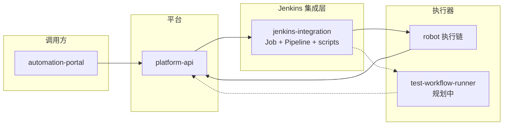
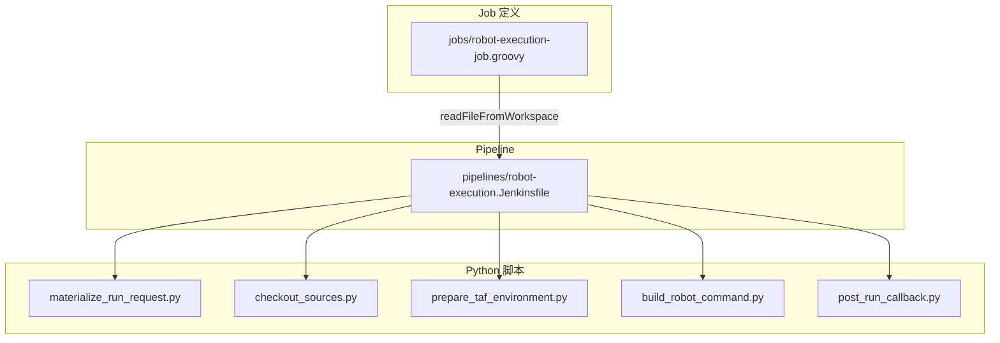
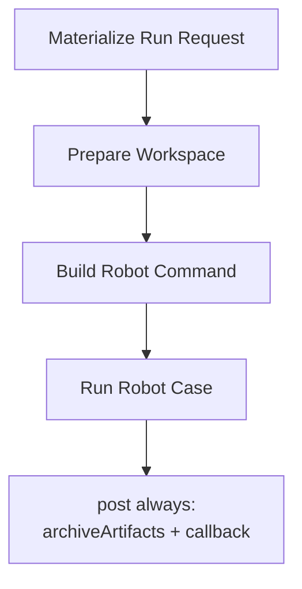
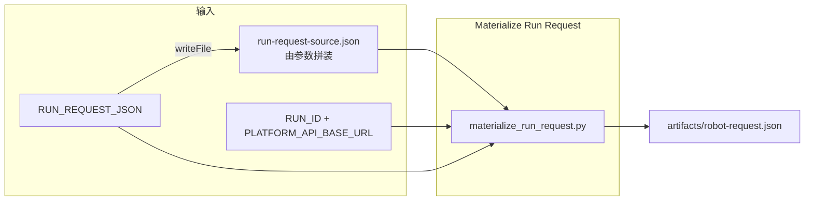
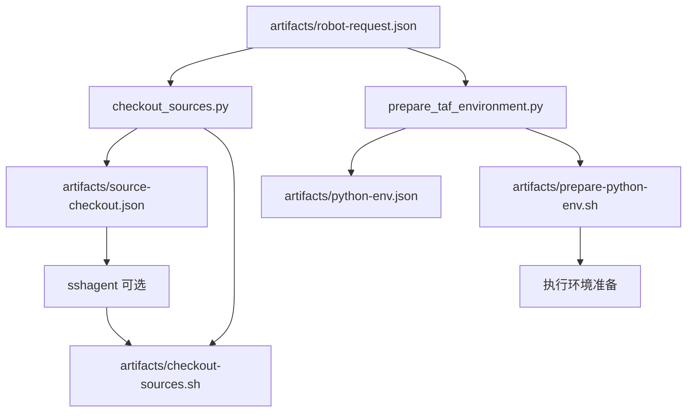
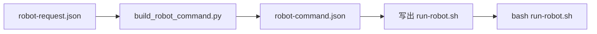
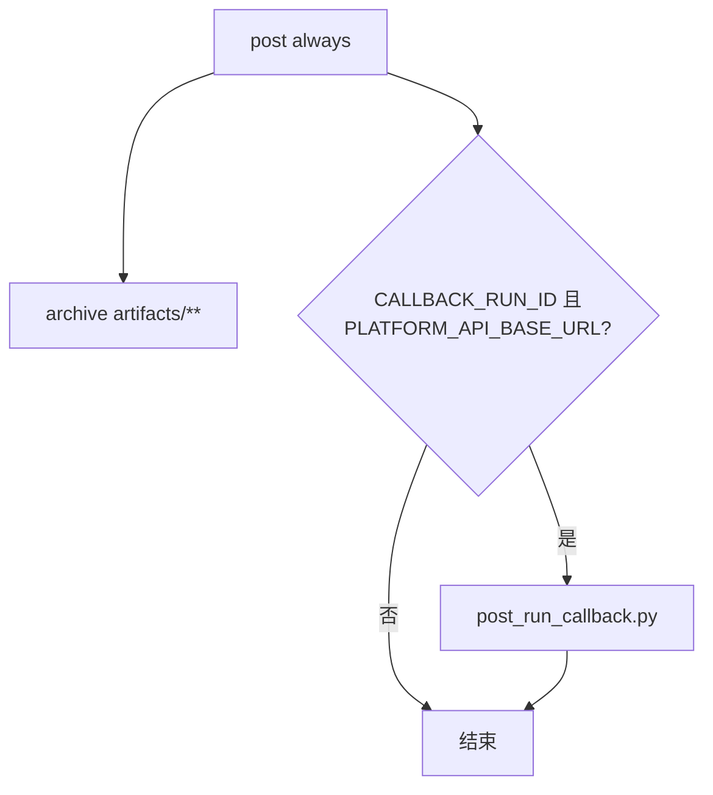

# jenkins-integration 模块架构与实现流程

本文档描述 `C:\TA\jenkins_robotframework\jenkins-integration` 目录下的**现有框架**、**职责边界**以及 **Robot 执行链的详细实现流程**（含流程图）。与根目录 `README.md` 及各子目录 `README.md` 互补；若冲突，以仓库内源码为准。

---

## 1. 模块定位

**Jenkins integration layer** 的公共骨架：不属于某个具体执行器，同时面向：

- **`robot` 执行链**（已落地）
- **`python_orchestrator` / test-workflow-runner**（规划中）

### 1.1 负责什么

| 职责 | 说明 |
|------|------|
| **Master / Agent 约定** | Controller 与 agent 分工、节点 label、`remoteFS`、全局环境变量名、凭据 id 命名等，与 Job、Pipeline、脚本假设一致。 |
| **Pipeline 编排** | 阶段顺序、阶段间数据传递、与 Jenkins 能力衔接（`sshagent`、`archiveArtifacts`、`post` 等）。 |
| **workspace / artifact / callback 组织** | 工作区子目录约定、中间 JSON 与 shell 路径、归档范围、回调目标与重试策略。 |
| **公共可测脚本** | 物化请求、checkout 计划、环境准备计划、Robot 命令计划、回调 payload；逻辑在 Python，便于单测。 |

### 1.2 不负责什么

- `platform-api` 的 run 契约与数据库语义
- `test_workflow_runner` 内部的 stage / item 编排
- `robotws` 具体测试用例内容

### 1.3 推荐调用链

```text
automation-portal / caller
  -> platform-api
  -> jenkins-integration
  -> robot executor | test-workflow-runner executor
  -> callback -> platform-api
```



---

## 2. 目录结构

| 路径 | 作用 |
|------|------|
| `jenkins-integration/jcasc/` | Configuration as Code：controller、全局 env、节点示例、凭据 id 约定（不含真实 secret）。 |
| `jenkins-integration/jobs/` | Job DSL、参数模板、与 Pipeline 对齐的 `pipelineJob` 定义。 |
| `jenkins-integration/pipelines/` | Declarative Pipeline（Jenkinsfile），阶段薄、脚本厚。 |
| `jenkins-integration/scripts/` | 被 Pipeline 调用的 Python 脚本。 |
| `jenkins-integration/tests/` | 对脚本的单元 / 集成式测试。 |

---

## 3. 术语：materialize / 物化请求

英文 **materialize** 在工程里常表示：把多种来源、非定稿的输入，**落实为一份固定形态、可落盘、可给下游消费的产物**（此处即 `artifacts/robot-request.json`）。

中文「物化」易觉拗口，文档或口头可用：**归一化运行请求**、**定型请求**、**生成内部请求 JSON** 等，与脚本 `materialize_run_request.py` 行为一致即可。

---

## 4. 职责要点（展开）

### 4.1 Master / Agent 约定

- **体现**：`jcasc/jenkins.yaml`（例如 controller `numExecutors: 0`、全局 `ROBOTWS_*` / `TESTLINE_CONFIGURATION_*`、节点 `labelString`、`remoteFS`、agent 环境变量）。
- **目的**：保证 `checkout_sources.py` 引用的环境变量名、Pipeline 中 `sshagent` 收集的凭据 id 与运维配置一致。

### 4.2 Pipeline 编排

- **体现**：`pipelines/robot-execution.Jenkinsfile` 的阶段顺序与 `post` 块；`jobs/robot-execution-job.groovy` 将 Jenkinsfile 挂到 `robot/robot-execution` Job。
- **原则**：编排留在 Groovy；复杂 JSON 与命令生成在 `scripts/`。

### 4.3 workspace / artifact / callback 组织

- **workspace**：`--workspace-root "$WORKSPACE"`；checkout 将 `robotws`、`testline_configuration` 置于约定子目录。
- **artifact**：统一放在 `artifacts/`，由环境变量指向各 JSON 与生成脚本路径；`archiveArtifacts artifacts: 'artifacts/**'`。
- **callback**：`post_run_callback.py`；可选 `PLATFORM_API_BASE_URL`、`CALLBACK_IGNORE_FAILURE`、重试与 fallback 文件路径。

### 4.4 脚本与可测性

| 脚本 | 作用 |
|------|------|
| `materialize_run_request.py` | 多源输入 → 统一 `robot-request.json`。 |
| `checkout_sources.py` | checkout 计划 JSON + `checkout-sources.sh`。 |
| `prepare_taf_environment.py` | Python 环境计划 + `prepare-python-env.sh`。 |
| `build_robot_command.py` | `robot-command.json`（含可写入的 shell 文本）。 |
| `post_run_callback.py` | 回调 payload、重试、落盘。 |

测试见 `tests/test_integration_helpers.py`、`tests/test_build_robot_command.py`。

---

## 5. Robot 链：组件关系



---

## 6. Robot 链：详细实现流程

### 6.1 阶段总览（与 Jenkinsfile 一致）



### 6.2 阶段 1：Materialize Run Request

**输入（之一）**：

- `RUN_REQUEST_JSON` 文本；或
- 无 `RUN_REQUEST_JSON` 时由 Groovy 从 Job 参数拼出 `artifacts/run-request-source.json`；若同时有 `RUN_ID` 与 `PLATFORM_API_BASE_URL` 且无 `RUN_REQUEST_JSON`，可走 platform-api 拉取分支（见 Jenkinsfile 条件）。

**处理**：执行 `jenkins-integration/scripts/materialize_run_request.py`。

**输出**：

- `artifacts/robot-request.json`（路径由环境变量 `ROBOT_REQUEST_PATH` 指定，默认即此相对路径）。

**副作用**：设置 `CALLBACK_RUN_ID`、`RUN_STARTED_AT` 等（供后续 callback 使用）。



### 6.3 阶段 2：Prepare Workspace

1. `checkout_sources.py`：读 `robot-request.json` → 写 `artifacts/source-checkout.json`（`CHECKOUT_PLAN_PATH`）与 `artifacts/checkout-sources.sh`。
2. Groovy 从 checkout plan 解析凭据 id，必要时包在 `sshagent { ... }` 中执行 `checkout-sources.sh`。
3. `prepare_taf_environment.py`：写 `artifacts/python-env.json`（`PYTHON_ENV_PLAN_PATH`）与 `artifacts/prepare-python-env.sh`，并执行该 shell。



### 6.4 阶段 3：Build Robot Command

- `build_robot_command.py`：读 `robot-request.json` + workspace → `artifacts/robot-command.json`（`ROBOT_COMMAND_PLAN_PATH`）。

### 6.5 阶段 4：Run Robot Case

- 内联 Python 读取 `artifacts/robot-command.json`，将 `plan['shell']['shell_script_text']` 写入 `artifacts/run-robot.sh`，再 `bash artifacts/run-robot.sh`。



### 6.6 post always：归档与回调

- **归档**：`archiveArtifacts artifacts: 'artifacts/**', allowEmptyArchive: true`
- **回调条件**：`CALLBACK_RUN_ID`（来自物化结果或参数）与 `PLATFORM_API_BASE_URL` 均非空。
- **脚本**：`post_run_callback.py`，输出如 `CALLBACK_PAYLOAD_PATH`、`CALLBACK_FALLBACK_PATH`、`CALLBACK_SEND_RESULT_PATH` 所指文件。



---

## 7. 关键产物路径一览

| 环境变量（Jenkinsfile `environment`） | 默认相对路径 |
|--------------------------------------|--------------|
| `ROBOT_REQUEST_PATH` | `artifacts/robot-request.json` |
| `CHECKOUT_PLAN_PATH` | `artifacts/source-checkout.json` |
| `PYTHON_ENV_PLAN_PATH` | `artifacts/python-env.json` |
| `ROBOT_COMMAND_PLAN_PATH` | `artifacts/robot-command.json` |
| `CALLBACK_PAYLOAD_PATH` | `artifacts/callback-payload.json` |
| `CALLBACK_FALLBACK_PATH` | `artifacts/callback-fallback.json` |
| `CALLBACK_SEND_RESULT_PATH` | `artifacts/callback-send-result.json` |

另有阶段生成：`artifacts/run-request-source.json`、`artifacts/checkout-sources.sh`、`artifacts/prepare-python-env.sh`、`artifacts/run-robot.sh`（与 Jenkinsfile 实现一致）。

---

## 8. 当前缺口（与 README 对齐）

- **`python_orchestrator` 路径**：对应的 Job、request 归一化与 Pipeline 对接仍待补充。
- **Pipeline 类型**：后续可拆分测试执行与发布/部署等不同 Jenkinsfile。

---

## 9. 相关文件索引

| 说明 | 路径 |
|------|------|
| 模块入口说明 | `jenkins-integration/README.md` |
| Pipeline 说明 | `jenkins-integration/pipelines/README.md` |
| Job DSL 说明 | `jenkins-integration/jobs/README.md` |
| 脚本说明 | `jenkins-integration/scripts/README.md` |
| JCasC 说明 | `jenkins-integration/jcasc/README.md` |
| Robot Pipeline | `jenkins-integration/pipelines/robot-execution.Jenkinsfile` |
| Robot Job DSL | `jenkins-integration/jobs/robot-execution-job.groovy` |
| JCasC 示例 | `jenkins-integration/jcasc/jenkins.yaml` |
