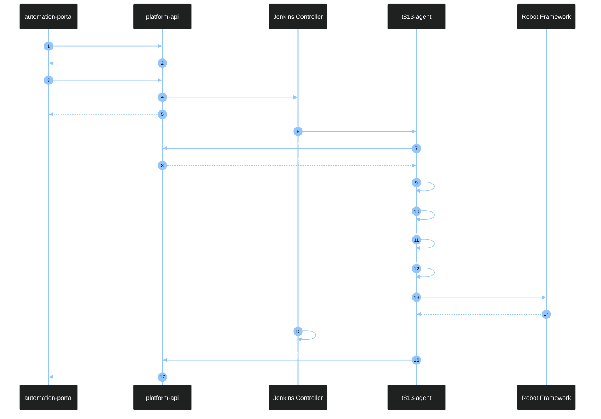

# Robot Jenkins Pipeline Flow

本文档说明 `jenkins-integration` 模块中 JCasC、Job DSL、Pipeline 和 helper scripts 如何协作，最终完成真实 Robot case 的 checkout、环境准备、命令生成、执行和 callback。

## 1. 总体交互图

### 1.1 外部触发与回写链路

```mermaid
%%{init: {"theme": "dark", "themeVariables": {"fontSize": "16px", "lineColor": "#93C5FD", "primaryTextColor": "#FFFFFF", "primaryBorderColor": "#93C5FD", "edgeLabelBackground": "#111827"}}}%%
flowchart TD
  User["Windows Browser<br/>Portal User"] --> Portal["automation-portal<br/>https://10.71.210.104/"]

  Portal --> Create["1. Create run<br/>POST /api/runs"]
  Create --> API["platform-api"]
  API --> Created["run_id<br/>status = created"]
  Created --> Portal

  Portal --> Trigger["2. Trigger run<br/>POST /api/runs/{run_id}/trigger"]
  Trigger --> API
  API --> Jenkins["Jenkins Controller<br/>/jenkins/<br/>buildWithParameters"]

  Jenkins --> Agent["t813-agent<br/>/automation/workspace"]
  Agent --> Robot["Robot Framework<br/>robotws + testline_configuration"]
  Robot --> Result["Robot outputs<br/>artifacts + result"]
  Result --> Agent

  Agent --> Callback["3. Callback<br/>post_run_callback.py<br/>POST /api/runs/{run_id}/callbacks/jenkins"]
  Callback --> API
  API --> Detail["4. Portal refresh<br/>GET /api/runs/{run_id}"]
  Detail --> Portal

  classDef ui fill:#e0f2fe,stroke:#075985,stroke-width:2px,color:#0f172a;
  classDef api fill:#dcfce7,stroke:#166534,stroke-width:2px,color:#0f172a;
  classDef jenkins fill:#fef3c7,stroke:#92400e,stroke-width:2px,color:#0f172a;
  classDef exec fill:#f3e8ff,stroke:#6b21a8,stroke-width:2px,color:#0f172a;
  classDef action fill:#fff7ed,stroke:#c2410c,stroke-width:2px,color:#0f172a;

  class User,Portal ui;
  class API,Created,Detail api;
  class Jenkins jenkins;
  class Agent,Robot,Result exec;
  class Create,Trigger,Callback action;

  linkStyle 0,1,2,3,4,5,6,7,8,9,10,11,12,13,14 stroke:#93C5FD,stroke-width:2.5px,color:#FFFFFF;
```

### 1.2 Jenkins 内部编排链路

```mermaid
%%{init: {"theme": "dark", "themeVariables": {"fontSize": "16px", "lineColor": "#93C5FD", "primaryTextColor": "#FFFFFF", "primaryBorderColor": "#93C5FD", "edgeLabelBackground": "#111827"}}}%%
flowchart TD
  subgraph Config["Static configuration loaded before/around build"]
    JCasC["jcasc/jenkins.yaml<br/>global env + node + credentials"]
    JobDSL["jobs/robot-execution-job.groovy<br/>creates robot/robot-execution"]
    Jenkinsfile["pipelines/robot-execution.Jenkinsfile<br/>pipeline stages"]
  end

  Job["Jenkins job<br/>robot/robot-execution"] --> Stage1["1. Materialize Run Request<br/>robot-request.json"]
  Stage1 --> Stage2["2. Prepare Workspace<br/>checkout + python env"]
  Stage2 --> Stage3["3. Build Robot Command<br/>robot-command.json"]
  Stage3 --> Stage4["4. Run Robot Case<br/>run-robot.sh"]
  Stage4 --> Post["post always<br/>archive + callback"]

  JCasC -.-> Job
  JobDSL -.-> Job
  Jenkinsfile -.-> Job

  Stage2 --> Checkout["checkout_sources.py<br/>source-checkout.json<br/>checkout-sources.sh"]
  Stage2 --> EnvPrep["prepare_taf_environment.py<br/>python-env.json<br/>prepare-python-env.sh"]
  Stage3 --> BuildCmd["build_robot_command.py"]
  Post --> Callback["post_run_callback.py"]
  Post --> Artifacts["archiveArtifacts<br/>artifacts/**"]

  classDef config fill:#eef2ff,stroke:#3730a3,stroke-width:2px,color:#0f172a;
  classDef stage fill:#fef3c7,stroke:#92400e,stroke-width:2px,color:#0f172a;
  classDef script fill:#dcfce7,stroke:#166534,stroke-width:2px,color:#0f172a;
  classDef output fill:#fee2e2,stroke:#991b1b,stroke-width:2px,color:#0f172a;

  class JCasC,JobDSL,Jenkinsfile config;
  class Job,Stage1,Stage2,Stage3,Stage4,Post stage;
  class Checkout,EnvPrep,BuildCmd,Callback script;
  class Artifacts output;

  linkStyle 0,1,2,3,4,5,6,7,8,9,10,11,12 stroke:#93C5FD,stroke-width:2.5px,color:#FFFFFF;
```

## 2. JCasC / Job / Pipeline 职责

```mermaid
%%{init: {"theme": "dark", "themeVariables": {"fontSize": "16px", "lineColor": "#93C5FD", "primaryTextColor": "#FFFFFF", "primaryBorderColor": "#93C5FD", "edgeLabelBackground": "#111827"}}}%%
flowchart LR
  subgraph JCasC["jenkins-integration/jcasc/jenkins.yaml"]
    GlobalEnv["Global env:<br/>ROBOTWS_REPO_URL<br/>TESTLINE_CONFIGURATION_REPO_URL<br/>PIP_INDEX_URL<br/>PIP_EXTRA_INDEX_URL<br/>PIP_TRUSTED_HOST"]
    Node["Node:<br/>t813-agent<br/>labels: t813 robot<br/>remoteFS: /automation/workspace"]
    NodeEnv["Node env:<br/>ROBOTWS_GIT_SSH_KEY_PATH<br/>TESTLINE_CONFIGURATION_GIT_SSH_KEY_PATH"]
    Cred["Credential:<br/>t813-agent-ssh<br/>Controller -> Agent SSH"]
  end

  subgraph JobDSL["jobs/robot-execution-job.groovy"]
    Job["robot/robot-execution"]
    Params["Job parameters:<br/>RUN_ID<br/>TESTLINE<br/>ROBOTCASE_PATH<br/>ROBOT_SELECTED_TESTS<br/>ROBOT_VARIABLES_JSON<br/>ROBOTWS_GIT_REF<br/>TESTLINE_CONFIGURATION_GIT_REF<br/>PLATFORM_API_BASE_URL<br/>CALLBACK_INSECURE_TLS"]
  end

  subgraph Jenkinsfile["pipelines/robot-execution.Jenkinsfile"]
    Stages["Materialize<br/>Prepare Workspace<br/>Build Robot Command<br/>Run Robot Case<br/>post callback"]
  end

  JCasC --> GlobalEnv
  JCasC --> Node
  JCasC --> NodeEnv
  JCasC --> Cred

  JobDSL --> Job
  JobDSL --> Params
  Job --> Jenkinsfile

  classDef config fill:#eef2ff,stroke:#3730a3,stroke-width:2px,color:#0f172a;
  classDef job fill:#fef3c7,stroke:#92400e,stroke-width:2px,color:#0f172a;
  classDef pipeline fill:#dcfce7,stroke:#166534,stroke-width:2px,color:#0f172a;

  class GlobalEnv,Node,NodeEnv,Cred config;
  class Job,Params job;
  class Stages pipeline;

  linkStyle 0,1,2,3,4,5,6 stroke:#93C5FD,stroke-width:2.5px,color:#FFFFFF;
```

当前实现里有两类 SSH：

```text
1. Jenkins Controller -> Agent
   由 JCasC credential t813-agent-ssh 管理。

2. Agent -> Git repo checkout robotws / testline_configuration
   当前实现走 agent-local-key：
   ROBOTWS_GIT_SSH_KEY_PATH
   TESTLINE_CONFIGURATION_GIT_SSH_KEY_PATH
```

`t813-agent-ssh` 是 Jenkins 连接 Agent 用的；源码 checkout 使用的是 Agent 本机可读的 SSH key path。

## 3. Pipeline Stage 详细流程

```mermaid
%%{init: {"theme": "dark", "themeVariables": {"fontSize": "16px", "lineColor": "#93C5FD", "primaryTextColor": "#FFFFFF", "primaryBorderColor": "#93C5FD", "edgeLabelBackground": "#111827"}}}%%
flowchart TD
  Start["Jenkins build starts<br/>robot/robot-execution"] --> Stage1["Stage 1<br/>Materialize Run Request"]

  Stage1 --> S1A{"Input source?"}
  S1A -->|"RUN_ID + PLATFORM_API_BASE_URL"| FetchAPI["materialize_run_request.py<br/>GET /api/runs/{run_id}"]
  S1A -->|"RUN_REQUEST_JSON or job params"| LocalJSON["write artifacts/run-request-source.json"]

  FetchAPI --> RobotRequest["artifacts/robot-request.json"]
  LocalJSON --> Materialize["materialize_run_request.py"]
  Materialize --> RobotRequest
  RobotRequest --> CallbackRunId["artifacts/callback-run-id.txt"]

  CallbackRunId --> Stage2["Stage 2<br/>Prepare Workspace"]

  Stage2 --> CheckoutPlan["checkout_sources.py<br/>outputs:<br/>artifacts/source-checkout.json<br/>artifacts/checkout-sources.sh"]
  Stage2 --> EnvPlan["prepare_taf_environment.py<br/>outputs:<br/>artifacts/python-env.json<br/>artifacts/prepare-python-env.sh"]

  CheckoutPlan --> CheckoutShell["bash artifacts/checkout-sources.sh"]
  EnvPlan --> EnvShell["bash artifacts/prepare-python-env.sh"]

  CheckoutShell --> Stage3["Stage 3<br/>Build Robot Command"]
  EnvShell --> Stage3

  Stage3 --> RobotPlan["build_robot_command.py<br/>outputs:<br/>artifacts/robot-command.json"]

  RobotPlan --> Stage4["Stage 4<br/>Run Robot Case"]
  Stage4 --> RunScript["write artifacts/run-robot.sh"]
  RunScript --> ExecuteRobot["bash artifacts/run-robot.sh"]

  ExecuteRobot --> Post["post always"]
  Post --> Archive["archiveArtifacts artifacts/**"]
  Post --> Callback["post_run_callback.py<br/>POST /api/runs/{run_id}/callbacks/jenkins"]

  classDef stage fill:#fef3c7,stroke:#92400e,stroke-width:2px,color:#0f172a;
  classDef script fill:#dcfce7,stroke:#166534,stroke-width:2px,color:#0f172a;
  classDef output fill:#fee2e2,stroke:#991b1b,stroke-width:2px,color:#0f172a;
  classDef decision fill:#e0f2fe,stroke:#075985,stroke-width:2px,color:#0f172a;

  class Start,Stage1,Stage2,Stage3,Stage4,Post stage;
  class FetchAPI,Materialize,CheckoutPlan,EnvPlan,CheckoutShell,EnvShell,RobotPlan,RunScript,ExecuteRobot,Archive,Callback script;
  class RobotRequest,CallbackRunId,LocalJSON output;
  class S1A decision;

  linkStyle 0,1,2,3,4,5,6,7,8,9,10,11,12,13,14,15,16,17,18,19,20,21 stroke:#93C5FD,stroke-width:2.5px,color:#FFFFFF;
```

每个 stage 还会通过 `artifacts/notify-stage.sh` 尝试回写 stage 进度：

```text
POST {PLATFORM_API_BASE_URL}/api/runs/{RUN_ID}/stages
```

如果没有 `RUN_ID` 或 `PLATFORM_API_BASE_URL`，这个通知会自动 skip，不影响主流程。

## 4. Checkout 与 SSH 认证流程

### 4.1 checkout 配置解析

```mermaid
%%{init: {"theme": "dark", "themeVariables": {"fontSize": "16px", "lineColor": "#93C5FD", "primaryTextColor": "#FFFFFF", "primaryBorderColor": "#93C5FD", "edgeLabelBackground": "#111827"}}}%%
flowchart LR
  Request["artifacts/robot-request.json"] --> CheckoutPy["checkout_sources.py"]

  CheckoutPy --> RobotwsSpec["robotws spec"]
  CheckoutPy --> ConfigSpec["testline_configuration spec"]

  subgraph RobotwsInputs["robotws inputs"]
    RepoUrl1["repo_url<br/>ROBOTWS_REPO_URL<br/>JCasC global env"]
    Ref1["ref<br/>ROBOTWS_GIT_REF<br/>job parameter"]
    Key1["ssh key path<br/>ROBOTWS_GIT_SSH_KEY_PATH<br/>JCasC node env"]
  end

  subgraph ConfigInputs["testline_configuration inputs"]
    RepoUrl2["repo_url<br/>TESTLINE_CONFIGURATION_REPO_URL<br/>JCasC global env"]
    Ref2["ref<br/>TESTLINE_CONFIGURATION_GIT_REF<br/>job parameter"]
    Key2["ssh key path<br/>TESTLINE_CONFIGURATION_GIT_SSH_KEY_PATH<br/>JCasC node env"]
  end

  RobotwsSpec --> RepoUrl1
  RobotwsSpec --> Ref1
  RobotwsSpec --> Key1
  ConfigSpec --> RepoUrl2
  ConfigSpec --> Ref2
  ConfigSpec --> Key2

  CheckoutPy --> Plan["artifacts/source-checkout.json"]
  CheckoutPy --> Shell["artifacts/checkout-sources.sh"]

  classDef input fill:#e0f2fe,stroke:#075985,stroke-width:2px,color:#0f172a;
  classDef script fill:#dcfce7,stroke:#166534,stroke-width:2px,color:#0f172a;
  classDef spec fill:#fef3c7,stroke:#92400e,stroke-width:2px,color:#0f172a;
  classDef output fill:#fee2e2,stroke:#991b1b,stroke-width:2px,color:#0f172a;

  class Request,RepoUrl1,Ref1,Key1,RepoUrl2,Ref2,Key2 input;
  class CheckoutPy script;
  class RobotwsSpec,ConfigSpec spec;
  class Plan,Shell output;

  linkStyle 0,1,2,3,4,5,6,7,8,9,10 stroke:#93C5FD,stroke-width:2.5px,color:#FFFFFF;
```

### 4.2 checkout shell 执行与 SSH

```mermaid
%%{init: {"theme": "dark", "themeVariables": {"fontSize": "16px", "lineColor": "#93C5FD", "primaryTextColor": "#FFFFFF", "primaryBorderColor": "#93C5FD", "edgeLabelBackground": "#111827"}}}%%
flowchart TD
  Shell["artifacts/checkout-sources.sh"] --> Loop["For each repo operation"]

  Loop --> CheckKey{"agent-local-key<br/>key path present?"}
  CheckKey -->|"yes"| GitWithKey["GIT_SSH_COMMAND=<br/>ssh -i $KEY<br/>-o IdentitiesOnly=yes<br/>-o StrictHostKeyChecking=no"]
  CheckKey -->|"missing/unreadable"| Fail["Fail fast:<br/>Missing readable SSH key"]

  GitWithKey --> Existing{"repo already exists?"}
  Existing -->|"has .git"| Sync["git remote set-url<br/>git fetch --all --tags --prune<br/>git checkout ref"]
  Existing -->|"new checkout"| Clone["git clone --branch ref repo_url path"]
  Existing -->|"directory without .git"| Reuse["reuse existing directory"]

  Sync --> Robotws["$WORKSPACE/robotws"]
  Clone --> Robotws
  Reuse --> Robotws

  Sync --> TestlineConfig["$WORKSPACE/testline_configuration"]
  Clone --> TestlineConfig
  Reuse --> TestlineConfig

  classDef shell fill:#dcfce7,stroke:#166534,stroke-width:2px,color:#0f172a;
  classDef decision fill:#e0f2fe,stroke:#075985,stroke-width:2px,color:#0f172a;
  classDef git fill:#fef3c7,stroke:#92400e,stroke-width:2px,color:#0f172a;
  classDef output fill:#fee2e2,stroke:#991b1b,stroke-width:2px,color:#0f172a;
  classDef fail fill:#fecaca,stroke:#991b1b,stroke-width:3px,color:#0f172a;

  class Shell,Loop shell;
  class CheckKey,Existing decision;
  class GitWithKey,Sync,Clone,Reuse git;
  class Robotws,TestlineConfig output;
  class Fail fail;

  linkStyle 0,1,2,3,4,5,6,7,8,9,10,11,12,13 stroke:#93C5FD,stroke-width:2.5px,color:#FFFFFF;
```

当前 `checkout_sources.py` 的默认 convention：

```text
robotws:
  path: robotws
  repo_url_env: ROBOTWS_REPO_URL
  ref_env: ROBOTWS_GIT_REF
  ssh_key_path_env: ROBOTWS_GIT_SSH_KEY_PATH
  credential_kind: agent-local-key

testline_configuration:
  path: testline_configuration
  repo_url_env: TESTLINE_CONFIGURATION_REPO_URL
  ref_env: TESTLINE_CONFIGURATION_GIT_REF
  ssh_key_path_env: TESTLINE_CONFIGURATION_GIT_SSH_KEY_PATH
  credential_kind: agent-local-key
```

因此源码 checkout 的关键条件是：

- JCasC/global env 中有 repo URL。
- job 参数中有 ref，默认 `master`。
- Agent 上 `ROBOTWS_GIT_SSH_KEY_PATH` / `TESTLINE_CONFIGURATION_GIT_SSH_KEY_PATH` 指向的 key 存在且可读。

## 5. Robot Command 如何生成和执行

```mermaid
%%{init: {"theme": "dark", "themeVariables": {"fontSize": "16px", "lineColor": "#93C5FD", "primaryTextColor": "#FFFFFF", "primaryBorderColor": "#93C5FD", "edgeLabelBackground": "#111827"}}}%%
flowchart TD
  RobotRequest["artifacts/robot-request.json"] --> BuildCmd["build_robot_command.py"]

  BuildCmd --> ResolvePaths["Resolve paths:<br/>workspace_root<br/>robotws_root<br/>testline_config_root<br/>testline_variables_path<br/>robotcase_path<br/>python_env_root"]

  BuildCmd --> MergeInputs["Merge inputs:<br/>case_name<br/>selected_tests<br/>robot_variables<br/>env_overrides<br/>artifact_label<br/>retry_index<br/>log_level"]

  ResolvePaths --> CommandPlan["artifacts/robot-command.json"]
  MergeInputs --> CommandPlan

  CommandPlan --> RunRobotSh["artifacts/run-robot.sh"]

  RunRobotSh --> Activate["source /home/ute/CIENV/{TESTLINE}/bin/activate"]
  Activate --> ClearProxy["export http_proxy=''<br/>export https_proxy=''"]
  ClearProxy --> Robot["python -m robot<br/>--pythonpath robotws<br/>-v KEY:VALUE<br/>-x quicktest.xml<br/>-b debug.log<br/>-d artifacts/{label}/retry-{n}/{suite}<br/>-V testline_configuration/{TESTLINE}<br/>-L TRACE<br/>-t selected tests<br/>ROBOTCASE_PATH"]

  classDef input fill:#e0f2fe,stroke:#075985,stroke-width:2px,color:#0f172a;
  classDef script fill:#dcfce7,stroke:#166534,stroke-width:2px,color:#0f172a;
  classDef output fill:#fee2e2,stroke:#991b1b,stroke-width:2px,color:#0f172a;
  classDef runtime fill:#fef3c7,stroke:#92400e,stroke-width:2px,color:#0f172a;

  class RobotRequest input;
  class BuildCmd script;
  class ResolvePaths,MergeInputs runtime;
  class CommandPlan,RunRobotSh output;
  class Activate,ClearProxy,Robot runtime;

  linkStyle 0,1,2,3,4,5,6,7,8 stroke:#93C5FD,stroke-width:2.5px,color:#FFFFFF;
```

最终命令大致如下：

```bash
cd "$WORKSPACE"
. /home/ute/CIENV/<TESTLINE>/bin/activate
export http_proxy=''
export https_proxy=''

python -m robot \
  --pythonpath "$WORKSPACE/robotws" \
  -v AF_PATH:<value> \
  -x quicktest.xml \
  -b debug.log \
  -d "$WORKSPACE/artifacts/quicktest/retry-0/<suite>" \
  -V "$WORKSPACE/testline_configuration/<TESTLINE>" \
  -L TRACE \
  -t "<selected test>" \
  "$WORKSPACE/robotws/<robotcase_path>"
```

## 6. 与 platform-api 的交互



## 7. 核心文件速查

| 文件 | 作用 |
|---|---|
| `jcasc/jenkins.yaml` | Jenkins controller、global env、Agent node、Controller -> Agent credential |
| `jobs/robot-execution-job.groovy` | 创建 `robot/robot-execution` job 和参数 |
| `pipelines/robot-execution.Jenkinsfile` | Pipeline 主编排 |
| `scripts/materialize_run_request.py` | 把 platform-api run detail 或 job 参数物化成稳定内部请求 |
| `scripts/checkout_sources.py` | 生成源码 checkout plan 和 shell |
| `scripts/prepare_taf_environment.py` | 生成 Python/TAF 环境准备 plan 和 shell |
| `scripts/build_robot_command.py` | 生成最终 `python -m robot` 命令 |
| `scripts/post_run_callback.py` | 收集 artifacts 并回写 `platform-api` |

## 8. Learning Record

### 本文解决的问题

把已经跑通的 JCasC + Jenkins Robot case 主线整理成一份模块内说明，帮助理解 `jenkins-integration` 下各目录如何协作。

### 关键调用流

```text
platform-api trigger
-> Jenkins robot/robot-execution
-> JCasC-provisioned t813-agent
-> materialize_run_request.py
-> checkout_sources.py
-> prepare_taf_environment.py
-> build_robot_command.py
-> bash artifacts/run-robot.sh
-> post_run_callback.py
-> platform-api callback
```

### 关键字段

- `RUN_ID`：`platform-api` run id，贯穿 trigger、materialize、callback。
- `PLATFORM_API_BASE_URL`：Jenkins callback 和 stage notify 的 API 根地址。
- `ROBOTWS_REPO_URL` / `TESTLINE_CONFIGURATION_REPO_URL`：JCasC global env 提供的源码仓库。
- `ROBOTWS_GIT_REF` / `TESTLINE_CONFIGURATION_GIT_REF`：job 参数控制 checkout ref。
- `ROBOTWS_GIT_SSH_KEY_PATH` / `TESTLINE_CONFIGURATION_GIT_SSH_KEY_PATH`：Agent 本机 checkout key。
- `ROBOT_VARIABLES_JSON`：Portal/API 传入并最终转为 Robot `-v KEY:VALUE`。

### 服务器侧验证命令

```bash
curl -k https://127.0.0.1/api/health
curl -k -I https://127.0.0.1/jenkins/
sudo systemctl status jenkins --no-pager
```

Jenkins 构建后检查 artifacts：

```text
artifacts/robot-request.json
artifacts/source-checkout.json
artifacts/python-env.json
artifacts/robot-command.json
artifacts/run-robot.sh
artifacts/callback-payload.json
artifacts/callback-send-result.json
```

### 预期结果

- Jenkins job 能被 `platform-api` trigger。
- `source-checkout.json` 中 repo URL 不为 `null`。
- `run-robot.sh` 中能看到完整 `python -m robot` 命令。
- `post_run_callback.py` 成功回写 `passed` 或 `failed`。

### 常见失败模式

- `repo_url` 为 `null`：JCasC/global env 未注入或 job 未加载最新配置。
- SSH checkout 失败：Agent 上 key path 不存在、权限不可读或 Git host 不信任。
- Missing activate script：`/home/ute/CIENV/<TESTLINE>/bin/activate` 不存在，或 `TAF_MODE` 不匹配。
- Robot case path not found：`ROBOTCASE_PATH` 不是 workspace 或 `robotws` 下的有效路径。
- callback 失败：`PLATFORM_API_BASE_URL` 错误、HTTPS 自签名未加 `CALLBACK_INSECURE_TLS`、或 `/api/` 反代异常。

### Review Questions

1. 当前源码 checkout 是否继续采用 Agent local key，而不是 Jenkins `sshagent` credential？
2. `ROBOTWS_GIT_REF` / `TESTLINE_CONFIGURATION_GIT_REF` 是否应该继续保留 job 参数默认 `master`？
3. 后续是否需要把 stage notify 的 `/api/runs/{run_id}/stages` 也正式纳入 `platform-api` 文档？
