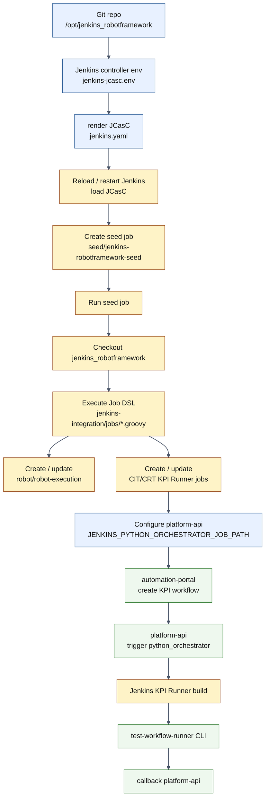
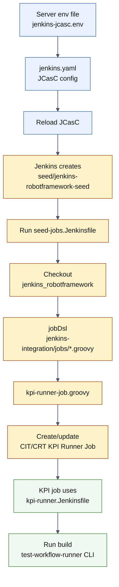

# KPI CI/CD Flow

## 1. 这份文档解决什么问题

这份文档解释 Python KPI Runner 在 Jenkins 里的 CI/CD 组织方式，重点回答：

- `CIT/KPI_Testing/SBTS26R1/7_5_UTE5G402T813` 是不是写死的。
- Jenkins 目录和 Job 要不要手工创建。
- 后续增加 `SBTS00`、`SBTS26R1`、其他 testline 时应该怎么维护。
- `kpi-runner-job.groovy`、`kpi-runner.Jenkinsfile`、`platform-api` 之间是什么关系。

当前结论：

```text
当前第一版代码只生成：
  CIT/KPI_Testing/SBTS26R1/7_5_UTE5G402T813
  CRT/KPI_Testing/SBTS26R1/7_5_UTE5G402T813

但这不是最终只能支持这一个 SBTS / testline。
它只是第一版 Job DSL 里先写了一个默认 release 和默认 testline。
```

后续不建议在 Jenkins 页面里手工逐个创建这些目录和 Job，而是通过 Job DSL 统一生成。

## 2. Jenkins 里谁负责创建目录和 Job

Jenkins 里的目录，例如：

```text
CIT
  └─ KPI_Testing
      └─ SBTS26R1
          └─ 7_5_UTE5G402T813
```

在 Jenkins 里本质上也是一种 Job Folder，不是普通文件夹。

当前项目用的是 Job DSL 思路：

```text
jenkins-integration/jobs/kpi-runner-job.groovy
  -> folder("CIT")
  -> folder("CIT/KPI_Testing")
  -> folder("CIT/KPI_Testing/SBTS26R1")
  -> pipelineJob("CIT/KPI_Testing/SBTS26R1/7_5_UTE5G402T813")
```

也就是说：

```text
Groovy DSL 文件定义 Jenkins 目录和 Job
Seed Job 执行 Groovy DSL
Jenkins 自动创建 / 更新这些 Folder 和 Pipeline Job
```

所以不需要你以后每来一个 testline 就手工去 Jenkins 页面创建一套目录。

## 3. 当前为什么看起来像写死了

当前 `kpi-runner-job.groovy` 顶部是：

```groovy
def pipelinePath = 'jenkins-integration/pipelines/kpi-runner.Jenkinsfile'
def sbtsRelease = 'SBTS26R1'
def defaultTestline = '7_5_UTE5G402T813'
def domains = ['CIT', 'CRT']
```

这表示当前第一版只生成：

```text
CIT/KPI_Testing/SBTS26R1/7_5_UTE5G402T813
CRT/KPI_Testing/SBTS26R1/7_5_UTE5G402T813
```

这个写法适合先做 smoke，验证：

- Job DSL 能否生成目录和 Job。
- Jenkinsfile 能否被加载。
- `BUILD` / `TESTLINE` / `WORKFLOW_SPEC_JSON` 等参数能否传进 pipeline。
- pipeline 能否 checkout `robotws` 和 `testline_configuration`。
- pipeline 能否执行 `test-workflow-runner` CLI 并 callback `platform-api`。

但如果后续要支持多 release / 多 testline，这段就应该改成数据列表，而不是继续写单个变量。

## 4. 后续多 SBTS / 多 testline 怎么扩展

推荐把当前写法改成类似下面这样：

```groovy
def pipelinePath = 'jenkins-integration/pipelines/kpi-runner.Jenkinsfile'
def domains = ['CIT', 'CRT']
def kpiTargets = [
    [sbts: 'SBTS00', testline: '7_5_UTE5G402T813'],
    [sbts: 'SBTS26R1', testline: '7_5_UTE5G402T813'],
    [sbts: 'SBTS26R1', testline: 'another_testline'],
]
```

然后用循环生成：

```text
CIT/KPI_Testing/SBTS00/7_5_UTE5G402T813
CRT/KPI_Testing/SBTS00/7_5_UTE5G402T813
CIT/KPI_Testing/SBTS26R1/7_5_UTE5G402T813
CRT/KPI_Testing/SBTS26R1/7_5_UTE5G402T813
CIT/KPI_Testing/SBTS26R1/another_testline
CRT/KPI_Testing/SBTS26R1/another_testline
```

这样新增一个 testline 的动作是：

```text
1. 修改 kpi-runner-job.groovy 里的 kpiTargets 列表。
2. 提交代码。
3. 在 Jenkins 里重新跑 seed job。
4. Jenkins 自动创建或更新对应 Folder / Job。
```

不需要手动创建每个目录。

## 5. seed job 已经如何代码化

当前 seed job 已经代码化为两部分：

| 文件 | 作用 |
|---|---|
| `jcasc/jenkins.yaml` | 通过 JCasC 的 `jobs:` 段创建 `seed/jenkins-robotframework-seed`。 |
| `pipelines/seed-jobs.Jenkinsfile` | seed job 的执行逻辑：checkout 本仓库，然后执行 `jenkins-integration/jobs/*.groovy`。 |

JCasC 创建的 seed job 名称是：

```text
seed/jenkins-robotframework-seed
```

它的执行流程是：

```text
seed/jenkins-robotframework-seed
  -> checkout jenkins_robotframework 仓库
  -> 执行 jobDsl targets: jenkins-integration/jobs/*.groovy
  -> 自动创建 / 更新 robot 和 KPI Runner jobs
```

seed job 使用的仓库由这些环境变量控制：

```text
JENKINS_ROBOTFRAMEWORK_REPO_URL
JENKINS_ROBOTFRAMEWORK_GIT_REF
JENKINS_ROBOTFRAMEWORK_CREDENTIALS_ID
```

示例值已经写入：

```text
deploy/env/jenkins-jcasc.env.example
```

如果仓库是公开 HTTPS，可以不配置 credentials；如果仓库是私有仓库，就需要先在 Jenkins 准备一个 Git credential，并把 id 写到 `JENKINS_ROBOTFRAMEWORK_CREDENTIALS_ID`。

## 6. 什么时候需要手工操作 Jenkins

建议区分两类操作。

### 6.1 一次性 Jenkins 基础准备

这类可能需要 Jenkins 管理员做一次：

- 安装 Job DSL 插件。
- 安装 Configuration as Code 插件。
- 确认 `jenkins.yaml` 已被 Jenkins 加载。
- 确认 seed job 能 checkout `C:\TA\jenkins_robotframework` 对应的 Git 仓库。
- 确认 seed job 能读取 `jenkins-integration/jobs/*.groovy`。
- 确认 JCasC / credentials / agent 已配置好。

当前 seed job 本身已经由 JCasC 代码化，不需要再在 UI 里手工创建 seed job。你需要做的是重载 JCasC，确认 `seed/jenkins-robotframework-seed` 出现在 Jenkins 页面里。

### 6.2 日常新增 release / testline

这类不建议手工操作 Jenkins 页面：

- 新增 `SBTS00`
- 新增 `SBTS26R1`
- 新增 testline
- 调整 Job 参数默认值
- 调整 Pipeline script path

推荐全部改 `kpi-runner-job.groovy`，然后重新跑 seed job。

原因是：

- Jenkins 页面手工建目录容易漏参数。
- 多个 testline 的配置容易不一致。
- 后续迁移 Jenkins 或恢复环境时，手工配置很难复现。
- Job DSL 文件可以 code review，也能进 Git 版本管理。

## 7. `platform-api` 怎么知道触发哪个 Job

Python KPI Runner 现在有独立 job path：

```text
JENKINS_PYTHON_ORCHESTRATOR_JOB_PATH=job/CIT/job/KPI_Testing/job/SBTS26R1/job/7_5_UTE5G402T813
```

Robot case 仍然走：

```text
JENKINS_ROBOT_JOB_PATH=job/robot/job/robot-execution
```

也就是说：

```text
executor_type=robot
  -> JENKINS_ROBOT_JOB_PATH

executor_type=python_orchestrator
  -> JENKINS_PYTHON_ORCHESTRATOR_JOB_PATH
```

当前这一版先把 Python KPI Runner 指到一个默认 testline job。

后续如果 Portal 上选择不同 testline，有两种演进方式。

## 8. 后续多 testline 触发策略

### 方案 A：一个统一 KPI Runner Job

结构：

```text
CIT/KPI_Testing/KPI_Runner
CRT/KPI_Testing/KPI_Runner
```

所有 testline 都传 `TESTLINE` 参数进去。

优点：

- `platform-api` 只需要配置一个 job path。
- 新增 testline 不需要新增 Jenkins job。
- 实现简单。

缺点：

- Jenkins build history 会混在同一个 Job 里。
- 按 testline 查历史不够直观。
- 如果每条 testline 要绑定不同 agent / 权限 / 默认参数，后续会变复杂。

### 方案 B：每个 testline 一个 KPI Runner Job

结构：

```text
CIT/KPI_Testing/<SBTS>/<testline>
CRT/KPI_Testing/<SBTS>/<testline>
```

优点：

- 每条 testline 有独立 build history。
- artifacts 和失败记录更容易按测试线查看。
- 适合真实设备测试线，因为 testline 往往和 agent / UTE / venv 绑定。

缺点：

- `platform-api` 后续需要根据 `testline` / `SBTS` 选择 job path。
- Job DSL 需要维护 target 列表。

当前项目更偏向方案 B，因为 KPI testing 的结果最常按 testline 追踪。

## 9. 当前推荐落地顺序

### Step 1：先保留当前单 testline smoke

当前先使用：

```text
CIT/KPI_Testing/SBTS26R1/7_5_UTE5G402T813
CRT/KPI_Testing/SBTS26R1/7_5_UTE5G402T813
```

目标是先验证整条链路：

```text
automation-portal
  -> platform-api
  -> Jenkins KPI Runner Job
  -> checkout robotws + testline_configuration
  -> prepare TAF environment
  -> test-workflow-runner CLI
  -> archive artifacts
  -> callback platform-api
```

### Step 2：配置 seed job 所需环境变量

在 Jenkins controller 的 JCasC env 文件中确认：

```text
JENKINS_ROBOTFRAMEWORK_REPO_URL=https://github.com/stella555359/jenkins_robotframework.git
JENKINS_ROBOTFRAMEWORK_GIT_REF=main
JENKINS_ROBOTFRAMEWORK_CREDENTIALS_ID=
```

如果是私有仓库：

```text
JENKINS_ROBOTFRAMEWORK_CREDENTIALS_ID=<your-git-credential-id>
```

### Step 3：重载 JCasC 生成 seed job

JCasC 重载后，Jenkins 页面应该出现：

```text
seed/jenkins-robotframework-seed
```

这个 job 由 `jcasc/jenkins.yaml` 的 `jobs:` 段创建，不需要手工 New Item。

### Step 4：确认 seed job 是否可用

需要在 Jenkins 上确认：

- 是否已有 seed job。
- seed job 是否能读取本仓库。
- seed job 是否会执行 `jenkins-integration/jobs/kpi-runner-job.groovy`。

如果没有 seed job，只需要创建或补齐 seed job，不需要手工创建每个 KPI job。

当前 seed job 流程：

```text
seed job
  -> checkout jenkins_robotframework 仓库
  -> 读取 jenkins-integration/jobs/*.groovy
  -> 执行 Job DSL
  -> Jenkins 自动创建 / 更新：
     robot/robot-execution
     CIT/KPI_Testing/SBTS26R1/7_5_UTE5G402T813
     CRT/KPI_Testing/SBTS26R1/7_5_UTE5G402T813
```

当前已采用 Pipeline seed job，逻辑在：

```text
jenkins-integration/pipelines/seed-jobs.Jenkinsfile
```

注意：

- seed job 由 JCasC 创建。
- 后续新增 `SBTS00` / 新 testline 时，不再手工创建目录。
- 后续只改 `kpi-runner-job.groovy`，提交代码，再重新跑 seed job。
- seed job 会根据 DSL 自动创建缺失的 Folder / Job，也会更新已有 Job 的参数和 Pipeline 定义。

### Step 5：跑 seed job 生成 KPI Runner Job

seed job 跑完后，Jenkins 页面应该能看到：

```text
CIT/KPI_Testing/SBTS26R1/7_5_UTE5G402T813
CRT/KPI_Testing/SBTS26R1/7_5_UTE5G402T813
```

### Step 6：配置 `platform-api`

在 `platform-api` 的 `.env` 中配置：

```text
JENKINS_PYTHON_ORCHESTRATOR_JOB_PATH=job/CIT/job/KPI_Testing/job/SBTS26R1/job/7_5_UTE5G402T813
```

如果先只验证 `CIT` 路径，就先指向 `CIT`。

如果要验证 `CRT` 路径，再切成：

```text
JENKINS_PYTHON_ORCHESTRATOR_JOB_PATH=job/CRT/job/KPI_Testing/job/SBTS26R1/job/7_5_UTE5G402T813
```

### Step 7：后续再扩展为多 target

等单 testline smoke 通过后，再把 `kpi-runner-job.groovy` 从单变量改成 target 列表。

不要一开始就铺很多目录，否则第一轮失败时不容易判断是 Job DSL、Pipeline、checkout、venv、runner request 还是 callback 的问题。

## 10. 当前代码对应关系

| 文件 | 作用 |
|---|---|
| `jcasc/jenkins.yaml` | 通过 JCasC 创建 `seed/jenkins-robotframework-seed`。 |
| `pipelines/seed-jobs.Jenkinsfile` | seed job 的 pipeline：checkout 仓库并执行 Job DSL。 |
| `jobs/kpi-runner-job.groovy` | 定义 Jenkins Folder / Pipeline Job / 参数列表。 |
| `pipelines/kpi-runner.Jenkinsfile` | 定义 Jenkins 执行阶段：materialize、checkout、prepare env、run CLI、callback。 |
| `scripts/materialize_python_orchestrator_request.py` | 把 `platform-api` run detail / `WORKFLOW_SPEC_JSON` 转成 runner CLI request。 |
| `scripts/checkout_sources.py` | 生成 checkout `robotws` 和 `testline_configuration` 的 shell plan。 |
| `scripts/prepare_taf_environment.py` | 生成复用或创建 `/home/ute/CIENV/<testline>` 的 shell plan。 |
| `scripts/post_run_callback.py` | 把 Jenkins 执行结果、artifact、metadata 回传给 `platform-api`。 |

## 11. `BUILD` 参数怎么理解

`BUILD` 是本次 KPI testing 对应的 CIT 包 / 软件包版本。

它和 Jenkins Folder 里的 `<SBTS>` 不是同一个层级：

```text
<SBTS>
  - 更像 release train / 大版本目录，例如 SBTS26R1、SBTS00。

BUILD
  - 更像某次真实测试的软件包版本，例如 SBTS26R1.ENB.9999.xxx。
```

所以它应该作为 Jenkins build 参数保留，而不是放进 Jenkins 目录层级。

当前链路中 `BUILD` 会进入：

- Jenkins Job 参数。
- Jenkins build display name。
- `test-workflow-runner` request 顶层 `build` 字段。
- `kpi_generator` item 的 `params.build`。
- callback metadata。

## 12. 验证命令

按项目约定，这些命令由你在目标服务器执行。

### 12.1 本地 helper 测试

```bash
cd /opt/jenkins_robotframework/jenkins-integration
python -m pytest tests/test_integration_helpers.py
```

预期结果：

- `materialize_python_orchestrator_request.py` 测试通过。
- `BUILD` 会被补到 `kpi_generator.params.build`。
- checkout / taf env / callback helper 现有测试仍通过。

常见失败：

- 找不到 pytest：当前 Python 环境没有安装测试依赖。
- materializer import 失败：脚本路径或文件名不一致。
- JSON 断言失败：说明 request materialize 字段有改动，需要同步测试预期。

### 12.2 后端 trigger 参数测试

```bash
cd /opt/jenkins_robotframework/platform-api
source .venv/bin/activate
python -m pytest tests/test_runs.py
```

预期结果：

- `python_orchestrator` 会触发 Jenkins。
- trigger 参数包含 `BUILD`、`WORKFLOW_SPEC_JSON`、repo ref、TAF 参数。
- `python_orchestrator` 使用 `JENKINS_PYTHON_ORCHESTRATOR_JOB_PATH`。

常见失败：

- `DispatchBackend` 相关断言失败：说明仍有旧 worker 路径测试未清理。
- Jenkins job path 断言失败：`.env` 或默认配置没有同步。

### 12.3 Jenkins 页面检查

先检查 seed job：

```text
seed/jenkins-robotframework-seed
```

预期结果：

- JCasC 重载后 seed job 自动出现。
- seed job 参数里有 `REPOSITORY_URL`、`REPOSITORY_REF`、`JOB_DSL_TARGETS`。
- seed job 的 Pipeline script path 是 `jenkins-integration/pipelines/seed-jobs.Jenkinsfile`。

运行 seed job 后再检查：

seed job 跑完后检查：

```text
CIT/KPI_Testing/SBTS26R1/7_5_UTE5G402T813
CRT/KPI_Testing/SBTS26R1/7_5_UTE5G402T813
```

预期结果：

- 两个 Job 都存在。
- Job 参数里有 `BUILD`、`TESTLINE`、`WORKFLOW_SPEC_JSON`。
- Pipeline script 指向 `jenkins-integration/pipelines/kpi-runner.Jenkinsfile`。

常见失败：

- 目录不存在：seed job 没执行，或没有加载 `kpi-runner-job.groovy`。
- Job 有但参数不对：seed job 用的是旧代码，需要重新拉代码再跑。
- Pipeline 找不到 Jenkinsfile：seed job workspace 没 checkout 到仓库根目录，或 `pipelinePath` 不正确。

## 13. 当前建议

当前不要手工创建 `seed/jenkins-robotframework-seed`，也不要手工创建 `CIT/KPI_Testing/...` 目录。

更推荐：

```text
先通过 JCasC 生成 seed/jenkins-robotframework-seed
-> 跑 seed job，执行 jenkins-integration/jobs/*.groovy
-> 生成当前单 testline smoke job
-> 配置 platform-api 指向 CIT job
-> 跑一次 dry-run smoke
-> 再把 kpi-runner-job.groovy 改成多 SBTS / 多 testline target 列表
```

这样每一步出问题时都能定位清楚，不会一开始就被大量 Jenkins 目录和 Job 混在一起。

## 14. Jenkins Job Lifecycle 总流程

这一节把从服务器配置到 Jenkins Job 自动生成，再到后续 Portal/API 触发执行的完整生命周期串起来。

整体流程：



可以把它理解成三段：

```text
第一段：JCasC 负责创建 seed job
第二段：seed job 负责创建业务 jobs
第三段：platform-api 负责触发业务 job 执行
```

## 15. 服务器配置与部署步骤

下面步骤默认服务器代码目录是：

```text
/opt/jenkins_robotframework
```

### 15.1 更新代码

在服务器上更新仓库：

```bash
cd /opt/jenkins_robotframework
git pull
```

需要确认这些文件已经存在：

```text
jenkins-integration/jcasc/jenkins.yaml
jenkins-integration/pipelines/seed-jobs.Jenkinsfile
jenkins-integration/jobs/robot-execution-job.groovy
jenkins-integration/jobs/kpi-runner-job.groovy
jenkins-integration/pipelines/kpi-runner.Jenkinsfile
```

检查方式：

```bash
ls -l /opt/jenkins_robotframework/jenkins-integration/jcasc/jenkins.yaml
ls -l /opt/jenkins_robotframework/jenkins-integration/pipelines/seed-jobs.Jenkinsfile
ls -l /opt/jenkins_robotframework/jenkins-integration/jobs/kpi-runner-job.groovy
```

预期结果：

- 三个文件都能看到。
- 文件时间是最新部署版本。

常见失败：

- `No such file or directory`
  - 服务器代码没更新，或部署目录不是 `/opt/jenkins_robotframework`。
- `git pull` 失败
  - 检查服务器是否有仓库访问权限。

### 15.2 更新 JCasC 环境变量文件

在 Jenkins controller 的 JCasC env 文件中增加或确认：

```text
JENKINS_ROBOTFRAMEWORK_REPO_URL=https://github.com/stella555359/jenkins_robotframework.git
JENKINS_ROBOTFRAMEWORK_GIT_REF=main
JENKINS_ROBOTFRAMEWORK_CREDENTIALS_ID=
```

如果仓库是私有仓库，应该改为：

```text
JENKINS_ROBOTFRAMEWORK_CREDENTIALS_ID=<Jenkins 中已有的 Git credential id>
```

同时确认原有变量仍在：

```text
JENKINS_URL=https://10.71.210.104/jenkins/
JENKINS_ADMIN_EMAIL=...
ROBOTWS_GIT_SSH_KEY_PATH=...
TESTLINE_CONFIGURATION_GIT_SSH_KEY_PATH=...
PIP_INDEX_URL=...
PIP_EXTRA_INDEX_URL=...
PIP_TRUSTED_HOST=...
```

参考模板：

```text
deploy/env/jenkins-jcasc.env.example
```

预期结果：

- controller 环境里有 `JENKINS_ROBOTFRAMEWORK_REPO_URL`。
- 如果仓库私有，`JENKINS_ROBOTFRAMEWORK_CREDENTIALS_ID` 对应的 Jenkins credential 已存在。

常见失败：

- seed job checkout 失败
  - repo URL 不对，或 credential id 不存在。
- seed job 使用旧代码
  - `JENKINS_ROBOTFRAMEWORK_GIT_REF` 指向了旧 branch。

### 15.3 渲染或部署 JCasC

当前项目已有 `jenkins-integration/jcasc/jenkins.yaml`。

如果部署流程里会先 render 私钥占位符，继续按现有部署方式生成最终 JCasC 文件；如果当前服务器已直接使用该 YAML，也要确认最终生效的 JCasC 里包含：

```yaml
jobs:
  - script: |
      folder('seed') {
          description('Bootstrap jobs managed by Jenkins Configuration as Code.')
      }
      ...
      pipelineJob('seed/jenkins-robotframework-seed') {
          ...
      }
```

检查方式：

```bash
grep -n "jenkins-robotframework-seed" /path/to/effective/jenkins.yaml
grep -n "JENKINS_ROBOTFRAMEWORK_REPO_URL" /path/to/effective/jenkins.yaml
```

如果不能确认实际 JCasC 文件位置，可以先看 Jenkins systemd override 里的：

```text
CASC_JENKINS_CONFIG
```

预期结果：

- 有 `seed/jenkins-robotframework-seed`。
- 有 `JENKINS_ROBOTFRAMEWORK_REPO_URL`。

常见失败：

- 修改了仓库里的 `jenkins.yaml`，但 Jenkins 加载的是另一个生成后的 YAML。
- systemd override 里 `CASC_JENKINS_CONFIG` 指向旧路径。

### 15.4 Reload JCasC 或重启 Jenkins

推荐优先使用 Jenkins 页面：

```text
Manage Jenkins
  -> Configuration as Code
  -> Reload existing configuration
```

如果当前环境更习惯通过服务重启：

```bash
sudo systemctl restart jenkins
```

预期结果：

- Jenkins 正常启动。
- `https://10.71.210.104/jenkins/` 可以打开。
- Jenkins 页面出现：

```text
seed/jenkins-robotframework-seed
```

常见失败：

- Jenkins 变成 404
  - 检查 systemd override 是否仍保留 `JENKINS_PREFIX=/jenkins`。
- JCasC reload 失败
  - 在 Jenkins 页面查看 Configuration as Code 报错。
  - 常见是 YAML 缩进、插件缺失、credentials id 不存在。
- `jobs:` 不生效
  - 检查是否安装 Job DSL Plugin。

### 15.5 检查 seed job

在 Jenkins 页面打开：

```text
seed/jenkins-robotframework-seed
```

检查参数：

```text
REPOSITORY_URL
REPOSITORY_REF
REPOSITORY_CREDENTIALS_ID
JOB_DSL_TARGETS
IGNORE_REMOVED_JOBS
```

预期默认值：

```text
REPOSITORY_URL=https://github.com/stella555359/jenkins_robotframework.git
REPOSITORY_REF=main
JOB_DSL_TARGETS=jenkins-integration/jobs/*.groovy
IGNORE_REMOVED_JOBS=true
```

还要检查 Pipeline 定义：

```text
scriptPath = jenkins-integration/pipelines/seed-jobs.Jenkinsfile
```

常见失败：

- seed job 不存在
  - JCasC 没 reload 成功，或 `jobs:` 段没被加载。
- seed job 存在但没有参数
  - JCasC 里 job 定义没更新，或 Jenkins 没重新加载配置。
- seed job 找不到 Jenkinsfile
  - repo URL/ref 不对，或仓库里没有 `seed-jobs.Jenkinsfile`。

### 15.6 运行 seed job

在 Jenkins 页面点击：

```text
seed/jenkins-robotframework-seed
  -> Build with Parameters
  -> Build
```

seed job 会做：

```text
checkout jenkins_robotframework
-> jobDsl targets: jenkins-integration/jobs/*.groovy
-> 执行 robot-execution-job.groovy
-> 执行 kpi-runner-job.groovy
```

预期 Console Output 里能看到类似：

```text
Processing DSL script jenkins-integration/jobs/robot-execution-job.groovy
Processing DSL script jenkins-integration/jobs/kpi-runner-job.groovy
GeneratedJob{name='robot/robot-execution'}
GeneratedJob{name='CIT/KPI_Testing/SBTS26R1/7_5_UTE5G402T813'}
GeneratedJob{name='CRT/KPI_Testing/SBTS26R1/7_5_UTE5G402T813'}
```

预期 Jenkins 页面出现：

```text
robot/robot-execution
CIT/KPI_Testing/SBTS26R1/7_5_UTE5G402T813
CRT/KPI_Testing/SBTS26R1/7_5_UTE5G402T813
```

常见失败：

- `No such DSL method 'pipelineJob'`
  - Job DSL Plugin 未安装。
- `Scripts not permitted`
  - Job DSL sandbox / script approval 问题，先看 Jenkins script approval 页面。
- checkout 失败
  - `REPOSITORY_URL`、`REPOSITORY_REF` 或 credentials 配置错误。
- 只生成 robot job，没有 KPI job
  - `JOB_DSL_TARGETS` 没匹配到 `kpi-runner-job.groovy`，或 seed job checkout 的代码不是最新版。

### 15.7 检查 KPI Runner Job

打开：

```text
CIT/KPI_Testing/SBTS26R1/7_5_UTE5G402T813
```

检查参数：

```text
RUN_ID
TESTLINE
WORKFLOW_NAME
WORKFLOW_SPEC_JSON
BUILD
DRY_RUN
RUNNER_REPOSITORY_ROOT
RESULT_JSON_PATH
TAF_MODE
PYTHON_ENV_ROOT
ROBOTWS_GIT_REF
TESTLINE_CONFIGURATION_GIT_REF
PLATFORM_API_BASE_URL
CALLBACK_INSECURE_TLS
```

预期：

- `TESTLINE` 默认是 `7_5_UTE5G402T813`。
- `BUILD` 存在，默认为空。
- `WORKFLOW_SPEC_JSON` 存在，默认 `{}`。
- Pipeline script 来自 `jenkins-integration/pipelines/kpi-runner.Jenkinsfile`。

常见失败：

- 参数缺失
  - seed job 运行的是旧版 `kpi-runner-job.groovy`。
- Pipeline 指向错误
  - `pipelinePath` 配置错误，或 seed job workspace 没在仓库根目录。

### 15.8 配置 platform-api 指向 KPI Runner Job

在 `platform-api` `.env` 中配置：

```text
JENKINS_PYTHON_ORCHESTRATOR_JOB_PATH=job/CIT/job/KPI_Testing/job/SBTS26R1/job/7_5_UTE5G402T813
```

保留 Robot job path：

```text
JENKINS_ROBOT_JOB_PATH=job/robot/job/robot-execution
```

重启 `platform-api`：

```bash
sudo systemctl restart platform-api
```

预期：

- `executor_type=robot` 仍触发 `robot/robot-execution`。
- `executor_type=python_orchestrator` 触发 `CIT/KPI_Testing/SBTS26R1/7_5_UTE5G402T813`。

常见失败：

- 触发 Python KPI Runner 却去了 Robot job
  - `JENKINS_PYTHON_ORCHESTRATOR_JOB_PATH` 没配置或 `platform-api` 没重启。
- Jenkins 返回 404
  - job path 写错，注意 Jenkins URL API path 要写成 `job/<folder>/job/<job>` 形式。

### 15.9 做一次 dry-run smoke

推荐先从 Portal 或 API 创建一个 `python_orchestrator` dry-run。

最小期望：

```text
Portal / API
  -> platform-api 创建 run
  -> trigger Jenkins KPI Runner Job
  -> Jenkins build 状态成功或至少进入 runner 执行阶段
  -> artifacts 下有 python-orchestrator-request.json
  -> artifacts 下有 python-kpi-runner-result.json
  -> platform-api run detail 能看到 callback 结果
```

Jenkins 侧重点检查：

```text
Materialize Workflow Request
Prepare Workspace
Run Test Workflow Runner
Collect Runner Metadata
Callback
```

常见失败：

- `workflow_spec is required`
  - Portal/API payload 没带 workflow spec。
- `testline alias is not defined in env_map.json`
  - runner 非 dry-run 时需要正确配置 `test-workflow-runner/configs/env_map.json`。
- `Missing activate script`
  - `TAF_MODE=reuse` 但 `/home/ute/CIENV/<testline>/bin/activate` 不存在。
- checkout `robotws` 失败
  - agent 本机 GitLab key path 不正确，检查 `ROBOTWS_GIT_SSH_KEY_PATH`。

## 15.10 后续新增 SBTS / testline 的 lifecycle

后续新增 testline 时，不手工创建 Jenkins 目录。

推荐流程：

```text
1. 修改 jenkins-integration/jobs/kpi-runner-job.groovy
   - 增加 SBTS / testline target

2. 提交代码并部署到 Jenkins seed job 可 checkout 的分支

3. 运行 seed/jenkins-robotframework-seed

4. Jenkins 自动创建新的：
   CIT/KPI_Testing/<SBTS>/<testline>
   CRT/KPI_Testing/<SBTS>/<testline>

5. platform-api 根据需要配置或选择新的 job path
```

如果未来要由 Portal 根据 `testline` 自动选择不同 Jenkins job path，`platform-api` 还需要增加一个映射层，例如：

```text
(domain=CIT, sbts=SBTS26R1, testline=7_5_UTE5G402T813)
  -> job/CIT/job/KPI_Testing/job/SBTS26R1/job/7_5_UTE5G402T813
```

当前第一阶段先配置一个默认 job path 做 smoke，不急着上动态映射。

## 16. Groovy、JCasC YAML、Seed Job Jenkinsfile 的关系

这一节用更直白的方式解释几个容易混淆的文件：谁负责创建 Jenkins 配置，谁负责创建 Job，谁负责真正执行测试。

### 16.1 先看一句话总结

```text
jenkins.yaml
  -> Jenkins 启动或 reload 时读取它
  -> 创建全局配置、agent、credential、seed job

seed/jenkins-robotframework-seed
  -> 这是 JCasC 创建出来的 Jenkins Job
  -> 它运行 seed-jobs.Jenkinsfile

seed-jobs.Jenkinsfile
  -> seed job 每次 build 时执行的流水线
  -> checkout jenkins_robotframework
  -> 调用 jobDsl 执行 jobs/*.groovy

jobs/*.groovy
  -> Job DSL 文件
  -> 描述要创建哪些 Jenkins folders / jobs / parameters
  -> 生成 robot job 和 KPI runner job

kpi-runner.Jenkinsfile
  -> KPI runner job 每次 build 时真正执行的流水线
  -> materialize request、checkout robotws/testline_configuration、准备 Python env、运行 test-workflow-runner
```

所以它们不是同一种东西，只是都可能出现 Groovy 语法：

```text
JCasC YAML：配置 Jenkins 自己
Job DSL Groovy：生成 Jenkins Job
Jenkinsfile Groovy：执行 Jenkins Job 的 build steps
```

### 16.2 文件树视角

当前和 KPI CI/CD 相关的核心文件是：

```text
jenkins-integration/
  jcasc/
    jenkins.yaml
      Jenkins Configuration as Code 文件
      Jenkins reload 后读取它
      负责创建全局变量、agent、credential、seed job

  pipelines/
    seed-jobs.Jenkinsfile
      seed job 的执行逻辑
      负责 checkout 本仓库，并执行 jobs/*.groovy

    kpi-runner.Jenkinsfile
      KPI runner job 的执行逻辑
      负责真正跑 Python KPI Runner

    robot-execution.Jenkinsfile
      Robot execution job 的执行逻辑

  jobs/
    kpi-runner-job.groovy
      Job DSL 文件
      负责生成 CIT/CRT KPI runner folders 和 pipeline jobs

    robot-execution-job.groovy
      Job DSL 文件
      负责生成 robot/robot-execution job
```

可以把它类比成：

```text
jenkins.yaml = Jenkins 的安装/配置说明书
seed-jobs.Jenkinsfile = 创建业务 Job 的执行脚本
kpi-runner-job.groovy = KPI Job 的设计图
kpi-runner.Jenkinsfile = KPI Job 真正运行测试的步骤
```

### 16.3 `jenkins.yaml` 里面有什么

文件：

```text
jenkins-integration/jcasc/jenkins.yaml
```

它是 JCasC 文件，全称是 Jenkins Configuration as Code。Jenkins reload JCasC 或启动时会读取它。

当前它主要包含四类内容。

第一类：Jenkins controller 基础配置。

```yaml
jenkins:
  systemMessage: "Managed by Jenkins Configuration as Code for jenkins-integration."
  numExecutors: 0
  mode: EXCLUSIVE
```

含义：

- controller 不直接跑测试。
- 测试任务交给 agent。
- Jenkins 页面会显示这是由 JCasC 管理的配置。

第二类：Jenkins 全局环境变量。

```yaml
globalNodeProperties:
  - envVars:
      env:
        - key: ROBOTWS_REPO_URL
          value: "git@wrgitlab.ext.net.nokia.com:RAN/robotws.git"
        - key: TESTLINE_CONFIGURATION_REPO_URL
          value: "git@wrgitlab.ext.net.nokia.com:RAN/configuration-management/testline_configuration.git"
        - key: JENKINS_ROBOTFRAMEWORK_REPO_URL
          value: "${JENKINS_ROBOTFRAMEWORK_REPO_URL}"
```

含义：

- 放所有 Job 都可以复用的默认值。
- 比如 `robotws` 仓库地址、`testline_configuration` 仓库地址、seed job 要 checkout 的本项目仓库地址。
- `${...}` 代表从 Jenkins controller 的环境变量里取值。

第三类：Jenkins agent 配置。

```yaml
nodes:
  - permanent:
      name: "t813-agent"
      remoteFS: "/automation/workspace"
      labelString: "t813 robot"
      launcher:
        ssh:
          host: "10.57.159.149"
          credentialsId: "t813-agent-ssh"
```

含义：

- 创建一个 Jenkins agent，名字叫 `t813-agent`。
- Job 里写 `agent { label 't813 && robot' }` 时，就会匹配这个 agent。
- 通过 SSH 连到 `10.57.159.149` 跑流水线。

第四类：seed job 定义。

```yaml
jobs:
  - script: |
      folder('seed') {
          description('Bootstrap jobs managed by Jenkins Configuration as Code.')
      }

      pipelineJob('seed/jenkins-robotframework-seed') {
          parameters {
              stringParam('REPOSITORY_URL', seedRepoUrl, '...')
              stringParam('JOB_DSL_TARGETS', 'jenkins-integration/jobs/*.groovy', '...')
          }

          definition {
              cpsScm {
                  scriptPath('jenkins-integration/pipelines/seed-jobs.Jenkinsfile')
              }
          }
      }
```

含义：

- JCasC 不直接生成所有 KPI Job。
- JCasC 只先创建一个 seed job。
- 这个 seed job 的 Pipeline script path 是 `jenkins-integration/pipelines/seed-jobs.Jenkinsfile`。
- 后续生成业务 Job 的动作交给 seed job。

为什么不把所有业务 Job 都直接写在 `jenkins.yaml`？

```text
因为 jenkins.yaml 更适合管理 Jenkins 基础配置。
业务 Job 会经常增加 SBTS/testline，用 Job DSL 文件管理更清晰。
以后新增 testline，只改 jobs/kpi-runner-job.groovy，然后重新跑 seed job。
```

### 16.4 `seed-jobs.Jenkinsfile` 里面有什么

文件：

```text
jenkins-integration/pipelines/seed-jobs.Jenkinsfile
```

它是 seed job 的 Jenkinsfile。也就是说，当你在 Jenkins 页面点击：

```text
seed/jenkins-robotframework-seed -> Build
```

真正执行的就是这个文件。

它的结构很简单：

```groovy
pipeline {
    agent { label 't813 && robot' }

    parameters {
        string(name: 'REPOSITORY_URL', ...)
        string(name: 'REPOSITORY_REF', ...)
        string(name: 'JOB_DSL_TARGETS', defaultValue: 'jenkins-integration/jobs/*.groovy', ...)
    }

    stages {
        stage('Checkout Seed Source') {
            steps {
                git checkoutArgs
            }
        }

        stage('Run Job DSL') {
            steps {
                jobDsl(
                    targets: params.JOB_DSL_TARGETS,
                    lookupStrategy: 'JENKINS_ROOT',
                    sandbox: true,
                )
            }
        }
    }
}
```

它做两件事：

```text
第一步：checkout jenkins_robotframework 仓库
第二步：执行 jenkins-integration/jobs/*.groovy
```

关键点是这一句：

```groovy
jobDsl(
    targets: params.JOB_DSL_TARGETS,
    lookupStrategy: 'JENKINS_ROOT',
    sandbox: true,
)
```

含义：

- `targets`：告诉 Jenkins 去执行哪些 Job DSL 文件。
- 当前默认是 `jenkins-integration/jobs/*.groovy`。
- 所以 `kpi-runner-job.groovy` 和 `robot-execution-job.groovy` 都会被加载。
- `lookupStrategy: 'JENKINS_ROOT'`：Job DSL 里写的路径从 Jenkins 根目录开始算。
- `sandbox: true`：用 Jenkins sandbox 限制脚本权限。

### 16.5 `jobs/*.groovy` 里面有什么

文件示例：

```text
jenkins-integration/jobs/kpi-runner-job.groovy
```

这是 Job DSL 文件。它不是用来跑测试的，而是用来“创建 Jenkins Job”的。

当前结构大概是：

```groovy
def pipelinePath = 'jenkins-integration/pipelines/kpi-runner.Jenkinsfile'
def sbtsRelease = 'SBTS26R1'
def defaultTestline = '7_5_UTE5G402T813'
def domains = ['CIT', 'CRT']

domains.each { domainName ->
    folder(domainName)
    folder("${domainName}/KPI_Testing")
    folder("${domainName}/KPI_Testing/${sbtsRelease}")

    def jobName = "${domainName}/KPI_Testing/${sbtsRelease}/${defaultTestline}"

    pipelineJob(jobName) {
        parameters {
            stringParam('BUILD', '', '...')
            stringParam('TESTLINE', defaultTestline, '...')
            textParam('WORKFLOW_SPEC_JSON', '{}', '...')
        }

        definition {
            cps {
                script(readFileFromWorkspace(pipelinePath))
                sandbox(true)
            }
        }
    }
}
```

它做的事：

```text
1. 创建 CIT folder
2. 创建 CRT folder
3. 创建 CIT/KPI_Testing/SBTS26R1 folder
4. 创建 CRT/KPI_Testing/SBTS26R1 folder
5. 创建 CIT/KPI_Testing/SBTS26R1/7_5_UTE5G402T813 job
6. 创建 CRT/KPI_Testing/SBTS26R1/7_5_UTE5G402T813 job
7. 给这些 job 配参数
8. 告诉这些 job build 时执行 kpi-runner.Jenkinsfile
```

最重要的是这里：

```groovy
script(readFileFromWorkspace(pipelinePath))
```

含义：

- seed job 先 checkout 了本仓库。
- Job DSL 执行时，可以从 seed job workspace 里读文件。
- 它读取 `jenkins-integration/pipelines/kpi-runner.Jenkinsfile` 的内容。
- 然后把这个 Jenkinsfile 内容写进生成出来的 KPI Runner Job。

所以 KPI Runner Job 是这样来的：

```text
seed job 执行 kpi-runner-job.groovy
-> kpi-runner-job.groovy 创建 pipelineJob
-> pipelineJob 使用 kpi-runner.Jenkinsfile 作为执行内容
```

### 16.6 `kpi-runner.Jenkinsfile` 里面有什么

文件：

```text
jenkins-integration/pipelines/kpi-runner.Jenkinsfile
```

这是 KPI Runner Job 每次 build 时真正执行的流水线。

它的结构是：

```groovy
pipeline {
    agent { label 't813 && robot' }

    environment {
        RUNNER_REQUEST_PATH = 'artifacts/python-orchestrator-request.json'
        RESULT_JSON_DEFAULT_PATH = 'artifacts/python-kpi-runner-result.json'
    }

    parameters {
        string(name: 'RUN_ID', ...)
        string(name: 'TESTLINE', ...)
        text(name: 'WORKFLOW_SPEC_JSON', ...)
        string(name: 'BUILD', ...)
        booleanParam(name: 'DRY_RUN', ...)
    }

    stages {
        stage('Materialize Workflow Request') { ... }
        stage('Prepare Workspace') { ... }
        stage('Run Test Workflow Runner') { ... }
        stage('Collect Runner Metadata') { ... }
    }

    post {
        always { ... callback ... archive artifacts ... }
    }
}
```

它负责实际执行 KPI Runner：

```text
Materialize Workflow Request
  -> 把 Jenkins 参数 / platform-api run detail 转成 runner request JSON

Prepare Workspace
  -> checkout test-workflow-runner
  -> checkout robotws
  -> checkout testline_configuration
  -> 准备或复用 Python/TAF 环境

Run Test Workflow Runner
  -> 设置 PYTHONPATH
  -> python -m test_workflow_runner.cli ...

Collect Runner Metadata
  -> 收集执行结果和 metadata

post/callback
  -> archive artifacts
  -> 回调 platform-api
```

所以如果 KPI Runner 执行失败，要优先看这个 Job 的 stage log，而不是 seed job log。

### 16.7 为什么 seed job 和 KPI runner job 都有 Jenkinsfile

这点最容易混淆。

它们都是 Jenkins Pipeline，但职责不同：

```text
seed-jobs.Jenkinsfile
  用来生成 Jenkins Jobs
  平时只有新增/修改 Job 定义时才需要跑

kpi-runner.Jenkinsfile
  用来执行 KPI Runner
  每次跑 KPI 测试都会执行
```

也就是说：

```text
seed job 是“造机器”的 job
KPI runner job 是“真正干活”的 job
```

seed job 的产物是 Jenkins Job：

```text
CIT/KPI_Testing/SBTS26R1/7_5_UTE5G402T813
CRT/KPI_Testing/SBTS26R1/7_5_UTE5G402T813
```

KPI runner job 的产物是测试结果：

```text
artifacts/python-orchestrator-request.json
artifacts/python-kpi-runner-result.json
artifacts/python-kpi-runner-metadata.json
platform-api callback result
```

### 16.8 完整调用链

从服务器部署到执行一次 KPI 测试，完整链路是：



### 16.9 修改需求时应该改哪个文件

常见场景：

```text
想改 Jenkins agent、全局 env、seed job 仓库地址默认值
  -> 改 jenkins-integration/jcasc/jenkins.yaml
  -> reload JCasC

想新增 SBTS/testline 的 Jenkins Job
  -> 改 jenkins-integration/jobs/kpi-runner-job.groovy
  -> 跑 seed/jenkins-robotframework-seed

想改 KPI Job 的参数列表
  -> 改 jenkins-integration/jobs/kpi-runner-job.groovy
  -> 同步检查 jenkins-integration/pipelines/kpi-runner.Jenkinsfile 的 parameters
  -> 跑 seed/jenkins-robotframework-seed

想改 KPI Job 每次 build 的执行步骤
  -> 改 jenkins-integration/pipelines/kpi-runner.Jenkinsfile
  -> 跑 seed/jenkins-robotframework-seed，让生成出来的 job 更新内嵌 pipeline script

想改 seed job 如何加载 groovy
  -> 改 jenkins-integration/pipelines/seed-jobs.Jenkinsfile
  -> 如果 seed job 已存在，下一次运行 seed job 会使用对应 branch 上的新 Jenkinsfile
  -> 如果 seed job 本身的 SCM/path/参数要改，还需要同步改 jenkins.yaml 并 reload JCasC
```

### 16.10 常见误解

误解一：`jenkins.yaml` 会直接跑 KPI 测试。

```text
不会。
jenkins.yaml 只负责配置 Jenkins 和创建 seed job。
真正跑 KPI 测试的是 KPI Runner Job 里的 kpi-runner.Jenkinsfile。
```

误解二：`kpi-runner-job.groovy` 是 KPI 测试脚本。

```text
不是。
它是 Job DSL，用来生成 Jenkins Job。
它定义 Job 名字、目录、参数、使用哪个 Jenkinsfile。
```

误解三：每次跑 KPI 都要跑 seed job。

```text
不需要。
只有 Job 定义变了，比如新增 SBTS/testline、改 Job 参数、改 Jenkinsfile 内容后，才需要跑 seed job。
平时跑 KPI，只需要运行生成出来的 KPI Runner Job，或由 platform-api 触发它。
```

误解四：Jenkins 页面手工创建目录更快。

```text
短期可能更快，但后续不可维护。
当前方案要求目录和 Job 由 Job DSL 管理。
这样新增或回滚 Jenkins Job，都可以通过 Git 记录追踪。
```

误解五：`seed-jobs.Jenkinsfile` 和 `kpi-runner.Jenkinsfile` 是同一个东西。

```text
不是。
seed-jobs.Jenkinsfile 管 Jenkins Job 的生成。
kpi-runner.Jenkinsfile 管 KPI 测试的执行。
```

## 17. 本节学习记录

本节解决的问题：

- 解释 `jenkins.yaml`、Job DSL Groovy、seed job Jenkinsfile、KPI runner Jenkinsfile 的区别。
- 说明 JCasC、seed job、Job DSL、业务 Pipeline 之间的调用链。
- 明确后续修改 Jenkins 配置、Job 结构、Pipeline 执行步骤时应该改哪个文件。

本节涉及文件：

```text
jenkins-integration/jcasc/jenkins.yaml
jenkins-integration/pipelines/seed-jobs.Jenkinsfile
jenkins-integration/jobs/kpi-runner-job.groovy
jenkins-integration/jobs/robot-execution-job.groovy
jenkins-integration/pipelines/kpi-runner.Jenkinsfile
jenkins-integration/pipelines/robot-execution.Jenkinsfile
```

核心调用流：

```text
JCasC reload
-> jenkins.yaml 创建 seed/jenkins-robotframework-seed
-> seed job 执行 seed-jobs.Jenkinsfile
-> seed Jenkinsfile 调用 jobDsl
-> jobDsl 执行 jobs/*.groovy
-> jobs/*.groovy 创建业务 Pipeline Job
-> 业务 Pipeline Job 执行对应 Jenkinsfile
```

服务器侧验证命令：

```bash
grep -n "jenkins-robotframework-seed" /path/to/effective/jenkins.yaml
grep -n "scriptPath('jenkins-integration/pipelines/seed-jobs.Jenkinsfile')" /path/to/effective/jenkins.yaml
ls -l /opt/jenkins_robotframework/jenkins-integration/pipelines/seed-jobs.Jenkinsfile
ls -l /opt/jenkins_robotframework/jenkins-integration/jobs/kpi-runner-job.groovy
ls -l /opt/jenkins_robotframework/jenkins-integration/pipelines/kpi-runner.Jenkinsfile
```

Jenkins 页面验证：

```text
1. Reload JCasC 后能看到 seed/jenkins-robotframework-seed
2. seed job 配置中 scriptPath 是 jenkins-integration/pipelines/seed-jobs.Jenkinsfile
3. 运行 seed job 后能看到 CIT/KPI_Testing/SBTS26R1/7_5_UTE5G402T813
4. KPI runner job 参数包含 BUILD、TESTLINE、WORKFLOW_SPEC_JSON
5. KPI runner job build 时执行 kpi-runner.Jenkinsfile 里的 stages
```

预期结果：

- JCasC 只负责生成 seed job。
- seed job 只负责执行 Job DSL 并生成业务 Job。
- KPI runner job 只负责执行 KPI Runner。
- 三层职责清楚，不需要手工创建 KPI Job。

复习问题：

```text
1. 如果新增一个 testline，应该改 jenkins.yaml 还是 kpi-runner-job.groovy？
2. 如果 KPI Runner 执行步骤要加一个 stage，应该改哪个 Jenkinsfile？
3. 如果 seed job 在 Jenkins 页面不存在，应该先查 JCasC 还是查 KPI runner job？
4. 如果 KPI job 参数缺少 BUILD，应该先查 Job DSL 还是查 platform-api？
5. 如果 Jenkins build 已经进入 Run Test Workflow Runner stage 后失败，应该看 seed job log 还是 KPI runner job log？
```

## 18. 本轮实践记录：Step 1 服务器代码资产齐全检查

本节解决的问题：

```text
在真正 reload JCasC 或运行 seed job 之前，先确认 Jenkins 服务器上的 jenkins-integration 相关代码文件已经齐全，避免后续 seed job 因找不到 Jenkinsfile、Job DSL 或 helper scripts 而失败。
```

本次确认的文件：

```text
jenkins-integration/jcasc/jenkins.yaml
jenkins-integration/pipelines/seed-jobs.Jenkinsfile
jenkins-integration/jobs/robot-execution-job.groovy
jenkins-integration/jobs/kpi-runner-job.groovy
jenkins-integration/pipelines/kpi-runner.Jenkinsfile
jenkins-integration/scripts/materialize_python_orchestrator_request.py
jenkins-integration/scripts/checkout_sources.py
jenkins-integration/scripts/prepare_taf_environment.py
jenkins-integration/scripts/post_run_callback.py
```

用户验证结果：

```text
代码文件已经齐全。
```

这一步的意义：

```text
JCasC 只负责创建 seed job；
seed job 需要 checkout 本仓库并读取 seed-jobs.Jenkinsfile；
seed job 再执行 jobs/*.groovy；
KPI runner job 后续需要 kpi-runner.Jenkinsfile 和 scripts/*.py。

因此，服务器代码资产齐全是后续 reload JCasC、运行 seed job 和生成 KPI Runner Job 的前置条件。
```

下一步：

```text
确认 Jenkins controller 实际加载的 JCasC 文件里已经包含 seed/jenkins-robotframework-seed，
并确认 Jenkins 页面中 seed job 是否存在、参数和 Pipeline scriptPath 是否正确。
```

## 19. 本轮实践记录：Step 2 当前 rendered JCasC 未包含 seed job

本节解决的问题：

```text
确认 Jenkins 当前是否已经通过 JCasC 启动，以及实际加载的 rendered JCasC 文件是否已经包含 seed job 定义。
```

用户执行结果：

```text
sudo systemctl show jenkins --property=Environment --no-pager

Environment=... JENKINS_PREFIX=/jenkins CASC_JENKINS_CONFIG=/var/lib/jenkins/casc_configs/jenkins.rendered.yaml
```

说明：

```text
Jenkins 已经设置 CASC_JENKINS_CONFIG，
当前实际加载文件是：
/var/lib/jenkins/casc_configs/jenkins.rendered.yaml
```

随后检查 rendered YAML：

```bash
grep -n "jenkins-robotframework-seed" /var/lib/jenkins/casc_configs/jenkins.rendered.yaml
grep -n "seed-jobs.Jenkinsfile" /var/lib/jenkins/casc_configs/jenkins.rendered.yaml
grep -n "JENKINS_ROBOTFRAMEWORK_REPO_URL" /var/lib/jenkins/casc_configs/jenkins.rendered.yaml
grep -n "JOB_DSL_TARGETS" /var/lib/jenkins/casc_configs/jenkins.rendered.yaml
```

用户验证结果：

```text
以上 grep 均无输出。
```

当前判断：

```text
仓库里的 jenkins-integration/jcasc/jenkins.yaml 已经包含 seed/jenkins-robotframework-seed；
但 Jenkins 实际加载的 /var/lib/jenkins/casc_configs/jenkins.rendered.yaml 没有包含 seed job。

因此当前问题不是仓库模板缺失，而是 rendered JCasC 没有用当前模板重新生成，
或者 Jenkins systemd override 没有执行 render_jcasc.py 的 ExecStartPre。
```

下一步：

```text
先检查 Jenkins systemd unit / drop-in 是否包含：
EnvironmentFile=-/etc/default/jenkins-jcasc
ExecStartPre=/usr/bin/python3 /opt/jenkins_robotframework/jenkins-integration/scripts/render_jcasc.py ...

确认 render 链路后，再决定是否执行 systemctl daemon-reload / restart jenkins。
```

## 20. 本轮实践记录：Step 3 systemd override 已包含 JCasC render 链路

本节解决的问题：

```text
确认 Jenkins systemd override 是否已经配置 CASC_JENKINS_CONFIG、JCasC env file 和 render_jcasc.py。
```

用户提供的实际配置：

```ini
# /etc/systemd/system/jenkins.service.d/override.conf
[Service]
Environment="JENKINS_PREFIX=/jenkins"
Environment="CASC_JENKINS_CONFIG=/var/lib/jenkins/casc_configs/jenkins.rendered.yaml"
EnvironmentFile=-/etc/default/jenkins-jcasc
ExecStartPre=/usr/bin/python3 /opt/jenkins_robotframework/jenkins-integration/scripts/render_jcasc.py --template /opt/jenkins_robotframework/jenkins-integration/jcasc/jenkins.yaml --output /var/lib/jenkins/casc_configs/jenkins.rendered.yaml
```

当前判断：

```text
systemd override 配置方向正确：

1. Jenkins prefix 仍然是 /jenkins。
2. Jenkins 会从 /var/lib/jenkins/casc_configs/jenkins.rendered.yaml 加载 JCasC。
3. Jenkins 启动前会执行 render_jcasc.py。
4. render 脚本会读取仓库里的 jenkins-integration/jcasc/jenkins.yaml 模板。
5. render 脚本会把私钥占位符替换后写入 rendered YAML。
```

但上一轮 grep 证明：

```text
当前 /var/lib/jenkins/casc_configs/jenkins.rendered.yaml 仍未包含 seed/jenkins-robotframework-seed。
```

因此当前更可能是：

```text
1. Jenkins 在仓库更新后还没有 restart，所以 ExecStartPre 没重新执行；
2. 或者 render 执行过，但使用的是旧模板；
3. 或者 render 依赖的 /etc/default/jenkins-jcasc / 私钥读取存在问题，但 Jenkins 当前进程仍沿用旧 rendered YAML。
```

下一步不要直接重启 Jenkins，先做离线 render 到临时文件：

```bash
sudo -E /usr/bin/python3 /opt/jenkins_robotframework/jenkins-integration/scripts/render_jcasc.py \
  --template /opt/jenkins_robotframework/jenkins-integration/jcasc/jenkins.yaml \
  --output /tmp/jenkins.rendered.check.yaml

grep -n "jenkins-robotframework-seed" /tmp/jenkins.rendered.check.yaml
grep -n "seed-jobs.Jenkinsfile" /tmp/jenkins.rendered.check.yaml
grep -n "JENKINS_ROBOTFRAMEWORK_REPO_URL" /tmp/jenkins.rendered.check.yaml
grep -n "JOB_DSL_TARGETS" /tmp/jenkins.rendered.check.yaml
```

预期结果：

```text
临时 rendered YAML 能 grep 到 seed job、seed Jenkinsfile、JENKINS_ROBOTFRAMEWORK_REPO_URL 和 JOB_DSL_TARGETS。
```

常见失败：

```text
Missing required environment variable: T813_AGENT_SSH_PRIVATE_KEY_PATH
  -> 当前 shell 没加载 /etc/default/jenkins-jcasc，需要先 source 或用 env 文件方式执行。

Permission denied
  -> 当前用户读不到 T813_AGENT_SSH_PRIVATE_KEY_PATH 指向的私钥文件。

grep 仍无输出
  -> 服务器上的 /opt/jenkins_robotframework/jenkins-integration/jcasc/jenkins.yaml 不是最新模板。
```

## 21. 本轮实践记录：Step 4 restart 后 Jenkins 启动失败定位

本节解决的问题：

```text
执行 sudo systemctl restart jenkins 后 Jenkins 启动失败，需要判断失败点是 JCasC render、JCasC 配置本身，还是 Jenkins 插件 / agent 启动链路。
```

用户执行结果：

```text
sudo systemctl restart jenkins
Job for jenkins.service failed because the control process exited with error code.
```

随后查看状态：

```text
ExecStartPre=/usr/bin/python3 ... render_jcasc.py ... (code=exited, status=0/SUCCESS)
```

说明：

```text
render_jcasc.py 已成功执行。
当前失败不是 env 文件缺失，也不是私钥读取失败。
```

日志中的关键错误：

```text
Failed ConfigurationAsCode.init
ConfigurationAsCodeBootFailure
SSH Launch of t813-agent on 10.57.159.149 failed
java.lang.ClassNotFoundException: com.trilead.ssh2.packets.PacketChannelOpenConfirmation
java.lang.NoClassDefFoundError: com/trilead/ssh2/packets/PacketChannelOpenConfirmation
java.lang.ClassNotFoundException: com.trilead.ssh2.packets.PacketDisconnect
java.lang.NoClassDefFoundError: com/trilead/ssh2/packets/PacketDisconnect
```

当前判断：

```text
JCasC rendered 文件已能生成；
Jenkins 启动失败点集中在 JCasC 加载 nodes / SSH launcher 后，尝试启动 t813-agent 时触发 trilead-api / SSH Build Agents 插件依赖异常。
```

短期恢复原则：

```text
先让 Jenkins controller 恢复启动；
暂时不要让 JCasC 自动创建 / 启动 t813-agent 的 SSH node；
保留 seed job 相关配置，后续再单独修复 SSH agent 插件或 node 配置。
```

推荐恢复路径：

```text
1. 先备份当前 jenkins.yaml。
2. 临时从 JCasC 模板中移除 top-level nodes: 配置块。
3. 保留 global env、credentials、jobs/seed job。
4. 重启 Jenkins。
5. 确认 Jenkins 能启动，且 rendered YAML 包含 seed job。
6. 再回头处理 t813-agent 的 SSH launcher / trilead-api 插件问题。
```

验证命令：

```bash
sudo systemctl status jenkins --no-pager
curl -k -I https://127.0.0.1/jenkins/
grep -n "jenkins-robotframework-seed" /var/lib/jenkins/casc_configs/jenkins.rendered.yaml
```

预期结果：

```text
Jenkins service 进入 active/running。
/jenkins/ 返回 HTTP 响应。
rendered YAML 里仍能看到 seed/jenkins-robotframework-seed。
```

后续待处理：

```text
重新检查 SSH Build Agents / trilead-api 插件版本兼容性；
确认 Jenkins 当前 Java 版本、Jenkins core 版本和插件版本；
再决定是升级插件、重装插件，还是把 t813-agent 改回 UI 手工配置 / inbound node 配置。
```

## 22. 本轮实践记录：Step 5 改为优先修复 SSH / trilead 插件问题

用户确认：

```text
当前没有 job 在跑，可以先解决插件问题。
```

因此本轮不先临时禁用 `nodes:`，而是优先排查并修复 Jenkins SSH agent 相关插件。

当前怀疑点：

```text
Jenkins 加载 JCasC 中的 t813-agent SSH launcher 后，尝试连接 10.57.159.149:22。
此时 trilead-api 插件加载 com.trilead.ssh2.packets.* 类失败。

这通常指向：
1. trilead-api 插件文件损坏；
2. ssh-slaves / ssh-build-agents 与 trilead-api 版本不兼容；
3. 插件升级不完整，存在 .jpi / .hpi / .bak / .pinned 混乱；
4. Jenkins core / Java / 插件组合不匹配。
```

第一步只做诊断，不删除插件：

```bash
java -version
sudo java -jar /usr/share/java/jenkins.war --version

sudo ls -l /var/lib/jenkins/plugins | grep -E "trilead|ssh|credentials|configuration-as-code"

sudo find /var/lib/jenkins/plugins -maxdepth 2 -iname "*trilead*" -o -iname "*ssh*"

sudo grep -R "Plugin-Version" /var/lib/jenkins/plugins/trilead-api* 2>/dev/null || true
sudo grep -R "Plugin-Version" /var/lib/jenkins/plugins/ssh-slaves* 2>/dev/null || true
sudo grep -R "Plugin-Version" /var/lib/jenkins/plugins/ssh-credentials* 2>/dev/null || true
```

预期要确认：

```text
Jenkins core 版本。
Java 版本。
trilead-api 插件是否存在。
ssh-slaves / SSH Build Agents 插件是否存在。
ssh-credentials 插件是否存在。
是否存在多个同名插件文件或异常备份文件。
```

下一步根据诊断结果决定：

```text
如果插件缺失或损坏：重装 / 更新 trilead-api 与 SSH Build Agents 相关插件。
如果版本不兼容：统一升级关联插件。
如果 Jenkins 当前插件目录混乱：先备份，再清理明确的旧残留文件。
```

## 23. 本轮实践记录：Step 6 Jenkins / Java / SSH 插件版本确认

本节解决的问题：

```text
确认 Jenkins core、Java、SSH Build Agents、trilead-api、ssh-credentials、Configuration as Code 插件版本，
判断 NoClassDefFoundError 更可能是插件缺失、版本组合不兼容，还是插件解包目录损坏。
```

用户验证结果：

```text
Java: OpenJDK 21.0.10
Jenkins core: 2.541.3

configuration-as-code: 2074.va_57f83f7a_10b_
credentials: 已安装
credentials-binding: 已安装
plain-credentials: 已安装
ssh-agent: 已安装
ssh-credentials: 372.va_250881b_08cd
ssh-slaves: 3.1097.v868116049892
trilead-api: 2.284.v1974ea_324382
mina-sshd-api-common/core: 已安装
```

当前关键错误仍是：

```text
ClassNotFoundException: com.trilead.ssh2.packets.PacketChannelOpenConfirmation
NoClassDefFoundError: com/trilead/ssh2/packets/PacketChannelOpenConfirmation
ClassNotFoundException: com.trilead.ssh2.packets.PacketDisconnect
NoClassDefFoundError: com/trilead/ssh2/packets/PacketDisconnect
```

当前判断：

```text
trilead-api 插件存在，ssh-slaves 插件也存在。
但运行时找不到 trilead-api 里应提供的 packets class。

下一步优先判断：
1. trilead-api.jpi 包里是否包含这些 class；
2. 如果 .jpi 包里有，但 /var/lib/jenkins/plugins/trilead-api 解包目录没有，说明插件解包目录可能是旧的或损坏；
3. 如果 .jpi 包里也没有，说明当前 trilead-api 插件版本与 ssh-slaves 期望不匹配，需要升级 / 重装相关插件。
```

下一步诊断命令：

```bash
sudo jar tf /var/lib/jenkins/plugins/trilead-api.jpi | grep -E "PacketChannelOpenConfirmation|PacketDisconnect" || true

sudo find /var/lib/jenkins/plugins/trilead-api -name "*PacketChannelOpenConfirmation*" -o -name "*PacketDisconnect*"

sudo grep -R "Short-Name\|Plugin-Version\|Jenkins-Version" \
  /var/lib/jenkins/plugins/trilead-api/META-INF/MANIFEST.MF \
  /var/lib/jenkins/plugins/ssh-slaves/META-INF/MANIFEST.MF \
  /var/lib/jenkins/plugins/ssh-credentials/META-INF/MANIFEST.MF
```

预期判断：

```text
如果 jar tf 能看到缺失 class，但 find 看不到：
  -> 优先备份并移走 exploded plugin dir，让 Jenkins 重启时从 .jpi 重新解包。

如果 jar tf 也看不到缺失 class：
  -> 当前 trilead-api.jpi 与 ssh-slaves 不兼容或插件包不完整，需要重装 / 升级 trilead-api 与 ssh-slaves。
```

## 24. 本轮实践记录：Step 7 trilead-api 顶层未直接发现缺失 class

用户验证结果：

```text
sudo jar tf /var/lib/jenkins/plugins/trilead-api.jpi | grep -E "PacketChannelOpenConfirmation|PacketDisconnect" || true

无输出。

sudo find /var/lib/jenkins/plugins/trilead-api -name "*PacketChannelOpenConfirmation*" -o -name "*PacketDisconnect*"

无输出。
```

插件 manifest：

```text
trilead-api:
  Plugin-Version: 2.284.v1974ea_324382
  Jenkins-Version: 2.504.1

ssh-slaves:
  Plugin-Version: 3.1097.v868116049892
  Jenkins-Version: 2.504.1

ssh-credentials:
  Plugin-Version: 372.va_250881b_08cd
  Jenkins-Version: 2.479.1
```

当前判断：

```text
缺失 class 没有出现在 trilead-api.jpi 顶层列表，也没有作为普通 .class 文件出现在 exploded plugin 目录。

但这还不能直接判定插件包坏了，因为 Jenkins 插件可能把依赖 class 放在 WEB-INF/lib/*.jar 里。
下一步需要检查 trilead-api 插件内嵌 jar 是否包含这些 class。
```

下一步诊断命令：

```bash
sudo jar tf /var/lib/jenkins/plugins/trilead-api.jpi | grep -E "WEB-INF/lib|trilead|ssh"

sudo find /var/lib/jenkins/plugins/trilead-api -maxdepth 4 -type f | sort

for f in /var/lib/jenkins/plugins/trilead-api/WEB-INF/lib/*.jar; do
  echo "== $f"
  sudo jar tf "$f" | grep -E "PacketChannelOpenConfirmation|PacketDisconnect" || true
done
```

预期判断：

```text
如果 WEB-INF/lib 内嵌 jar 包含缺失 class：
  -> 重点怀疑 exploded plugin / classpath 加载异常，可尝试清理解包目录后让 Jenkins 重新解包。

如果 WEB-INF/lib 内嵌 jar 也不包含缺失 class：
  -> 重点怀疑当前 trilead-api 与 ssh-slaves 插件版本组合不兼容或插件包本身异常，需要重装 / 升级相关插件。
```

## 25. 本轮实践记录：Step 8 缺失 class 实际存在于 trilead 内嵌 jar

用户验证结果：

```text
trilead-api.jpi 包含：

WEB-INF/lib/trilead-api.jar
WEB-INF/lib/trilead-putty-extension-1.2.jar
WEB-INF/lib/trilead-ssh2-build-217-jenkins-371.vc1d30dc5a_b_32.jar
```

继续检查内嵌 jar 后确认：

```text
WEB-INF/lib/trilead-ssh2-build-217-jenkins-371.vc1d30dc5a_b_32.jar
  com/trilead/ssh2/packets/PacketChannelOpenConfirmation.class
  com/trilead/ssh2/packets/PacketDisconnect.class
```

当前判断：

```text
缺失 class 实际存在于 trilead-api 插件的 WEB-INF/lib 内嵌 jar 中。
因此当前不再优先判断为 trilead-api 插件包缺 class。

更可能的问题变成：
1. Jenkins 插件解包目录 / classpath 加载异常；
2. trilead-api exploded plugin 目录与 .jpi 状态不一致；
3. 插件加载缓存异常；
4. ssh-slaves 与 trilead-api 的运行时加载顺序或依赖解析异常。
```

下一步先做非破坏性 classpath 诊断：

```bash
sudo grep -E "Plugin-Dependencies|Libraries|Class-Path|Short-Name|Plugin-Version" \
  /var/lib/jenkins/plugins/trilead-api/META-INF/MANIFEST.MF

sudo grep -E "Plugin-Dependencies|Libraries|Class-Path|Short-Name|Plugin-Version" \
  /var/lib/jenkins/plugins/ssh-slaves/META-INF/MANIFEST.MF

sudo jar tf /var/lib/jenkins/plugins/ssh-slaves.jpi | grep -E "trilead|PacketChannelOpenConfirmation|PacketDisconnect" || true
```

如果 manifest 看起来正常，下一步再考虑：

```text
备份并移走 /var/lib/jenkins/plugins/trilead-api 解包目录，
保留 trilead-api.jpi，
让 Jenkins 下次启动时重新解包 trilead-api。
```

注意：

```text
这一步虽然不是删除 .jpi 插件包，但会移动 Jenkins 的 exploded plugin 目录。
操作前必须备份，且只针对 trilead-api 目录，不动其他插件。
```

## 26. 本轮实践记录：Step 9 manifest 检查后决定重建插件解包目录

用户验证结果：

```text
trilead-api manifest:
  Short-Name: trilead-api
  Plugin-Version: 2.284.v1974ea_324382
  Plugin-Dependencies: eddsa-api..., gson-api...

ssh-slaves manifest:
  Short-Name: ssh-slaves
  Plugin-Version: 3.1097.v868116049892
  Plugin-Dependencies: commons-lang3-api..., credentials...

ssh-slaves.jpi 中未直接包含 trilead / PacketChannelOpenConfirmation / PacketDisconnect。
```

当前判断：

```text
ssh-slaves 不直接携带 trilead class 是正常的，它通过插件依赖使用 trilead-api。
trilead-api 的缺失 class 已确认存在于 trilead-api/WEB-INF/lib/trilead-ssh2-build-217-jenkins-371...jar。

因此下一步优先按 exploded plugin 解包目录 / classpath 加载异常处理。
```

推荐操作：

```text
保留 /var/lib/jenkins/plugins/trilead-api.jpi；
备份并移走 /var/lib/jenkins/plugins/trilead-api 解包目录；
让 Jenkins 下次启动时从 .jpi 重新解包 trilead-api。
```

服务器操作命令：

```bash
sudo systemctl stop jenkins

sudo mkdir -p /var/lib/jenkins/plugins-backup
sudo mv /var/lib/jenkins/plugins/trilead-api \
  /var/lib/jenkins/plugins-backup/trilead-api.exploded.$(date +%Y%m%d%H%M%S)

sudo test -f /var/lib/jenkins/plugins/trilead-api.jpi
sudo chown jenkins:jenkins /var/lib/jenkins/plugins/trilead-api.jpi

sudo systemctl start jenkins
sudo systemctl status jenkins --no-pager
```

启动后验证：

```bash
curl -k -I https://127.0.0.1/jenkins/
grep -n "jenkins-robotframework-seed" /var/lib/jenkins/casc_configs/jenkins.rendered.yaml
sudo journalctl -u jenkins -n 120 -l --no-pager | grep -E "NoClassDefFoundError|trilead|ConfigurationAsCode|BootFailure|SEVERE|Failed" || true
```

预期结果：

```text
Jenkins 能进入 active/running。
/jenkins/ 能返回 HTTP 响应。
rendered YAML 中包含 seed/jenkins-robotframework-seed。
不再出现 PacketChannelOpenConfirmation / PacketDisconnect 的 NoClassDefFoundError。
```

如果仍失败：

```text
说明不只是 trilead-api 解包目录问题；
下一步需要同时重建 ssh-slaves 解包目录，或升级 / 重装 ssh-slaves + trilead-api 插件组合。
```

## 27. 本轮实践记录：Step 10 重建 trilead-api 解包目录后仍失败

用户验证结果：

```text
移动 /var/lib/jenkins/plugins/trilead-api 解包目录并保留 trilead-api.jpi 后，
重新 start Jenkins 仍失败。
```

新日志仍然是同类错误：

```text
Failed ConfigurationAsCode.init
ConfigurationAsCodeBootFailure
SSH Launch of t813-agent on 10.57.159.149 failed
ClassNotFoundException: com.trilead.ssh2.packets.PacketChannelOpenConfirmation
NoClassDefFoundError: com/trilead/ssh2/packets/PacketChannelOpenConfirmation
ClassNotFoundException: com.trilead.ssh2.packets.PacketDisconnect
NoClassDefFoundError: com/trilead/ssh2/packets/PacketDisconnect
```

当前判断：

```text
可以排除“单个 trilead-api exploded plugin 目录损坏”这一类原因。

下一步更适合按插件组合问题处理：
1. ssh-slaves / trilead-api / ssh-credentials / credentials 之间存在版本组合不兼容；
2. 或 Jenkins 2.541.3 + Java 21 + 当前 SSH 插件组合触发运行时 classloader 问题；
3. 或 JCasC 在启动阶段自动 launch t813-agent，放大了 SSH 插件问题，导致 Jenkins controller 无法完成启动。
```

接下来的两条路线：

```text
路线 A：先恢复 Jenkins controller
  - 临时禁用 JCasC 的 nodes: 配置块
  - Jenkins 先启动起来
  - seed job / Job DSL 先继续学习实践
  - SSH agent 插件后续在 Jenkins 页面或离线插件管理中修复

路线 B：继续修插件组合
  - 备份并重建 ssh-slaves / trilead-api / ssh-credentials 解包目录
  - 如仍失败，统一下载并替换兼容版本插件
```

当前建议：

```text
如果目标是继续学习 Jenkins CI/CD seed job 流程，优先走路线 A，先让 Jenkins controller 恢复。
如果目标是彻底修复 t813-agent SSH launcher，再走路线 B。
```

## 28. 本轮实践记录：Step 11 重建 SSH 插件解包目录后仍失败，切回 controller 恢复路线

用户验证结果：

```text
重建 trilead-api / ssh-slaves / ssh-credentials 三个 exploded plugin 目录后，
Jenkins 重新 start 仍失败。
```

日志仍然是同一类错误：

```text
Trilead_TransportManager_receiveThread_10.57.159.149:22_0 died unexpectedly
ClassNotFoundException: com.trilead.ssh2.packets.PacketChannelOpenConfirmation
NoClassDefFoundError: com/trilead/ssh2/packets/PacketChannelOpenConfirmation
SSH Launch of t813-agent on 10.57.159.149 failed
ClassNotFoundException: com.trilead.ssh2.packets.PacketDisconnect
NoClassDefFoundError: com/trilead/ssh2/packets/PacketDisconnect
```

同时确认三个解包目录已重新生成：

```text
/var/lib/jenkins/plugins/ssh-credentials
/var/lib/jenkins/plugins/ssh-slaves
/var/lib/jenkins/plugins/trilead-api
```

当前判断：

```text
可以基本排除单纯 exploded plugin 目录损坏。
当前问题更像 Jenkins 2.541.3 + Java 21 + ssh-slaves / trilead-api 插件组合在 JCasC 启动阶段自动 launch SSH agent 时触发的插件兼容性 / classloader 问题。
```

当前恢复原则：

```text
先恢复 Jenkins controller。
临时禁用 JCasC 模板中的 nodes: 配置块，避免 Jenkins 启动时自动 launch t813-agent。
保留 global env / credentials / seed job。
Jenkins 启动成功后，再通过插件管理或离线插件安装方式修复 SSH agent 插件组合。
```

恢复命令：

```bash
sudo systemctl stop jenkins || true
sudo systemctl reset-failed jenkins

sudo cp /opt/jenkins_robotframework/jenkins-integration/jcasc/jenkins.yaml \
  /opt/jenkins_robotframework/jenkins-integration/jcasc/jenkins.yaml.bak.$(date +%Y%m%d%H%M%S)

sudo python3 - <<'PY'
from pathlib import Path

p = Path("/opt/jenkins_robotframework/jenkins-integration/jcasc/jenkins.yaml")
lines = p.read_text(encoding="utf-8").splitlines()
out = []
skip = False

for line in lines:
    if line.startswith("  nodes:"):
        skip = True
        out.append("  # nodes temporarily disabled: SSH launcher/trilead plugin boot failure")
        continue

    if skip:
        if line and not line.startswith(" "):
            skip = False
            out.append(line)
        else:
            continue
    else:
        out.append(line)

p.write_text("\n".join(out) + "\n", encoding="utf-8")
PY

grep -n "nodes:" /opt/jenkins_robotframework/jenkins-integration/jcasc/jenkins.yaml || true
grep -n "jenkins-robotframework-seed" /opt/jenkins_robotframework/jenkins-integration/jcasc/jenkins.yaml

sudo systemctl start jenkins
sudo systemctl status jenkins --no-pager
```

启动后验证：

```bash
curl -k -I https://127.0.0.1/jenkins/
grep -n "jenkins-robotframework-seed" /var/lib/jenkins/casc_configs/jenkins.rendered.yaml
grep -n "seed-jobs.Jenkinsfile" /var/lib/jenkins/casc_configs/jenkins.rendered.yaml
sudo journalctl -u jenkins -n 120 -l --no-pager | grep -E "NoClassDefFoundError|trilead|ConfigurationAsCode|BootFailure|SEVERE|Failed" || true
```

预期结果：

```text
Jenkins controller 能恢复 active/running。
/jenkins/ 能访问。
rendered YAML 仍包含 seed/jenkins-robotframework-seed。
不再在启动阶段自动连接 t813-agent。
```

后续再处理：

```text
1. 进入 Jenkins 页面检查插件管理器中的 SSH Build Agents / trilead-api 更新建议。
2. 确认当前插件组合与 Jenkins 2.541.3 / Java 21 的兼容性。
3. 修复后再把 nodes: 配置重新纳入 JCasC，或者改用 UI 手工 node / inbound node 方式。
```

