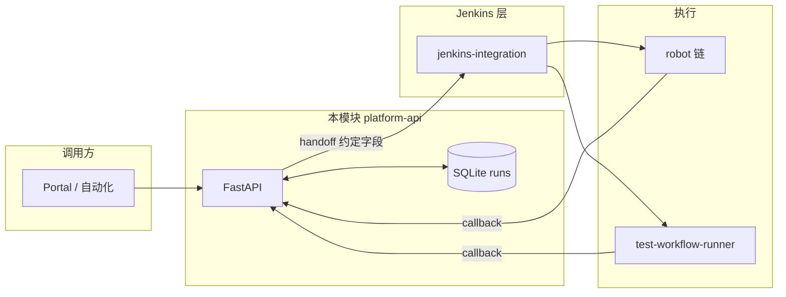
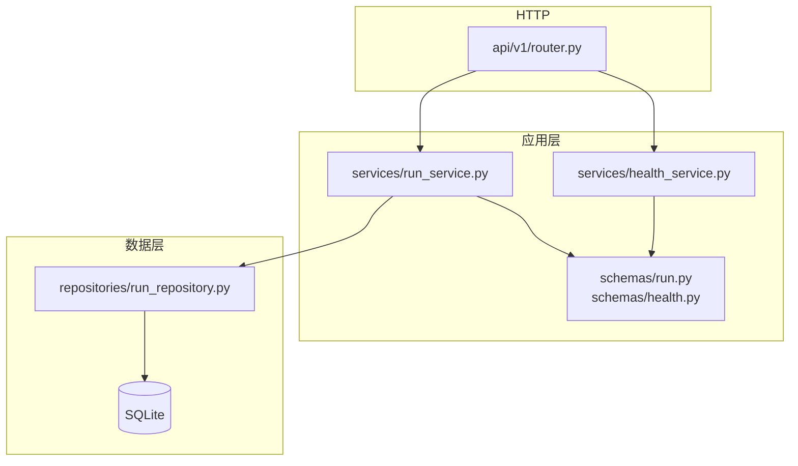
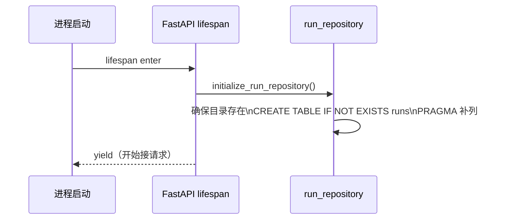
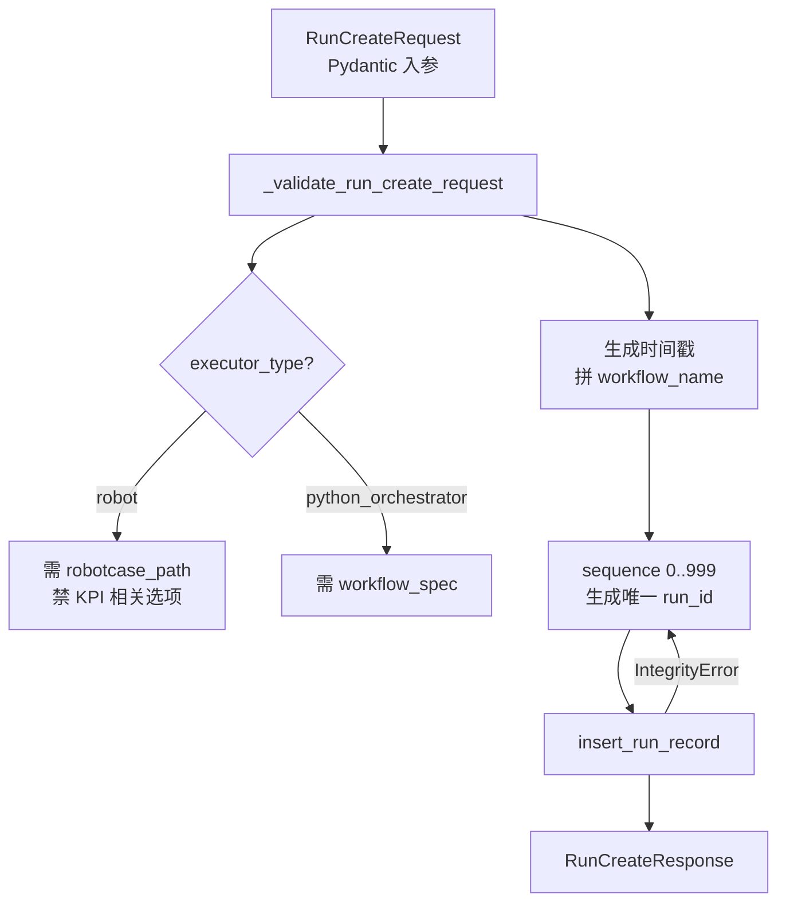
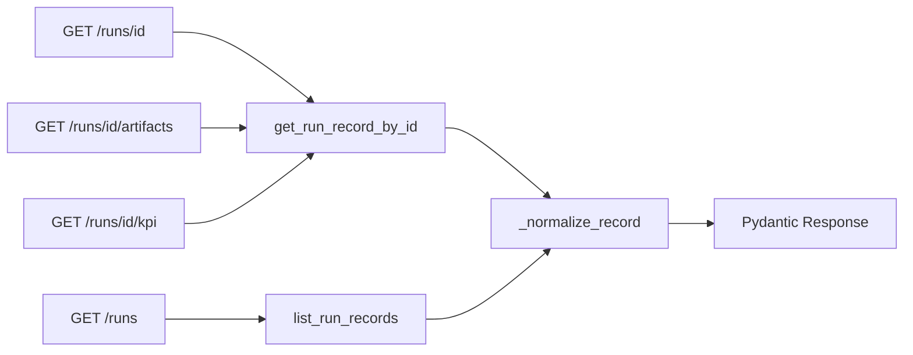
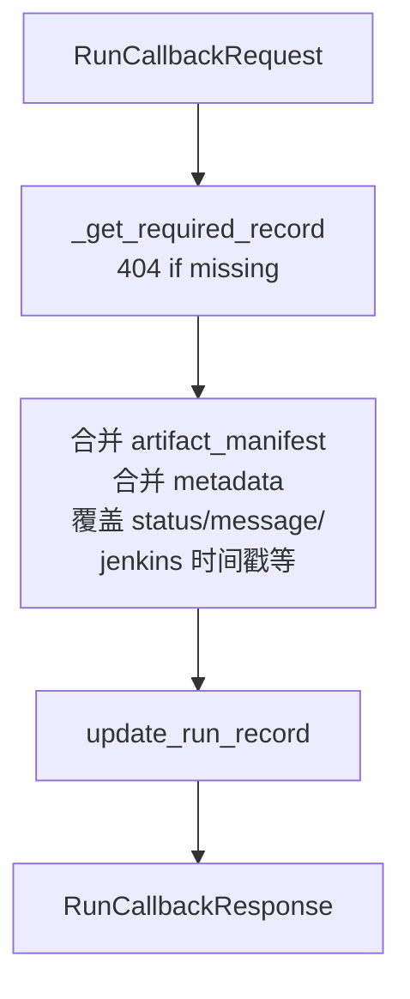

# platform-api 模块架构与实现流程

本文档是 **`C:\TA\jenkins_robotframework\platform-api`** 的权威说明：模块定位、分层、HTTP 与数据流、与 Jenkins / runner 的边界，以及**改代码时应动哪些文件**。历史上曾将「代码地图」写在 `docs/modules/platform-api/` 下独立文档中，现已按**运行时逻辑**并入本文；分步教学仍以仓库内 `docs/modules/platform-api/steps/` 为准。

---

## 1. 文档与仓库位置

| 说明 | 路径 |
|------|------|
| 本模块（FastAPI 应用根） | `platform-api/` |
| 分步实现（Step 06–13 等） | `docs/modules/platform-api/steps/` |

---

## 2. 模块定位（做什么 / 不做什么）

### 2.1 负责

- 对 **Portal**、**jenkins-integration** 等调用方暴露 **run 维度** 的 **HTTP API**。
- **SQLite** 持久化：run 元数据、`workflow_spec`、artifact 清单、KPI / detector 摘要字段等。
- **Jenkins 回调**：接收执行结束后的状态与产物描述，**合并写回**数据库。
- **查询**：列表、详情、artifact 列表、KPI 聚合读模型（`GET .../artifacts`、`GET .../kpi`）。

### 2.2 不负责

- Jenkins Job / Pipeline / workspace / checkout / 请求物化（见 `jenkins-integration/`）。
- 在 UTE/Agent 上实际执行 Robot 或 `test_workflow_runner` 编排（见执行器与 CLI）。
- React Portal 前端实现。

### 2.3 在整条链路中的位置

```text
Portal / 调用方
  -> platform-api（契约、落库、查询、回调入口）
  -> jenkins-integration（调度、桥接）
  -> robot 链 | test-workflow-runner
  -> 回调 POST .../callbacks/jenkins -> platform-api
```



---

## 3. 分层与依赖方向

**原则**：依赖单向 **`router` → `services` → `repositories`**；`schemas` 被 `router` / `services` 使用；**禁止**从 `repositories` 再 import 业务编排层。

```text
app/main.py              FastAPI 实例、/api 前缀、lifespan（启动时初始化 DB）
app/api/v1/router.py     路由表：HTTP 映射到 service 函数
app/schemas/             Pydantic：请求/响应模型与字段校验
app/services/            用例：create / list / detail / callback / artifacts / kpi
app/repositories/        SQLite：建表、增删改查、JSON 列编解码
app/core/config.py      pydantic-settings：应用名、DB 路径等
```



---

## 4. HTTP 路由一览（与实现一致）

| 方法 | 路径 | Service | 说明 |
|------|------|---------|------|
| `GET` | `/api/health` | `health_service.get_health_payload` | 健康检查 |
| `POST` | `/api/runs` | `run_service.run_create` | 创建 run，生成 `run_id` 并插入 DB |
| `GET` | `/api/runs` | `run_service.get_run_list` | 列表，按 `created_at` 倒序 |
| `GET` | `/api/runs/{run_id}` | `run_service.get_run_detail` | 详情；不存在则 404 |
| `GET` | `/api/runs/{run_id}/artifacts` | `run_service.get_run_artifacts` | artifact 清单 |
| `GET` | `/api/runs/{run_id}/kpi` | `run_service.get_run_kpi` | KPI 开关、配置、摘要、detector、manifest |
| `POST` | `/api/runs/{run_id}/callbacks/jenkins` | `run_service.apply_run_callback` | Jenkins 回写状态与产物元数据 |

路由定义见：`platform-api/app/api/v1/router.py`。

---

## 5. 详细实现流程

### 5.1 应用启动（lifespan）



- **配置**：`app/core/config.py` 中 `runs_db_path`（默认 `data/results/automation_platform.db`），可由环境变量 / `.env` 覆盖（见模块 `README.md`）。

### 5.2 创建 Run：`POST /api/runs`



**业务规则摘要**（`run_service._validate_run_create_request`）：

- `executor_type == "robot"`：**必须**有 `robotcase_path`；**不允许** `enable_kpi_generator` / `enable_kpi_anomaly_detector` / `kpi_config`（KPI 能力仅对 `python_orchestrator` 开放）。
- `executor_type == "python_orchestrator"`：**必须**提供 `workflow_spec`。

### 5.3 读路径：列表 / 详情 / Artifacts / KPI



- **`_normalize_record`**：把库里的 `*_json` 列解析为 Python 对象，并映射为 API 对外字段名（如 `workflow_spec`、`metadata`、`artifact_manifest`、`kpi_summary`、`detector_summary`）。

### 5.4 Jenkins 回调：`POST /api/runs/{run_id}/callbacks/jenkins`



- **artifact_manifest**：请求体若带清单则替换；否则保留库中已有（`request.artifact_manifest or existing`）。
- **metadata**：在已有 `metadata` 上 **`update`** 请求中的键。
- **kpi_summary / detector_summary**：请求有值则采用请求值，否则保留原值。

---

## 6. 数据层要点（`run_repository`）

- **表名**：`runs`；列定义集中在 `RUN_COLUMNS`；新列通过 **`_ensure_run_columns`** 在启动时 `ALTER TABLE` 补齐，便于演进。
- **JSON 列**：`workflow_spec_json`、`run_metadata_json`、`artifact_manifest_json`、`kpi_config_json`、`kpi_summary_json`、`detector_summary_json` 在写入前 **`json.dumps`**，读出 **`json.loads`**（见 `_encode_record` / `_decode_record`）。
- **布尔列**：`enable_kpi_generator`、`enable_kpi_anomaly_detector` 以 `INTEGER 0/1` 存储。

**不负责**：HTTP 状态码、业务错误文案；这些在 **`run_service`**（`HTTPException`）。

---

## 7. 契约与模型（`schemas/run.py`）

- **`ExecutorType`**：`"robot"` | `"python_orchestrator"`。
- **`WorkflowSpec` / `WorkflowStage` / `WorkflowItem`**：与 orchestrator 侧 traffic 结构对齐的**平台契约**子集（字段以代码与 Step 文档为准）。
- **回调**：`RunCallbackRequest` 含 `status`、`message`、`jenkins_build_ref`、`started_at`、`finished_at`、`metadata`、`artifact_manifest`、`kpi_summary`、`detector_summary`。

契约变更时建议同步：**`app/schemas/run.py`**、**`app/services/run_service.py`**、**`platform-api/tests/test_runs.py`**、**`docs/modules/platform-api/steps/`** 中相关 Step。

---

## 8. 与 jenkins-integration / test-workflow-runner 的边界

| 边界 | 说明 |
|------|------|
| **与 jenkins-integration** | **非** Python import；通过 **run contract**（创建响应中的 `run_id`、详情中的字段）、**handoff**（Jenkins 侧拉详情或带参数触发）、**callback contract**（`POST .../callbacks/jenkins` 的请求体）协作。 |
| **与 test-workflow-runner** | 无直接 import；orchestrator 消费的是 **落盘后的 workflow JSON 语义**，应与 `workflow_spec` 及 Portal 约定一致；执行结果经 Jenkins 回调回到 **本平台**。 |

任一方契约变更：**`schemas/run.py` + 测试 + Step 文档** 一起改。

---

## 9. 改代码应落在哪里

| 场景 | 建议文件 |
|------|----------|
| 新增/改路由、方法、标签 | `app/api/v1/router.py` |
| 请求/响应字段、校验规则 | `app/schemas/run.py`（并改 `run_service` 与测试） |
| 业务规则（executor、回调合并策略等） | `app/services/run_service.py` |
| 表结构、查询、编解码 | `app/repositories/run_repository.py` |
| 新配置项 | `app/core/config.py` |
| 健康检查语义 | `app/schemas/health.py`、`app/services/health_service.py`、`router` |

---

## 10. 测试

- 位置：`platform-api/tests/`（如 `test_runs.py`、`test_health.py`）。
- **fixture**：`tests/conftest.py`（含 `TestClient`、`db_connection` 等）。
- 分层建议见模块根目录 **`README.md`**（契约层 / 持久化验证 / 后续系统层）。

---

## 11. 相关路径索引

| 说明 | 路径 |
|------|------|
| 模块 README | `platform-api/README.md` |
| 本文档 | `platform-api/ARCHITECTURE.md` |
| 应用入口 | `platform-api/app/main.py` |
| 路由 | `platform-api/app/api/v1/router.py` |
| Run 用例层 | `platform-api/app/services/run_service.py` |
| 持久化 | `platform-api/app/repositories/run_repository.py` |
| 契约模型 | `platform-api/app/schemas/run.py` |
| 配置 | `platform-api/app/core/config.py` |
| 练习材料（JMeter/Postman/SQL） | `platform-api/practice/` |
