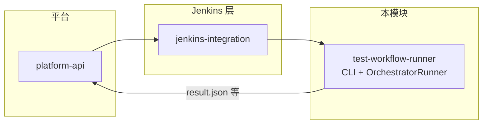
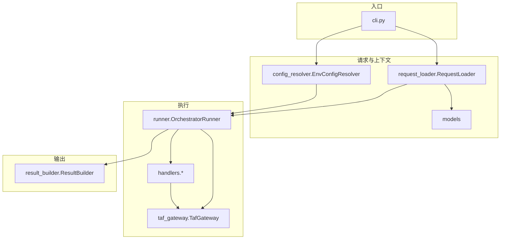
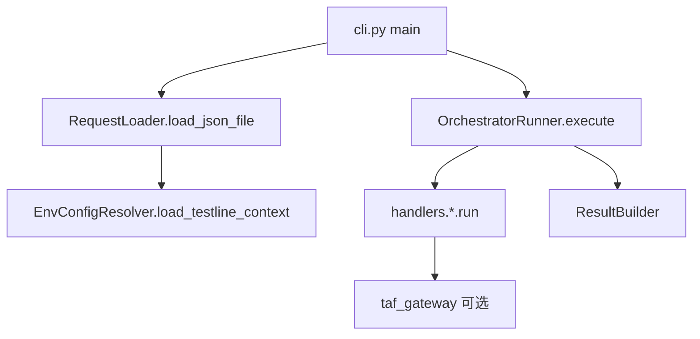
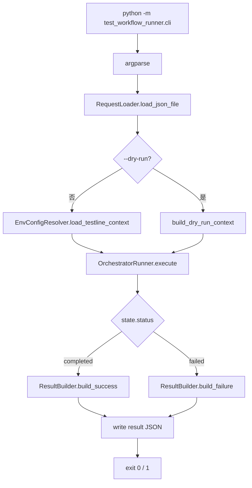
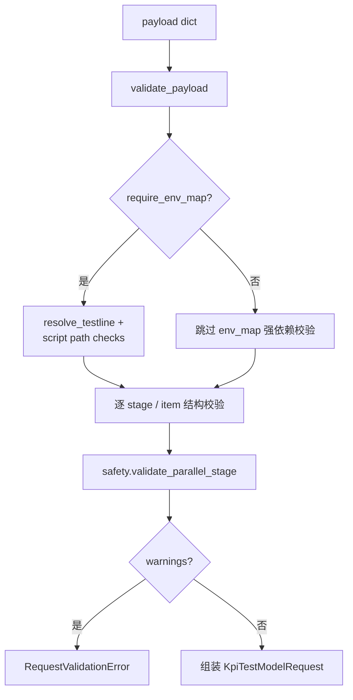
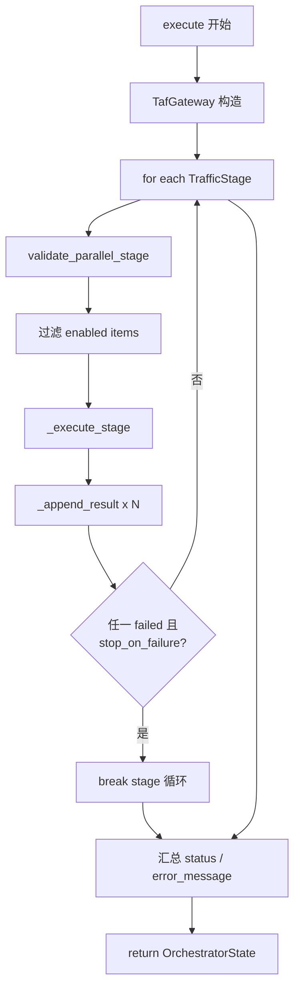
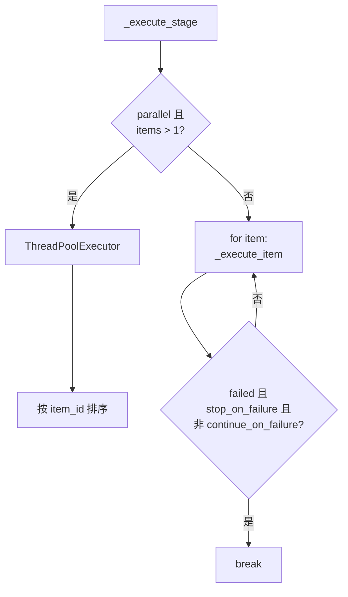
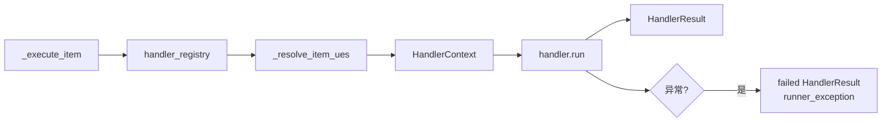
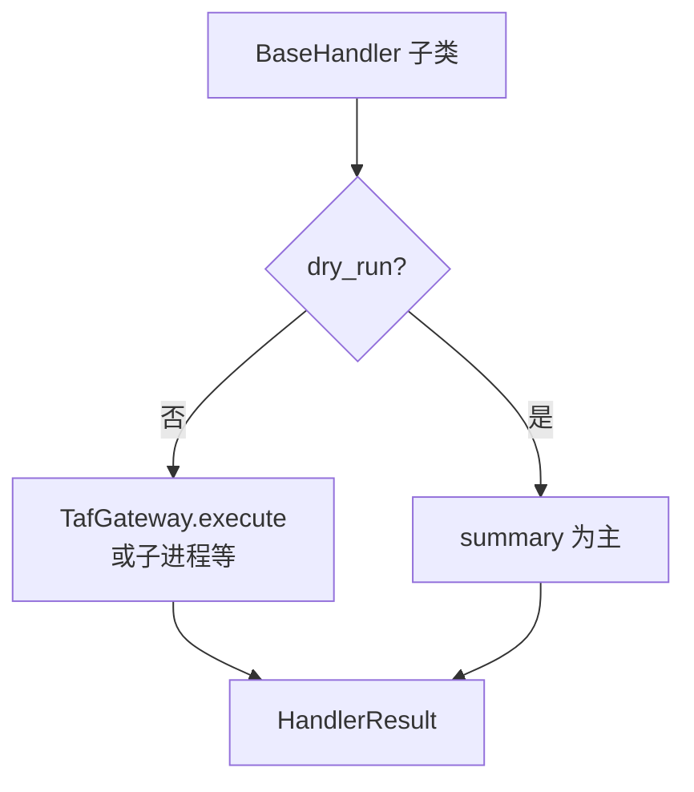

# test-workflow-runner 架构与实现（权威文档）

本文档描述 **`C:\TA\jenkins_robotframework\test-workflow-runner`** 的模块定位、**分层与各文件职责**、**数据约定**、**CLI → Loader → Runner → Handler → Result 的完整运行时流程**（含 Mermaid 图），以及**改代码时的落点**。历史上曾拆成「流程稿」与「代码地图稿」，现已合并为本文**唯一权威**说明；请以**源码**为准。

**分步教学**：`docs/modules/test-workflow-runner/steps/` 与各子目录 `guides/`、`testing-*` 互补。

---

## 1. 建议阅读顺序

1. **§2** 在仓库里负责什么、不负责什么。  
2. **§3–§4** 分层与**每个 Python 文件**干什么（改代码前先查表）。  
3. **§5** 请求 JSON 与 `model` 的约定。  
4. **§6** 运行时：依赖图 → CLI → Loader 校验 → Runner 阶段/并行 → Handler → TAF。  
5. **§7–§8** 与 `platform-api` 边界、契约对齐。  
6. **§9–§10** 改哪里、维护注意、路径索引。

---

## 2. 模块定位

本目录是 **`python_orchestrator` 执行器本体** 及 runner 侧资源：**不是** Web 后端或前端。

### 2.1 负责什么

- 在 Agent 上读取 **workflow JSON**
- 加载 **`configs/env_map.json`**（非 dry-run）与 **testline configuration**（`config_resolver`）
- 按 `traffic_plan` 调度 **stage / item**，执行 `attach`、`handover`、`dl_traffic`、`ul_traffic`、`swap`、`detach`、`syslog_check`、`apply_preconditions`、`kpi_generator`、`kpi_detector` 等
- 产出 **结果 JSON**（`result_builder`）
- 为 **`jenkins-integration`** 提供可调用的 **CLI 入口**（与通用 Jenkins Pipeline / robot 链分离）

### 2.2 不负责什么

- 通用 Jenkins Pipeline、workspace / checkout / callback 组织（见 `jenkins-integration/`）
- `robot` 执行链的公共 bootstrap
- `platform-api` 的 HTTP 契约、SQLite、React Portal（见仓库其他模块）

### 2.3 在整条链路中的位置

```text
platform-api          收请求、聚合状态
jenkins-integration   公共调度与桥接
test-workflow-runner  真正执行 workflow
```



---

## 3. 分层与目录

### 3.1 分层总览（自上而下）

```text
入口层              cli.py
请求与解析层        request_loader.py, models.py
测试线与 UE 上下文 config_resolver.py, ue_extractor.py
安全校验层          safety.py（并行 stage 资源域）
执行编排层          runner.py, taf_gateway.py
单步能力层          handlers/*.py, handlers/base.py
后处理 / 内部工具   internal_tools/kpi_generator, internal_tools/kpi_detector
结果落盘            result_builder.py
测试                tests/
配置样例            configs/
```

### 3.2 目录表

| 路径 | 说明 |
|------|------|
| `test_workflow_runner/` | 可 import 的 Python 包：CLI、loader、resolver、runner、handlers、结果构建。 |
| `test_workflow_runner/handlers/` | 每种 `traffic_plan` item 的 **`model`** 对应一个 Handler 类。 |
| `internal_tools/` | 随仓库携带的 kpi_generator / kpi_detector；**尽量经 handler 调用**，避免协议散落。 |
| `configs/` | 样例：`sample_request.json`、`env_map.example.json` 等。 |
| `tests/` | pytest：loader、runner、CLI 等。 |

---

## 4. 各核心文件职责（工程地图）

### 4.1 入口

| 文件 | 职责 |
|------|------|
| `test_workflow_runner/cli.py` | 命令行：读 JSON、`--dry-run`、`RequestLoader`、构造 `TestlineContext`（dry-run 用 `build_dry_run_context`，否则 `EnvConfigResolver.load_testline_context`）、`OrchestratorRunner.execute`、`ResultBuilder` 写结果、退出码。 |
| `test_workflow_runner/__init__.py` | 包初始化，保持精简即可。 |

### 4.2 请求、模型、测试线解析

| 文件 | 职责 |
|------|------|
| `test_workflow_runner/models.py` | `KpiTestModelRequest`、`TrafficStage` / `TrafficItem`、`OrchestratorState`、`HandlerResult`、`ResolvedConfig`、`TestlineContext` 等；`normalize_testline`、`derive_testline_alias`、`SUPPORTED_TRAFFIC_MODELS` 等。 |
| `test_workflow_runner/request_loader.py` | 从 dict/JSON **校验**并组装 `KpiTestModelRequest`；对接 `config_resolver` 得到真实或 dry-run 的 `ResolvedConfig`；**loader 阶段**对并行资源域问题会 **`RequestValidationError` 硬失败**（见 `safety.validate_parallel_stage`）。 |
| `test_workflow_runner/config_resolver.py` | 由 `testline` 派生 key、读 `configs/env_map.json`、定位 `testline_configuration`、动态加载 `tl`、构建 `TestlineContext`；`validate_script_path` 等。 |

### 4.3 执行编排

| 文件 | 职责 |
|------|------|
| `test_workflow_runner/runner.py` | `OrchestratorRunner`：`handler_registry`、按 stage **串/并行**执行 item、汇总 `OrchestratorState`、`_append_result` 按 **`result_bucket`** 分桶。 |
| `test_workflow_runner/taf_gateway.py` | 从 `runtime_options.bindings_module` 等动态 import TAF/绑定，对真实执行暴露 **`execute(action, context)`**。 |
| `test_workflow_runner/safety.py` | **`MODEL_RESOURCE_DOMAINS`**、**`SERIAL_ONLY_DOMAINS`**；`validate_parallel_stage`。典型 CLI 路径下 loader **已拦截**不安全并行；若绕过 loader，Runner 仍会把 warning 写入 **`state.validation_warnings`**。 |
| `test_workflow_runner/ue_extractor.py` | 从 testline 的 `tl` 对象抽取规范化 UE 列表。 |

### 4.4 Handlers（单步能力）

| 文件 | 职责 |
|------|------|
| `handlers/base.py` | `BaseHandler`、`HandlerContext`；dry-run 与真实 TAF/子进程封装（`execute_taf_action` / `execute_command` 等）。 |
| `handlers/attach.py` 等 | 一 **`model`** 一文件，例如 `AttachHandler` ↔ `"attach"`。 |
| `handlers/kpi_generator.py` / `kpi_detector.py` | 对接 `internal_tools` 的入口封装。 |
| `handlers/__init__.py` | 导出各 Handler 类。 |

**新增一种 `model` 时**：新建 `handlers/xxx.py` → 在 **`runner.handler_registry`** 注册 → 更新 **`SUPPORTED_TRAFFIC_MODELS`**（及 `request_loader` 若需）；若参与并行资源语义 → 同步 **`safety.MODEL_RESOURCE_DOMAINS`**（必要时 `SERIAL_ONLY_DOMAINS` 策略）。

### 4.5 内部工具

| 路径 | 职责 |
|------|------|
| `internal_tools/kpi_generator/` | KPI 报告生成（API 见 `service.py` / `core.py`），经 handler 注入 payload。 |
| `internal_tools/kpi_detector/` | KPI 检测与报表等，经 handler 调用。 |
| `internal_tools/__init__.py` | vendored 工具包说明即可。 |

### 4.6 结果

| 文件 | 职责 |
|------|------|
| `test_workflow_runner/result_builder.py` | 将 `OrchestratorState` 与上下文组装为可序列化 dict，写入 JSON。 |

---

## 5. 数据形态与约定

- 工作流请求为 **JSON**，顶层以 **`testline`** 标识测试线；可由全名派生 **`config_id` / alias**（如 `Txxx`），用于 **`configs/env_map.json`** 等。
- **`Runner` 里的 `model`**：指 **`traffic_plan.stages[].items[].model` 字符串**，用于选择 Handler，**不是**机器学习里的 model。

---

## 6. 运行时与流程图

### 6.1 包级依赖（谁调用谁）



### 6.2 主链路（精简，与非 dry-run 一致）



### 6.3 CLI 参数与 dry-run

- **实现**：`test_workflow_runner/cli.py`
- **参数**：`request_json`、可选 `result_json` / `--result-json`、`--dry-run`、`--repository-root`
- **`RequestLoader`**：`require_env_map = not args.dry_run`（dry-run **不要求**真实 `env_map` 能解析 testline）

**dry-run**：`RequestLoader` 在 `require_env_map=False` 下走简化 **`ResolvedConfig`**；CLI 用 **`build_dry_run_context`** 基于请求内 **`selected_ues`** 构造最小 **`TestlineContext`**。`OrchestratorRunner` 仍会跑各 handler，多数在 **`dry_run`** 下以 summary 为主、不触真实 TAF。

### 6.4 CLI 端到端（含 dry-run 分支）



### 6.5 RequestLoader 校验（含并行安全）

`validate_payload` 中会：校验 `testline`、`ue_selection`、`traffic_plan.stages`、各 item 的 **`model` ∈ `SUPPORTED_TRAFFIC_MODELS`**、`ue_scope` 等；**`require_env_map=True`** 时还有 **`resolve_testline`**、traffic **`validate_script_path`**；对每条 stage 调用 **`validate_parallel_stage`** —— 若在并行 stage 内触发 **`SERIAL_ONLY_DOMAINS`** 相关 warning，loader 会 **`RequestValidationError`**，CLI **直接失败**。



### 6.6 OrchestratorRunner（阶段循环）

**文件**：`test_workflow_runner/runner.py`

1. `state.status = "running"`，记 **`kpi_test_starttime`**
2. **`request.traffic_stages()`** 有序遍历 stage
3. 构造 **`TafGateway(bindings_module)`**（整次 run 共用）
4. 每个 stage：**`validate_parallel_stage`** → 追加 **`state.validation_warnings`**（loader 已拦时通常为空）；过滤 **`enabled`** items；**`_execute_stage`** → **`_execute_item`**；**`_append_result`** 按 handler 的 **`result_bucket`** 写入 `precondition_results` / `traffic_results` / `sidecar_results` / `followup_results`；若 **`failed`** 且 **`stop_on_failure`** 可 **break** 外层 stage 循环
5. 汇总 **`completed` / `failed`**，**`kpi_test_endtime`**



**Stage 内串行 / 并行**：

| `stage.execution_mode` | 行为 |
|------------------------|------|
| **`parallel`** 且 **多于一个** item | `ThreadPoolExecutor`，`max_workers = min(max_parallel_workers, len(items))`，结果按 **`item_id`** 排序 |
| **否则** | 顺序 **`_execute_item`**；**`failed`** 且 **`stop_on_failure`** 且非 **`continue_on_failure`** 时中断本 stage 后续 item |



### 6.7 单条 item 与 Handler

```text
OrchestratorRunner._execute_item
  -> handler = handler_registry[item.model]
  -> handler.run(HandlerContext(...))
  -> BaseHandler: dry_run 或 gateway.execute 或子进程
```



| `model` | Handler 类 |
|---------|------------|
| `apply_preconditions` | `ApplyPreconditionsHandler` |
| `attach` | `AttachHandler` |
| `handover` | `HandoverHandler` |
| `dl_traffic` | `DlTrafficHandler` |
| `ul_traffic` | `UlTrafficHandler` |
| `swap` | `SwapHandler` |
| `detach` | `DetachHandler` |
| `syslog_check` | `SyslogCheckHandler` |
| `kpi_generator` | `KpiGeneratorHandler` |
| `kpi_detector` | `KpiDetectorHandler` |

### 6.8 并行安全（资源域）

**文件**：`test_workflow_runner/safety.py`

- **`MODEL_RESOURCE_DOMAINS`**：`model` → 逻辑域（如 `ue_lifecycle`、`traffic_plane`、`gnb_control`）
- **`SERIAL_ONLY_DOMAINS`**：如 **`gnb_control`**、**`followup`** — 同一 **并行** stage 内同域 **多个 item** → warning；**loader 中升级为错误**

### 6.9 Handler 与 TAF（概念）



**bindings**：`runtime_options.bindings_module` 等经 **`taf_gateway`** 动态加载；细节见 `handlers/base.py` 与各 handler。

---

## 7. 与 platform-api 的边界

- **platform-api**：run 记录、Jenkins 回调、artifact 清单与 KPI/摘要查询 API。
- **test-workflow-runner**：在 Agent/UTE 上跑完 workflow 并产 **本地结果 JSON**。
- 对齐：**`run_id`、callback URL、artifact 路径、日志约定**；**不互相 import**。
- 与 Portal / Day1 对齐的字段名：以 **`docs/modules/platform-api`** 与 **`platform-api/app/schemas/run.py`** 为准；执行层 **`testline`** 等语义与之对齐。

---

## 8. 改代码应落在哪里

| 你想做的事 | 建议落点 |
|------------|----------|
| 新增一种 traffic **`model`** | 新建 `handlers/你的模型.py` + **`runner.handler_registry`** + **`SUPPORTED_TRAFFIC_MODELS`** / `request_loader`；若有并行资源语义 → **`safety.MODEL_RESOURCE_DOMAINS`**（及必要时 `SERIAL_ONLY_DOMAINS` 策略）。 |
| 改 workflow JSON 字段、校验规则 | **`models.py`** + **`request_loader.py`**（执行主循环少动除非语义变）。 |
| 改 testline 与 **`env_map`** 对应关系 | **`config_resolver.py`** + 样例 **`configs/`**。 |
| 改 TAF/真实设备调用方式 | **`taf_gateway.py`** + 相关 **`handlers`** / **`BaseHandler`** 路径。 |
| 改 **kpi_generator / kpi_detector** 行为 | 以 **`internal_tools/...`** 为主；**对外契约**变时同步 **handlers** 与文档。 |
| 改 **输出 JSON** 形状 | **`result_builder.py`** + 必要时 **`platform-api`** artifact 约定。 |
| 新加 **CLI 参数** | **`cli.py`**，并保持 **`main()`** 可被测试 import。 |

---

## 9. 维护提示

- 主链路保持稳定：**`loader → runner → handler → result`**，避免分叉成两套。
- 大逻辑用 **新 handler 文件** 或小模块，避免 **`runner.py`** 无限膨胀。
- 并行安全：**loader** 已硬拦典型错误；若改 **`safety`** 或并行语义，务必同步 **`request_loader`**，且不要忘记 Runner 侧 **`validation_warnings`** 与文档预期一致。

---

## 10. 相关路径索引

| 说明 | 路径 |
|------|------|
| 模块 README | `test-workflow-runner/README.md` |
| **本文档（权威）** | `test-workflow-runner/ARCHITECTURE.md` |
| **本包目录内说明** | `test-workflow-runner/test_workflow_runner/ARCHITECTURE.md` |
| CLI | `test-workflow-runner/test_workflow_runner/cli.py` |
| 编排器 | `test-workflow-runner/test_workflow_runner/runner.py` |
| 请求加载 | `test-workflow-runner/test_workflow_runner/request_loader.py` |
| 并行校验 | `test-workflow-runner/test_workflow_runner/safety.py` |
| 请求样例 | `test-workflow-runner/configs/sample_request.json` |
| 分步文档 | `docs/modules/test-workflow-runner/steps/` |
